# SFM 自我监督深度估计:打破观念

> 原文：<https://towardsdatascience.com/self-supervised-depth-estimation-breaking-down-the-ideas-f212e4f05ffa?source=collection_archive---------7----------------------->

## 无需手动标注的学习深度

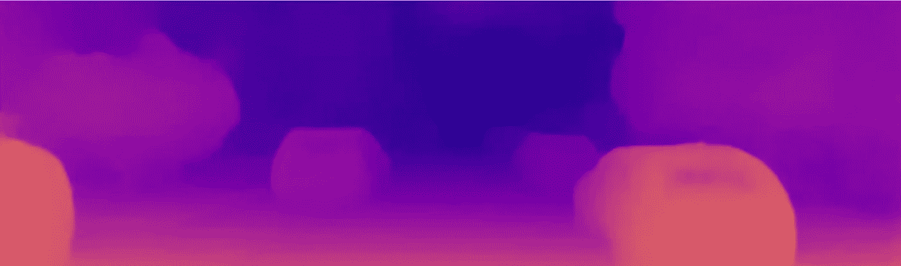

# 1.概观

> 这篇文章最后一次更新是在 2020 年 8 月 10 日

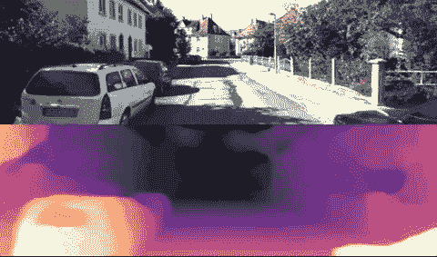

视差预测

这篇文章致力于探索通过自我监督学习进行深度估计的想法。关于深度估计的一些概念性想法充当先决条件。你可以参考这篇讨论相关话题和相关问题的文章。

自我监督的方法放松了对有注释的基础事实的硬性要求，这本身是麻烦的。它需要使用昂贵的高分辨率激光雷达，必须与相机进行良好的校准，以获得准确、良好的投影深度和同步数据。

由于上述原因，这种方法在研究人员中日益流行。它始于周[1]的开创性工作，其准确性大大落后于监督学习方法。从那以后，人们对这一领域的兴趣激增。许多工作已经开始系统地确定和解决这个框架中的每个组件，迅速缩小与监督学习方法的差距。

在本文中，我们将介绍以下内容:

*   自我监督深度估计框架:训练深度模型所需的组件
*   管道中每个组件需要考虑的相关问题
*   致力于解决这些问题的研究工作。

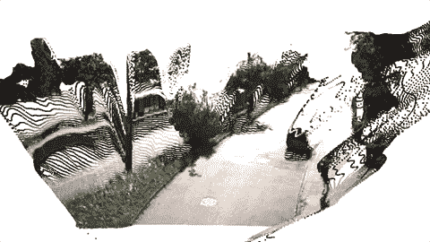

从 RGBD 序列重建的场景

# 2.自我监督的深度估计是如何工作的？

这种方法是自我监督的，因为地面实况来自输入信号本身。在这种情况下是 RGB 图像。不需要任何外部数据或信号来教导网络→深度估计器本身就是自己的老师！

因此，我们将目标定义为基于一些输入图像重新合成图像。在我们的上下文中，通过利用 3D 场景几何来合成图像。其以数学理论为基础来模拟 3D 世界和图像平面之间的关系。

## A.自我监督学习框架

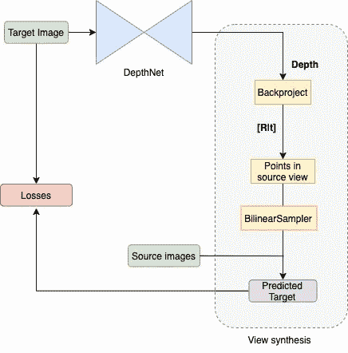

自监督深度估计流水线

在大画面上，当提供了深度和自我运动时，我们可以通过从**源**相机视点应用投影扭曲来合成新的视图(**目标**)。从上图可以看出，变形是使用视图合成模块实现的。请注意，深度是模块的输入，在我们的例子中，深度是由神经网络预测的。

然后，通过最小化目标和预测目标之间的代理光度损失来指导学习，并且通过双线性采样器模块和深度网络来导出和传播梯度。因此，如果目标图像和预测的目标在外观上相似，这意味着深度是隐含地和正确地学习的。

源图像可以取自视频序列或从其他相机(如双目或三目设置)捕获的图像。前者需要估计`[R|t]`，而后者需要在摄像机之间进行良好的校准，以获得外部属性。

我们将关注基于 SFM 的自监督深度估计，其需要从神经网络估计姿态。

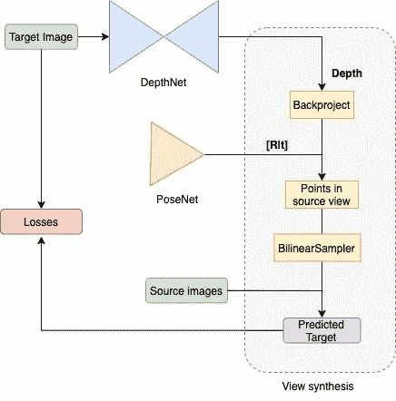

SFM 管道公司

## B.从结构到运动的深度[SFM]

使用 SFM 的深度估计源于这样的想法，即我们能够通过在 3D 环境周围移动来感知和从结构上理解 3D 环境。当观察者移动时，它们周围的物体根据它们与观察者的距离而移动不同的量。这被称为 [**运动视差**](/depth-estimation-1-basics-and-intuition-86f2c9538cd1) ，从这个深度信息可以用来生成我们周围世界的精确 3D 表示。

在计算机视觉中，这是通过移动📷捕捉场景并测量每个时间步的视图变化之间的重叠。深度网络用于理解运动视差。而姿态网络用于预测帧间观察的变化。

## C.深度模型

该网络不是直接回归深度，而是通过输出图层经过 sigmoid 激活来预测差异，从而给出 0-1 之间的连续值。

因此，可以使用`1/(a*disp + b)`将该值转换为深度，其中 a、b 控制获得的最小和最大深度值的范围。

[**多尺度预测**](https://people.eecs.berkeley.edu/~tinghuiz/projects/SfMLearner/cvpr17_sfm_final.pdf) :这是用来缓冲从低纹理区域学习的影响，这在合成时经常是不明确的。因此，建议通过使用较低分辨率的特征来增加可以导出梯度的空间区域。

为此，来自解码器的中间输出将分别通过 sigmoid 激活，以预测每个相应比例的视差。

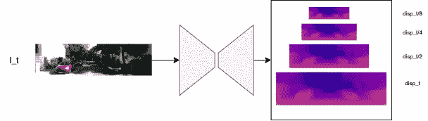

深度推理流水线

## **维姿网络**

姿态网络应该预测从`I_t-1 / I_t+1`到`I_t`的摄像机姿态`[R|t]`的 6 自由度相对变化。最终卷积层的输出缩放至 0.01，如[5]所示。网络输出的旋转角度遵循轴角表示法，可以使用 [*Rodrigues 旋转公式*](https://en.wikipedia.org/wiki/Rodrigues%27_rotation_formula)*转换成旋转矩阵`R`*

*注意，输入之间存在时间一致性，从而保持顺序。这简化了学习过程。*

*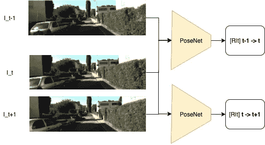*

*姿态推理管道*

## *E.视图合成*

*如前所述，目标是在给定源图像的情况下合成目标图像。我们想重现从不同摄像机视角看到的场景。这可以通过将目标像素坐标投影到另一个给定深度和视图相对变化(姿态)的摄像机视点上来实现。*

*有了预测的深度、`depth_pred`和姿态`[R|t]_pred`，下一步就是把图像`I_t-1, I_t+1`投影扭曲成`I_t`。*

*如果目标图像`I_t`和扭曲图像`I_t_pred`之间的像素亮度相似，这意味着深度和姿态网络确实已经成功地学会预测深度和相对相机姿态。*

*要执行转换，请执行以下操作:*

*   *首先使用`depth_pred`将目标图像`I_t`反投影到 3D 点云。我已经写了一篇关于深度反投影的文章。你可以参考它来理解背后的概念，并看到它的实际应用。*
*   *接下来，使用预测的相机姿态对点云执行线性变换，以获得`cam_t->t-1/cam_t->t+1`坐标中的目标点。然后通过投影变换将三维点投影到图像平面上。*
*   *使用类似于 STN [3]中介绍的可微分双线性采样方法的机制，从源图像`I_t-1/I_t+1`中采样相应的像素坐标，以获得两个样本的`I_t_pred`。*

*下图总结了这些步骤。*

*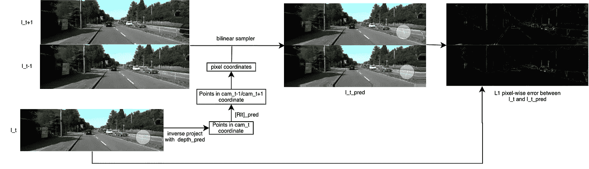*

*查看合成管道*

## *F.设计损失函数*

*通过计算目标和合成视图之间的代理光度损失来更新和学习权重。有几种方法可以测量图像之间的外观。最常见的是天真的 L1/MSE。从那以后，为了更好地捕捉图像中的外观和结构，已经提出了一些修改。我们将在这里讨论它们。*

***考虑结构内容**:由于 L1/MSE 只考虑了像素间的亮度差异，因此没有结构内容的概念。即许多失真的图像可能产生相同的强度误差*

*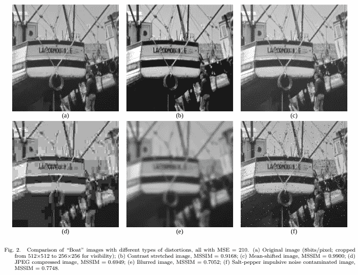*

*[**结构相似指数，SSIM**](https://www.mathworks.com/help/images/ref/ssim.html) :该度量将相似性度量的任务分成 3 个比较；两幅图像之间的亮度、对比度和结构。这个想法是通过减少亮度和对比度的权重来更加强调图像的结构。*

# *3.普通框架的问题*

*不幸的是，通过实现上述流水线，可以用不同程度的伪像来训练深度估计。仍然存在几个需要解决的问题。在本节中，我们将讨论一些不足之处。*

*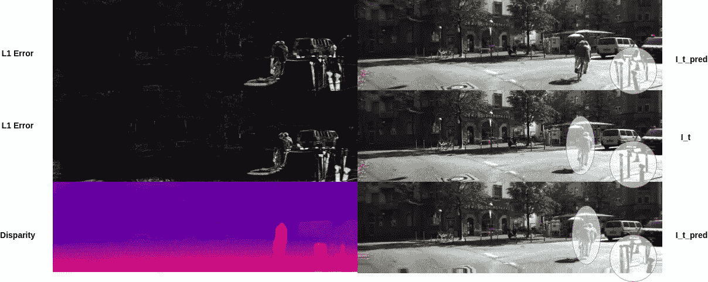*

*该图示出了预测图像和目标图像之间的像素级绝对差异，观察到模型在边界和细长结构附近挣扎。L1 误差图中较高的强度表示较高的绝对差异。*

## *A. **SFM 在静态世界的前提下运作***

*在自然场景中，它通常既包括**静止的**背景，如墙壁、结构和建筑物，也包括**运动的**实体，如人。通过采用 SFM，我们假设了一个**静态世界假设**，并且只有静态部分可以实现。*

***静态假设是什么意思？***

1.  ***静态**:视频中静态部分的运动完全由摄像机运动和深度结构引起。帧之间的投影 2D 图像运动可以完全由深度结构和相机运动来确定*
2.  ***动态**:具备**大位移**(想想光流)的特点。由摄像机运动和特定物体运动共同作用。这不是 SFM 的模型。*

## *B.SFM 对损失的暗示*

*除了违反静态世界假设之外，该框架还带来了许多其他考虑*

1.  ***未考虑物体运动**:当使用估计的姿态将目标点转换到另一个摄像机视图时，构建的场景不会考虑场景中的运动，而只是基于预测的自身运动。导致具有运动的像素的目标图像和预测图像之间的不匹配。
    **→** 这暗示了即使模型正确预测了深度，模型仍然会受到惩罚。*
2.  ***深度的性能与姿态网络紧密耦合**:性能不佳的姿态网络会降低深度性能。因为姿态网络负责计算视图中的相对变化。*
3.  ***预测“无限深度”或洞**:这是动态物体的另一个结果，也是一个非常特殊的例子，其中**物体以与相机相同的速度移动。**物体相对于摄像机看起来是静止的。这也可以在任何事物无限远的情况下实现。物体的任何移动都被认为是不可观察的，并且看起来是静止的。这可以触发深度网络来预测无限深度，因为对象不移动，表现为洞。*

*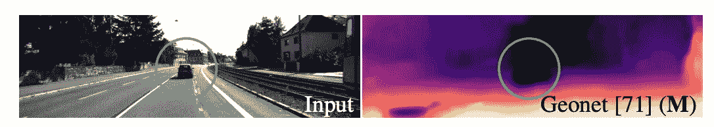*

*[来源](https://arxiv.org/pdf/1806.01260.pdf)*

## *C.光度损失是你最好的赌注吗？*

*基于外观的损失是深度损失的有效替代。然而，使用图像强度作为衡量标准有一定的缺陷。*

*   ***我们无法从 2D RGBD 图像中推断出世界的实际大小**:由于我们在 2D 图像空间中计算损失，因此在双线性采样阶段后，我们会丢失比例信息。即**许多投影预测实际上可以给出相同的正确图像**。更多细节可以在这个[帖子](/depth-estimation-1-basics-and-intuition-86f2c9538cd1)中找到。结果，所学习的深度在 3D 度量空间中将是尺度模糊的，但是在图像空间中是一致的。
    关于 Kitti 基准上的结果，许多工作依赖于根据地面真实情况找到中值深度来解决比例问题。*
*   *[**标度模糊导致深度收缩**](https://arxiv.org/pdf/1712.00175.pdf) **:** 标度模糊的另一个危险方面是深度塌陷的可能性。本文表明，随着比例的减小，相同的场景可以用更小的深度图来构建，直到它退化为零。该论文建议通过增加归一化步骤来防止平均深度崩溃*

*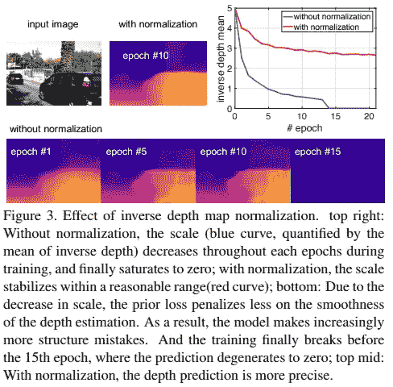*

*   ***即使合成图像在几何上不一致，损失也能得到满足**:在某些场景中，当深度预测错误而姿态正确时，或者反之亦然，重建图像仍有可能得到很好的预测。这种情况在无纹理的区域更常见，如墙壁和天空。在这种情况下，深度和姿态网络不会因为不良预测而受到惩罚和奖励。*
*   ***不同的视图会导致严重的损失**:考虑像素在目标图像中可见而在源图像中被遮挡或不在视图中的情况。当重新投影这些点时，在这些区域中将会出现不匹配。因此，即使深度被正确预测，模型仍然是不利的。*
*   ***要考虑的边缘情况**:除了上面提到的，反射的表面(违反视图之间的朗伯假设)、失真的图像或色彩饱和的图像也会导致不匹配并降低损耗计算。*

*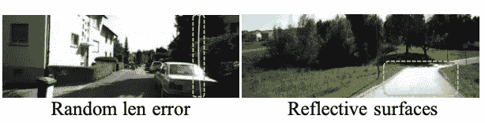*

*由于非朗伯曲面，在 SFM 环境中不一致的场景*

## *D.对深度模型的影响*

*考虑到上述因素，文献中的大多数深度模型倾向于产生具有以下伪像的结果:*

1.  ***沿遮挡边界的平滑深度和深度不连续**:深度网络倾向于预测这些边界附近的过度平滑深度，而不是保留边缘。这可能是由于缺少明确定义的边缘感知，并且损失主要由平滑表面造成。这导致了[出血边缘效应](https://arxiv.org/pdf/1903.09847.pdf)。反向投影的点没有被很好地定义。*

*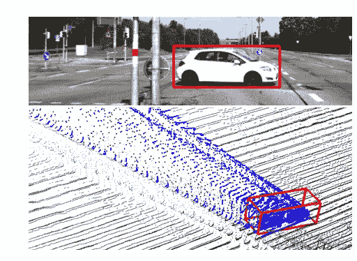*

*[来源](https://arxiv.org/pdf/1903.09847.pdf)*

***2。闪烁效果**:深度图随时间推移产生的几何效果不一致。在下图中可以观察到深度的巨大变化。尤其是在薄结构和边界处。*

**

# *4.研究进展*

> *这一部分将根据新的发现不断更新。*

*在对相关问题有了更清楚的理解之后，让我们继续讨论文献中提出了什么解决方案来试图解决这些问题。我将在这里强调一些文件。*

*已经提出的许多想法可以大致归类为解决以下任务:*

1.  ***使光度损失有意义:**通过考虑场景中的运动和遮挡，或者从损失计算中移除它们。*
2.  ***解决尺度模糊:**为了在 3D 空间中进行度量上合理的深度预测，存在通过利用帧之间的额外一致性来解决这个问题的工作*
3.  ***通过注入额外的模态来提高性能**:许多人利用了各种模态，例如使用光流、表面法线来模拟物体运动，或者使用语义分割来提高场景理解。*
4.  ***边界细化**:通过使用额外的模态或作为后处理阶段，一些努力集中于明确地细化边缘和遮挡边界。*
5.  ***设计更好的深度网络**:关于如何最好地表现深度和视差，有许多工作正在进行。或者设计更好地保存和捕捉场景结构的架构。*
6.  ***采用半监督框架:**想法是通过具有某种形式的注释，通过从低分辨率激光雷达获取稀疏地面真实，模型将受益于弱监督。*

## *A.解决不完美的光度损失*

*在 [MonoDepth2，ICCV2019](https://arxiv.org/pdf/1806.01260.pdf) 中对此进行了大量调查和处理。他们的想法简单而有效，可以提高性能。*

***自动屏蔽源和目标之间的静止像素:**为了防止静态场景违规，他们提出在计算损失时简单地忽略这些像素。当其他对象以与相机相同的速度移动时，或者当相机在帧之间静止时，会发生这种情况。*

***针对所有预测视图逐个像素地选择最小误差**:这种情况处理相邻视图中由于自身运动造成的遮挡或视图外像素。这种简单的方法能够锐化遮挡边界并减少伪影。*

*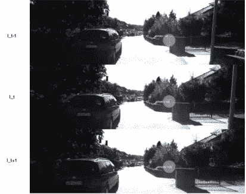*

*因为 I_t+1 预测没有被遮挡，所以在该区域中选取像素，并丢弃那些来自 I_t-1 的像素*

## *B.模型进展*

*这里，我们看到的架构设计本质上应该能够最好地从 RGB 图像中捕获结构信息，并提取连续的深度/视差值。一个研究方向主要集中在通过修改基本编码器-解码器架构来保留空间内容，而另一个方向集中在开发视差输出的更好表示。*

***编码-解码特性**:这一系列工作寻求优化网络中的信息流。在 [SuperDepth ICRA2019](https://arxiv.org/pdf/1810.01849.pdf) 中，他们提出使用[亚像素卷积](https://arxiv.org/pdf/1609.05158.pdf)层来有效和准确地超解析来自其较低分辨率输出的差异，取代解码器中的上采样层。*

*操作如下:使用相移对图像进行整形，称为**像素混洗**，其重新排列 H × W × C r 张量的元素以形成 rH × rW × C 张量。*

*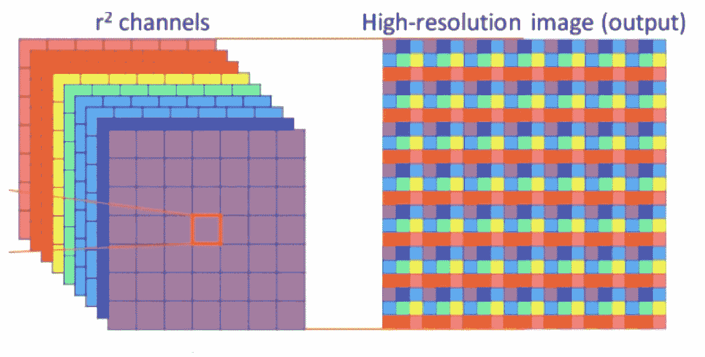*

*[子像素卷积](https://arxiv.org/pdf/1609.05158.pdf):像素在深度和空间维度之间混洗*

*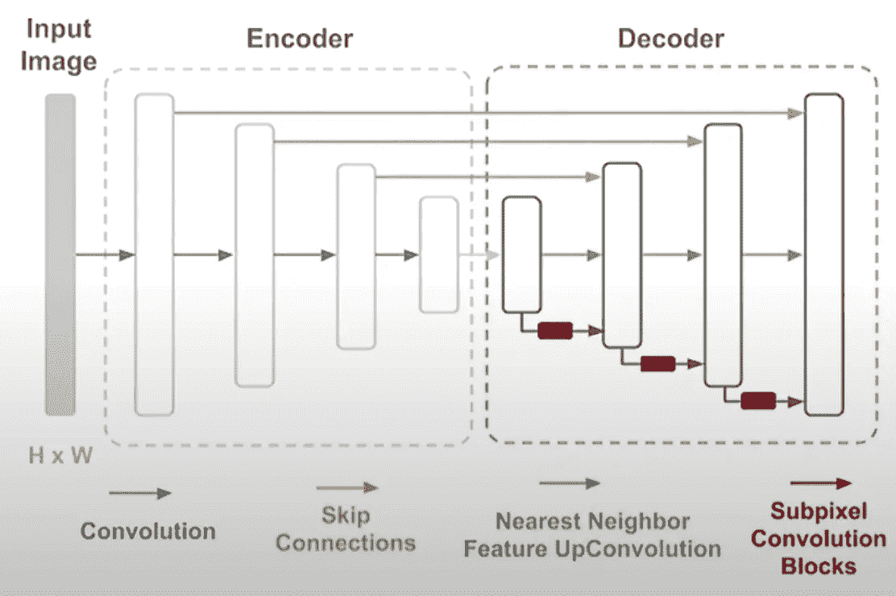*

*在 [PackNet，CVPR2020](https://arxiv.org/pdf/1905.02693.pdf) 中，他们认为编码器中的标准下采样阶段在空间上对密集深度预测有害。类似地，上采样策略无法在解码器层传播和保留足够的细节来恢复准确的深度预测。他们提出通过用**打包**和**解包**块来代替下采样池和上采样来保存信息。因此，不是执行 2x2 最大池，即选择 4 像素区域中的最大值并丢弃其余值，而是通过`Space2Depth`操作将特征打包到深度维度中。这样，就不会有信息被删除。在论文中，他们提到卷积 2D 并不是为捕获深度通道而设计的。因此，特征空间被扩展到 4D，并通过卷积 3D 馈送。解包块执行相反的操作，其工作方式与超深度相同，使用子像素卷积来恢复特征。*

*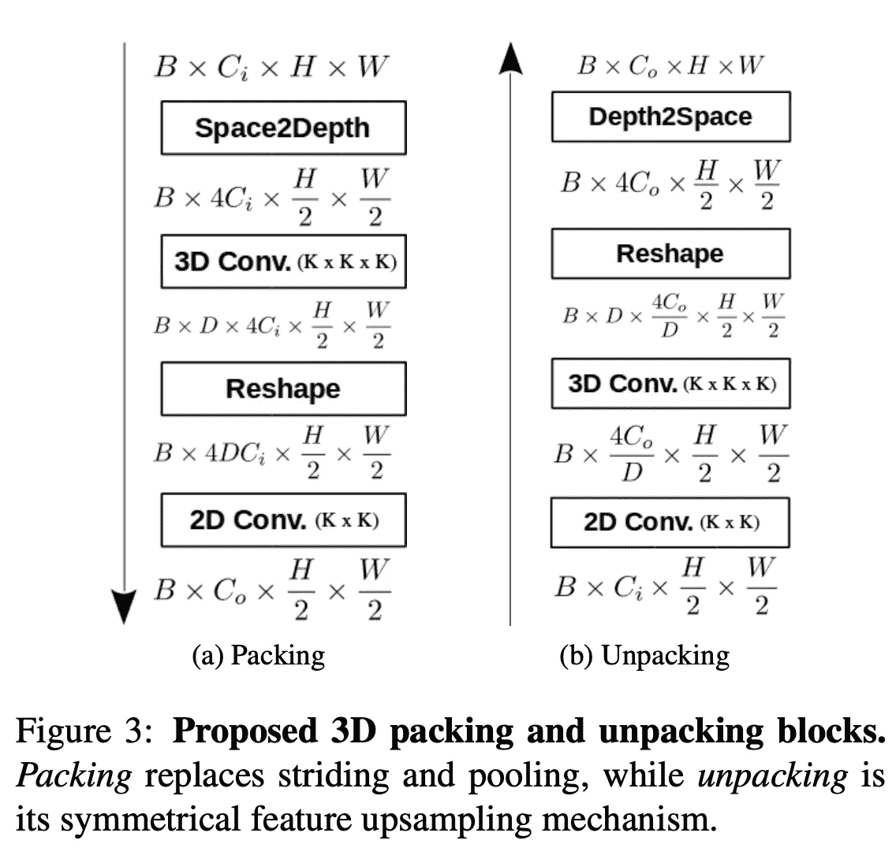*

*包装和拆包*

***着眼于表现深度和视差**:除了预测每像素深度，还有其他人着眼于深度预测，以提高鲁棒性和稳定性。*

*在[神经 RGB- > D Sensing，CVPR2019](https://arxiv.org/pdf/1901.02571.pdf) 中，他们决定将不确定性估计纳入视差估计，同时在贝叶斯滤波框架下随时间累积，生成视差概率体(DPV)。然后降低深度不确定性估计并提高鲁棒性。*

*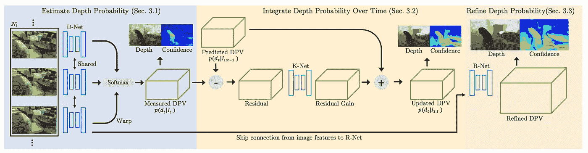*

*在这篇论文中，他们提出预测[离散视差体积，ECCV2020](https://arxiv.org/pdf/2003.13951.pdf) 。这是受众所周知的监督方法 [DORN，CVPR2018](https://arxiv.org/pdf/1806.02446.pdf) 的启发，该方法选择将回归任务构建为有序回归问题。DORN 在单目深度估计中取得了优异性能。*

*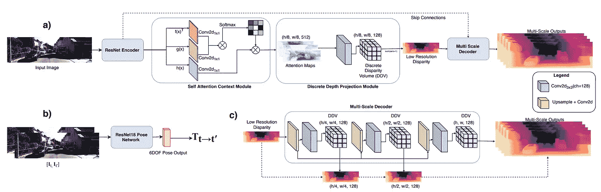*

## *C.探索不同的模式*

*表面法线、视差和光流在表示图像中的结构方面与深度有许多相似之处。表面法线可以解释为深度梯度的方向。光流可以通过自我运动和物体运动自然地链接到深度。视差与深度成反比关系。虽然语义没有任何直接关系，但许多人使用分割图作为学习更精细深度的指导。有许多研究这些联合互补性质的著作。*

***在多任务学习框架中共同学习:**学习的一个方向是与其他任务一起共同学习深度。这些工作中有许多在经验上显示出积极的结果，并证明它是一个有前途的方向。这些任务是紧密相关的，在共享主干的多任务环境中，它们将相互受益。在 [GeoNet，CVPR2018](https://arxiv.org/pdf/1803.02276.pdf) 中，考虑联合学习光流、深度和姿态，同时加强几何一致性，而在另一个作品 [SceneNet 中，CVPR2019](https://openaccess.thecvf.com/content_CVPR_2019/papers/Chen_Towards_Scene_Understanding_Unsupervised_Monocular_Depth_Estimation_With_Semantic-Aware_Representation_CVPR_2019_paper.pdf) 专注于学习深度和分割。*

*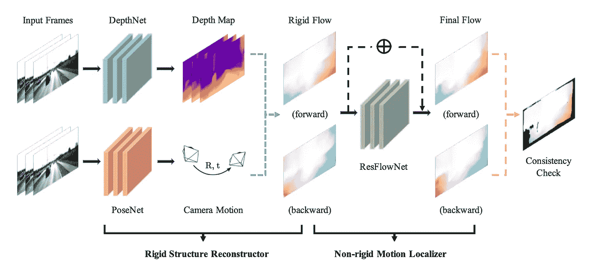*

*[地理网](https://arxiv.org/pdf/1803.02276.pdf)*

*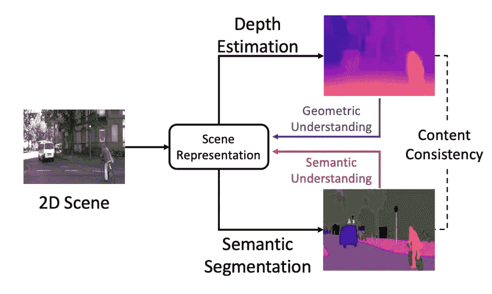*

*[SceneNet](https://openaccess.thecvf.com/content_CVPR_2019/papers/Chen_Towards_Scene_Understanding_Unsupervised_Monocular_Depth_Estimation_With_Semantic-Aware_Representation_CVPR_2019_paper.pdf)*

***利用语义分割**:语义本身与深度没有任何数学关系。然而，一些作品在语义应该通过提供某些线索来指导深度估计的想法上追求这个方向。例如，天空应该位于远处，并且自然地具有非常高的深度值。像素标签的变化很可能指示对象的边界，并导致深度的显著变化。*

*本作品由 [TRL，ICLR2020](https://arxiv.org/pdf/2002.12319.pdf) 完成。他们提出用语义模型来指导几何表征学习。他们设计了一个精心制作的语义指导功能模块，在网络的不同阶段注入语义信息。*

*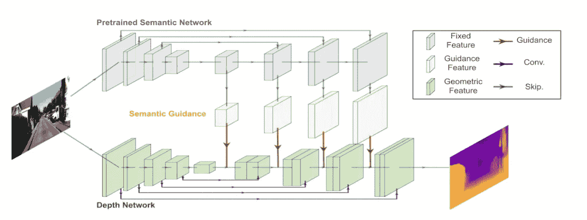*

*[来源](https://arxiv.org/pdf/2002.12319.pdf)*

## *D.解决比例模糊*

*如前一节所述，预测的深度在比例上是不明确的。在与 PackNet 相同的论文中，他们表明来自姿势的预测平移分量和地面真实姿势之间的位移的弱监督可以解决度量尺度。通过约束姿态，它确保姿态网络预测度量准确的估计。*

## *F.稀疏深度半监督*

*假设某种形式的深度可以从距离传感器(如激光雷达)获得，那么可以以半监督的方式使用它来创建稀疏深度图。这已经在[熊伟桂子林等人的 2019 年 CoRL2019](https://arxiv.org/pdf/1910.01765.pdf) 中进行了广泛的探讨。我认为这是一个有趣的分析。他们研究了与训练期间可用的激光雷达点的数量相关的深度改善的效果。*

*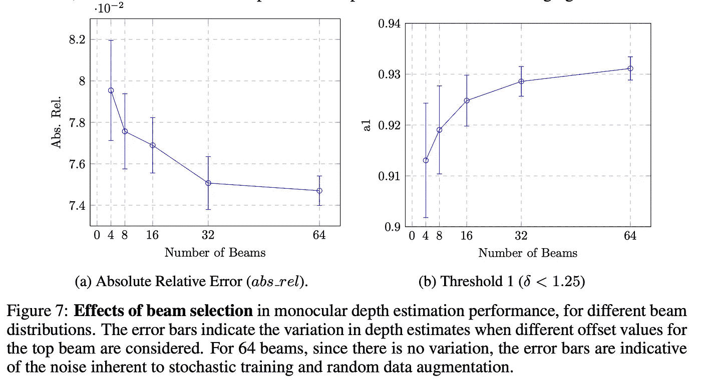*

*[来源](https://arxiv.org/pdf/1910.01765.pdf)*