# 自我监督关键点学习综述

> 原文：<https://towardsdatascience.com/self-supervised-keypoint-learning-aade18081fc3?source=collection_archive---------6----------------------->

关键点或兴趣点检测是许多计算机视觉任务的一个重要组成部分，例如 [SLAM](https://youtu.be/ufvPS5wJAx0?t=40) (同时定位和地图绘制)[【SfM】](https://grail.cs.washington.edu/rome/)(从运动得到的结构)和[摄像机校准](https://en.wikipedia.org/wiki/Chessboard_detection#Chessboard_feature_extraction)。关键点检测在深度学习之前有很长的历史，许多广泛行业应用中的辉煌算法(如 [FAST](https://en.wikipedia.org/wiki/Features_from_accelerated_segment_test) 、 [SIFT](https://en.wikipedia.org/wiki/Scale-invariant_feature_transform) 和 [ORB](https://en.wikipedia.org/wiki/Oriented_FAST_and_rotated_BRIEF) )都是基于手工制作的特征。正如在许多其他计算机视觉任务中一样，人们一直在探索如何使用深度学习来胜过手工制作的算法。在本帖中，我们将回顾这一领域的一些最新进展。

## 语义关键点与兴趣点

在我们继续之前，让我们弄清楚一些概念。在计算机视觉中通常使用两种类型的关键点。**语义关键点**是对图像中的物体具有语义意义的兴趣点，例如人脸的左眼角、人的右肩或汽车的左前轮胎轮毂。**兴趣点**更多的是可能没有明确语义的低级点，比如线段的一个角点或者终点。

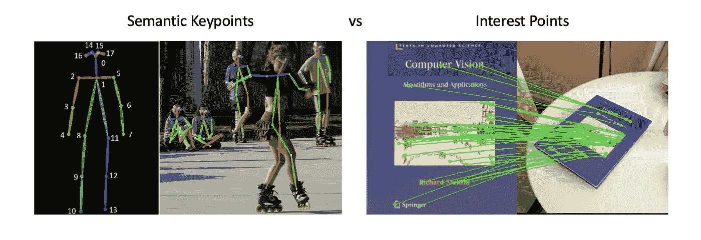

深度学习方法主导了最先进的语义关键点检测。[**Mask RCNN**](https://arxiv.org/abs/1703.06870)(ICCV 2017)和[**pif PAF**](https://arxiv.org/abs/1903.06593)(CVPR 2019)是语义关键点检测的两种代表性方法。这些方法是监督学习，需要大量昂贵的人工注释。这使得它们难以容易地应用于兴趣点检测，因为兴趣点在语义上是不明确的，因此人类注释者不能可靠地和重复地识别同一组兴趣点。因此，不可能将兴趣点检测的任务公式化为监督学习问题。

现在进入自我监督学习。自监督学习(或无监督学习，如果你关注它不需要明确的人类注释的事实)是 2020 年初重新出现的话题。这包括最近的进展，如 FAIR 的 [**、MoCo**](https://arxiv.org/abs/1911.05722) 和 Geoffrey Hinton 团队的 [**SimCLR**](https://arxiv.org/abs/2002.05709) 。(关于自我监督学习的更多一般趋势，我会推荐 [Lilian Weng 的博客](https://lilianweng.github.io/lil-log/2019/11/10/self-supervised-learning.html)。)与监督学习相比，自监督学习受益于每个训练样本多几个数量级的监督比特，并且不需要昂贵的和特定任务的人工注释。由于难以从人类获得可靠的注释，这非常适合于兴趣点检测。

**这篇文章的主题是将自我监督学习应用于兴趣点学习。**下面我们将互换使用*兴趣点*和*关键点*。

下面这篇博文是基于我第一次阅读这篇论文时的笔记。欢迎星/叉/评论！

 [## 帕特里克-llgc/学习-深度学习

### 这个知识库包含了我关于深度学习和机器学习的论文阅读笔记。它的灵感来自丹尼·布里兹…

github.com](https://github.com/patrick-llgc/Learning-Deep-Learning) 

# 超级点

[**SuperPoint** :自监督兴趣点检测与描述](https://arxiv.org/abs/1712.07629) (CVPR 2018)是利用自监督学习进行兴趣点检测与描述的开创性工作。总之，它首先在合成数据上预训练兴趣点检测器，然后通过使用已知的单应变换生成图像对来学习描述符。

寻找兴趣点的任务由**探测**和**描述**组成。检测是图像中感兴趣点(或特征点，或关键点，取决于文献)的定位，描述是用向量(即描述符)描述每个检测到的点。总体目标是有效和高效地找到有特征的和稳定的视觉特征。在下面的博文中，我们将看到兴趣点学习是如何处理检测和描述这两项任务的。

本文仍然遵循许多经典算法的思路:先检测后描述。首先如何学习一个健壮的检测器？我们可以使用已知兴趣点的 3D 对象来绘制 2D 投影，例如长方体的角和线段的端点。作者称这种探测器为 Magic point(Magic Leap 的作者起的一个好听的名字。).

> 现在你可能会说，这与兴趣点在语义上定义不清的事实相矛盾，但在实践中，这似乎工作得很好。当然，这就为以后的作品留下了一个需要改进的地方(比如下面讨论的**)。**

**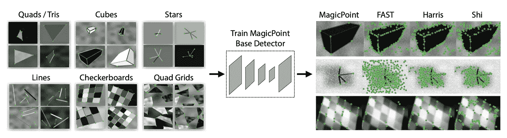**

**MagicPoint:对合成数据进行预处理**

**从合成图像到真实图像，为了弥补真实图像之间的差距，使用测试时间增强(TTA)来积累兴趣点特征。这种密集的 TTA(约 100 次扩充)被称为“单应适应”。该步骤隐含地要求 MagicPoints 以低假阳性率产生高精度检测结果。聚合步骤是增加回忆和创造更多兴趣点。类似的技术也在最近的作品 [**UR2KiD**](https://arxiv.org/abs/2001.07252) 中使用(他们在一种称为**组-概念检测器-描述**的技术中聚集了来自不同概念组的关键点)。**

**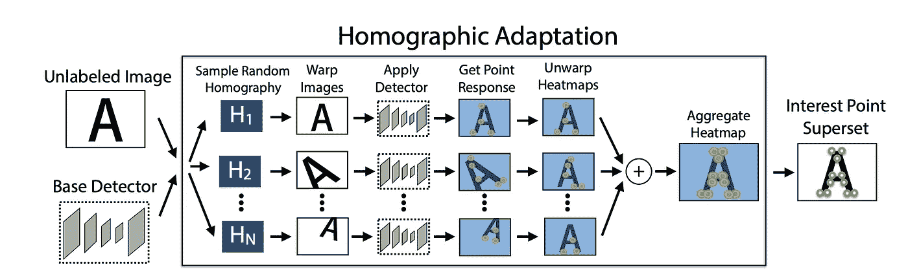**

**单应性适应:一种弥合模拟真实传输差距的 TTA 方案**

**现在，从生成建模的角度来看，如果我们知道一幅图像的关键点，我们就可以将图像和关键点一起进行单应变换。这将生成大量的训练数据来学习描述符。作者使用[对比损失](http://yann.lecun.com/exdb/publis/pdf/hadsell-chopra-lecun-06.pdf) (CVPR 2006，Yann LeCun 的小组)来学习描述符，该描述符基本上包括成对点的拉动项和不成对点的推动项。注意这个损失中有很多项，O(N)其中 N 是每个图像的点数。这是将明确定义的数学问题的知识转移到神经网络的又一个例子。**

**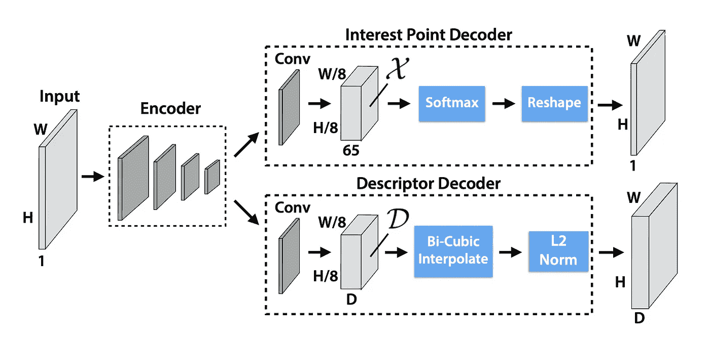**

**SuperPoint 对检测器和描述符使用相同的编码器，以便快速推断**

> **我发现一项特别有趣的技术是，检测器使用分类和**通道 2 图像**技巧来实现高精度检测。总之，它将特征图中每个像素表示的输入图像中的每个 8×8 像素扭曲为 64 个通道，后跟一个垃圾箱通道。如果在 8×8 区域没有关键点，垃圾箱具有高激活度。否则，其他 64 个通道通过 *softmax* 在 8×8 区域找到关键点。**

**以上步骤很大程度上总结了 SuperPoint 的主要思路。**

*   **MagicPoint:对关键点检测器的合成数据进行预处理**
*   **同形适应:实像上的 TTA**
*   **SuperPoint: MagicPoint，使用经过已知单应变换的图像对训练的描述符。描述符用于图像匹配任务。**

**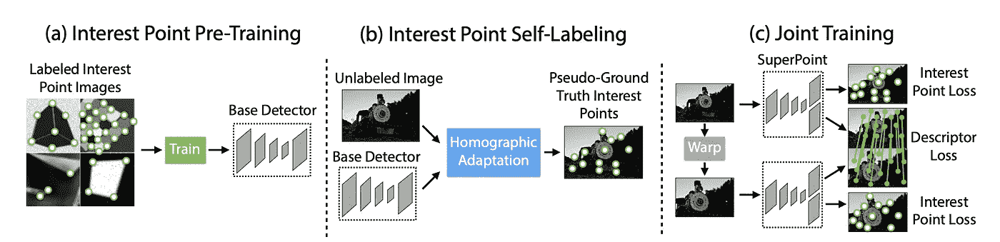**

**[SuperPoint](https://arxiv.org/abs/1712.07629) 的三个主要步骤**

**在大多数基准测试中，SuperPoints 优于手工算法。在配有 GPU 的机器上，480p (480x640)的运行速度为 13 毫秒或 70 FPS，240p (320x240)的运行速度为 167 FPS。**

# **未点**

**[**:端到端无监督兴趣点检测器和描述符**](https://arxiv.org/abs/1907.04011)**通过消除检测器预训练步骤，进一步采用了 superPoint 的概念。关键点在训练中自然出现。****

****该网络的架构在一个 VGG 风格的主干上有三个头。****

*   ****第一个输出是粗略评分热图(x8 下采样)。它消除了 NMS 的需要，并鼓励关键点更均匀地分布在图像上。****
*   ****子像素位置回归以预测 8×8 像素区域内的精确位置。****
*   ****描述符描述。它使用子像素位置进行插值。****

****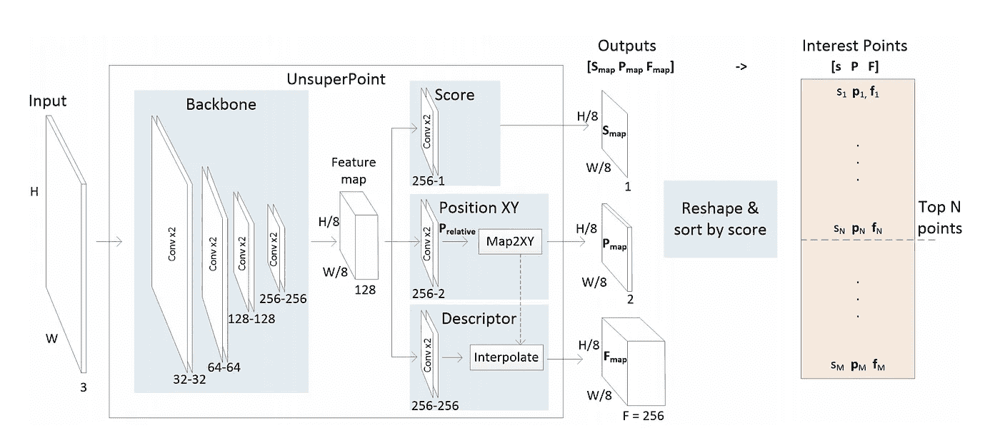****

****[未点](https://arxiv.org/abs/1907.04011)的网络架构****

****SuperPoint 之间有几个区别/改进:****

*   ****没有对关键点位置的直接监督。没有对合成数据和单应自适应繁琐的预处理。****
*   ****用于亚像素位置预测的直接回归而不是逐通道分类。****
*   ****插值发生在网络内部。SuperPoint 在推理后做插值，占用宝贵的 CPU 周期。****

****未点引入吨损失！平衡它们是一项艰巨的任务。为了计算这些损失，必须建立点对对应关系。UnsuperPoint 使用了贪婪匹配算法。如果目标图像(pt)中的点在已知的单应变换(pt*)下变形到源图像后，在源图像中有一个关键点(ps)在阈值(4 个像素)内，那么 ps 和 pt 称为*点对*。****

****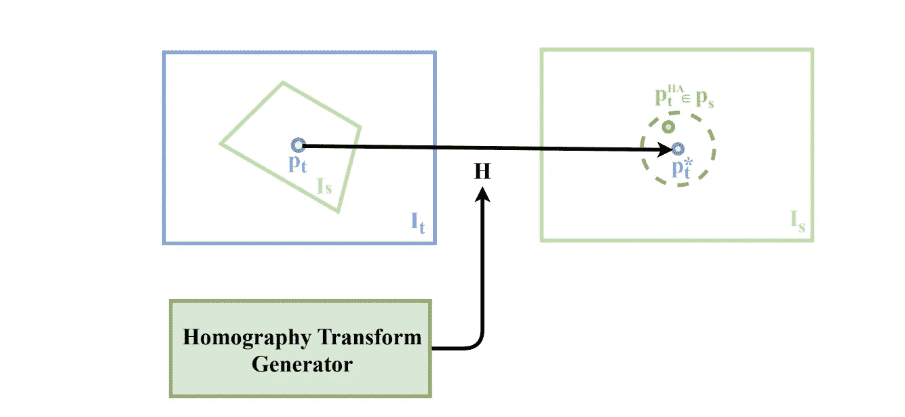****

****寻找点对(来源: [KP3D](https://arxiv.org/pdf/1912.03426.pdf)****

> ****注意，这不是匈牙利匹配，因此不是内射的。换句话说，目标图像中的一个点在源图像中可能有多个匹配。在没有直接监督的其他数据协会论文中可以找到类似的匹配步骤，例如，[像素到图形](https://arxiv.org/abs/1706.07365) (NeurIPS 2017)。****

****利用定义的点对，定义了以下损失项。****

*   ******点对的位置损失**:像素坐标间的欧几里德 L2 距离。****
*   ****点对的分数损失:点对中的点应该有相似的分数。****
*   ****匹配损失:它确保点分数实际上是关键点的置信度分数。它鼓励网络为网络认为在单应变换下可以可靠检索的点输出高分。具体地说，它是点对的平均得分和零均值距离的乘积。****
*   ****均匀分布损失:它鼓励[0，1]内分布均匀。这取决于排序函数是可微的这一事实。这是第一次(正如作者所声称的，据我所知)损失被应用于强制神经网络预测的特定分布。****
*   ****描述符损失:对比损失，同 SuperPoint。****
*   ****去相关损失:鼓励描述符之间的维度是独立的。具体是相关矩阵中非对角元素的 L2 范数(见[ICCV L2 网 2017](http://www.nlpr.ia.ac.cn/fanbin/pub/L2-Net_CVPR17.pdf) )。****

****通过仔细平衡这些损失项，UnsuperPoint 在准确性和速度方面都优于 superPoint。UnsuperPoint 对于 480p 图像以 65 FPS 运行，对于 240p 图像以 119 FPS 运行，比 superPoint 稍慢。****

# ****KP2D****

****[**【KP2D】**:自监督关键点学习的神经离群点剔除](https://arxiv.org/abs/1912.10615) (ICLR 2020)是丰田研究所的后续工作之一。虽然工作看起来是渐进的，但是建议的技巧产生了具体的改进。****

****相对于 UnsuperPoint 有三大改进。****

*   ****一种更具表现力的关键点位置回归方法。UnsuperPoint 将子像素回归的输出限制在[0，1]内，甚至使用了专门设计的损失来强制每个 8×8 像素区域中的均匀分布。KP2D 没有鼓励[0，1]的分布是均匀的，而是深入研究了分布不均匀的原因，并将值放宽到[0，1]之外，允许每个 8×8 像素区域为其边界之外的关键点投票。****

> ****我认为这是因为点对匹配不是内射的。仅通过距离阈值就可以将源图像中的一个点匹配到目标图像中的多个点。****

****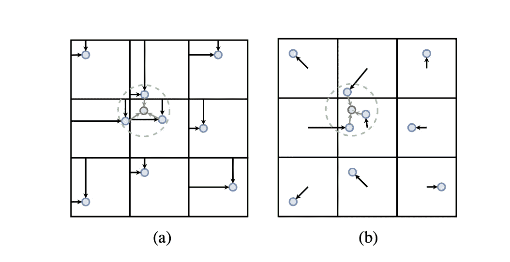****

****KP2D 中的每个 8×8 像素区域可以为其相邻区域中的关键点投票****

*   ****快速和学习的上采样层，即亚像素 ConvNet ( [使用高效亚像素卷积神经网络](https://arxiv.org/abs/1609.05158)，CVPR 2016)的实时单个图像和视频超分辨率)用于在执行插值之前将特征地图上采样 2x2。****

****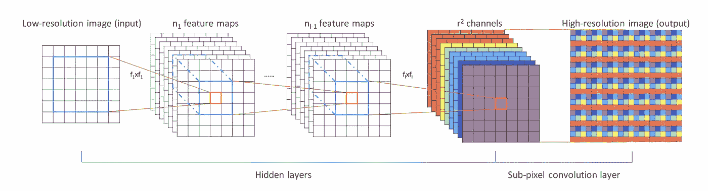****

****用于快速超分辨率的亚像素卷积(通道 2 空间)****

*   ****基于异常值拒绝的附加代理任务，仅在训练期间使用。所谓的 InlierOutlierNet (IO-Net)的灵感来自于[神经引导的 Ransac](https://arxiv.org/abs/1905.04132) (ICCV 2019)，其本身就是受 PointNet 的启发。IO-Net 接受一个点对(2 个点的坐标，带有一个数量的附加描述符距离),并预测该点对是否是用于下游任务(如单应性估计)的 Ransac 类鲁棒匹配方案中的内侧集。****

****此外，在超点和非超点中使用的对比损失由三重损失代替。总体而言，KP2D 始终比 UnsuperPoint 表现出色。它的运行速度与 SuperPoint 和 UnsuperPoint 差不多，在 240p (320x240)下为 175 FPS。****

# ****KP3D****

****[**KP3D** :用于自我运动估计的自监督 3D 关键点学习](https://arxiv.org/abs/1912.03426) (ArXiv 12/2019)由来自丰田研究所的 KP2D 的相同作者完成，并将自监督关键点学习的思想进一步推进到 SLAM 的端到端视觉里程表前端。KP3D 结合了近年来新兴的两个热门话题:**基于视频的关键点自监督学习**(如 KP2D)和**单目逐像素深度估计**(如 [sfm 学习器](https://github.com/patrick-llgc/Learning-Deep-Learning/blob/master/paper_notes/sfm_learner.md)、[野外深度](https://github.com/patrick-llgc/Learning-Deep-Learning/blob/master/paper_notes/mono_depth_video_in_the_wild.md)和[尺度一致 sfm 学习器](https://github.com/patrick-llgc/Learning-Deep-Learning/blob/master/paper_notes/sc_sfm_learner.md))。****

****KP3D 借鉴了 KP2D (ICLR 2020)和[规模一致的 sfm 学习者](https://arxiv.org/abs/1908.10553) (NeurIPS 2019)在上述两个领域的 SOTA 表现。特别地，在尺度一致的 sfm 中，学习器增加了帧之间的深度一致性，这对于精确的自我运动估计是至关重要的。****

****综合来看，KP3D 有一个令人惊叹的 SLAM 演示视频。作为一种单目方法，KP3D 击败了所有以前的 SOTA 单目和几乎所有的立体 SLAM 方法。它唯一没有胜过的立体 SLAM([DVSO:深度视觉立体里程计](https://arxiv.org/abs/1807.02570)，ECCV 2018)也是基于深度学习的方法。****

****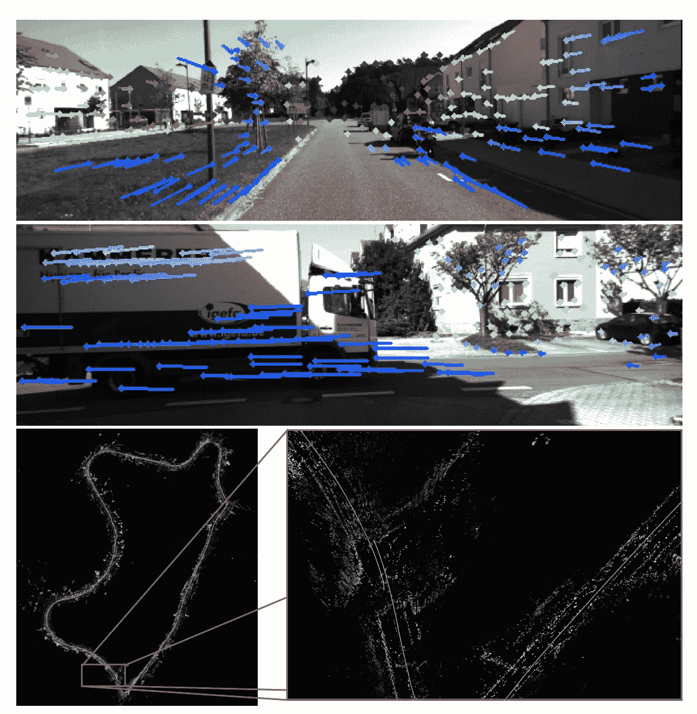****

****2D 关键点完全从无标签的单目视频中学习，匹配稀疏缓慢，并在 KP3D 中产生惊人的远程单目视觉里程计****

## ****注释****

****乍一看，这篇论文数学很重。确切地说，它需要更多的 SLAM 领域知识来理解。为了更深入地研究算法，我们必须考虑一些符号约定:****

*   ****pt∈是目标图像中的关键点，PS∈是源图像中的关键点。****
*   ****pt(MV)∈是基于描述子空间的源图像中 pt 的匹配关键点。(MV 是多视图的简写)基于这对 pt↔pt(MV，我们可以计算相关的自我运动 Xt→s。描述符损失基于此。****
*   ****pt∑∈是源图像中的扭曲 pt(类似于 UnsuperPoint 和 KP2D 中的 pt*)。稀疏关键点位置损失介于 pt(MV)和 pt *之间。****
*   ****一旦 Xt→s 已知，密集光度损失和稀疏关键点位置损失被公式化。****

****在整个流水线中，计算 pt* *是最难的。*在以前的 2D 关键点作品(例如，SuperPoint、UnsuperPoint、KP2D)中，pt*可以很容易地计算，但是在多视图适应中，这很难，并且需要首先用估计的深度投影到 3D，然后用估计的自我运动投影到另一个视图。****

> ****我认为 KP3D 的作者误解了单应适应的原始命名，这是 SuperPoint 中第**第二**阶段使用的 TTA 技术。他们似乎把这种技术误认为是第**第三**阶段的超级要点，即利用已知的单应变换来产生训练信号。这个细节不会对我们理解这篇论文有太大影响。****

****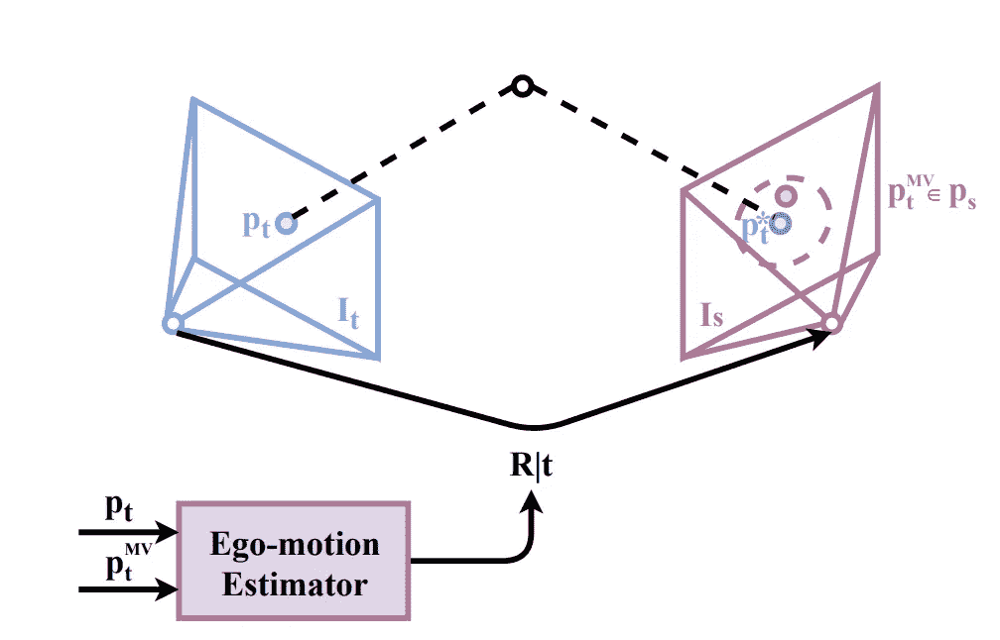****

****根据多视图适应变换的各种关键点****

## ****可微分三维姿态估计****

****KP3D 不是直接使用 CNN 来进行姿态估计(在 [sfm 学习器](https://github.com/patrick-llgc/Learning-Deep-Learning/blob/master/paper_notes/sfm_learner.md)中的 PoseNet)，而是使用匹配的关键点来进行姿态估计，这可能是更好的性能的关键，因为上面回顾的上述 2D 关键点学习方法已知会产生非常好的 HA 或单应性准确性。****

****本文的一个主要贡献是如何以完全可微的方式从匹配的 2D 点执行姿态估计。快速入门经典算法基于 [**极线几何**](https://en.wikipedia.org/wiki/Epipolar_geometry) 从两幅图像中匹配的 2D 点估计自我运动。基本思想是估计图像对的基本矩阵或[本质矩阵](https://en.wikipedia.org/wiki/Essential_matrix)，然后从任一矩阵中恢复旋转和平移。****

****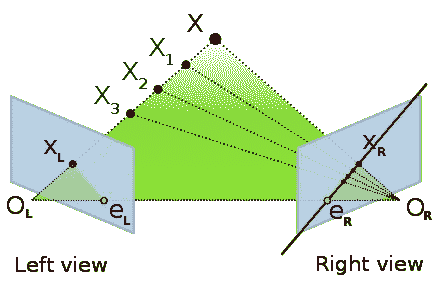****

****[极线约束](https://en.wikipedia.org/wiki/Epipolar_geometry):三维点及其在 2D 图像上的投影之间的几何关系****

****因为我们联合估计每个像素的密集深度，所以我们可以使用 Epnp ( [透视 n 点](https://en.wikipedia.org/wiki/Perspective-n-Point))来估计帧之间的相对姿态。然而，这是不可微的，因此只能作为一个初步的猜测。****

****KP3d 提出的方法是，我们可以粗略地使用关键点的变换的 3D 位置(具有初始猜测)来获得点在新的相机坐标中的 3D 位置。那么本质上，该问题被简化为基于两组匹配的 3D 点来估计相对相机姿态变化。这个问题被称为正交 Procrustes 问题，具有诸如 ICP(迭代闭合点，通常用于激光雷达点云配准)的良好解决方案。在我们知道 3D 点之间的匹配的假设下，ICP 具有基于 SVD(矩阵的奇异值分解)的封闭形式的公式，称为 [Kabsch 算法](https://en.wikipedia.org/wiki/Kabsch_algorithm)。****

# ****外卖食品****

****近年来，使用深度学习的关键点检测和描述领域受到了越来越多的关注。正如 KP2D 的公开评论中所指出的，“ [**这个问题是老问题，但还没有完全解决，因为手工制作的 SIFT 仍然在基准测试中胜出。**](https://openreview.net/forum?id=Skx82ySYPH&noteId=rklyawTEYS)****

*   ****SuperPoint 提出使用已知单应变换来生成用于关键点检测和描述的监控信号。这是这篇文章中所有论文探索的开创性思想。****
*   ****SuperPoint 使用合成数据来预训练关键点探测器，并使用称为单应自适应的测试时间增加技术来转换到真实数据。****
*   ****UnsuperPoint 建议取消关键点检测器繁琐的预训练阶段。通过巧妙地平衡损失，关键点的检测和描述都将从训练中出现。****
*   ****KP2D 用几种技术改进了 UnsuperPoint，最显著的是用代理损失来确定建议的点对是否匹配 inlier。****
*   ****KP3D 结合了 KP2D 的工作和单目深度估计的最新进展，以提供基于 SOTA 单目 SLAM 系统。****

# ****参考****

*   ****[**超级点**:自监督兴趣点检测与描述](https://arxiv.org/abs/1712.07629)，CVPR 2018****
*   ****[**非重叠点**:端到端非监督兴趣点检测器和描述符](https://arxiv.org/abs/1907.04011)，ArXiv 07/2019****
*   ****[**KP2D** :自监督关键点学习的神经离群点剔除](https://arxiv.org/abs/1912.10615)，ICLR 2020****
*   ****[**KP3D** :用于自我运动估计的自监督 3D 关键点学习](https://arxiv.org/abs/1912.03426)，ArXiv 12/2019****
*   ****[**DVSO:** 深度虚拟立体里程计:利用深度预测进行单目直接稀疏里程计](https://arxiv.org/pdf/1807.02570.pdf)，ECCV 2018****
*   ****[**面具 RCNN**](https://arxiv.org/abs/1703.06870) ，ICCV 2017****
*   ****[**:人体姿态估计的复合场**](https://arxiv.org/abs/1903.06593)**，CVPR 2019******
*   ********SC-SfM-Learner** : [来自单目视频的无监督尺度一致深度和自我运动学习](https://arxiv.org/abs/1908.10553)，NeurIPS 2019******
*   ****[**神经引导的 RANSAC** :学习从哪里采样模型假设](https://arxiv.org/abs/1905.04132) ICCV 2019****
*   ******亚像素卷积神经网络** : [使用高效亚像素卷积神经网络的实时单幅图像和视频超分辨率](https://arxiv.org/abs/1609.05158)，CVPR 2016****
*   ****[**MoCo:** 用于无监督视觉表征学习的动量对比](https://arxiv.org/abs/1911.05722)，ArXiv 11/2019****
*   ****[**:视觉表征对比学习的简单框架**](https://arxiv.org/abs/2002.05709)**，ArXiv 02/2020******