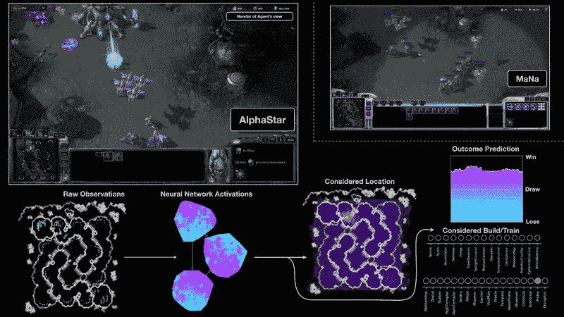
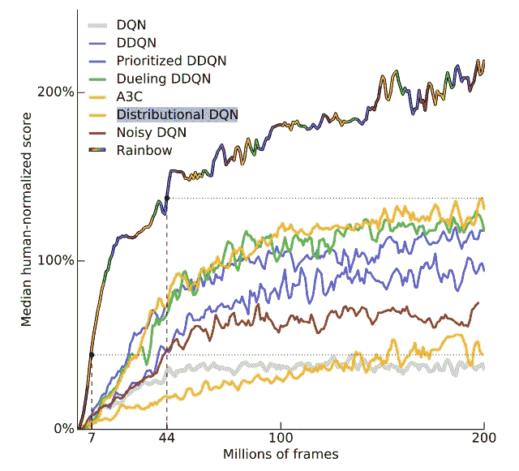
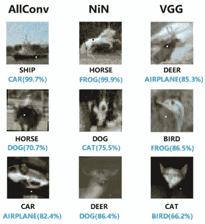
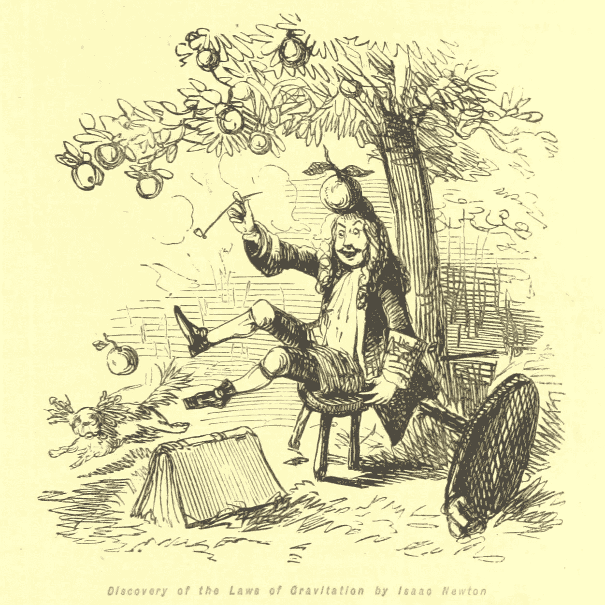
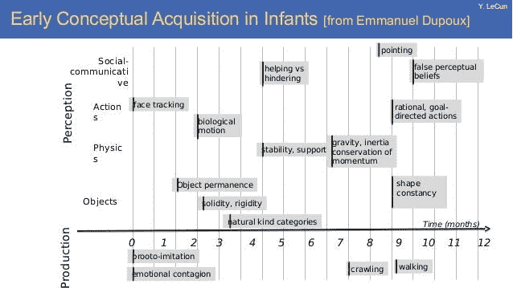
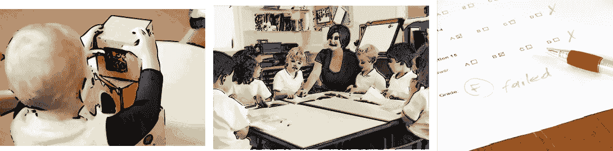
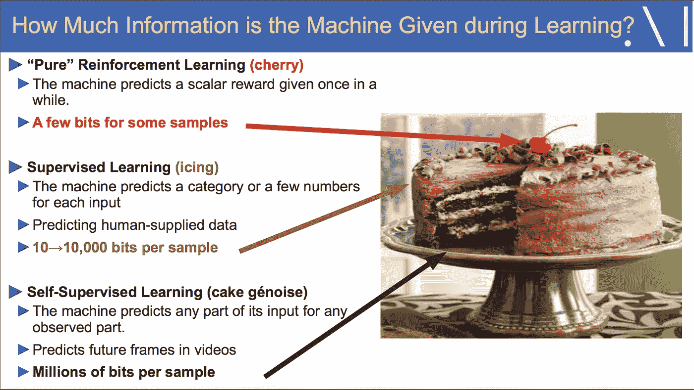
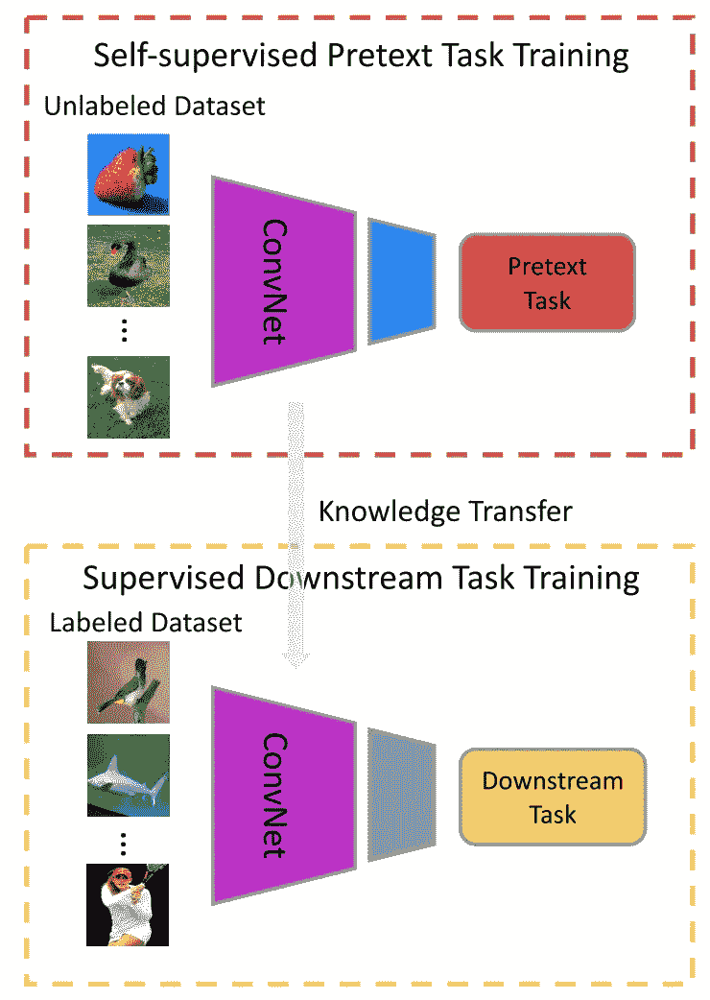

# 自我监督学习和深度学习中减少标记数据的探索

> 原文：<https://towardsdatascience.com/self-supervised-learning-and-the-quest-for-reducing-labeled-data-in-deep-learning-db59a563e25b?source=collection_archive---------8----------------------->

## 深度学习的现状以及自我监督如何可能是更健壮模型的答案

图片来自[来自 www.picjumbo.com 的免费库存照片](https://pixabay.com/users/picjumbo_com-2130229/?utm_source=link-attribution&utm_medium=referral&utm_campaign=image&utm_content=865116)来自 [Pixabay](https://pixabay.com/?utm_source=link-attribution&utm_medium=referral&utm_campaign=image&utm_content=865116)

T 这里有一件事是每个深度学习实践者都同意的。

> 深度学习模型是数据低效的。

让我们首先考虑计算机视觉中流行的分类任务。以 [ImageNet](http://www.image-net.org/) 数据库为例。它包含来自 1000 个不同类别的 130 万张图片。对于这些图像中的每一个，都有一个人注释的标签。

ImageNet 无疑是当前深度学习复兴的垫脚石之一。其中大部分始于 2012 年的那篇([krijevsky 等人](https://papers.nips.cc/paper/4824-imagenet-classification-with-deep-convolutional-neural-networks.pdf))论文。在这里，ConvNets 第一次大幅度击败了当前最先进的模型。在竞争对手中，它是基于 ConvNet 的单一解决方案。之后，ConvNets 变得无处不在。

在深度学习之前，ImageNet 挑战一直被认为是非常困难的。在主要原因中，其较大的可变性最为突出。事实上，要建立能在这么多种类的狗中通用的手工制作的特征并不容易。

> 然而，随着深度学习的发展，我们很快意识到，让 ImageNet 如此艰难的原因实际上是让深度学习如此有效的秘密成分。这就是丰富的数据。

然而，经过多年的深度学习研究，有一点变得很清楚。*用于训练精确模型的大型数据库的必要性成为一个非常重要的问题*。当需要人工标注的数据时，这种低效率会成为一个更大的问题。

而且，在当前的深度学习应用中，数据的问题无处不在。再以 [DeepMind 的 AlphaStar](https://deepmind.com/blog/article/alphastar-mastering-real-time-strategy-game-starcraft-ii) 模型为例。

来源: [AlphaStar:精通即时战略游戏星际争霸 2](https://deepmind.com/blog/article/alphastar-mastering-real-time-strategy-game-starcraft-ii)

AlphaStar 是一个深度学习系统，使用监督和强化学习来玩星际争霸 2。在训练过程中，AlphaStar 只能看到来自游戏控制台的原始图像像素。为了训练它，DeepMind 的研究人员使用了一种分布式策略，他们可以并行训练大量的代理人。**每个代理都经历了至少 200 年的实时星际争霸游戏(不间断)**。AlphaStar 接受了与职业选手相似的训练。它在官方游戏服务器上的活跃玩家中排名超过 99.8%——这是一个巨大的成功。

尽管使用了所有通用技术来训练系统，但有一件事对成功构建 AlphaStar(或几乎任何其他 RL 代理)至关重要——**数据的可用性**。事实上，最好的强化学习算法需要许多(但许多)试验才能达到人类水平的性能。**这与我们人类的学习方式完全相反。**

因此，巨大的成功来自于有大量可用数据的受限的、定义良好的场景。看看 DeepMind 的这篇论文[。最好的 RL 方法需要近 100 小时(1080 万帧)的不间断播放，才能达到专业人员在一套 Atari 游戏上的相同性能水平。尽管最近有所改善，但这似乎还是太多了。](https://arxiv.org/pdf/1710.02298.pdf)

学分:[彩虹:结合深度强化学习的改进](https://arxiv.org/pdf/1710.02298.pdf)

*要了解更多关于 AlphaStar 的信息，请看一下这个来自* [*批次*](https://blog.deeplearning.ai/blog/the-batch-google-achieves-quantum-supremacy-amazon-aims-to-sway-lawmakers-ai-predicts-basketball-plays-face-detector-preserves-privacy-1-0-0-0-0) *的简短摘要。*

我可以用更多的例子来烦你，但是我想这两个例子说明了我想要表达的观点。

> 目前的深度学习是基于大规模数据的。当它们的环境和约束得到满足时，这些系统就像魔法一样工作。然而，在一些奇怪的情况下，他们也会灾难性地失败。

让我们稍微回到 ImageNet 上的分类。具体来说，该数据库估计人为错误率为 5.1% 。另一方面，目前最先进的 [**深度学习 top-5 准确率在 1.8%**](https://paperswithcode.com/sota/image-classification-on-imagenet) 左右。因此，人们完全可以说深度学习在这项任务上已经比人类做得更好了。但是是吗？

如果是这样的话，我们如何解释这些事情？

学分:[用对抗性例子攻击机器学习](https://openai.com/blog/adversarial-example-research/)

这些例子在互联网上非常流行，被称为[反例](https://openai.com/blog/adversarial-example-research/)。我们可以认为这是一个优化任务，旨在欺骗机器学习模型。这个想法很简单:

> 我们如何改变先前被分类为“熊猫”的图像，以便分类器认为它是“长臂猿”？

我们可以简单地认为它是精心设计的输入示例，用来欺骗 ML 模型，使其犯分类错误。

致谢:[愚弄深度神经网络的一个像素攻击](https://arxiv.org/pdf/1710.08864.pdf)

正如我们所看到的，优化是如此有效，以至于我们无法(用肉眼)感知真实(左)和对立(右)图像之间的差异。事实上，造成错误分类的噪声不是任何类型的已知信号。相反，它被精心设计来探索这些模型中隐藏的偏见。此外，最近的研究表明，在某些情况下，我们只需要改变 [1 个像素，就可以完全欺骗最好的深度学习分类器](https://arxiv.org/pdf/1710.08864.pdf)。

在这一点上，我们可以看到问题开始相互叠加。我们不仅需要大量的例子来学习一项新的任务，而且我们还需要确保我们的模型学习正确的表示。

来源:[用对立的例子愚弄图像识别](https://www.youtube.com/watch?v=piYnd_wYlT8&list=PL4-Hw6PNAmgc1NUCsMRbZFOChJmuDnefp&index=12)

当我们看到深度学习系统像那样失败时，一个有趣的讨论就来了。显然，我们人类不会轻易被这样的例子愚弄。但这是为什么呢？

有人可能会说，当我们需要掌握一项新任务时，我们实际上并不是从零开始学习。取而代之的是，我们使用了大量在我们的生活和经历中获得的先验知识。

我们了解重力及其含义。我们知道，如果我们让一枚炮弹和一根鸟毛从同一个起点落下，由于两个物体中空气阻力的不同作用，炮弹将首先到达地面。我们知道物体不应该浮在空中。我们了解世界如何运转的常识。你知道如果你的父亲有一个孩子，他或她将是你的兄弟姐妹。我们知道，如果我们在报纸上看到有人出生在 20 世纪，他/她可能已经不在人世，因为我们知道(通过观察世界)人们通常不会活超过 120 岁。

我们理解事件之间的因果关系。最令人好奇的是，我们实际上在生命的早期就学习了许多这些高层次的概念。事实上，我们只用 6 到 7 个月就学会了像重力和惯性这样的概念。这个年纪，和世界的互动几乎没有！

婴儿的早期概念习得。 [Yann LeCun 幻灯片](https://drive.google.com/file/d/12pDCno02FJPDEBk4iGuuaj8b2rr48Hh0/view)

从这个意义上说，有人可能会说，将算法的性能与人类进行比较是不“*公平的”*。

在他的一次关于自我监督学习的[演讲](https://www.facebook.com/epflcampus/videos/1960325127394608)中，Yann LeCun 认为至少有三种方法可以获得知识。

*   通过观察
*   来自监督(大多来自家长和老师)
*   来自强化反馈

人类通过生活获得的不同知识来源。通过观察/互动、监督和反馈来学习。

然而，如果我们以人类婴儿为例，在那个年龄几乎没有互动。然而，婴儿设法建立一个直观的世界物理模型。因此，像重力这样的高级知识只能通过纯粹的观察来学习——至少，我还没有见过任何父母给 6 个月大的婴儿教物理。

只是在生命的后期，当我们掌握了语言并开始上学时，监督和互动(有反馈)才变得更加普遍。但更重要的是，当我们到达人生的这些阶段时，我们已经发展出一个强健的模型世界。这可能是为什么人类比现在的机器数据效率更高的主要原因之一。

正如 LeCun 所说，强化学习就像蛋糕中的樱桃。监督学习是糖衣，自我监督学习是蛋糕！

来源: [Yann LeCun](https://drive.google.com/drive/folders/0BxKBnD5y2M8NUXhZaXBCNXE4QlE)

# 自我监督学习

> 在自我监督学习中，系统学习从其输入的其他部分预测其输入的一部分— [LeCun](https://www.facebook.com/722677142/posts/10155934004262143/)

自监督学习源于无监督学习。它涉及从未标记的数据中学习语义上有意义的特征。在这里，我们主要关注的是计算机视觉环境下的自我监督。

一般的策略是通过设计一个*借口*任务，将一个无监督的问题转化为一个有监督的任务。通常，一个*借口*任务有一个总的目标。这个想法是让网络从图像或视频中捕捉视觉特征。

借口任务和常见的监督问题有一些相似之处。

我们知道监督训练需要标签。反过来，这些通常是由**人类注释者**收集的。然而，在许多情况下，标签要么非常昂贵，要么不可能获得。此外，我们还知道深度学习模型天生就需要数据。其直接结果是，大规模标注数据集成为进一步发展的主要障碍之一。

嗯，自我监督学习也需要标签来训练托词任务。然而，这里有一个关键的区别。用于学习借口任务的标签(或伪标签)具有不同的特征。

> 事实上，对于自监督训练，伪标签仅从数据属性中单独导出。

换句话说，不需要人为标注。事实上，自我学习和监督学习的主要区别在于标签的来源。

*   如果标签来自人类注释者(像大多数数据集一样)，这是一个监督任务。
*   如果标签来自数据，在这种情况下，我们可以自动生成它们，我们谈论的是自我监督学习。

最近的研究提出了许多借口任务。一些最常见的包括:

*   旋转
*   七巧板
*   图像彩色化
*   图像修复
*   使用 GANs 生成图像/视频

*在这里* *查看每个* [*借口任务的概要描述。*](https://arxiv.org/abs/1902.06162)

学分:[深度神经网络的自我监督视觉特征学习:综述](https://arxiv.org/abs/1902.06162)

在自我监督训练期间，我们挑战网络来学习*托词*任务。同样，伪标签是从数据本身自动生成的，并用作训练目标。一旦训练结束，我们通常使用学习到的视觉特征将知识转移到第二个问题——下游任务**中。**

一般来说，*下游任务*可以是任何被监督的问题。这个想法是使用自我监督的特性来提高下游任务的性能。通常，*下游*任务的数据有限，过度拟合是一个大问题。在这里，我们可以看到在大型标记数据库(如 ImageNet)上使用预训练的 ConvNets 进行普通迁移学习的相似性。但有一个关键优势。

> 通过自我监督训练，我们可以在难以置信的大型数据库上预先训练模型，而不用担心人类标签。

另外，*托辞*和平时的分类任务有个茬儿区别。在纯分类中，网络学习表示，目标是在特征空间中分离类别。在自我监督学习中，*托辞*任务通常挑战网络来学习更一般的概念。

以图像着色*托辞*任务为例。为了在其中脱颖而出，网络必须学习解释数据集中对象的许多特征的通用特征。这些包括物体的形状，它们的一般纹理，担心光线，阴影，遮挡等。

简而言之，通过解决托词任务，网络将学习语义上有意义的特征，这些特征可以很容易地转移到学习新问题。**换句话说，我们的目标是在接受监督之前从未标记的数据中学习有用的表示法**。

# 结论

自我监督学习允许我们在不使用大型**注释**数据库的情况下学习良好的表示。相反，我们可以使用未标记的数据(这是丰富的)并优化预定义的*借口*任务。然后，我们可以使用这些特征来学习数据稀缺的新任务。

**感谢阅读**。

# 参考

*   [用对立的例子攻击机器学习](https://openai.com/blog/adversarial-example-research/)
*   [阿尔法星:精通即时战略游戏星际争霸 2](https://deepmind.com/blog/article/alphastar-mastering-real-time-strategy-game-starcraft-ii)
*   《彩虹:结合深度强化学习的改进》*第三十二届 AAAI 人工智能大会*。2018.
*   景，龙龙，田英丽。"深度神经网络自监督视觉特征学习:综述." *arXiv 预印本 arXiv:1902.06162* (2019)。
*   Gidaris，Spyros，Praveer Singh 和 Nikos Komodakis。"通过预测图像旋转的无监督表示学习." *arXiv 预印本 arXiv:1803.07728* (2018)
*   较少标签的高保真图像生成。 *arXiv 预印本 arXiv:1903.02271* (2019)
*   苏、佳伟、达尼洛·瓦斯康塞洛斯·巴尔加斯和樱井幸一。"愚弄深度神经网络的一个像素攻击." *IEEE 进化计算汇刊* (2019)。