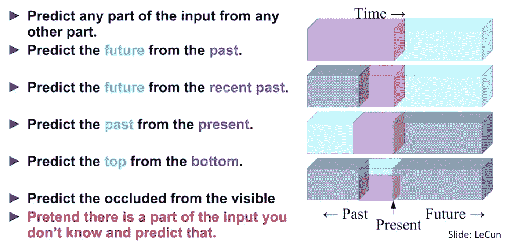
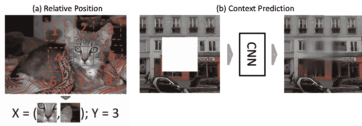
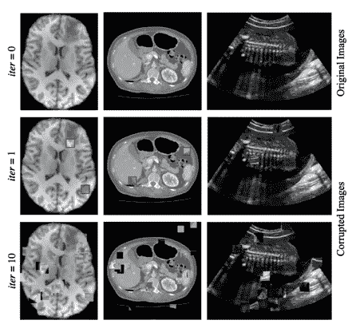
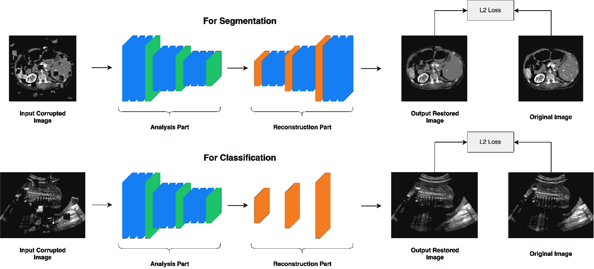
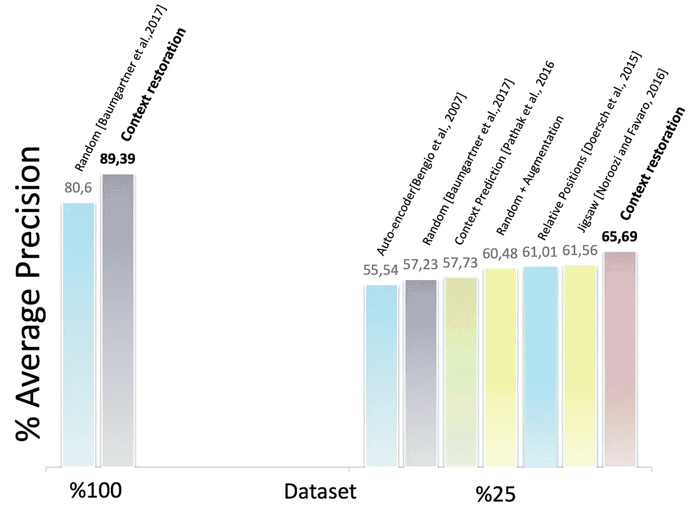
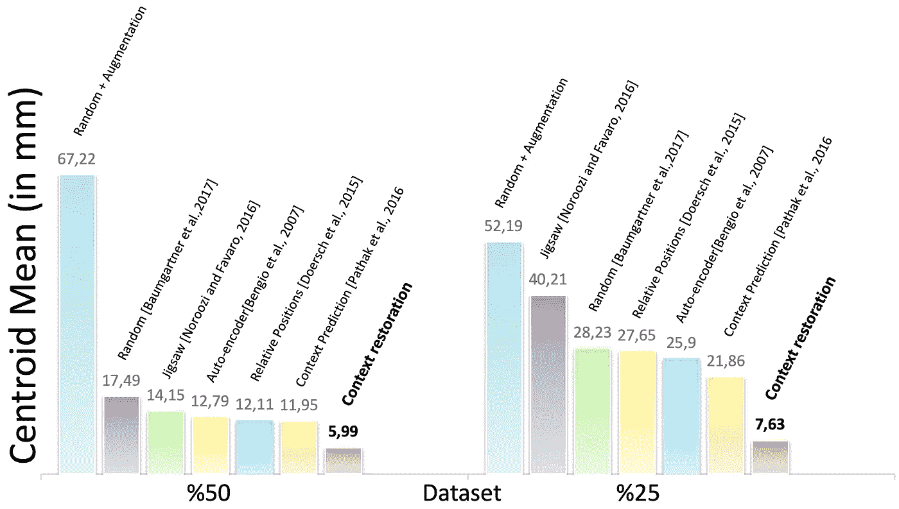
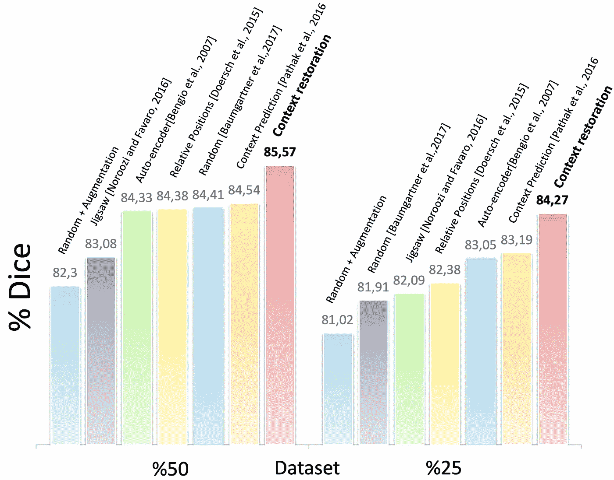

# 基于图像上下文恢复的医学图像分析自监督学习

> 原文：<https://towardsdatascience.com/self-supervised-learning-for-medical-image-analysis-using-image-context-restoration-557c8c35d27f?source=collection_archive---------23----------------------->

## 一种称为上下文恢复的新型自我监督学习策略

这是论文“*使用图像上下文恢复进行医学图像分析的自我监督学习*”的博客帖子。

*原载于*[*wiki . tum . de*](https://wiki.tum.de/display/dlma/Self-supervised+learning+for+medical+image+analysis+using+image+context+restoration)

# 介绍

深度学习方法在计算机视觉领域取得了巨大成功。特别是，CNN 最近在医学图像领域，如疾病分类[1]和器官分割[2]中展示了令人印象深刻的结果。好的深度学习模型通常需要相当数量的标签，但在许多情况下，未标记的数据量远远大于已标记的数据量。此外，来自自然图像的预训练模型在医学图像上没有用，因为强度分布不同。此外，标记自然图像很容易，简单的人类知识就足够了。然而，医学图像的注释需要专业知识。

> 那么，我们应该如何学习无标签的表征呢？

答案很简单；从数据或图像本身获得监督。这意味着我们可以通过以特定的形式构建监督学习任务来实现这一点，以利用其余信息来预测仅一部分信息。这就是所谓的*自我监督学习*。

***什么是自我监督学习？***

它仍然是监督学习，因为它使用标记数据。它提取并使用自然可用的相关上下文。从这一事实来看，有监督的大量训练实例是可用的。由于这一点，基于这种自我监督来预训练 CNN，它导致基于具有有限人工标签的数据来初始化后续 CNN 的有用权重。图 1 向我们展示了自我监督学习的概要。

图一。自我监督学习概述[3]

由于现有的自我监督学习策略在医学图像上没有显著的性能改善，作者提出了另一种自我监督策略，称为*上下文恢复*。

图二。上下文恢复方法概述(图片由作者提供)

图 2 是上下文恢复如何工作的很好的概述。基本上，有输入图像，然后算法破坏并试图恢复它们。在这个恢复过程中，它学习权重，这将在处理后续任务时给我们带来更好的结果。

其中一项名为*通过上下文预测的无监督视觉表示学习【4】*的自我监督研究，从给定图像中预测 3 × 3 面片网格中中心面片与其周围面片之间的相对位置。例如，图 3-a 向我们展示了猫的右耳相对于猫的眼睛应该在右上的位置。但是它有三个缺点:可能有多个正确答案(例如，汽车或建筑物)，它仍然学习在医学图像中没有用的琐碎特征，最后，补丁不包含关于图像的全局上下文的信息。

在特征学习方面，提出了另一个自我监督的研究，名为*上下文编码器:通过修复进行特征学习[5]。*它被训练来填补图像中缺失的一块，如图 3-b 所示，因此，在学习有意义的潜在表征的同时，重构原始输入。此外，这种方法也有一些缺点:它改变了图像的强度分布。因此，所得到的图像属于另一个域，并且所学习的特征对于原始域中的图像可能是无用的。

图 3。相对位置(a)和上下文预测(b)方法的演示[4，5]

# 方法学

论文提出了一种新的自我监督策略，他们称之为*上下文恢复*。该方法很简单，在给定的图像中随机选择两个孤立的小块并交换它们的上下文。重复这些操作 T 次，直到强度分布仍然保留，但其空间信息被改变。图 4 向我们展示了迭代 1 和 10 后的情况。

本文在医学成像中的三个常见问题上验证了上下文恢复策略:**分类**、**定位**和**分割**。胎儿 2D 超声图像中的扫描平面检测:在计算机断层摄影(CT)图像中定位腹部器官；为了分割多模态磁共振(MR)图像中的脑肿瘤，使用了。

图 4。生成用于自监督上下文乱序的训练图像:分别是大脑 T1 MR 图像、腹部 CT 图像和 2D 胎儿超声图像。在第二列的图中，红框突出显示了第一次迭代后交换的面片。(图片由作者提供)

所提出的自监督学习策略使用了细胞神经网络，它由两部分组成:一个*分析部分*和一个*重构部分*。图 5 示出了可行 CNN 的一般架构的概述。分析部分将给定的无序图像编码成特征图，重建部分使用这些特征图来产生正确上下文的输出图像。

**分析部分**

这部分包括卷积单元和下采样单元的堆栈，它们从给定的图像中提取特征图。

**重建部分**

这里，它包括卷积层和上采样层的堆栈，从而恢复图像。每个后续任务的重建部分是不同的。对于分类任务，简单的结构如几个反褶积层是优选的。对于分割任务，与分割 CNN 一致的复杂结构是优选的。

结果，几乎所有后续分割 CNN 的权重都可以使用在自我监督预训练中学习到的权重来初始化。

图 5。用于上下文恢复自监督学习的通用 CNN 结构。(图片由作者提供)

# 实验装置

所提出的使用上下文恢复任务的自我监督可以由 CNN 在三个不同的数据集上执行，包括脑部 MR 图像、腹部 CT 图像和胎儿 US 图像，并且他们使用预训练的 CNN 分别执行后续任务，例如分类、定位和分割。对于这些问题中的每一个，使用不同的 CNN 架构和数据:

***分类***

该数据集由 2694 个胎龄在 18 至 22 周之间的胎儿(224×288)的 2D 超声检查组成[6]。

这个分类问题的 CNN 是 SonoNet-64，它在[6]中取得了最好的性能。

CNN 在这种分类任务中的性能通过精确度、召回率和 F1 分数来测量。

***本地化***

采用了来自 150 名受试者 3D 腹部 CT 图像的数据集[7]。

数据集被随机分成两半。前半部分用于训练和验证，另一半用于测试。

用于多器官定位任务的 CNN 类似于 SonoNet [6]。由于输入图像为 512×512，大约是每侧已处理 2D 超声帧的两倍，因此它比 SonoNet 多了一个卷积堆栈和池层。

通过计算边界框之间的质心和墙的距离来测量性能。

***分割***

BraTS 2017 挑战赛的数据集，由 285 名受试者组成[8]。每个对象都有多种模式的 MR 图像，即自然 T1 (T1)、增强后 T1 加权(T1-Gd)、T2 加权(T2)、T2 液体衰减反转恢复(FLAIR)。*如果您想进一步了解这些术语，请访问本网站***。**

*285 幅图像中的 142 幅用于训练和验证，剩余的 143 幅用于测试。*

*本实验中使用的 CNN 是 2D U-Net [9]。*

*他们在 BraTS 2017 挑战赛中使用了相同的评估指标:骰子得分、灵敏度、特异性和 Hausdorff 距离。*

*作者比较了不同的自我监督学习策略，即随机[6]，随机+增强，自动编码器[10]，使用补丁相对位置预测的自我监督[4]，Jigsaw [11]，以及使用局部上下文预测的自我监督[5]和提议的上下文恢复。*

# *结果和讨论*

**

*图 6。胎儿 2D 超声图像标准扫描平面的分类(图片由作者提供)*

*图 6 展示了不同配置下 CNN 的性能结果。由于自我监督的预训练，当使用小训练数据集时，CNN 的性能可以得到改善。上下文恢复预训练对 SonoNet 性能的改善最大。*

**

*图 7。CNN 在不同训练环境下解决多器官定位(本结果中为左肾)问题的表现(图片由作者提供)*

*图 7 表示 CNN 在不同训练方法中的定位性能。在某些情况下，使用**上下文恢复**预训练的 CNN 在更多标记的训练数据上与无预训练相当甚至更好。就在左肾上的性能而言，CNN 在半个训练数据上略微优于在所有训练数据上。值得注意的是，如果较少的训练数据导致结果显著下降，自我监督学习往往会显著改善结果。*

**

*图 8。不同训练设置下定制 U-Nets 的分割结果(图片由作者提供)*

*图 8 显示了 BraTS 问题的结果。增强的肿瘤核心中的 Dice 分数甚至稍好。并且，它向我们展示了使用一半的训练数据集，所提出的自监督策略产生了与使用整个训练数据集相似的性能。同样，我们可以看到基于上下文恢复的自我监督为分段任务提供了最佳的预训练方法。*

*提出了一种新的基于上下文恢复的自监督学习策略。这使得 CNN 能够在没有任何标签的情况下学习有用的图像语义，并用于后续任务。因此，我们可以总结出以下要点:*

*   *在分类、定位和分割这三项任务中，使用上下文恢复预训练比其他方法表现更好*
*   *如果减少训练数据导致性能显著下降，上下文恢复预训练可以提高性能*
*   *语境还原有三个显著特征；学习语义图像特征；这些语义特征对于不同的后续任务是有用的；实现简单明了*
*   *缺点是 L2 损失导致图像模糊。*

# *未来作品*

*探索更有效的自我监督学习策略，使自我监督预训练在未来能像监督预训练一样好，是值得关注的。此外，还会出现以下问题:*

*   *如果使用更大的数据集会发生什么？还是优化的自我监督学习模型？*
*   *如果他们可以使用 3x3 补丁并随机交换，结果会受到什么影响？*
*   *添加额外的模型？*
*   *使用另一种损失函数代替 L2，例如对抗性损失？*

*作者:粱晨、保罗·本特利、森健作、三泽和里、藤原道孝、丹尼尔·吕克特*

*关于这项工作的更多细节，请查看[关于科学指导的论文](https://www.sciencedirect.com/science/article/abs/pii/S1361841518304699)。*

# *参考*

*[1]王，x，彭，y，陆，l，陆，z，巴盖里，m，萨默斯，R. M，2017 .ChestX-ray8:医院规模的胸部 X 射线数据库和常见胸部疾病的弱监督分类和定位基准。IEEE 计算机视觉和模式识别会议论文集。第 3462-3471 页。网址 https://arxiv.org/abs/1705.02315。*

*[2]Suk h .-I .，Lee s-w .，Shen d .，Initiative，A. D. N .等人，2014 年。用于 AD/MCI 诊断的分层特征表示和具有深度学习的多模态融合。神经影像 101，569–582。网址[https://www.ncbi.nlm.nih.gov/pmc/articles/PMC4165842/](https://www.ncbi.nlm.nih.gov/pmc/articles/PMC4165842/)。*

*[3] Yann LeCun，自我监督学习:机器能否像人类一样学习，2018。网址[youtube.com](https://www.youtube.com/watch?v=7I0Qt7GALVk)。*

*[4]多尔施，c .，古普塔，a .，埃夫罗斯，A. A .，2015。基于上下文预测的无监督视觉表征学习。IEEE 计算机视觉国际会议论文集。第 1422-1430 页。网址[https://arxiv.org/abs/1505.05192](https://arxiv.org/abs/1505.05192)。*

*[5] Pathak，d .，Krahenbuhl，p .，Donahue，j .，Darrell，t .，Efros，A. A .，2016 年。上下文编码器:通过修补进行特征学习。IEEE 计算机视觉和模式识别会议论文集。第 2536-2544 页。网址[https://arxiv.org/abs/1604.07379](https://arxiv.org/abs/1604.07379)。*

*[6]鲍姆加特纳，C. F .，卡姆尼萨斯，k .，马修，j .，弗莱彻，T. P .，史密斯，s .，科赫，L. M .，坎因茨，b .，吕克特，d .，2017。SonoNet:徒手超声中胎儿标准扫描平面的实时检测和定位。IEEE 医学成像汇刊 36 (11)，2204–2215。网址[https://arxiv.org/abs/1612.05601](https://arxiv.org/abs/1612.05601)。*

*[7] Tong，t .，Wolz，r .，Wang，z .，Gao，q .，Misawa，k .，藤原，m .，Mori，k .，Hajnal，J. V .，Rueckert，d .，2015 年。用于腹部多器官分割的判别字典学习。医学图像分析 23 (1)，92–104。网址 https://www.ncbi.nlm.nih.gov/pubmed/25988490。*

*[8] Menze，B. H .，Jakab，a .，Bauer，s .，Kalpathy-Cramer，j .，Farahani，k .，Kirby，j .，Burren，y .，Porz，n .，Slotboom，j .，Wiest，r .，等人，2015 年。多模态脑肿瘤图像分割基准(BRATS)。IEEE 医学成像汇刊 34 (10)，1993–2024。网址 https://ieeexplore.ieee.org/document/6975210。*

*[9]罗内贝格，o .，菲舍尔，p .，布罗克斯，t .，2015。生物医学图像分割的卷积网络。医学图像计算和计算机辅助介入国际会议论文集。第 234-241 页。网址[https://arxiv.org/abs/1505.04597](https://arxiv.org/abs/1505.04597)。*

*[10]本吉奥，y .，兰布林，p .，波博维奇，拉罗歇尔，h .，2007 年。深度网络的贪婪分层训练。神经信息处理系统进展。第 153-160 页。网址[https://papers . nips . cc/paper/3048-greedy-layer-wise-training-of-deep-networks . pdf](https://papers.nips.cc/paper/3048-greedy-layer-wise-training-of-deep-networks.pdf)。*

*[11]诺鲁齐，m .，法瓦罗页，2016 年。通过解决拼图游戏实现视觉表征的无监督学习。《欧洲计算机视觉会议论文集》。第 69-84 页。网址[https://arxiv.org/abs/1603.09246](https://arxiv.org/abs/1603.09246)。*