# 视频的自监督表示学习

> 原文：<https://towardsdatascience.com/self-supervised-representation-learning-on-videos-3a63872971c5?source=collection_archive---------64----------------------->

如今，从 Imagenet 迁移学习是计算机视觉中的绝对标准。自我监督学习主导了自然语言处理，但这并不意味着计算机视觉没有值得考虑的重要用例。

在处理图像时，确实有很多很酷的自我监督的任务，比如拼图游戏、图像着色、图像修补，甚至是无人监督的图像合成。

但是当时间维度开始起作用时会发生什么呢？您如何处理您想要解决的基于视频的任务？

所以，让我们从头开始，一次一个概念。什么是自我监督学习？和迁移学习有什么不同？什么是借口任务？

# 自我监督学习与迁移学习

毫无疑问，迁移学习是一个公平的起点。

> *迁移学习使我们能够利用用于任务 A 的神经网络的权重，并将其应用于另一个任务(B)，假定输入域以某种方式相关****。***

*任务 A 中的训练过程在机器学习术语中称为**预训练**。这背后的核心思想是，任务 A 所获得的“知识”可以被用来增强任务 b 中的概括。这通常是这样，因为谁想从随机权重初始化开始呢？*

*显然，迁移学习是最大化模型性能的一种方式，通过在类似的**监督的**(视频)数据集上**预训练**。然而，在视频等领域，标注(监督)的问题很快出现。很难找到视频注释数据和转移权重。*

*但在此之前，我们先来澄清一下**自我监督学习 VS 迁移学习**的内在区别。我创建这个简单的图表是为了让事情变得非常清楚:*

*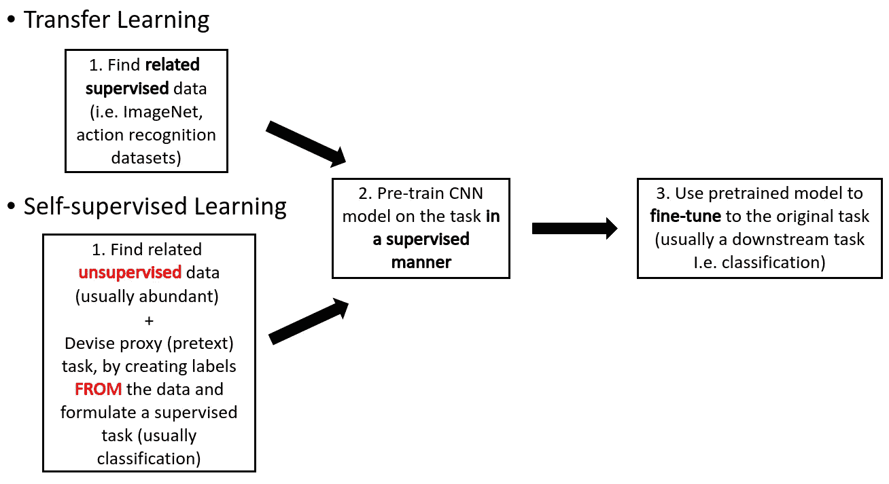*

**作者图片，自我监督 VS 迁移学习**

> **作为监督缺失领域的解决方案，自我监督学习是转移权重的一种方式，通过在标签上预先训练你的模型，这些标签是从* *数据/视频中人工产生的* ***。****

*正如我们将看到的，这可以通过一系列不同的(有时是欺骗性的)转换来实现。这就是我们所说的自我监督的表征学习。*

*注意，对于自我监督学习，你甚至可以只使用你自己的数据，没有提供的标签。*

> **本质上，在自我监督学习中，我们试图* ***猜测*** *一个相关的任务 A，因此将权重转移到任务 B，将是比随机更好的初始化点。**

# *符号、概念和示例任务*

*设计的自我监督任务 A 通常被称为**借口**或**代理**任务，而我们想要解决的期望任务 B 在文献中被称为**下游任务**。我通常也称之为原始任务。*

*回到视频的世界，基于视频的学习属于顺序学习的范畴。这些方法可以大致分为两类:序列**预测**和**验证**。此外，(图像)**元组**指的是将被用作深度学习架构的输入的一串视频帧。*

***连体**模型或**多分支**模型在不同论文中交替使用。基本上是**多个输入数据的独立预测**。您可以简单地认为，在向后传递之前，必须执行暹罗模型的许多向前传递，而提取的特征将在接下来的层中进行融合。因此，将反向传播的损失考虑了所有正向传递。*

*现在我们对自我监督有了明确的高层概念。让我们看看它为什么重要，尤其是在视频数据集上！*

# *为什么要自我监督学习？*

*首先，你**不能为每个特定的任务**创建一个新的视频数据集(或任何种类的数据集)**。视频注释也是昂贵且耗时的。其次，在[医学影像](https://theaisummer.com/medical-image-coordinates/)、**这样的领域，根本很难获得任何专家的注释**。另一方面，youtube 上每天都有数十万小时的未标记视频被上传！如果你仍然不相信自我监督学习是一个令人敬畏的方向，让我们向专家提出建议:***

**我们人类学习的大部分东西和动物学习的大部分东西都是在一种* ***自我监督模式*** *下进行的，而不是强化模式。它基本上是观察这个世界，并与它进行一点互动，主要是通过独立于测试的方式进行观察。*~[艾研究中心主任杨乐存(公正)](https://venturebeat.com/2020/05/02/yann-lecun-and-yoshua-bengio-self-supervised-learning-is-the-key-to-human-level-intelligence/)*

*现在我相信你已经被说服了。然而，要知道每一个令人兴奋的想法都伴随着它的假设和对应物。但在此之前，让我们先澄清我们的术语。*

*继续，视频自我监督学习的核心假设是什么？*

> **直觉上，我们认为成功地解决“托词”任务 A 将* ***允许我们的模型学习有用的视觉表示，以恢复视频的时间连贯性*** *，或者通常从视频的统计时间结构中学习。**

*时间一致性的一个例子可能是**观察物体**(汽车、人)**如何在场景**中移动。*

*你可能会想到的一些问题:*

1.  *给定空间和时间视频结构，模型如何在没有监督的情况下从视频**中学习？***
2.  *自我监督模型学习什么样的表征？有意义吗？*
3.  *与监控的图像/视频数据相比，学习的表示**是互补的**还是相似的？"*

*我们将通过考察不同的方法来回答这些问题。但即使在此之前，**一个人如何设计一个自我监督的任务**？*

> **“总之，一个好的自我监督的任务既不简单也不含糊”
> ~* [诺鲁齐等人【6】](https://link.springer.com/chapter/10.1007/978-3-319-46466-4_5)*。**

*我们考虑的另一个关键因素是**人类是否能解决借口任务**。举个例子，试着理解下面这些帧的顺序。通过一点点关注相对姿势和对“一个人如何移动”的猜测，我们可以预测这些帧的时间顺序。*

*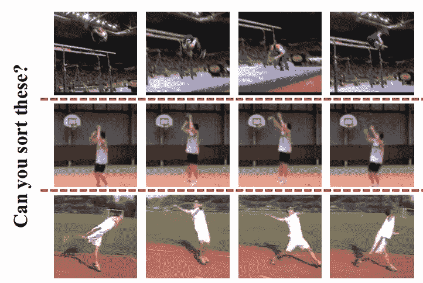*

*[*图片由*李信颖等人](https://faculty.ucmerced.edu/mhyang/papers/iccv2017_sorting_sequences.pdf)*制作**

**此外，我们需要选择一些事情，如果**解决了，就需要理解我们的数据**。这就是为什么无论如何它都属于表征学习的范畴:)。**

> ***洞察力:关键思想是利用原始图像的固有结构和* ***将*** *问题公式化为判别(分类)或引入重建损失函数来训练网络。***

**也就是说，我希望你已经准备好简要地检查最有影响力的视频自我监督表示学习论文。**

# **1.洗牌和学习:使用时序验证的无监督学习，ECCV 2016**

**这是 Misra 等人[1]介绍的首批作品之一。他们将他们的托词任务公式化为序列验证问题。**

> ***在时序***中，一个预测序列的'***'。*****

***在这项工作中，作者探索了任务**视频帧序列是否处于正确的时间顺序**。为了做到这一点，他们必须使用一种采样方案来对视频进行采样。这很重要的原因当然是计算的复杂性。***

***为此，**他们根据每帧的平均光流幅度对高速运动的图像进行采样**。为了创建阳性和阴性元组，使用五个帧的样本作为输入。**正样**对应**正确顺序**，而**负样**是指**错误顺序**中的帧。下图进一步说明了这种差异。***

***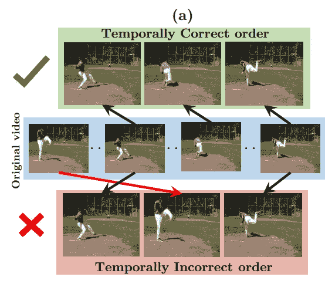***

****视频混洗的例子，正反例子。由 Misra 等人[1]拍摄的图像。链接:[https://link . springer . com/chapter/10.1007/978-3-319-46448-0 _ 32](https://link.springer.com/chapter/10.1007/978-3-319-46448-0_32)****

*****训练技巧**:在训练过程中，作者使用了相同的开始和结束帧，而**只改变了正反例的中间帧**。因此，鼓励网络**关注这个信号，以了解积极和消极之间的微妙差异**，而不是无关的特征。***

***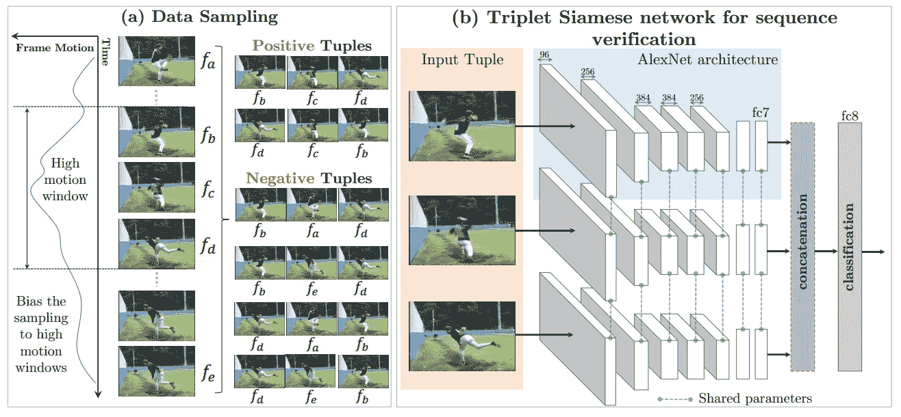***

****提议的网络架构概述。由 Misra 等人[1]拍摄的图像。链接:[https://link . springer . com/chapter/10.1007/978-3-319-46448-0 _ 32](https://link.springer.com/chapter/10.1007/978-3-319-46448-0_32)****

***基于该架构方案，值得注意的是，AlexNet 独立地**处理每一帧**，而图像特征输出被连接用于最终分类。***

***最后，他们使用了大约 **90 万个图像元组**，具有正负实例的平衡小批量比率。正如所发现的那样，对于订单验证来说，拥有更大比例的反面例子(75%)是至关重要的。***

## ***结果和讨论***

***提出的问题是**模型真正从时间结构**中学到了什么？在下图中，作者声称显示了这些单位的[感受野](https://theaisummer.com/receptive-field/)(用红框标出)。由于我们的网络是在人体动作识别视频上训练的，许多单元显示出对人体部位和姿势的偏好，因为它们与高速运动有关。虽然在论文中它被称为感受域，但事实是这是层的特征激活。***

***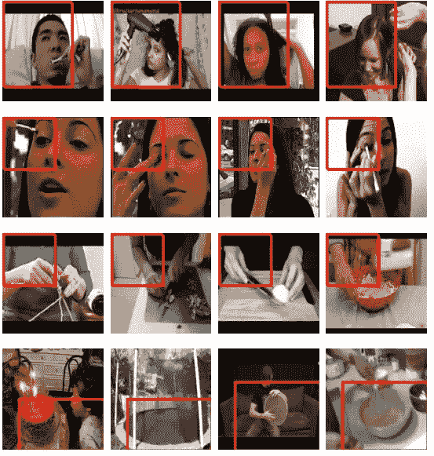***

****可视化激活，如原文所述。*图片由 Misra 等人提供。链接:[https://link . springer . com/chapter/10.1007/978-3-319-46448-0 _ 32](https://link.springer.com/chapter/10.1007/978-3-319-46448-0_32)***

***在数字上，通过将该方案与 imagenet 预训练权重相结合，我们获得了与视频监督几乎相同的平均准确度，如下图所示(UCF sup。是有动作视频的监督数据库):***

***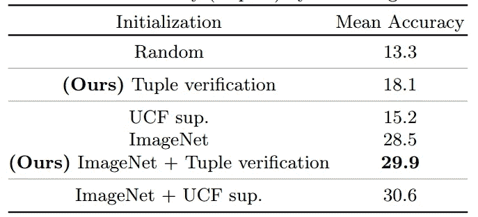***

***图片由 Misra 等人提供。链接:[https://link . springer . com/chapter/10.1007/978-3-319-46448-0 _ 32](https://link.springer.com/chapter/10.1007/978-3-319-46448-0_32)***

****挑战性动作识别任务的结果。****

***最后，基于呈现的结果，可以验证序列验证需要理解手边的基于视频的任务(动作识别)。***

# ***2.通过排序序列的无监督表示学习，ICCV 2017***

> ****核心贡献:Lee 等 2017 [2]提出了一种顺序预测网络(OPN)架构*，通过**成对特征提取**解决序列排序任务。***

***扩展之前的工作，我们正在尝试排序混洗图像序列。如果验证需要理解图像的统计时间结构，人们可能会猜测**图像分类将提供更丰富和更一般化的视觉表示**。为此，作者尝试在给定四个采样图像的元组的情况下，使用这样的代理任务进行训练，如下所示。***

***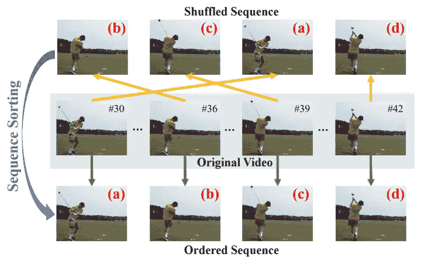***

***[*形象由*李信颖等人](https://faculty.ucmerced.edu/mhyang/papers/iccv2017_sorting_sequences.pdf)**塑造。顺序采样和排序*****

***对于一个有 n 帧的元组，有 n！([！是阶乘](https://en.wikipedia.org/wiki/Factorial)的可能组合。在实践中，作者使用了四个随机洗牌的框架。类似于拼图难题[6]，他们把问题铸为多类分类。对于每个四帧元组，有 24 种可能的排列。然而，向前和向后的排列可以被转换为一个类，因为它们可以是动作的可能的解决方案，导致总共 12 个类。***

## ***训练数据采样***

***与其他作品类似，他们基于运动幅度对帧进行采样。除了仅使用光流大小进行帧选择之外，**他们进一步选择具有大运动的空间补片**(图中的 a)。另外，它们在已经提取的裁剪图像中应用空间抖动(如图中的 b 所示)。此外，他们引入了一种新的策略，称为渠道分裂(如 c 所示)。这大致类似于使用灰度图像，但是基于实验分析，它表现得更好。具体来说，他们选择一个通道，并将值复制到 RGB 图像的其他两个通道。结果，引导网络关注图像的语义，而不是低级特征。***

***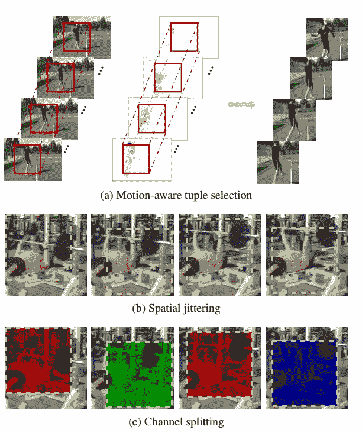***

****训练抽样技巧。* [*图片由*李新英等人](https://faculty.ucmerced.edu/mhyang/papers/iccv2017_sorting_sequences.pdf)*制作****

## ****模型架构、数据和一些结果****

****与[1]类似，它们基于典型的卷积神经网络产生图像特征。在文献中，这被称为连体建筑。同样，每个帧由同一个模型独立处理(通常称为多分支，更好一些)，而参数是相同的。另一个要点是**成对特征提取**，如架构概述所示。如下所示，fc6 特征的特征用于形成帧特征对。这些允许某种融合，或者换句话说，考虑特征的成对关系。****

****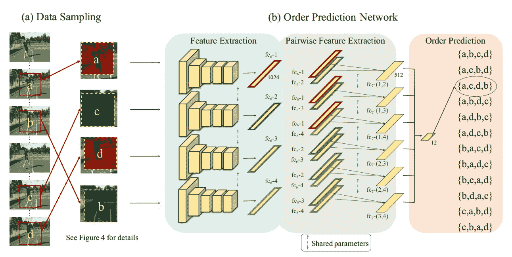****

*****具有成对特征提取的连体模型架构。* [*图片由*李新英等人](https://faculty.ucmerced.edu/mhyang/papers/iccv2017_sorting_sequences.pdf)*制作*****

****最后，他们从~30K 的 UCF-101 动作识别数据集提取 **280k 元组**作为训练数据，相对大批量 128。输入补丁为 80x80。值得注意的是，使用较大补丁的性能不佳的一个潜在原因可能是训练数据量不足。****

****下面是一些功能激活的图示。可以观察到，特征激活对应于人的头部和对象部分。****

****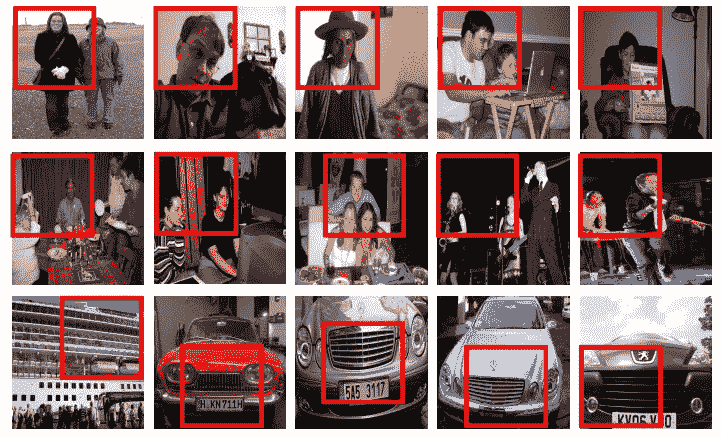****

****原作中呈现的激活。 [*形象由*李新英等人*【2】*](https://faculty.ucmerced.edu/mhyang/papers/iccv2017_sorting_sequences.pdf)****

# ***3.2017 年 CVPR，利用奇数一输出网络的自监督视频表示学习***

***让我们从这个被设计出来的任务开始，这个任务叫做奇数一个出局。简而言之，奇一出学习的目标是从一组其他相关元素中**预测** **奇(**不相关** ) **元素。*******

***形式上，给定一组多个相关元素和**，只有一个奇数元素**构成问题 q = {I_1，.。。，I_{N+1}，其中 I_i 是元素。在这种情况下，我 _{1}，。。。，I_{N+1} **是从视频**中采样的子序列集。所描述的 **N 个子视频具有正确的时间顺序**。奇数不相关视频子序列是来自同一视频的无效顺序。为了防止平凡的解决方案，作者随机化奇数元素的位置。因此，奇一出预测任务被视为一个 N+1 分类问题。***

## ***模型架构***

***预测模型是多分支 CNN，称为奇一出网络(O3N)。O3N 由 N + 1 个输入分支组成，每个分支包含 5 个 conv。图层(权重在输入图层间共享)。奇数一出任务需要在(N+1)个元素中进行比较。要解决这个问题，不能只看单个的元素。因此，他们进一步引入了一个融合层来合并来自不同分支的信息。最后，他们实验了两种融合，串联和差和。***

***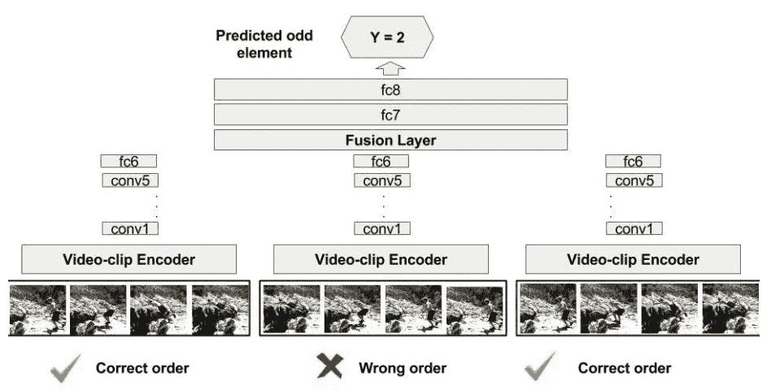***

****模型概述。图像由* [*徐等人【4】*](https://www.researchgate.net/publication/315747848_Self-Supervised_Video_Representation_Learning_With_Odd-One-Out_Networks)***

# ***4.通过视频剪辑顺序预测的自我监督时空学习，CVPR 2019***

***再次，徐等 2019 [4]制定的任务顺序预测，作为一个分类问题。除了以前的作品，他们**通过制作小视频剪辑的独立特征而不是纯图像来整合 3D CNN**。因此，手头的任务现在被称为*剪辑顺序预测*。他们的方法可以总结如下:***

*   ***首先，从视频中采样几个固定长度(16 帧)的剪辑并随机打乱，***
*   ***然后，使用共享权重(暹罗架构)，使用 3D CNNs 来提取这些片段的独立特征。***
*   ***最后，使用一个简单的神经网络来预测混洗剪辑的实际顺序。***

***学习的 3D CNNs 可以用作剪辑特征提取器或预训练模型，以针对动作识别进行微调。为了证明他们的想法，评估了三种强大的 3D-CNN 架构，即 C3D [9]、R3D 和 R(2+1)D [10](在下图中表示为 3D ConvNets)。提议的架构概述如下:***

***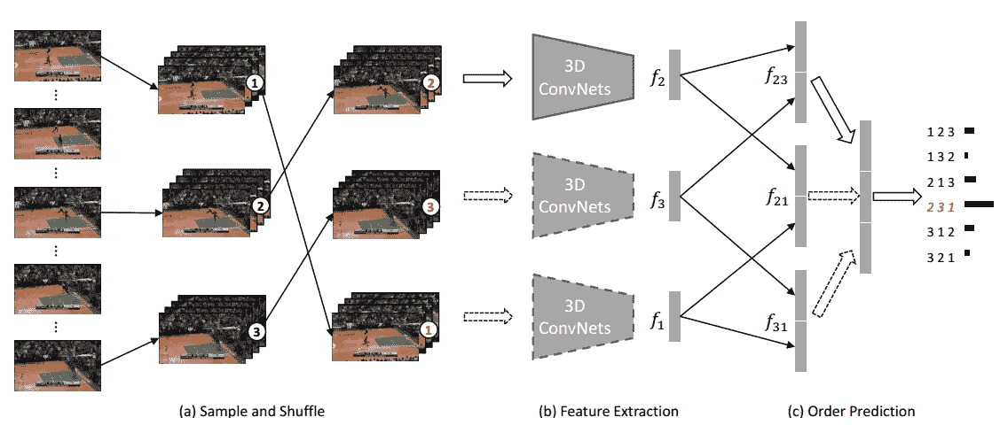***

****建议的模型架构。图像由* [*徐等人【4】*](https://www.researchgate.net/publication/315747848_Self-Supervised_Video_Representation_Learning_With_Odd-One-Out_Networks)***

*****注意:**由于剪辑顺序预测只是一个代理任务，并且目标是学习视频表示，所以该任务应该是可解决的。对于元组长度，每个元组选择 3 个片段，批量大小为 8 个元组。视频剪辑由用于 3D CNNs 的 16 帧组成，而视频之间的间隔被设置为 8 帧，以避免琐碎的解决方案。***

***为了验证所学习的表示，他们使用基于从 3D-CNN 产生的特征的最近邻检索。为了评估他们的动作识别方法，从视频中采样 10 个剪辑以获得剪辑预测，然后对其进行平均以获得最终的视频预测。***

***最后一点，虽然这项研究显示了有希望的结果，但在较大数据集(如 Kinetics)上监督预训练的**微调仍然是最佳预训练方案**。***

# ***结论***

***我希望你现在明白了。我们将会看到越来越多的自我监督学习的酷应用。简而言之，我们开始了自我监督学习，重点是视频。我们介绍了额外时间维度带来的问题以及如何应对它们。***

***另外，Yann LeCun 在 [ICLR 2020](https://iclr.cc/Conferences/2020) 中做了一个非常值得一看的鼓舞人心的演讲。我想虚拟会议的积极一面。我很喜欢看这部电影。***

***对于那些想要更高级的东西的人，你可以继续前往[自我监督的生成对抗网络](https://www.arxiv-vanity.com/papers/1811.11212/)，因为你知道我们有多喜欢人工智能夏天的[生成学习](https://theaisummer.com/gan-computer-vision/)。最后，为了更全面地总结大量自我监督的表征学习(**没有关注视频**)，请查看 Lilian Weng 的这篇[博客文章](https://lilianweng.github.io/lil-log/2019/11/10/self-supervised-learning.html)【8】。***

## ***参考***

***[1] Misra，I .，Zitnick，C. L .，& Hebert，M. (2016 年 10 月)。[洗牌学习:使用时序验证的无监督学习。](https://link.springer.com/chapter/10.1007/978-3-319-46448-0_32)在*欧洲计算机视觉会议*(第 527–544 页)。斯普林格，查姆。***

***[2]李海燕，黄，J. B .，辛格，m .，，杨，M. H. (2017)。[通过排序序列的无监督表示学习](https://faculty.ucmerced.edu/mhyang/papers/iccv2017_sorting_sequences.pdf)。IEEE 计算机视觉国际会议论文集(第 667-676 页)。***

***[3] Fernando，Basura，et al . .[用单输出网络进行自监督视频表示学习](https://www.researchgate.net/publication/315747848_Self-Supervised_Video_Representation_Learning_With_Odd-One-Out_Networks)*IEEE 计算机视觉和模式识别会议论文集*。2017.***

***[4]徐，丁，肖，赵，赵，邵，谢，庄，杨(2019).[通过视频剪辑顺序预测的自我监督时空学习](https://openaccess.thecvf.com/content_CVPR_2019/html/Xu_Self-Supervised_Spatiotemporal_Learning_via_Video_Clip_Order_Prediction_CVPR_2019_paper.html)。在*IEEE 计算机视觉和模式识别会议论文集*(第 10334–10343 页)。***

***[5]焦，j .，德罗斯特，r .，德鲁克尔，l .，帕帕乔乔，A. T .，&诺布尔，J. A. (2020 年 4 月)。[超声视频的自监督表示学习。](https://ieeexplore.ieee.org/document/9098666)载于 *2020 年 IEEE 第 17 届国际生物医学成像研讨会(ISBI)* (第 1847-1850 页)。IEEE。***

***[6]米·诺鲁齐和法瓦罗出版社(2016 年 10 月)。[通过解决拼图游戏对视觉表征进行无监督学习。](https://link.springer.com/chapter/10.1007/978-3-319-46466-4_5)在*欧洲计算机视觉会议*(第 69–84 页)。斯普林格，查姆。***

***[7] Gopnik，a .，Meltzoff，A. N .，& Kuhl，P. K. (2000 年)。 [*婴儿床里的科学家:早期学习告诉我们关于大脑的什么*](https://www.amazon.com/Scientist-Crib-Early-Learning-Tells/dp/0688177883) 。威廉·莫罗平装本。***

***[8] [自我监督表征学习](https://lilianweng.github.io/lil-log/2019/11/10/self-supervised-learning.html)，翁，李莲 2019***

***[9] Tran，d .，Bourdev，l .，Fergus，r .，Torresani，l .，和 Paluri，M. (2015 年)。[用 3d 卷积网络学习时空特征](https://www.cv-foundation.org/openaccess/content_iccv_2015/html/Tran_Learning_Spatiotemporal_Features_ICCV_2015_paper.html)。IEEE 计算机视觉国际会议论文集*(第 4489–4497 页)。****

***[10] Tran，d .，Wang，h .，Torresani，l .，Ray，j .，LeCun，y .，& Paluri，M. (2018 年)。[近距离观察用于动作识别的时空卷积](https://openaccess.thecvf.com/content_cvpr_2018/html/Tran_A_Closer_Look_CVPR_2018_paper.html)。在*IEEE 计算机视觉和模式识别会议论文集*(第 6450–6459 页)。***

****原载于 2020 年 7 月 29 日 https://theaisummer.com**T21*[。](https://theaisummer.com/self-supervised-learning-videos/)***