# 通过视频彩色化的自我监督跟踪

> 原文：<https://towardsdatascience.com/self-supervised-tracking-via-video-colorization-7b2b066359d5?source=collection_archive---------44----------------------->

## 作为代理任务的视频着色和作为下游任务的对象跟踪

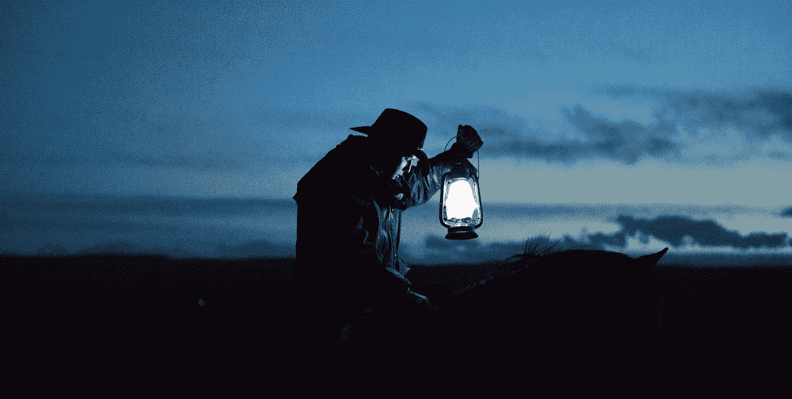

普里西拉·杜·普里兹在 [Unsplash](https://unsplash.com/s/photos/night?utm_source=unsplash&utm_medium=referral&utm_content=creditCopyText) 上的照片

在这篇文章中，我们将了解一种新颖的自监督目标跟踪方法。自我监督是模型自我学习的一种方法😎，这本身就让题目很有意思。在这里，我们将看到我们的模型如何学会自己跟踪对象。我们将从物体跟踪的基础开始，然后讨论什么是计算机视觉的自我监督学习，最后详细讨论这种方法。

> 这个方法的实现可以在[这里](https://github.com/hyperparameters/tracking_via_colorization)找到

# 对象跟踪简介🎯

用简单的语言来说，它可以理解为在整个视频序列中识别唯一的对象。要跟踪的对象通常被称为*目标对象。*跟踪可以通过 [*包围盒*](https://d2l.ai/chapter_computer-vision/bounding-box.html) 或者 [*实例分割*](https://kharshit.github.io/blog/2019/08/23/quick-intro-to-instance-segmentation) *来完成。*有两种类型的公共对象跟踪挑战。

1.  单个对象跟踪:在整个视频序列中跟踪感兴趣的对象。例如 [VOT 挑战](https://www.votchallenge.net/)
2.  多目标跟踪:在整个视频序列中跟踪多个感兴趣的目标。例如 [MOT 挑战](https://motchallenge.net/)

## 研究趋势

用于解决对象跟踪的一些著名的经典 CV 算法是:

1.  [均值漂移](https://docs.opencv.org/master/d7/d00/tutorial_meanshift.html)
2.  [光流](https://opencv-python-tutroals.readthedocs.io/en/latest/py_tutorials/py_video/py_lucas_kanade/py_lucas_kanade.html)
3.  [卡尔曼滤波器](https://www.bzarg.com/p/how-a-kalman-filter-works-in-pictures/)

其中最著名的多目标跟踪算法 [SORT](https://arxiv.org/abs/1602.00763) 以卡尔曼滤波器为核心，非常成功。

随着深度学习时代的到来，非常创新的研究进入了社区，DL 在公共跟踪挑战方面成功地胜过了经典的 CV 方法。尽管 DL 在公共挑战上取得了巨大成功，但它仍在努力为现实世界的问题陈述提供通用的解决方案。

# 深度模型的挑战💭

当训练深度 CNN 模型时，我们面临的主要挑战之一是训练数据。

*   **训练数据:**深度学习方法需要大量数据，这几乎每次都会成为瓶颈。此外，像多目标跟踪这样的任务很难注释，并且这个过程变得不切实际且昂贵。


DL 模型需要大量数据

# 自我监督学习营救😯

我们都知道[监督和非监督学习](https://blogs.nvidia.com/blog/2018/08/02/supervised-unsupervised-learning/#:~:text=In%20a%20supervised%20learning%20model,and%20patterns%20on%20its%20own.)技术。这是一种相当新的类型，被称为自我监督学习。在这些类型的学习中，我们试图利用数据中已经存在的信息，而不是任何外部标签，或者有时我们说模型自己学习。在现实中，我们所做的是训练 CNN 模型来完成一些其他的任务，间接帮助我们实现我们的目标，模型会自我监督。这些任务被称为“*代理任务*或“*借口任务*”。
代理任务的几个例子是:

*   **着色**

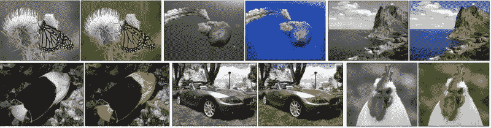

CNN 模型学习从灰度图像预测颜色。[ [来源](https://arxiv.org/abs/1603.08511)

*   **将图像补丁放置在正确的位置**

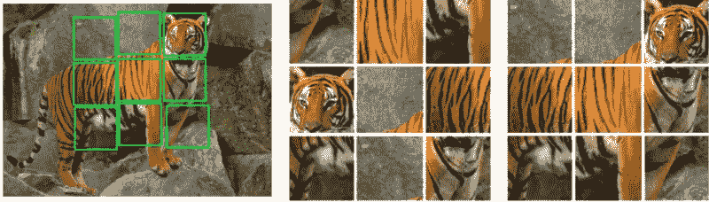

这些小块是从图像中提取出来的，并被混洗。该模型学习解决这个拼图，并按照正确的顺序排列瓷砖，如图 3 所示。[ [来源](https://arxiv.org/abs/1603.09246)

*   **按照正确的顺序放置框架**

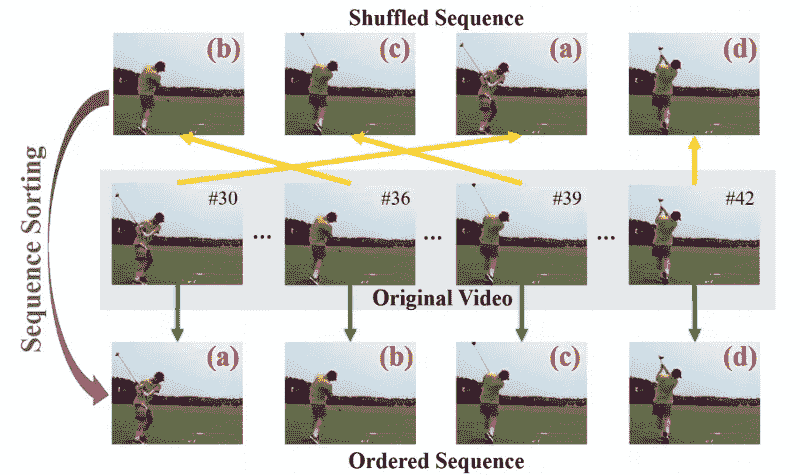

该模型学习对视频序列中的混洗帧进行排序。[ [来源](https://arxiv.org/abs/1708.01246)

许多这样的任务可以用作计算机视觉问题的代理任务。这种培训的一个主要好处是，培训不需要手动注释数据，并且适合解决现实生活中的用例。

# 通过视频彩色化的自我监督跟踪

我们已经看到了什么是自我监督模型，你一定已经猜到了我们将使用着色作为我们的代理任务的名称。

 [## 通过给视频着色，跟踪出现了

### 我们使用大量未标记的视频来学习模型，以便在没有人工监督的情况下进行视觉跟踪。我们…

arxiv.org](https://arxiv.org/abs/1806.09594) 

## 介绍

着色是我们的*代理任务*或*借口任务*，物体跟踪是*主任务*或*下游任务*。大规模无标签视频用于训练模型，没有任何单个像素被人类标注。视频的时间相干性用于使模型学习给灰度视频着色。这可能看起来令人困惑，但坚持下去，我会把事情弄清楚。

## 模型将如何学习跟踪？

我们将取两个帧一个目标帧(在时间 t)和一个参考帧(在时间 t-1)，并通过模型。期望该模型根据参考帧的颜色的先验知识来预测目标帧的颜色。这样，模型内部学习指向正确的区域，以便从参考帧复制颜色，如图所示。这种指向机制可以用作推断过程中的跟踪机制。我们将很快看到如何做到这一点。


该模型接收一个彩色帧和一个灰度视频作为输入，并预测下一帧的颜色。该模型学习从参考帧复制颜色，这使得能够在没有人类监督的情况下学习跟踪机制[ [来源](https://ai.googleblog.com/2018/06/self-supervised-tracking-via-video.html)

我们不复制网络中的颜色，而是训练我们的 CNN 网络来学习目标帧的像素和参考帧的像素之间的相似性*(相似性是灰度像素之间的相似性)*，然后当与参考帧的真实颜色线性组合时，该相似性矩阵给出预测的颜色。数学上，让 *Cᵢ* 是参考帧中每个像素 *i* 的真实颜色，让 *Cⱼ* 是目标帧中每个像素 *j* 的真实颜色。该模型给出了目标帧和参考帧之间的相似性矩阵 *Aᵢⱼ* 。我们可以通过线性组合得到预测的颜色 *yᵢ* 。

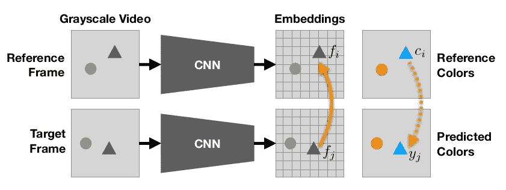

[ [来源](https://arxiv.org/abs/1806.09594)


**等式 1** :预测颜色与参考颜色的线性组合

## 相似矩阵怎么算？

当通过模型时，图像、参考帧和目标帧都学习对每个像素的低级嵌入，这里 *fᵢ* 是对参考帧中的像素 *i* 的嵌入，类似地， *fⱼ* 是对目标帧中的像素 *j* 的嵌入。那么相似性矩阵可以通过下式计算:

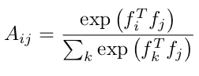

**等式 2:** 内部
产品相似度由 softmax 归一化

相似性矩阵中的每一行表示参考帧的所有像素 *i* 和目标帧的像素 *j* 之间的相似性，因此为了使总权重为 1，我们对每一行应用 softmax。

```
Lets look an example with dimension to make it clear,we try to find a similarity matrix of 1 pixel from target frame.
An illustration of this example is shown below.Consider reference image and target image, size (5, 5) => (25,1)for each pixel, cnn gives embedding of size (64, 1)
*fᵢ*, embedding for reference frame, size (64, 25)
*fⱼ*, embedding for target frame, size (64, 25)
*at j=2 f₂*,  embedding for 3rd pixel in target frame, size (64, 1)**Similarity Matrix,** between reference frame and target pixel, j=2
 *Aᵢ₂* =softmax *(fᵢᵀ x f₂)* , size (25, 64) *x* (64, 1) => (25,1) =>   (5, 5)
we get a similarity between all the ref pixels and a target pixel at j=2.**Colorization,** To copy the color (here, colours are not RGB but quantized colour of with 1 channel) from reference frame,
*cᵢ*, Colors of reference frame size (5, 5) => (25, 1)
*Aᵢ₂*, Similarity matrix, size (5, 5) => (1, 25)**Predicted color** at j=2, 
*y₂ = Aᵢ₂ x cᵢ*, size (1, 25) *x* (25, 1) => (1, 1)From the similarity matrix in below figure, we can see reference color at i=1 is dominant(0.46), thus we have a color copied for target, j=2 from reference, i=1**PS:** 1\. ᵀ denotes transpose
2\. matrix indices starts from 0
```

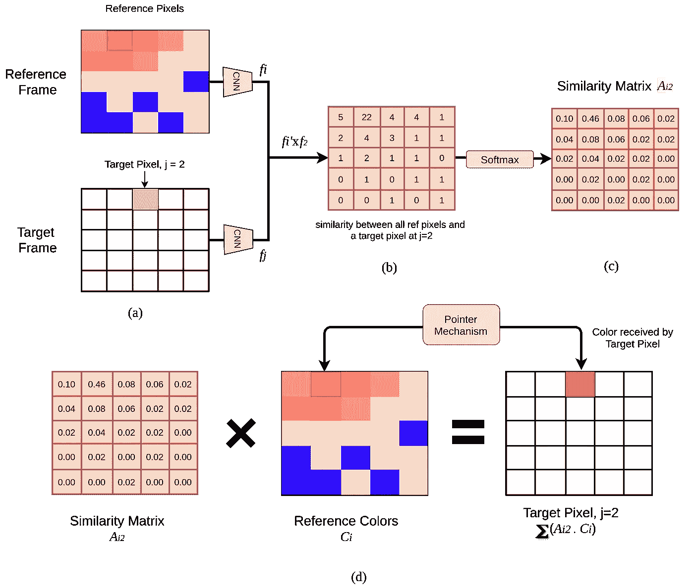

(a)示出了大小为(5，5)的 2 个帧，(b)参考帧嵌入和 j =2 处的目标像素嵌入的内积，(softmax 之后的相似性矩阵，(d)相似性矩阵和参考帧的真实颜色的线性组合[ [源](https://github.com/hyperparameters/tracking_via_colorization) ]

类似地，对于目标帧中的每个目标像素( *(5，5)= > 25 像素)，*我们将具有大小为(5，5)的相似性矩阵，即大小为(5，5，25) = (25，25)的完整相似性矩阵 *Aᵢⱼ* 。
我们将在实现中使用(256 x 256)图像扩展相同的概念。

## 图像量化

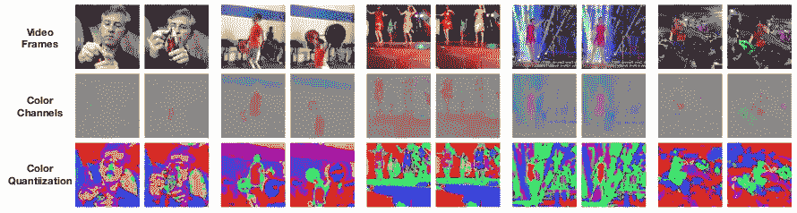

第一行显示原始帧，第二
行显示来自 Lab space 的 ab 颜色通道。第三行将颜色空间量化为离散的面元，并扰动颜色以使效果更加明显。[ [来源](https://arxiv.org/abs/1806.09594)

颜色是低空间频率，所以我们可以使用低分辨率的帧。我们不需要 *C(255，3)* 颜色组合，所以我们创建了 16 个聚类，并将颜色空间量化到这些聚类中。现在我们只有 16 种独特的颜色，(见上图第三栏)。聚类是使用 k-means 完成的。16 个簇会丢失一些颜色信息，但足以识别物体。我们可以增加聚类的数量来提高着色的精度，但代价是增加计算量。

## 为什么 LAB 色彩空间优于 RGB？

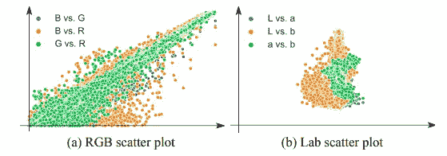

来源

为了将图像量化成簇，我们将使用 LAB 色彩空间的 AB 通道，而不是 RGB 色彩空间。上图显示了 RGB 和 LAB 通道间相关性，我们可以从图中得出以下结论

*   RGB 往往比 LAB 有更多的相关性。
*   LAB 将迫使模型学习方差，它将迫使学习更健壮的表示，而不是依赖于局部颜色信息

可以使用 sklearn 的 [KMeans](https://www.analyticsvidhya.com/blog/2019/08/comprehensive-guide-k-means-clustering/) 包来完成集群。

这个类将被用来制作颜色簇，我们将把它作为泡菜来保存。

# 履行💻

> **注意**:我用 pytorch 实现，它遵循(N，C，H，W)格式。在处理矩阵整形时，请记住这一点。如果你对形状有任何疑问，请联系我们。

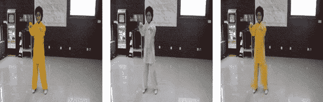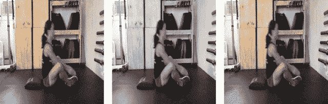

该模型从参考帧学习给视频帧着色。[ [来源](https://ai.googleblog.com/2018/06/self-supervised-tracking-via-video.html)

## 投入

该模型的输入是下采样到
256 × 256 的四个灰度视频帧。三个参考帧和一个目标帧。

## 预处理

首先，我们将把所有的训练视频压缩到 6 帧/秒。然后预处理帧以创建两个不同的集合。一个用于 CNN 模型，另一个用于着色任务。

```
- Video fps is reduced to 6 fps**SET 1 - for CNN Model**- Down sampled to 256 x 256- Normalise to have intensities between [-1, 1]**SET 2 - for Colourization**- Convert to LAB colour space- Downsample to 32 x 32- Quantize in 16 clusters using k-means- Create one-hot vector corresponding to the nearest cluster centroid
```

## 模型架构

使用的主干是 *ResNet-18* ，因此结果与其他方法相当。ResNet-18 的最后一层被更新以给出 32 x 32 x 256 的尺寸输出。ResNet-18 的输出然后被传递到 3D-Conv 网络，最终输出是 32 x 32 x 64。(*下面的代码块显示了从 ResNet-18 网络*获取输入的 3D 网络)

## 培养

培训可分为以下 3 个步骤:

1.  **网络通道**
    我们将使用预处理帧的集合 1，即大小为(256 x 256)的 4 个灰度帧通过网络，以获得具有 64 个通道的(32 x 32)空间图。这可以解释为对(32 x 32)图像的每个像素进行 64 维嵌入。因此，我们有四个这样的像素级嵌入，三个用于参考图像，一个用于目标图像。

1.  **相似性矩阵** 利用这五个嵌入，我们找到参考帧和目标帧之间的相似性矩阵。对于目标帧中的像素，我们将通过 softmax 将所有三个参考帧中的所有像素的相似性值归一化为 1。

**3。着色** 我们将使用预处理帧的集合 2，即四个下采样为(32 x 32)并量化的帧用于着色。将三个参考帧与相似性矩阵组合以获得预测的量化帧。我们用预测的颜色*找到 [*交叉熵损失*](https://machinelearningmastery.com/cross-entropy-for-machine-learning/) (记得我们将帧量化为 16 个簇，现在我们有 16 个类别。我们在这些颜色上发现了多类别交叉熵损失。)*

## 推理

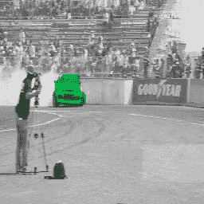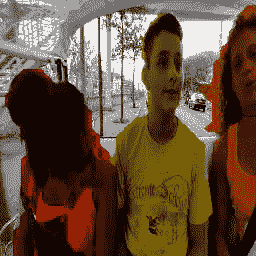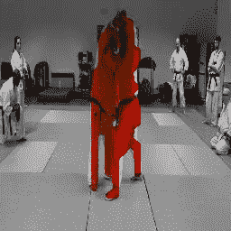

跟踪预测示例[ [来源](https://ai.googleblog.com/2018/06/self-supervised-tracking-via-video.html)

在学习了着色的任务之后，我们有了一个可以为一对目标和参考帧计算相似矩阵 *Aᵢⱼ* 的模型。现在对于实际的跟踪任务，我们利用了我们的模型在标签空间中是非参数的特性。我们简单地重复使用 e *方程 1* 来传播，但是不是传播颜色，而是传播类别的分布。对于第一帧，我们有地面真实遮罩，我们将把所有实例遮罩安排为独热向量 c *ᵢ(这类似于训练期间使用的量化颜色的独热向量)*。将 c *ᵢ* 与我们的相似性矩阵 *Aᵢⱼ* 结合起来，找到蒙版*、*的新位置，但是记住预测 c *ⱼ* 在随后的帧中会变软，表示模型的置信度。要做一个艰难的决定，我们可以简单地取最有信心的一类。推理的算法将是:

```
**WHILE (**target frame, reference frames) in the videostep 1\. Pass the target and reference frames through CNN modelstep 2\. Find Similarity Matrixstep 3\. Take ground truth object masks as one-hot encodingstep 4\. Linear combine the object masks with similarity matrixstep 5\. Update ground truth object masks by predicted masks
```

## 故障模式

让我们讨论一下在某些情况下模型什么时候会失败，这主要是着色失败的情况，这意味着着色与跟踪有很高的相关性。
在以下情况下会发现一些故障:

*   当视频中的光线剧烈或频繁变化时
*   该方法成功地跟踪具有轻微到中等遮挡物体，但是当物体经历较大遮挡时仍然失败
*   物体尺寸的突然变化

# 结论

在这里，我们看到了一个模型如何在没有任何手动注释数据的情况下从自己的模型中学习。我们学习了如何在一些代理任务上训练 CNN 模型，并利用这种学习来完成实际的任务。我们使用着色作为代理，但不限于此，各种新的方法作为新的[代理任务](https://www.fast.ai/2020/01/13/self_supervised/)出现。自我监督的方法是当前的需要，它们可以消除现实世界用例的昂贵数据收集的主要限制。这个模型还不能击败目前的 SOTA 监督模型，但优于许多其他模型。

该方法在方法和灵活性方面非常有前途。由于自身的优势，自监督模型将很快成为解决最大似然问题的首选。这篇文章是基于“ [Google Research](https://arxiv.org/abs/1806.09594) ”的研究和他们所有的功劳。我试图根据我的知识和理解来解释这项研究。

# 关于我

我是 Tushar Kolhe，在 Fynd 担任深度学习工程师。我的兴趣是建立解决现实世界问题的计算机视觉模型。
通过[电子邮件](mailto:tushark.engg@outlook.com)寻求任何建议或帮助。

> 我坚信，如果有足够的动力，任何人都可以学到任何东西，深度模型也是如此😛。

# 附录

目标跟踪领域的一些有趣研究:

1.  *简单的在线实时跟踪，具有深度关联度量。【* [*论文*](https://arxiv.org/abs/1703.07402)*→扩展排序*
2.  *没有花里胡哨的跟踪。【* [*论文*](https://arxiv.org/pdf/1903.05625.pdf)*】*
3.  *单次多目标跟踪的简单基线- FairMOT* 。*[*论文*](http://arxiv.org/abs/2004.01888)*
4.  ***学习用于多目标跟踪的神经解算器。【* [*论文*](https://arxiv.org/abs/1912.07515)*】***

**你可以找到更多有趣的研究，评论你觉得有趣的研究。**

# **参考**

1.  **冯德里克、施里瓦斯塔瓦、法蒂、瓜达拉马和墨菲(2018 年)。跟踪是通过给视频着色而出现的。 *ArXiv，abs/1806.09594* 。**
2.  **[何](https://arxiv.org/search/cs?searchtype=author&query=He%2C+K)、[、](https://arxiv.org/search/cs?searchtype=author&query=Zhang%2C+X)、[、](https://arxiv.org/search/cs?searchtype=author&query=Ren%2C+S)、[、](https://arxiv.org/search/cs?searchtype=author&query=Sun%2C+J)。用于图像识别的深度残差学习。*ArXiv*[*ABS/1512.03385*](https://arxiv.org/abs/1512.03385v1)**
3.  **[张曦轲](https://arxiv.org/search/cs?searchtype=author&query=Zhang%2C+R)，[菲利普·伊索拉](https://arxiv.org/search/cs?searchtype=author&query=Isola%2C+P)，[阿列克谢·阿·埃夫罗斯](https://arxiv.org/search/cs?searchtype=author&query=Efros%2C+A+A)。彩色图像彩色化。*ArXiv*T58*ABS/1603.08511***
4.  **迈赫迪·诺鲁齐，[保罗·法瓦罗](https://arxiv.org/search/cs?searchtype=author&query=Favaro%2C+P)。通过解决拼图游戏实现视觉表征的无监督学习。 *ArXiv abs/1603.09246***
5.  **[李新英](https://arxiv.org/search/cs?searchtype=author&query=Lee%2C+H)，[贾-黄斌](https://arxiv.org/search/cs?searchtype=author&query=Huang%2C+J)，[辛格](https://arxiv.org/search/cs?searchtype=author&query=Singh%2C+M)，[明-杨玄](https://arxiv.org/search/cs?searchtype=author&query=Yang%2C+M)。通过排序序列的无监督表示学习。 *ArXiv abs/1708.01246***
6.  **[https://www.fast.ai/2020/01/13/self_supervised/](https://www.fast.ai/2020/01/13/self_supervised/)**