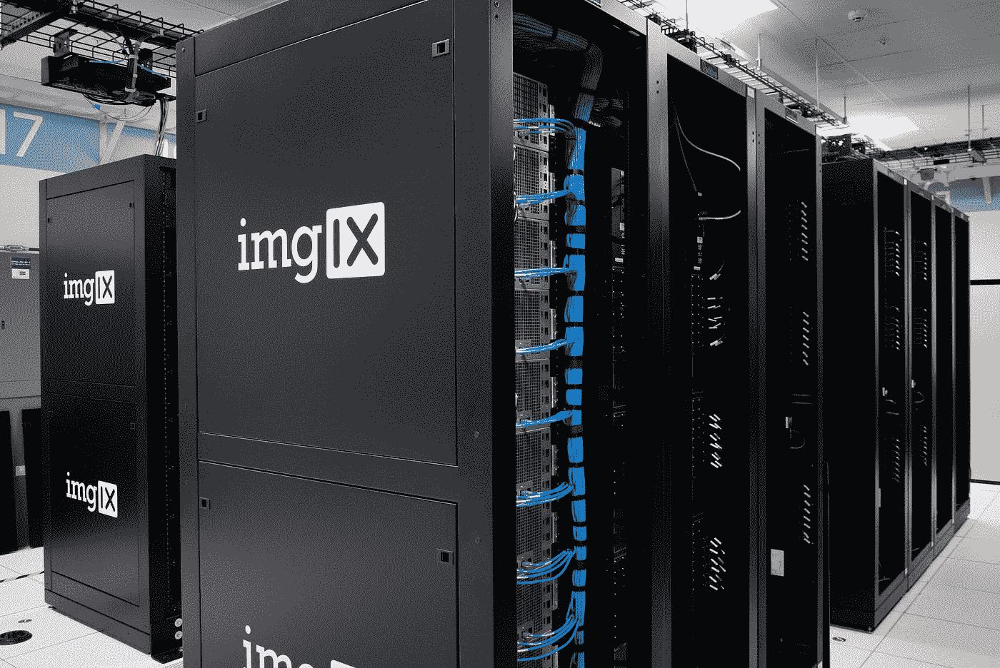

# 自学成才的数据科学家:用个人网站展示自己

> 原文：<https://towardsdatascience.com/self-taught-data-scientist-showcase-yourself-with-a-personal-website-79fc31580c2?source=collection_archive---------16----------------------->

## 一个简单且几乎免费的初学者循序渐进指南


爱丽丝·山村在 [Unsplash](https://unsplash.com?utm_source=medium&utm_medium=referral) 上的照片

没有数据科学的大学学位，很难让别人相信你的技能。没有任何工作经验更是难上加难。

我知道，这似乎不公平！

当你在电脑上花了无数个小时努力开发所有这些技能，弄清楚那些令人绞尽脑汁的算法是如何工作的时候，你认为雇主必须承认你是一名体面的数据科学家，并给你你努力争取的工作机会。

除非你用确凿的证据向他们展示你的所有技能，让自己与众不同，否则这种情况不会发生。

拥有一个个人网站为你提供了一个展示技能的平台。

在这篇文章中，我将解释你如何能容易地并且几乎免费地创建你的网站。

在这篇文章的第一部分，我将介绍你应该在你的网站上展示什么。然后在后面的部分，我会告诉你如何从头到尾处理网站开发任务，包括设置主机/域名服务和处理 HTML/CSS 开发。

所有的源代码都在[我的 GitHub 库](https://github.com/eisbilen/ds-personal-website)中提供，你可以访问[我的个人网站](https://erdemisbilen.com/)来查看所有的操作。

# 作为一名自学成才的数据科学家，你应该在你的网站上展示什么

在开始开发你的网站之前，你应该考虑如何构建你网站的内容。下面是你的网站应该包含的主要部分；

*   您的博客帖子
*   您的数据科学产品组合
*   你的简历
*   您的社交媒体资料

# 开始写博客

如果你在自学数据科学家之旅的早期就开始写博客，会有很大帮助。写文章不仅能让你在旅途中学到的东西具体化，还能向别人展示你的发现和论点传达得有多好。

以下是您可以撰写的数据科学主题列表；

*   数据采集和准备
*   特征工程
*   机器学习
*   (英)可视化(= visualization)
*   传达调查结果

你可以开发自己的博客网站，也可以使用免费平台，如 [**Medium**](https://medium.com) 。


亚历杭德罗·埃斯卡米拉在 [Unsplash](https://unsplash.com?utm_source=medium&utm_medium=referral) 上的照片

# 发展你的投资组合

你可能会参加许多 **Coursera** 或 **Bootcamp** 的课程，但让你与众不同的是你如何将你的知识应用到实际问题中。这是让招聘人员相信你的技能的原因。

因此，拥有一个适当的数据科学组合并在您的网站上展示它会产生巨大的影响。

但是，什么是好的数据科学投资组合呢？

*   **独立边项目:**这些项目向别人展示你在现实生活中如何运用你的数据科学知识。最好不要使用概念验证数据库来解决琐碎的问题。相反，开发你独特的数据库，调查一个有趣的问题。
*   **Kaggle 竞赛:**参加 Kaggle 竞赛是展示你相对于该领域其他人的技能水平的一种方式。
*   **开源项目:**开源项目为您提供了一个发展数据科学经验的绝佳机会。

# 创建您的简历

招聘人员浏览简历以确定可能的候选人。因此，拥有一份结构良好、易于阅读的简历会增加你被聘用的机会。为了更好地展示自己，你至少应该在简历中包括以下内容:

*   个人信息
*   位置
*   教育
*   项目
*   能力和个人技能

# 建立你的社交媒体档案

作为一名数据科学家，你需要在一定程度上使用社交媒体。推特是和你的同龄人交流的最好方式。它有助于保持更新。

如果你想被雇佣，你应该使用 LinkedIn，因为它是招聘人员寻找潜在候选人的主要来源。


Igor Miske 在 [Unsplash](https://unsplash.com?utm_source=medium&utm_medium=referral) 上拍摄的照片

# 如何建立你的网站

一旦你完成了开发和组织内容这一过程中的困难部分，剩下的就很容易了。

由于提供了免费的服务、库和模板，开发一个个人网页从未如此容易。

我会用 [**Bootstrap 4.0**](https://getbootstrap.com/) 这是一个开源的前端 web 开发库。它支持响应式和移动优先的网页开发流程，确保我们的网站能够在移动设备上正常运行。

连同 Bootstrap 4.0，我将在我的项目中使用免费版的 [**字体牛逼**](https://fontawesome.com/) 图标库。

不是从头开始处理所有的 HTML/CSS 开发工作，我将修改一个我从[这个链接](https://startbootstrap.com/themes/freelancer/)下载的引导模板。

对于托管我的网站，我将使用 [**谷歌 Firebase**](https://firebase.google.com/) ，并带有自定义域名。我在 isimtescil.net[](https://www.isimtescil.net/en/)****注册了我的自定义域名，花了 8 美元。你可以随意使用任何其他的主机和域名服务。****

# ****让我们建造它****

****在本地计算机上创建一个包含所有项目文件的文件夹结构。****

```
****$ mkdir** ds-personal-website
**$ cd** ds-personal-website
**$ mkdir** public**
```

****然后 [**把自由职业者模板**](https://github.com/BlackrockDigital/startbootstrap-freelancer) 的源代码下载到你的电脑里，把你的**‘public’**项目文件夹里的所有文件都复制下来。稍后，Firebase 会在将文件部署到托管服务器时查看公共文件夹，因此将所有文件复制到我们刚刚创建的**‘public’**文件夹中非常重要。****

********

****Github 中的自由职业者免费模板源代码****

********

****卡尔·海尔达尔在 [Unsplash](https://unsplash.com?utm_source=medium&utm_medium=referral) 上拍摄的照片****

******修改 HTML 的 Head 部分******

****作为第一步，我们需要做的是根据我们的需要修改 HTML 元素。让我们在编辑器中打开 **'index.html'** ，先修改 head 部分。****

****我修改的是网页的元数据和标题。这些标签向搜索引擎提供关于我们页面内容的数据。****

****此外，我已经修改了与 root 相关的 **href** 属性，以便可以在托管环境中访问 CSS & JavaScript 源文件。****

****我在下面用粗体标出了修改。****

```
****Modifications are noted in bold
../public/Index.html**<head><meta charset="utf-8">
 <meta name="viewport" content="width=device-width, initial-scale=1,   
 shrink-to-fit=no"><meta name="description" content="**Erdem Isbilen - Automotive & 
 Mechanical Engineer,Machine Learning and Data Science Enthusiasts**"><meta name="author" content="**Erdem Isbilen**"><title>**Erdem ISBILEN - My Personal WebPage**</title><!-- Custom fonts for this theme --><link **href="../vendor/fontawesome-free/css/all.min.css"**     
 rel="stylesheet" type="text/css">

 <link href="https://fonts.googleapis.com/css?
 family=Montserrat:400,700" rel="stylesheet" type="text/css"><link href="https://fonts.googleapis.com/css?  
 family=Lato:400,700,400italic,700italic" rel="stylesheet" 
 type="text/css"><!-- Theme CSS -->
 <link **href="../css/freelancer.css"** rel="stylesheet"></head>**
```

******修改 HTML 的导航部分******

****我在导航部分添加了我的 logo，保持导航部分的其余部分基本不变。**多亏了引导库**，导航条可以完美地工作，并通过折叠来调整自己以适应不同的屏幕尺寸。****

****我在导航栏的布局上做了一些小改动，分别添加了作品集、博客、简历和联系我部分。****

****根据您希望呈现内容的方式，您可以添加任意多个部分。****

```
****Modifications are noted in bold
../public/Index.html**<!-- Navigation -->
<nav class="navbar navbar-expand-lg bg-secondary text-uppercase fixed-top" id="mainNav"><div class="container">**<a class="navbar-brand js-scroll-trigger" href="#page-top">
 
</a>**<button class="navbar-toggler navbar-toggler-right text-uppercase   
 font-weight-bold bg-primary text-white rounded" type="button" data-
 toggle="collapse" data-target="#navbarResponsive" 
 aria-controls="navbarResponsive" aria-expanded="false"
 aria-label="Toggle navigation">
   <i class="fas fa-bars"></i>
 </button><div class="collapse navbar-collapse" id="navbarResponsive"><ul class="navbar-nav ml-auto">

   <li class="nav-item mx-0 mx-lg-1">
    <a class="nav-link py-3 px-0 px-lg-3 rounded js-scroll-trigger"    
    **href="#portfolio">Portfolio**</a>
   </li><li class="nav-item mx-0 mx-lg-1">
    <a class="nav-link py-3 px-0 px-lg-3 rounded js-scroll-trigger" 
    **href="#blog">Blog**</a>
   </li>

   <li class="nav-item mx-0 mx-lg-1">
    <a class="nav-link py-3 px-0 px-lg-3 rounded js-scroll-trigger" 
    **href="#resume">Resume**</a>
   </li><li class="nav-item mx-0 mx-lg-1">
    <a class="nav-link py-3 px-0 px-lg-3 rounded js-scroll-trigger" 
    **href="#connect">Connect Me**</a>
   </li>

 </ul>
</div>
</div>
</nav>**
```

******修改 HTML 的报头部分******

****在 HTML 的报头部分，我添加了我的照片、名字和头衔。****

****由于这一部分位于页面折叠的上方，访问者无需滚动就可以看到，所以它是访问者在网站上看到的第一个内容。****

****为了给人留下良好的第一印象，放上你最好的职业照片，并选择最恰当的词语来描述你。****

****拥有一张自己的专业照片也将有助于他人信任你和你的企业。****

```
****Modifications are noted in bold
../public/Index.html**<!-- Masthead -->
<header class="masthead bg-primary text-white text-center">
 <div class="container d-flex align-items-center flex-column"><!-- Masthead Avatar Image -->
 ****<!-- Masthead Heading -->
 **<h2 class="masthead-heading text-uppercase mb-0">ERDEM ISBILEN</h2>**<!-- Icon Divider -->
 <div class="divider-custom divider-light">
  <div class="divider-custom-line"></div>
   <div class="divider-custom-icon">
    <i class="fas fa-star"></i>
   </div>
  <div class="divider-custom-line"></div>
 </div><!-- Masthead Subheading -->
 **<h8 class="masthead-subheading font-weight-light mb-0">Automotive 
  & Mechanical Engineer</h8>
  <h8 class="masthead-subheading font-weight-light mb-0">Machine 
  Learning and Data Science Enthusiasts</h8>**</div>
</header>**
```

******修改 HTML 的其余部分******

****以类似的方式修改其余的 HTML 部分，因此您可以根据需要调整它们或包含额外的内容。****

****博客、简历和投资组合部分是你的网页上应该有的最少部分，以恰当地传达你的数据科学技能和专业。****

********

****照片由 [imgix](https://unsplash.com/@imgix?utm_source=medium&utm_medium=referral) 在 [Unsplash](https://unsplash.com?utm_source=medium&utm_medium=referral) 上拍摄****

# ****设置 Google Firebase****

****现在，我们已经准备好了所有的项目文件，是时候用免费的“星火计划”来建立托管我们内容的 Firebase 了。****

****假设你已经有了一个**‘谷歌账户’，**登录 FireBase 并创建一个新项目。****

********

****Firebase —创建新项目****

********

****Firebase 仪表板****

****此时，我们已经准备好使用带有 Firebase CLI 的本地计算机将文件部署到 Firebase。****

# ****将您的网站部署到 Firebase****

****在将我们的网站部署到 Firebase 之前，我们应该在本地计算机上安装 Firebase CLI。****

```
****$** npm install -g firebase-tools**
```

****然后，我们将登录并初始化 Firebase。转到项目文件夹的根目录，使用下面的终端命令登录 Firebase。它会引导你到一个网站，在那里你使用你的“谷歌账户”来授权 Firebase。****

```
****ds-personal-website$** firebase login**
```

****登录后，现在我们可以初始化 Firebase 项目并配置主机细节。****

****选择**‘Hosting’**选项，并提供公共目录作为**‘public’**，所有准备部署的文件都存储在本地计算机中。不要选择覆盖到“index.html”选项，因为这将修改您的“index.html”。****

```
****ds-personal-website$** firebase initYou're about to initialize a Firebase project in this directory:
**/Users/erdemisbilen/Angular/my-personal-webpage**Before we get started, keep in mind:
***** You are initializing in an existing Firebase project directory? **Which Firebase CLI features do you want to set up for this folder? Press Space to select features, then Enter to confirm your choices.**Hosting: Configure and deploy Firebase Hosting sites**=== Project Setup** First, let's associate this project directory with a Firebase project.
You can create multiple project aliases by running **firebase use --add**, but for now we'll just set up a default project.**i ** .firebaserc already has a default project, using my-personal-webpage-c7096.**=== Hosting Setup** Your **public** directory is the folder (relative to your project directory) that will contain Hosting assets to be uploaded with **firebase deploy**. If you have a build process for your assets, use your build's output directory.? **What do you want to use as your public directory?** public
? **Configure as a single-page app(rewrite all urls to /index.html)?**No
? **File public/404.html already exists. Overwrite?** Yes
**✔ ** Wrote **public/404.html**? **File public/index.html already exists. Overwrite?** No
**i ** Skipping write of **public/index.html
i ** Writing configuration info to **firebase.json**...
**i ** Writing project information to **.firebaserc**...**✔ ** Firebase initialization complete!**
```

****现在您已经登录并初始化了 Firebase，您可以用一行命令部署所有文件。****

****如果你成功地完成了正确的设置，Firebase 将部署你所有的文件，并给你一个网址，你可以在你的浏览器上看到你的网站。****

```
****ds-personal-website$** firebase deploy**=== Deploying to 'my-personal-webpage-c7096'...****i ** deploying **hosting
i  hosting[my-personal-webpage-c7096]:** beginning deploy...
**i  hosting[my-personal-webpage-c7096]:** found 91 files in **public
✔  hosting[my-personal-webpage-c7096]:** file upload complete
**i  hosting[my-personal-webpage-c7096]:** finalizing version...
**✔  hosting[my-personal-webpage-c7096]:** version finalized
**i  hosting[my-personal-webpage-c7096]:** releasing new version...
**✔  hosting[my-personal-webpage-c7096]:** release complete**✔ ** **Deploy complete!****Project Console:** [https://console.firebase.google.com/project/my-personal-webpage-c7096/overview](https://console.firebase.google.com/project/my-personal-webpage-c7096/overview)**Hosting URL:** [https://my-personal-webpage-c7096.firebaseapp.com](https://my-personal-webpage-c7096.firebaseapp.com)**
```

# ****在 Firebase 中配置您的自定义域名****

****你不能使用 Firebase 提供的 URL，因为它是让你试验你的设计并在浏览器上看到它的东西。****

****当你对你的网站在浏览器上的外观感到满意后，还有最后一步用自定义域名使你的网站独一无二。****

****有几个提供商可以让你注册一个特定的域名。对我来说，它是[**【www.erdemisbilen.com】**](https://erdemisbilen.com/)，我在[**【isimtescil.net】**](https://www.isimtescil.net/en/)**注册了这个域名，每年花费 8 美元。******

******您可以向您选择的任何 DNS 服务提供商注册您的域名。******

******注册了唯一的域名后，进入 Firebase Dashboard——托管部分，Firebase 会要求您添加自定义域名。******

******向 Firebase 提供自定义域名后，您将获得一个 TXT 文件。使用您的 DNS 提供商的仪表板，用 Firebase 提供的记录替换您的域名的 TXT 记录。******

******一旦完成，Firebase 将要求您修改“A”记录。因此，相应地修改 A 记录。******

******几个小时后，您会看到 Firebase 连接到您的自定义域。******

******也就是说，所有的工作都完成了，你的网站开始运行了！******

************

******Firebase 自定义域名配置******

# ******摘要******

******在这篇文章中，我试图解释我为自学成才的数据科学家建立个人网站的方式。******

******我希望我的文章能帮助你建立自己的网站，展示你的数据科学技能。******