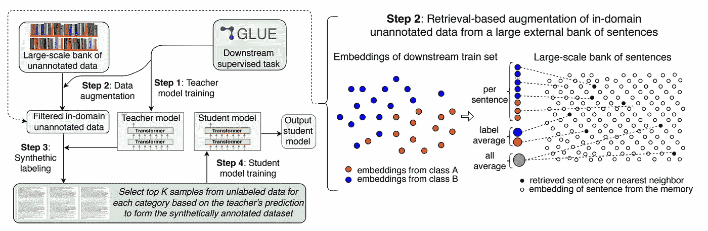
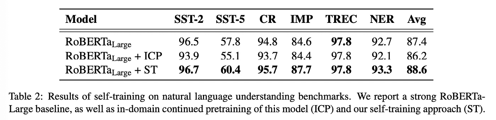
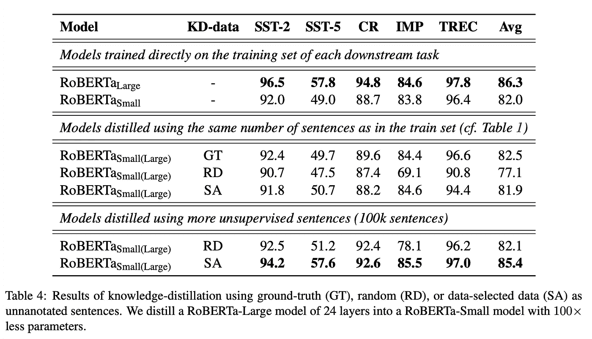
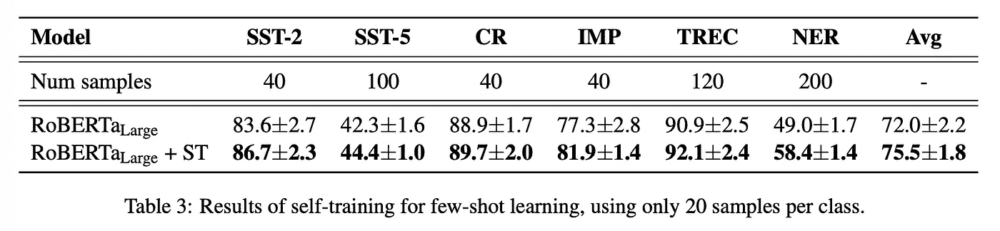
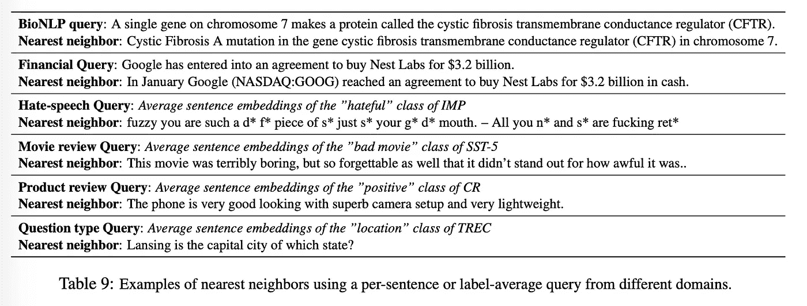
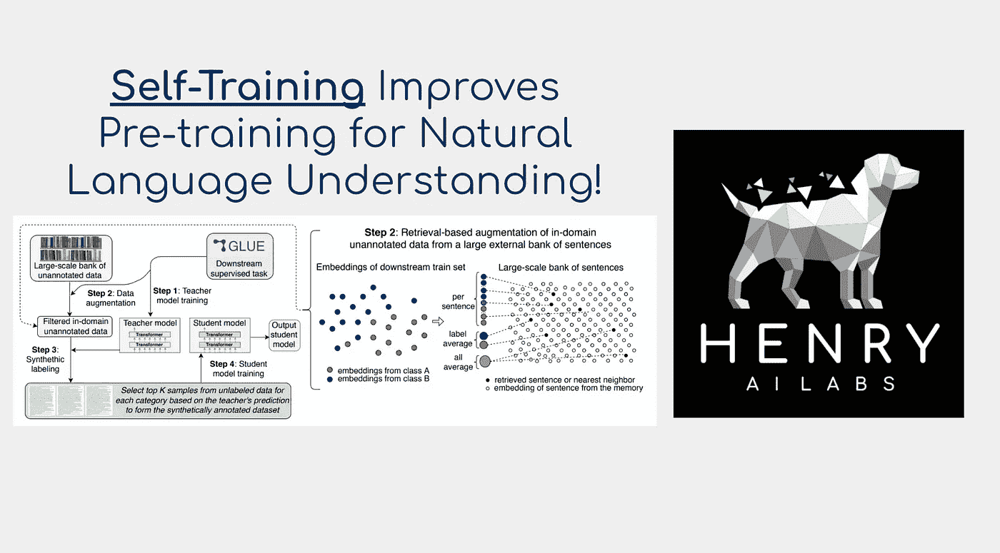

# 自然语言理解的自我训练

> 原文：<https://towardsdatascience.com/self-training-for-natural-language-understanding-d5c369b5a7f6?source=collection_archive---------24----------------------->

这篇文章将解释自然语言处理中令人兴奋的发展。提出了一种半监督学习算法，该算法通过自训练显著提高了 RoBERTa 的性能。如果你喜欢这篇论文的视频解释，请看看这个！

迁移学习在深度学习方面取得了极大的成功。这描述了用从另一个任务学习的权重初始化深度神经网络。在计算机视觉中，这另一项任务通常是 ImageNet 监督学习。在自然语言处理中，另一项任务通常是使用互联网规模的语料库进行自我监督的语言建模。

迁移学习的成功激发了深度学习研究人员探索更多用于预训练的任务。一个有希望的替代任务是自我训练。自训练是知识蒸馏的逆过程，它被开发来压缩大型深度神经网络。

自我训练和知识蒸馏描述了使用一个神经网络来标记另一个神经网络的训练数据。知识蒸馏用较大网络标注较小网络的数据，自练用较小网络标注较大网络的数据。这可以循环渐进增长或收缩的几个步骤。

自我训练在嘈杂学生的框架内实现了图像网络分类的最先进水平[1]。在其他组成部分中，吵闹的学生在半监督学习的环境中实现自我训练。Zoph 等人[2]表明，在从分类到对象检测和语义分割的一些计算机视觉问题上，自训练优于使用 ImageNet 监督学习的预训练。如果感兴趣，下面的视频解释了这项研究，它与我们在本文中讨论的论文极其相似:

半监督学习描述了这样一种环境，其中我们有少量的已标记数据和大量(通常是绝对大量的)未标记数据。表征学习的许多最新进展，如 SimCLRv2 [3]，就是以这种方式工作的。这似乎适用于大多数深度学习问题，如图像分类、问题回答，甚至是蛋白质结构建模等应用，其中有一小组实验验证的 3D 结构和一大组在自然界中发现的验证的氨基酸序列。

本文讨论了在半监督学习环境下，应用于自然语言理解的自我训练。

使半监督学习工作良好的一个核心因素是未标记的数据至少与标记的数据在同一域内。这是什么意思？对于下游的 NER 生物医学任务，没有标签的生物医学论文比流行文化新闻文章要好。Gururangan 等人[4]在“不要停止预训练”中用更多相关领域的顺序语言建模证明了这一点。例如，在为文章主题分类装配标签之前，从普通爬行到用于语言建模的新闻文章。下面的视频解释了那篇论文，如果感兴趣的话:

作者提出了 SentAugment 来过滤基于最域内和相关子集的未标记数据。该算法通过训练语义文本相似性模型来工作，该模型将整个未标记集(例如来自常见爬行的 50 亿个句子)嵌入到向量空间中。这些向量空间被称为“大规模句子嵌入空间”。

使用相同的编码模型将整个标记数据集嵌入到单个矢量表示中。这是通过对每个标记句子的向量进行平均、基于下游标签进行平均或者对标记集合中的每个句子使用单独的查询来完成的。查询向量用于在未标记的文档索引中查找最近的邻居。像 FAISS [5]这样的库加速了这个过程。

**所以总而言之，算法是这样工作的:**

*   语义相似度模型被训练并嵌入未标记集合中的每个句子。该模型还形成了标记集的嵌入，以用作检索查询。
*   教师模型最初是在小标签集上用监督学习来训练的。该教师模型然后伪标记来自检索的前 K 个最相似的文档。
*   学生模型在老师的这些伪标签上训练。
*   你可以根据需要切换学生和老师，通常每一步都增加学生的规模(在自我训练的情况下，注意知识升华与此相反)。

本文探讨的完整管道的可视化

作者使用常见的爬行语料库和一些范围从大约 5k 到 65k 的标记示例的文本分类数据集进行实验。文档和查询编码器用由释义和平行句子数据集组成的数据集上的三元组损失来训练。

表 2 显示了来自预训练的 RoBERTa 大模型的自我训练的收益。请注意，持续的语言建模(ICP)会损害性能，可能会过度适应自我监督的学习任务。还要注意的是，SST-2 比其他数据集拥有更多的数据，而其他数据集的增益要大得多。

表 4 显示了 SentAugment 的优势。顶行突出显示了 RoBERTa Large 的表现明显优于 RoBERTa small。中间一行(GT)显示了使用标记数据集从大到小的知识提取的成功。在中间一行中，(RD)指的是从未标记和标记的组中随机取样进行蒸馏。在中间一行中，(SA)显示 SentAugment 几乎恢复了单独使用最近邻检索的蒸馏的地面真实性能。底部一行显示了使用额外的未标记数据的好处(比如 100K 对 5k，与中间一行进行比较)。与随机选择未标记的句子进行提取相比，这显示了检索过滤的巨大优势。

表 3 显示了少量学习的结果。这描述了使用极小的标记集，例如在情感分类中的正面和负面类别中的每个类别中有 20 个例子。与最近的结果相比，如 GPT-3，或更实际的模式探索训练，这是一个有希望的结果，解释如下:

作者进一步研究了构造 SentAugment 算法的不同方法。值得注意的是，他们探索了使用 word2vec 嵌入与使用串联文本相似性语料库训练的 Transformer 嵌入之间的差异。他们还研究了为监督学习集构建查询的不同方法。如果您有兴趣学习更多关于检索模型的知识，我强烈推荐您查看检索增强生成模型。如果你感兴趣，这里有一个解释这一点的视频:

作者还包括这个检索系统的不同查询的最近邻居的可视化，如下所示。我很喜欢用“大规模句子嵌入空格”这个术语来描述这项研究。

我一直认为知识提炼是成功的，因为老师利用其较大的模型尺寸为较小的学生制作了更详细的标签。自我训练的成功表明不仅仅是这样。我怀疑这种转移与优化格局有关。感谢您的阅读！

# 参考

[1]与吵闹的学生一起进行自我训练可提高 ImageNet 分类。谢启哲，Minh-Thang Luong，Eduard Hovy，郭诉乐。[https://arxiv.org/abs/1911.04252](https://arxiv.org/abs/1911.04252)

[2]反思职前培养和自我培养。Barret Zoph、Golnaz Ghiasi、宗、尹翠、刘韩啸、Ekin Cubuk、Quoc V. Le。https://arxiv.org/pdf/2006.06882.pdf

[3]大的自我监督模型是强的半监督学习器。陈婷，西蒙·科恩布鲁斯，凯文·斯维斯基，穆罕默德·诺鲁齐，杰弗里·辛顿。[https://arxiv.org/abs/2006.10029](https://arxiv.org/abs/2006.10029)

[4]不要停止预训练:使语言模型适应领域和任务。Suchin Gururangan，Ana Marasovic，Swabha Swayamdipta，Kyle Lo，Iz Beltagy，Doug Downey，Noah A. Smith。【https://arxiv.org/pdf/2004.10964.pdf 号

[5] Faiss:一个用于高效相似性搜索的库。埃尔韦·杰古，马特吉斯·杜泽，杰夫·约翰逊。[https://engineering . FB . com/data-infra structure/faiss-a-library-for-efficient-similarity-search/](https://engineering.fb.com/data-infrastructure/faiss-a-library-for-efficient-similarity-search/)

自我训练提高自然语言理解的预训练:[https://arxiv.org/pdf/2010.02194.pdf](https://arxiv.org/pdf/2010.02194.pdf)

感谢阅读，如果你喜欢深度学习论文的摘要，请在 YouTube 上查看 [Henry AI Labs！](https://www.youtube.com/channel/UCHB9VepY6kYvZjj0Bgxnpbw/videos?view_as=subscriber)

