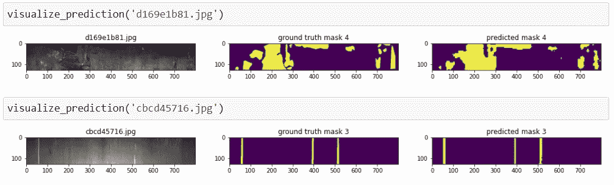

# 基于全卷积网络的语义图像分割

> 原文：<https://towardsdatascience.com/semantic-image-segmentation-using-fully-convolutional-networks-bf0189fa3eb8?source=collection_archive---------10----------------------->

## 语义分割/扩展卷积

## Severstal 钢缺陷检测——案例研究

人类有一种与生俱来的能力，能够识别他们在周围世界看到的物体。我们大脑中的视觉皮层几乎可以在短时间内毫不费力地区分猫和狗。这不仅适用于猫和狗，也适用于我们看到的几乎所有物体。但是计算机没有人脑聪明，无法自己做到这一点。在过去的几十年里，深度学习研究人员试图通过一种特殊类型的人工神经网络(称为卷积神经网络(CNN))来弥合人脑和计算机之间的这种差距。

# 什么是卷积神经网络？

在对哺乳动物大脑进行了大量研究后，研究人员发现，大脑的特定部分在特定类型的刺激下会被激活。例如，当我们看到垂直边缘时，视觉皮层的一些部分被激活，当我们看到水平边缘时，一些部分被激活，当我们看到特定的形状、颜色、脸等时，一些部分被激活。ML 的研究人员将这些部分想象成神经网络的一层，并考虑了这种层的大型网络可以模仿人脑的想法。
这种直觉导致了 CNN 的出现，这是一种神经网络，其构建块是卷积层。卷积层只不过是一组称为核或滤波器的权重矩阵，用于对诸如图像的特征矩阵进行卷积运算。

**卷积:** 2D 卷积是一个相当简单的操作，你从一个内核开始，然后“跨越”(滑动)2D 输入数据，与它当前所在的输入部分执行逐元素乘法，然后将结果相加到单个输出单元中。内核对它滑过的每个位置重复这个过程，将 2D 特征矩阵转换成另一个 2D 特征矩阵。
内核在输入特征矩阵上滑动的步长称为 ***步距*** 。在下面的动画中，输入矩阵的四边都添加了额外的零条纹，以确保输出矩阵的大小与输入矩阵的大小相同。这称为(零)填充。


**2D 卷积** : 内核大小=3x3，填充=1 或‘相同’，步幅= 1**【GIF 来源: [pyimagesearch](https://www.pyimagesearch.com/2018/12/31/keras-conv2d-and-convolutional-layers/)**

# **语义图像分割**

**图像分割是基于一些特征将数字图像分割成多个片段(像素组)的任务。目标是将图像简化或改变成更有意义和更容易分析的表示。
语义分割是指给定图像中的每个像素分配一个类别标签。参见下面的例子。**

****

**图片来源:[马丁托马/ CC0](https://commons.wikimedia.org/wiki/File:Image-segmentation-example-segmented.png)**

> **请注意，分段不同于分类。在分类中，完整的图像被分配一个类别标签，而在分割中，图像中的每个像素被分类到一个类别中。**

# **1.商业问题**

**对卷积网络和语义图像分割有了一个公平的想法，让我们进入我们需要解决的问题。**

********

**图片来源: [Kaggle](https://www.kaggle.com/c/severstal-steel-defect-detection)**

**俄罗斯北方钢铁公司是世界 50 大钢铁生产商之一，也是俄罗斯高效钢铁开采和生产的最大参与者。谢韦尔钢铁公司的主要产品之一是钢板。平板钢板的生产工艺精细。从加热和轧制，到干燥和切割，当扁钢准备装运时，几台机器会接触到它。为了确保钢板生产的质量，今天，谢韦尔钢铁公司使用高频摄像机的图像来驱动缺陷检测算法。
通过这次比赛，Severstal 希望人工智能社区能够通过**定位和分类钢板上的表面缺陷**来改进算法。**

## **业务目标和约束**

1.  **有缺陷的纸张必须被预测为有缺陷的，因为如果我们将有缺陷的纸张错误地分类为无缺陷的，将会有严重的质量问题。即每个类别都需要高召回值。**
2.  **我们不需要一眨眼就给出给定图像的结果。(没有严格的延迟问题)**

# **2.机器学习问题**

## **2.1.将业务问题映射到 ML 问题**

**我们的任务是**

1.  **使用图像分割检测/定位钢板中的缺陷**
2.  **将检测到的缺陷分成[1，2，3，4]中的一个或多个类别**

**放在一起就是一个语义图像分割问题。**

## **2.2.绩效指标**

**使用的评估指标是平均 Dice 系数。Dice 系数可用于比较预测的分割与其对应的基本事实之间的逐像素一致性。该公式由下式给出:**

****

**其中 X 是预测的像素组，Y 是地面实况。
[在这里阅读更多关于骰子系数的内容](https://en.wikipedia.org/wiki/S%C3%B8rensen%E2%80%93Dice_coefficient)。**

## **2.3.数据概述**

**我们收到了一个 2GB 大小的 zip 文件夹，其中包含以下内容:**

*   **`**train_images**`—包含 12，568 张训练图像的文件夹(。jpg 文件)**
*   **`**test_images**` —包含 5506 个测试图像的文件夹(。jpg 文件)。我们需要检测和定位这些图像中的缺陷**
*   **`**train.csv**` —为属于 ClassId = [1，2，3，4]的缺陷提供分段的训练注释**
*   **`**sample_submission.csv**` —正确格式的样本提交文件，每个 *ImageId* 重复 4 次，4 个缺陷类别各一次。**

**关于数据的更多细节将在下一节讨论。**

# **3.探索性数据分析**

**解决任何机器学习问题的第一步应该是彻底研究原始数据。这为我们解决问题的方法提供了一个合理的思路。通常，它还能帮助我们发现数据的一些潜在方面，这些方面可能对我们的模型有用。让我们分析这些数据，试着得出一些有意义的结论。**

## **3.1.正在加载 train.csv 文件**

****

*****train.csv*** 告知图像中哪个像素位置存在哪种类型的缺陷。它包含以下列:**

*   **`**ImageId**`:图像文件名。jpg 扩展**
*   **`**ClassId**`:缺陷的类型/等级，为【1、2、3、4】中的一种**
*   **`**EncodedPixels**`:以游程编码像素的形式表示图像中缺陷像素的范围(缺陷开始的像素数<空格>缺陷的像素长度)。
    *例如“29102 12”表示缺陷从像素 29102 开始，总共有 12 个像素，即像素 29102、29103、………、29113 有缺陷。像素从上到下，然后从左到右进行编号:1 对应于像素(1，1)，2 对应于(2，1)，依此类推。***

```
**train_df.ImageId.describe()**count              7095
unique             6666
top       ef24da2ba.jpg
freq                  3
Name: ImageId, dtype: object
```

*   **有 7095 个数据点对应于包含缺陷的 6666 张钢板图像。**

## **3.2.分析 train_images 和 test_images 文件夹**

****训练和测试图像的数量** 让我们了解一下训练和测试图像的比例，并检查有多少训练图像包含缺陷。**

```
Number of train images :  12568
Number of test images :  5506
Number of non-defective images in the train_images folder: 5902
```

*   **train_images 文件夹中的图像比 *train.csv* 中的唯一图像 id 还多。这意味着，并非 train_images 文件夹中的所有图像都具有缺陷 1、2、3、4 中的至少一个。**

****

****列车数据中有缺陷和无缺陷图像的百分比****

****训练图像和测试图像的尺寸** 让我们检查一下训练图像和测试图像的尺寸是否相同。如果没有，我们必须使它们大小相同。**

```
{(256, 1600, 3)}
{(256, 1600, 3)}
```

*   **训练和测试文件夹中的所有图像大小相同(256×1600×3)**

## **3.3.标签分析:ClassId**

**让我们看看训练数据是如何分布在各个类中的。**

****

```
Number of images in class 1 : **5150 (77.258 %)**
Number of images in class 2 : **897 (13.456 %)**
Number of images in class 3 : **801 (12.016 %)**
Number of images in class 4 : **247 (3.705 %)**
```

*   **数据集看起来不平衡。**
*   **与其他类别的图像相比，具有类别 3 缺陷的图像的数量非常高。77%的缺陷图像具有 3 级缺陷。**
*   **类别 2 是最少出现的类别，train.csv 中只有 3.7 %的图像属于类别 2。**

> **注意，上述分析中的百分比值之和大于 100，这意味着一些图像具有属于一个以上类别的缺陷。**

****每幅图像标记的标签数量****

****

```
Number of images having 1 class label(s): **6239 (93.594%)**
Number of images having 2 class label(s): **425 (6.376%)**
Number of images having 3 class label(s): **2 (0.03%)**
```

*   **大多数图像(93.6%)只有一类缺陷。**
*   **只有 2 个图像(0.03%)具有 3 类缺陷的组合。**
*   **其余的图像(6.37%)具有两类缺陷的组合。**
*   **没有图像具有所有 4 类缺陷。**

# **4.数据准备**

**在我们继续训练深度学习模型之前，我们需要将原始数据转换为可以输入模型的形式。此外，我们需要构建一个数据管道，它将执行所需的预处理，并为训练生成成批的输入和输出图像。**

**作为第一步，我们创建一个 pandas dataframe，包含列`**ImageId**`下的列车图像的文件名，以及一个或多个列`**Defect_1**`、`**Defect_2, Defect_3, Defect_4**` 下的 ***编码像素*，这取决于 *train.csv 中图像的***ClassId***。*没有任何缺陷的图像将这 4 列全部留空。以下是数据帧的示例:****

****

## **4.1.列车，CV 分流 85:15**

**我会在 85%的训练图像上训练我的模型，并在 15%上验证。**

```
(10682, 5)
(1886, 5)
```

## **4.2.用于将 RLE 编码像素转换为遮罩的实用函数，反之亦然**

**让我们想象一下每个班级的一些图片和他们的面具。钢板图像中属于缺陷区域的像素在掩模图像中用黄色表示。**

********

**我们的深度学习模型将钢板图像作为输入(X)并返回四个掩码(Y)(对应于 4 个类别)作为输出。这意味着，为了训练我们的模型，我们需要将成批的训练图像和它们相应的掩码输入到模型中。
我已经为 train_images 文件夹中的所有图像生成了遮罩，并将它们存储在名为 train_masks 的文件夹中。**

## **4.3.使用 tensorflow.data 的数据生成器**

**以下代码是数据管道，用于对输入图像应用预处理、增强，并生成用于训练的批次。**

## **4.4.定义度量和损失函数**

**我使用了一个混合损失函数，它是由***【BCE】***和 ***骰子损失*** 组合而成的。BCE 对应于每个像素的二进制分类(当与地面真实掩模比较时，0 表示该像素处缺陷的错误预测，1 表示正确预测)。骰子损失由(1 骰子系数)给出。
***BCE 骰子损失= BCE +骰子损失*****

# **5.模型**

**有几种用于语义图像分割的模型/架构。在这个案例研究中，我尝试了其中的两个:i)U-Net 和 ii) Google 的 DeepLabV3+。**

## ****5.1。第一个切割解决方案:用于语义图像分割的 U-Net****

**这个模型是基于德国弗赖堡大学*的 *Olaf Ronneberger* 、 *Philipp Fischer* 和 *Thomas Brox* 于 2015 年发表的研究论文 [**U-Net:卷积网络用于生物医学图像分割**](https://arxiv.org/abs/1505.04597v1) 。在本文中，作者构建了一个优雅的架构，称为“**全卷积网络**”。他们已经将此用于电子显微镜堆栈和少数其他生物医学图像分割数据集中的神经元结构的分割。***

****5.1.1。架构**
网络的架构如下图所示。它由收缩路径(左侧)和扩张路径(右侧)组成。扩展路径与收缩路径对称，使得网络的形状类似于英文字母“U”。由于这个原因，这个网络被称为 U-Net。**

****

**U-net 架构(以最低分辨率的 32x32 像素为例)。每个蓝框对应一个多通道特征图。盒子的顶部标明了频道的数量。x-y 尺寸位于框的左下边缘。白色方框表示复制的要素地图。箭头表示不同的操作。[图片来源:[弗赖堡大学](https://lmb.informatik.uni-freiburg.de/people/ronneber/u-net/) ]**

**收缩路径遵循卷积网络的典型架构。它由两个 3×3 卷积(无填充卷积)的重复应用组成，每个卷积后跟一个整流线性单元(ReLU)和一个跨距为 2 的 2×2 最大池操作，用于下采样。在每个下采样步骤中，特征通道的数量会翻倍。在此路径中，模型从图像中捕获重要的特征(类似于钢板中的缺陷)并丢弃不重要的特征，从而降低图像在每个卷积+最大池层的分辨率。
在扩展路径中，每一步都包括特征图的上采样，随后是将特征通道的数量减半的 2x2 卷积(**上卷积**)、与来自收缩路径的相应裁剪的特征图的连接，以及两个 3x3 卷积，每个卷积之后是 ReLU。由于每次卷积都会丢失边界像素，因此裁剪是必要的。在最后一层，使用 1x1 卷积将每个 64 分量的特征向量映射到所需的类别数(在我们的例子中为 4)。
为了精确定位，来自收缩路径的高分辨率特征被裁剪并与上采样输出相结合，并被馈送到后续卷积层，该卷积层将学习组装更精确的输出。**

*   **不是在第一层中使用 64 个滤波器，而是仅使用 8 个滤波器(后续层中的滤波器数量也相应改变)。这导致较不复杂的模型，与具有 64 个过滤器的模型相比，训练更快。**
*   **钢板图像的原始尺寸为 256x1600。大尺寸图像包含更多像素，因此需要更多卷积、池化等计算。由于计算资源的限制，我已经将图像的大小调整到一半(128x800)。**
*   **我在每个卷积块后添加了一个小的 dropout = 0.2，以避免模型过度拟合。**

> **U-Net 模型的代码可以在我的 [GitHub 库](https://github.com/aruns2120/Semantic-Segmentation-Severstal/tree/master/U-Net)中找到。**

**5.1.2。训练
我已经使用 [Keras Adam optimizer](https://www.tensorflow.org/api_docs/python/tf/keras/optimizers/Adam) 以 50 个时期的默认学习速率训练了模型。优化器试图最小化的损失函数是 **bce_dice_loss** ，在前面的[第 4.4 节](#fc4d)中定义。**

**随着培训的进行，我已经使用 [Keras 模型检查点](https://www.tensorflow.org/api_docs/python/tf/keras/callbacks/ModelCheckpoint)来监控**验证骰子系数**，并保存具有最佳验证骰子系数分数的模型。TensorBoard 已被用于在训练时动态绘制损失和得分。**

****5.1.3。训练图****

********

**5.1.4。测试** 

****

> **由于 Kaggle 要求我们提交原始大小的预测，而不是一半大小的图像，我用输入大小= (256，1600，3)重建了模型，并加载了在 128×800 图像上训练的模型的权重。我这么做是因为 CNN 对于不同的输入大小是相当稳定的。**

*   **当我在 Kaggle 上上传这个模型的预测时，Dice 系数得分相当不错。我在私人排行榜得到了 **0.80943** 的分数，在公共排行榜得到了 **0.81369** 的分数。**

## **5.2.最终解决方案:DeepLab V3+**

**DeepLab 是谷歌在 2016 年设计并开源的最先进的语义分割模型。从那以后，对该模型进行了多次改进，包括 DeepLab V2、DeepLab V3 和最新的 DeepLab V3+。
DeepLab V3+基于 Google 于 2018 年发表的论文[采用阿特鲁可分离卷积进行语义图像分割的编解码器](https://arxiv.org/abs/1802.02611)。**

****5.2.1。架构** 与前面讨论的 U-Net 类似，DeepLab V3+也是一种编解码架构。主要区别在于它使用阿特鲁卷积而不是简单卷积。在这一节的后面，我们将了解更多关于阿特鲁卷积的知识。**

********

****DeepLab V3+架构**【图片来源:[原创研究论文](https://arxiv.org/abs/1802.02611v3)**

**编码器模块通过在多个尺度上应用复杂的卷积来编码多尺度上下文信息，而简单的 effective 解码器模块沿着对象边界重新定义分割结果。**

****阿特鲁卷积
在二维信号的情况下，对于输出特征图 ***y*** 上的每个位置 ***i*** 和卷积滤波器 ***w*** ，如下所示对输入特征图***×***应用 atrous 卷积:****

****

**其中， ***r*** 决定了我们对输入信号进行采样的步距。注意，标准卷积是速率 r = 1 的特例。通过改变膨胀/收缩率值，滤波器的视野得到自适应修改。**

****

****标准卷积**(左)vs **扩张或阿特鲁卷积**(右)【GIF 来源: [Sik-Ho Tsang](https://towardsdatascience.com/@sh.tsang?source=post_page-----d527e1a8fb5----------------------) 经由[走向数据科学](/review-drn-dilated-residual-networks-image-classification-semantic-segmentation-d527e1a8fb5)**

****

**图片来源: [ResearchGate/CC](https://www.researchgate.net/figure/Atrous-convolution-kernel-green-dilated-with-different-rates_fig6_329213875)**

****深度方向可分离卷积** 深度方向可分离卷积通过将标准卷积分成两个子部分
i .深度方向卷积
ii，大大降低了计算复杂度。逐点卷积。**

**第一部分是深度方向卷积，为每个输入通道独立执行空间卷积。其后是逐点卷积(即 1×1 卷积)，用于合并深度卷积的输出。**

**让我们借助一个例子来理解这一点。假设我们有一个由 3 个通道组成的 12×12 的图像。我们希望对该输入应用 5×5 的卷积，得到 8×8×256 的输出。**

**在第一部分，深度方向卷积，我们给输入图像一个不改变深度的卷积。我们通过使用 3 个形状为 5×5×1 的核来实现。**

****

****第一部分:深度卷积**【图片来源:[齐-汪锋](https://towardsdatascience.com/@reina.wang?source=post_page-----b99ec3102728----------------------)经由[走向数据科学](/a-basic-introduction-to-separable-convolutions-b99ec3102728)**

**逐点卷积之所以如此命名，是因为它使用 1×1 核或遍历每个单点的核。无论输入图像有多少通道，该内核都具有深度；在我们这里是 3 个。因此，我们通过我们的 8×8×3 图像迭代 1×1×3 核，得到 8×8×1 图像。**

****

****第二部分:逐点卷积**【图片来源:[齐-汪锋](https://towardsdatascience.com/@reina.wang?source=post_page-----b99ec3102728----------------------)经由[走向数据科学](/a-basic-introduction-to-separable-convolutions-b99ec3102728)**

**为了获得 8×8×256 的输出图像，我们需要简单地将 1×1×3 核的数量增加到 256。**

****编码器架构** DeepLab V3+编码器使用 [*例外架构*](https://arxiv.org/abs/1610.02357) 进行以下修改—**

*   **我们在中间流程中添加更多的层**
*   **所有的最大池操作都被具有步长的深度可分卷积所取代**
*   **在每个 3×3 深度方向卷积之后，添加额外的批标准化和 ReLU。**

**编码器的输出是比输入特征图小 16 倍的特征图。这由解码器进行补偿，该解码器将编码器特征图上采样 4 倍两次([参考模型架构图](#bf35))。**

****

****DeepLab V3+编码器架构**【图片来源:[原创研究论文](https://arxiv.org/abs/1802.02611v3)**

****5.2.2。训练** 我已经使用 [Keras Adam optimizer](https://www.tensorflow.org/api_docs/python/tf/keras/optimizers/Adam) 以 47 个时期的默认学习率训练了模型。优化器试图最小化的损失函数是 **bce_dice_loss** ，在前面的[第 4.4 节](#fc4d)中定义**

**与 U-Net 的情况一样，我保存了具有最佳验证 dice_coefficient 的模型的权重。**

**5.2.3。训练图**

****

****请注意，模型在第 37 个时期后开始过度拟合，验证分数没有进一步提高。因此，我使用了保存在第 37 纪元的模型权重。****

****5.2.4。测试** 下图显示了来自验证数据的一些样本图像，以及它们的基本事实遮罩和预测遮罩。**

********

> **在这种情况下，使用原始输入大小(256，1600，3)重建模型并加载按一半大小训练的模型的权重效果不佳。我不得不使用不同的策略——我使用训练好的模型在 128×800 的图像上进行预测，并将预测的遮罩大小调整为 256×1600。这种方法在 DeepLab V3+上运行得非常好。**

## **结果比较和最终提交**

****

**我最后提交的是 DeepLab V3+，无论是私信还是公信都给了一个像样的分数。**

****

# **现有方法和改进**

**这个 Kaggle 比赛很受欢迎，许多人用不同的方法解决了这个问题。然而，他们中的大多数都使用了 U-Net 的某种变体或类似的编码器-解码器架构。**

**我使用 simple U-Net 作为我的第一个 cut 解决方案，它在测试数据上给出了不错的性能，这要归功于半尺寸上的训练和全尺寸策略上的预测。**

**我已经实现了 DeepLab V3+，这是一种从零开始的语义图像分割技术。帮我把分数从 0.809 提高到 0.838。**

# **未来的工作**

*   **一些超参数调整可以用 U-Net 来完成。**
*   **可以尝试其他图像分割架构，如 U-Net++、SegNet 和 Mask R-CNN。**
*   **可以利用在大数据集上训练的各种骨干的迁移学习的思想。**

# ****结论****

**谢谢你看了这么长的博客，感谢你的耐心。我非常喜欢写它，希望你也喜欢读它。**

**我跳过了大部分代码，因为我不想用代码淹没读者。请参考我的 [GitHub 库](https://github.com/aruns2120/Semantic-Segmentation-Severstal)获取完整的 Keras 代码。**

**如果您有任何疑问、建议或讨论，请随时在下面的评论区提出。我将尽我所知努力解决这些问题。
你可以在 LinkedIn 上联系我，[这是我的简介](https://www.linkedin.com/in/arunsingh314)。**

# **参考**

1.  **[https://www.kaggle.com/c/severstal-steel-defect-detection/](https://www.kaggle.com/c/severstal-steel-defect-detection/)**
2.  **[https://arxiv.org/abs/1505.04597v1](https://arxiv.org/abs/1505.04597v1)**
3.  **[https://arxiv.org/abs/1802.02611v3](https://arxiv.org/abs/1802.02611v3)**
4.  **[https://www . analyticsvidhya . com/blog/2019/02/tutorial-semantic-segmentation-Google-deep lab/](https://www.analyticsvidhya.com/blog/2019/02/tutorial-semantic-segmentation-google-deeplab/)**
5.  **[https://arxiv.org/abs/1610.02357](https://arxiv.org/abs/1610.02357)**
6.  **[https://github . com/MLearing/Keras-deep lab-v3-plus/blob/master/model . py](https://github.com/MLearing/Keras-Deeplab-v3-plus/blob/master/model.py)**
7.  **https://www.appliedaicourse.com/**