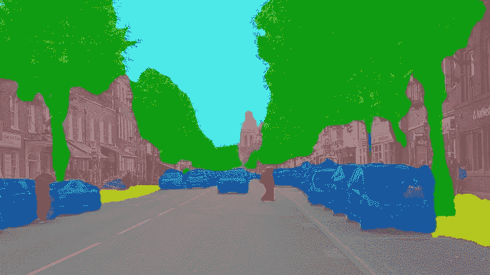
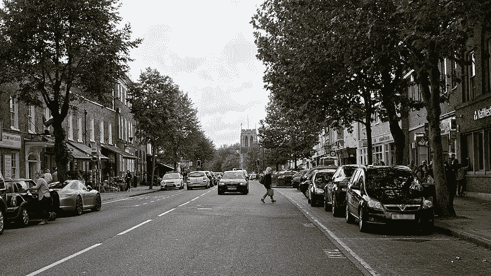
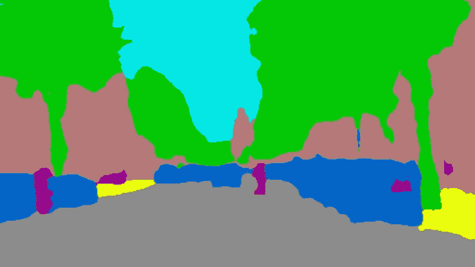
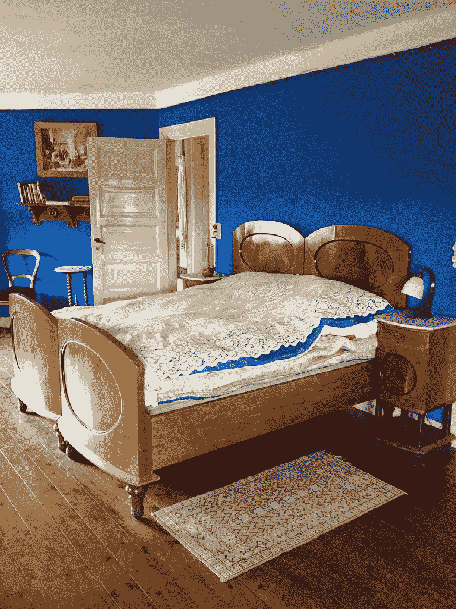
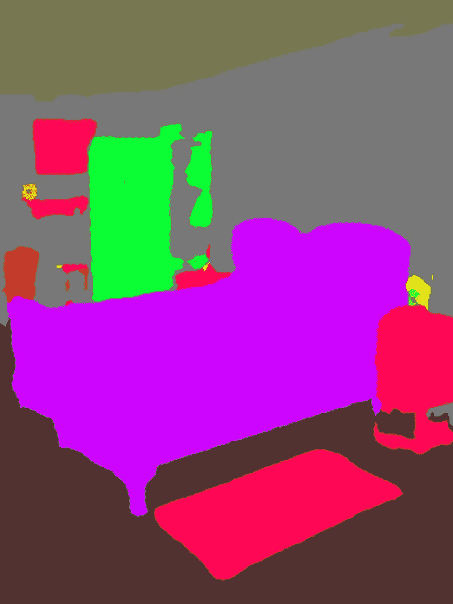

# 用 5 行代码对 150 类对象进行语义分割

> 原文：<https://towardsdatascience.com/semantic-segmentation-of-150-classes-of-objects-with-5-lines-of-code-7f244fa96b6c?source=collection_archive---------16----------------------->

## 用 PixelLib 对 150 类对象进行语义分割



现在可以使用带有 PixelLib 的 ade20k 模型对 150 类对象进行分割。Ade20k 模型是在 ade20k 数据集上训练的 deeplabv3+模型，ade 20k 数据集有 150 个对象类。感谢[tensorflow deep lab 的模型动物园，](https://github.com/tensorflow/models/blob/master/research/deeplab/g3doc/model_zoo.md)我从它的 tensor flow 模型检查点提取了 ade20k 模型。

安装最新版本的 tensorflow (tensorflow 2.0)和:

*   *pip3 安装张量流*

安装 Pixellib:

*   *pip3 安装 pixellib —升级*

***用 PixelLib 实现语义分割:***

用 deeplabv3+模型实现语义切分的代码在 ade20k 数据集上进行训练。

我们将观察每一行代码:

```
import pixellib
from pixellib.semantic import semantic_segmentation segment_image = semantic_segmentation()
```

执行语义分割的类是从 pixelLib 导入的，我们创建了该类的一个实例。

```
segment_image.load_ade20k_model(“deeplabv3_xception65_ade20k.h5”)
```

在上面的代码中，我们加载了在 ade20k 上训练的用于分割对象的 xception 模型。模型可以从[这里](https://github.com/ayoolaolafenwa/PixelLib/releases/download/1.3/deeplabv3_xception65_ade20k.h5)下载。

```
segment_image.segmentAsAde20k(“path_to_image”, output_image_name = “path_to_output_image)
```

我们加载了该函数来对图像执行分割。该函数有两个参数…

*   *路径至图像:-* 这是待分割图像的路径。
*   *输出图像名称:-* 这是保存分割图像的路径。它将保存在您当前的工作目录中。

**Sample.jpg**



来源:W [ikicommons](https://commons.m.wikimedia.org/wiki/File:B1393_Epping_High_Street_Epping_Essex_England.jpg) (CC0)作者 [Acabashi](https://commons.m.wikimedia.org/wiki/User:Acabashi)

***注:*** 使用 Ade20k 模型，可以用 PixelLib 对室内和室外场景进行语义分割。

**输出图像**



*室外场景的语义分割*

分割后保存的图像，图像中的物体被分割。如果您愿意，可以在图像上应用分段覆盖。

```
segment_image.segmentAsAde20k("sample.jpg", output_image_name = "image_new.jpg", overlay = True)
```


我们添加了额外的参数**叠加**，并将其设置为**真**，我们获得了一个对象上带有分割叠加的图像。

**Sample2.jpg**



来源:W [ikicommons](https://commons.m.wikimedia.org/wiki/File:Blue_bedroom_(7530077032).jpg) 。由[卡伦·马尔达尔](https://www.flickr.com/people/29050965@N08)

```
segment_image.segmentAsAde20k(“sample2.jpg”, output_image_name = “image_new2.jpg")
```

**输出图像**



*室内场景的语义分割*

**PixelLib 的特殊用途可能需要您返回分段输出的数组:**

*使用代码*获得分段输出的数组

```
segmap, output = segment_image.segmentAsAde20k()
```

您可以测试获取数组的代码，并通过修改下面的语义分段代码打印出输出的形状。

*   使用以下代码获得 segmap 和分段覆盖图的数组，

```
segmap, seg_overlay = segment_image.segmentAsAde20k(overlay = True)
```

## 基于 ADE20K 模型的视频分割

我们将在下面解释每一行代码。

```
import pixellibfrom pixellib.semantic import semantic_segmentationsegment_video = semantic_segmentation()
```

我们导入了用于执行语义分段的类，并创建了该类的一个实例。

```
segment_video.load_ade20k_model("deeplabv3_xception65_ade20k.h5")
```

我们加载了在 ade20k 数据集上训练的 xception 模型来执行语义分割，它可以从[这里](https://github.com/ayoolaolafenwa/PixelLib/releases/download/1.3/deeplabv3_xception65_ade20k.h5)下载。

```
segment_video.process_video_ade20k("video_path",  overlay = True, frames_per_second= 15, output_video_name="path_to_output_video")
```

我们调用函数对视频文件进行分割。

它采用以下参数:-

*   *video_path* :这是我们要分割的视频文件的路径。
*   *每秒帧数:*该参数用于设置保存的视频文件每秒帧数。在这种情况下，它被设置为 15，即保存的视频文件每秒将有 15 帧。
*   *输出 _ 视频 _ 名称:这是*保存的分段视频*的名称。*输出的视频将保存在您当前的工作目录中。

***样本 _ 视频***

***输出视频***

这是使用 ade20k 模型保存的分段视频。

*现场摄像机的语义分割。*

我们可以使用相同的模型在相机上执行语义分割。这可以通过对用于处理视频文件的代码进行少量修改来实现。

```
import cv2capture = cv2.VideoCapture(0)
```

我们导入了 cv2 并包含了捕捉相机帧的代码。

```
segment_video.process_camera_ade20k(capture,  overlay = True, frames_per_second= 15, output_video_name="output_video.mp4", show_frames= True,frame_name= "frame")
```

在执行分割的代码中，我们将视频的文件路径替换为*捕获*，即我们正在处理摄像机捕获的帧流，而不是视频文件。为了显示摄像机画面，我们添加了额外的参数:

*   *显示帧:*该参数处理分段摄像机帧的显示，按 q 退出帧的显示。
*   *帧名:*这是显示的摄像机帧的名称。

展示 pixelLib 使用 ade20k 模型对摄像机输入进行语义分割的输出的演示。

*干得好！*它成功地把我分段了。

访问 PixelLib 的[官方 GitHub 库。](https://github.com/ayoolaolafenwa/PixelLib)

访问 PixelLib 的[官方文档](https://pixellib.readthedocs.io/en/latest/)

通过以下方式联系我:

电子邮件:[olafenwaayoola@gmail.com](https://mail.google.com/mail/u/0/#inbox)

推特: [@AyoolaOlafenwa](https://twitter.com/AyoolaOlafenwa)

脸书:[阿尤拉·奥拉芬娃](https://web.facebook.com/ayofen)

Linkedin: [阿尤拉·奥拉芬娃](https://www.linkedin.com/in/ayoola-olafenwa-003b901a9/)

如果您喜欢这篇文章，您会喜欢阅读关于 PixelLib 的其他文章:

用 5 行代码实现图像分割

[](/image-segmentation-with-six-lines-0f-code-acb870a462e8) [## 用 5 行代码实现图像分割

### 用 PixelLib 进行语义和实例分割。

towardsdatascience.com](/image-segmentation-with-six-lines-0f-code-acb870a462e8) 

用 5 行代码实现视频分割

[](/video-segmentation-with-5-lines-of-code-87f798afb93) [## 用 5 行代码实现视频分割

### 视频的语义和实例分割。

towardsdatascience.com](/video-segmentation-with-5-lines-of-code-87f798afb93)