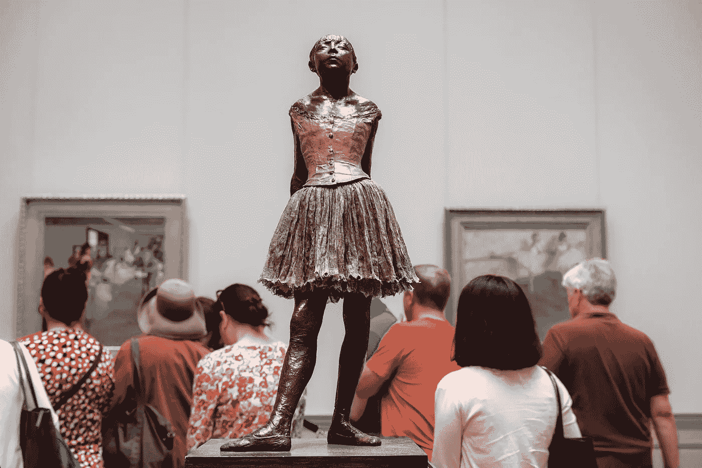
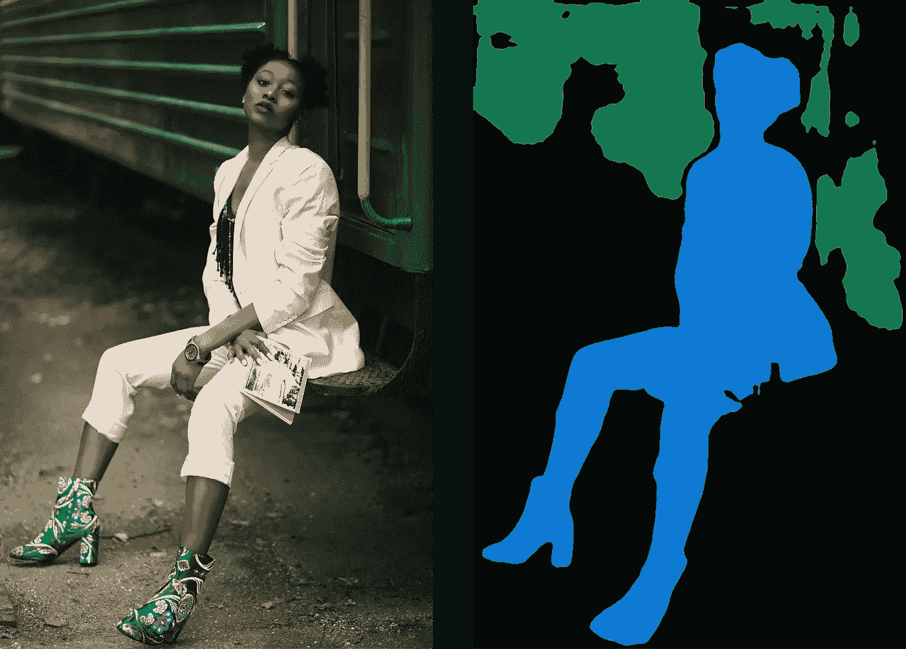
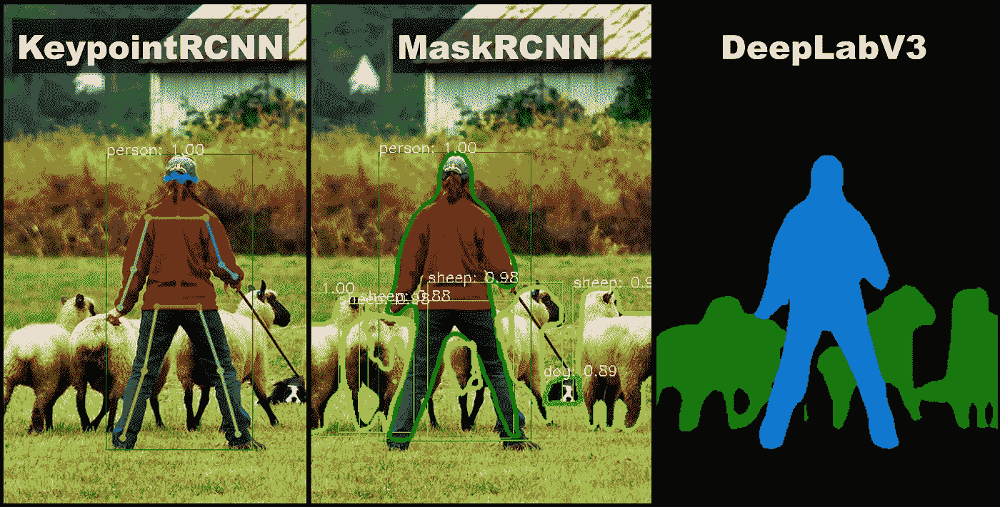
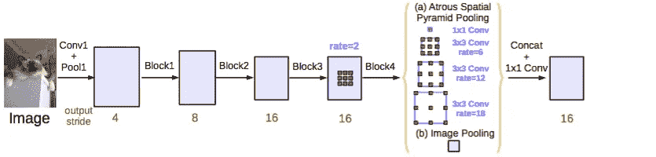
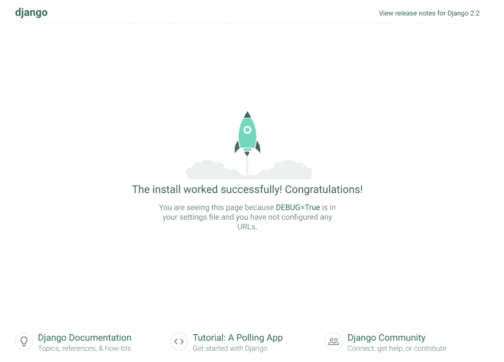
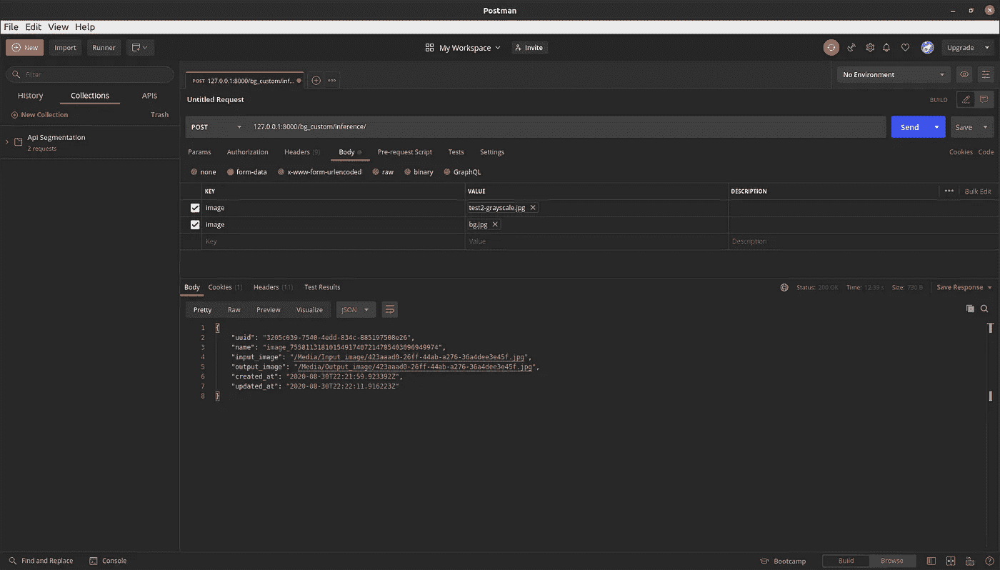
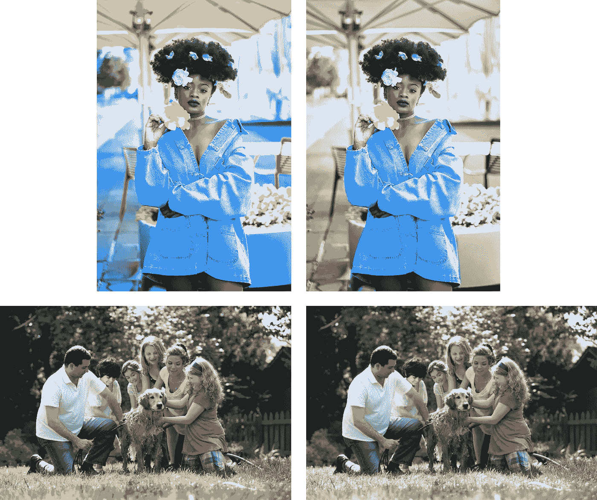

# 使用 Django API——DeepLabV3 进行语义分割

> 原文：<https://towardsdatascience.com/semantic-segmentation-using-a-django-api-deeplabv3-7b7904ddfed9?source=collection_archive---------53----------------------->

## 构建一个 Django API，使用语义分段执行后台定制



Sole D'Alessandro G. 在 [Unsplash](https://unsplash.com/@s___d___g?utm_source=unsplash&utm_medium=referral&utm_content=creditCopyText) 上拍摄的原始照片

# 介绍

图像分割一直是热门话题。涉及分割的各种用例出现在许多不同的领域，机器视觉、医学成像、物体检测、识别任务、交通控制系统、视频监控等等。这些智能系统背后的直觉是捕捉形成图像的各种组件，从而教会计算机视觉模型掌握更多洞察力，更好地理解场景和背景。



左边是 [Melody Jacob](https://unsplash.com/@melodyjacob1?utm_source=unsplash&utm_medium=referral&utm_content=creditCopyText) 在 [Unsplash](https://unsplash.com/@melodyjacob1?utm_source=unsplash&utm_medium=referral&utm_content=creditCopyText) 上的原图，右边是分段版

常用的两种图像分割类型是:

*   **语义分割**:识别图像中的不同类别，并*相应地分割*
*   **实例分割**:预先确定图像中的不同类别，识别每个类别包含的实例数量。图像被分解成与模型被训练的不同类实例相关的多个标记区域。

在本文中，我将使用 Google DeepLab V3 分割模型的 Pytorch 实现来自定义图像的背景。其目的是分割前景，并将其与其余部分分离，同时用一幅完全不同的图片替换剩余的背景。该模型将通过 Django REST API 提供服务。

## 概观

1.  DeepLab V3 的一点背景知识
2.  使用 Pytorch 的 DeepLab V3-Resnet101 实现
3.  设置 Django API
4.  结论

你可以在我的 Gihut repo 下查看这个项目的全部代码。

[](https://github.com/aymanehachcham/Background-Customization) [## aymanehachham/背景-定制

### 在 GitHub 上创建一个帐户，为 aymanehachham/后台定制开发做贡献。

github.com](https://github.com/aymanehachcham/Background-Customization) 

# 1.DeepLab V3 的一点背景知识

分割模型使用完全卷积神经网络 **FCNN** 在之前的图像检测阶段，将遮罩和边界放置到位，然后通过深度极大的网络处理输入，在该网络中，累积的卷积和汇集会导致图像的分辨率和质量显著降低，因此产生的结果会损失大量信息。DeepLab 模型利用阿特鲁卷积和阿特鲁空间金字塔池(ASPP)架构解决了这一挑战。



不同分割模型之间的差异和比较，鸣谢:Francisco Massa， [Torchvision 0.3:分割、检测模型、新数据集等](https://pytorch.org/blog/torchvision03/)

在 DeepLab 架构的正向流程中涉及四个主要阶段:

*   用主干模型提取图像特征。我们案例中使用的主干是 Resnet 101 对象检测模型，作为第一个卷积管道来捕捉和屏蔽重要的特征图。
*   为了控制输出特征图的大小，在主干的最后几层中使用阿特鲁卷积。
*   在最后阶段，ASPP 架构对输出图像的不同像素进行分类，并通过 1 x 1 卷积层进行处理，以恢复其原始大小。



具有 atrous 卷积(ASPP)的并行模块，增强了图像级特征，信用: [**重新思考用于语义图像分割的阿特鲁卷积**](https://arxiv.org/pdf/1706.05587.pdf)

# 2.使用 Pytorch 的 DeepLab V3-Resnet101 实现

让我们通过创建一个包装原始 DeepLab V3 模型的 Pytorch 模块来开始这个过程。最初，Pytorch 团队已经提出了他们在 COCO 数据集上预先训练的 Google DeepLab V3 架构的实现，以及可供选择的各种主干。对于我们的特定任务，我们将使用可从`torchvision.models.segmentation` API 包轻松加载的 deeplabv3-resnet101 预训练模块。

## 创建您的 python 虚拟环境

使用`pip virtualenv`设置您的 python 虚拟环境，并安装所有需要的包:

**我**。指定 python 虚拟环境的路径:

`virtualenv absolute/path/to/virtual/env/pytorch-en`

**二。**激活您的虚拟环境:

`source /absolute/path/pytorch-env/bin/activate`

**三。**安装所需的库:

`pip install torch torchvision`

`pip install opencv-python`

`pip install numpy`

`pip install Pillow=2.2.1`

## 实现数据集示例

在编写 Pytorch 包装器之前，您需要定义一个 Pytorch 数据集类，用多种方法将输入图像文件采样到一个高级对象中。这样，模型将处理被采样的对象，而不是转换和处理所有相关的文件。

`def __init__(self, root_dir, image_file, device)`init 方法负责将图像文件转换为`Pillow`图像对象，然后转换为 torch 张量，在内部定义一组预处理规则，将初始张量转换为更适合 deeplabv3 模型的输入。目的是生成一个形状良好的张量，以避免图像文件和模型之间任何令人讨厌的不匹配。

## 为 DeepLab V3 推理创建 Pytorch 包装器模块

`SemanticSeg(nn.Module)`包装器模块有三个主要方法:

*   `def __init__(self, pretrained, device)`用预训练值初始化加载一个已经训练好的 deeplabv3-resnet101 模块，设备参数指定处理推理时的 *CPU* 或 *GPU* 加速。
*   `def forwar(self, input)`对`SegmentationSample`输入应用模块推理，并返回预测张量。
*   `def load_model(self, pretrained=False)`从`torchvision.models.segmentation` API 加载 deeplabv3-resnet101 模块。

添加一个方法来帮助处理结果。请记住，输出张量有 21 个通道与模型训练的每个目标类的预测结果相匹配。因此，我们需要解码张量形状，以便能够输出正确的图像结果。

`background_custom(self, input_image, source, background_source, channel=21)`该方法采用具有`[1, 21, H, W]`形状的输出张量图像、图像文件的路径、背景图像文件的路径以及已经设置为 21 的通道数。目标是从输出中提取人物通道( *class 15* )，排除所有标记为背景的剩余通道，最后将定义的背景与新的图像源合并。

# 设置 Django API

我们将使用 Django REST 框架为我们的模型构建一个简单的 API。关键的想法是配置所有需要的文件，包括模型、路由管道和视图，这样我们就可以通过一个简单的转发 POST 和 GET 请求轻松地测试推理。

你也可以遵循 Bennett Garner 的教程，它详细介绍了让你的 API 运行的所有必要步骤。

[](https://medium.com/swlh/build-your-first-rest-api-with-django-rest-framework-e394e39a482c) [## 用 Django REST 框架构建您的第一个 REST API

### 在 Django 中构建 REST API 非常简单。在本教程中，我们将逐步完成您的第一个 API

medium.com](https://medium.com/swlh/build-your-first-rest-api-with-django-rest-framework-e394e39a482c) 

通常，API 是数据库的一个窗口。API 后端处理数据库查询和响应格式化。您收到的是一个静态响应，通常是 JSON 格式的，是您请求的任何资源的静态响应。

## 建立 Django 项目

安装`django`和`djangorestframework` : `pip install django` `pip install djangorestframework`。

前往你将要工作的地方，开始你的项目:`django-admin startproject semanticsegmentation`。

在`semanticsegmentation/`文件夹中，您将找到一个`manage.py`脚本来运行您的 localhost 项目:`python manage.py runserver`。

在 127.0.0.1:8080 港口，您应该登陆欢迎 Django 页面:



Django 本地主机 127.0.0.1:8080

从现在开始，你的 Django 后端已经正确设置并运行了。

## 创建您的 API 应用程序

您将在前一个文件夹中生成一个专门用于 API 管理的新应用程序。

运行以下命令创建文件夹:`python manage.py startapp api`

向项目文件夹注册新的 API app:转到`semanticsegmentation/settings.py`添加 API 的路径，

```
INSTALLED_APPS = [
'api.apps.ApiConfig',
'django.contrib.admin',
'django.contrib.auth',
...
]
```

## 定义您的模型并使用 Django ORM 管理它们

现在，为了从 Django 数据库中保存和检索对象，您需要构建一个模型类来表示我们将在 API 请求中处理的实体。对于我们的特殊情况，我们需要张贴图像，应用模型推理来获得语义过滤器，然后恢复它们。因此，最合适的是一个具有两个属性的类，用于将输入和输出图像文件上传到服务器，一个特定的 id `models.UUIDField`链接到每个存储的图像，一个名称`CharField`用于标识它们，并且可选地，一个`DateTimeField`用于保存它们被存储的确切时间。

在单独的脚本中定义处理文件上传逻辑的方法:

`get_input_image_path`

`get_output_image_path`

将您的更改迁移到数据库:`python manage.py makemigrations`

`python manage.py migrate`

定义与模型类匹配的序列化程序，一个序列化程序用于输入图像，另一个用于输出结果:

在管理站点`admin.site.register(ImageSegmentation)`注册你的新模型

## 建立你的观点

我们将创建简单的 get 和 post 方法来处理简单的操作:

*   ***POST api_view*** :发送两个文件图像，应用模型推理进行处理，保存到对应的输入输出文件夹。

*   **GET api_view:** 检索保存的图像，并将其作为静态资源。

## 配置 URL 端点并运行您的 API

1.  在`semanticsegmentation/urls.py`文件中设置 url 模式:

```
urlpatterns = [
   path('admin', admin.site.urls),
   path(r'bg_custom_api', include('API.urls'))
]
```

2.在`api.urls`文件中定义 API 端点的地址:

```
urlurlpatterns = [
 path(r'test/', views.test_api, name='test_api_communication'),
 path(r'images/', views.get_images, name='get_images'),
 path(r'api/', views.run_inference, name='run_inference_on_images'),
]
```

## 在邮递员上运行您的 API

[下载 Postman](http://softwaretestingmaterial.com/install-postman/) 并开始在本地测试您的 API。



截屏(*邮递员*)127 . 0 . 0 . 1 上的 post 请求:8000/api/inference/

*   在**127 . 0 . 0 . 1:8080/API/gray/**上运行灰度推断



左上角的 [Calvin Lupiya](https://unsplash.com/@calvinlupiya?utm_source=unsplash&utm_medium=referral&utm_content=creditCopyText) 在 [Unsplash](https://unsplash.com/?utm_source=unsplash&utm_medium=referral&utm_content=creditCopyText) 上的原始照片，其右侧为灰度版本，左下角的 [Unsplash](https://unsplash.com/?utm_source=unsplash&utm_medium=referral&utm_content=creditCopyText) 上的 [CDC](https://unsplash.com/@cdc?utm_source=unsplash&utm_medium=referral&utm_content=creditCopyText) 的原始彩色照片，其右侧为分段版本。

*   在**127 . 0 . 0 . 1:8080/API/inference/**上运行后台自定义推理


乔安娜·尼克斯-沃克普在 [Unsplash](https://unsplash.com/@joanna_nix?utm_source=unsplash&utm_medium=referral&utm_content=creditCopyText) 上的照片[和](https://unsplash.com/@joanna_nix?utm_source=unsplash&utm_medium=referral&utm_content=creditCopyText) [Kiana Bosman](https://unsplash.com/@capturedby_kiana?utm_source=unsplash&utm_medium=referral&utm_content=creditCopyText) 在 [Unsplash](https://unsplash.com/?utm_source=unsplash&utm_medium=referral&utm_content=creditCopyText) 上的照片

# 结论

一旦你设置了 API 正确运行所需的所有组件，你就可以开始用 DeepLab V3 尝试一些非常酷的功能，包括背景自定义、背景灰度、背景模糊以及我相信你能想到的许多其他创造性的东西。

在为模型服务构建 API 之后，一个自然的步骤是开发一个小的移动应用程序，作为与 Django 后端交互的客户端，因此您可以测试并获取之前看到的所有结果。我愿意在我的下一篇文章中考虑这个选项，所以请继续关注第二部分。

如果您对代码有任何疑问，请与我联系，不要犹豫，给我发电子邮件到[aymanehachchaming@gmail.com](mailto:aymanehachchaming@gmail.com)

本文的整个项目代码可以在我的 GitHub repo 中找到:

[](https://github.com/aymanehachcham/Background-Customization) [## aymanehachham/背景-定制

### 在 GitHub 上创建一个帐户，为 aymanehachham/后台定制开发做贡献。

github.com](https://github.com/aymanehachcham/Background-Customization) 

## 本文的参考资料

*   [py torch 团队开发的配有 ResNet-101 主干网的 DeepLabV3 型号](https://pytorch.org/hub/pytorch_vision_deeplabv3_resnet101/)
*   谷歌团队【2017 arXiv】【DeepLabv3】[重新思考语义图像分割的阿特鲁卷积](https://arxiv.org/pdf/1706.05587.pdf)
*   [DeepLab V3 阿特鲁卷积](/review-deeplabv3-atrous-convolution-semantic-segmentation-6d818bfd1d74)由 [Sik-Ho Tsang](https://towardsdatascience.com/@sh.tsang?source=post_page-----6d818bfd1d74----------------------)
*   感谢艾哈迈德·巴布切的帮助。