# 推荐环境中的语义相似度

> 原文：<https://towardsdatascience.com/semantic-similarity-in-the-context-of-recommendation-9d088aab9e95?source=collection_archive---------28----------------------->

## 如何利用语义提高传统最大似然推荐算法的性能

相似性、距离和相关性是数据科学中的核心概念。它们对事物有多“近”或“远”这一基本问题给出了一个数字尺度。有许多不同的方法来计算相似性，如[余弦相似性](https://en.wikipedia.org/wiki/Cosine_similarity)、[皮尔逊相关系数](https://en.wikipedia.org/wiki/Pearson_correlation_coefficient)等等。在本文中，我将讨论语义相似度及其在推荐算法中的应用。

经典的协作过滤(CF)推荐器是基于行为数据的。我们收集用户评级或使用行为，并创建一个“评级矩阵”，从中我们可以识别统计模式并计算行为相似性。基于这种相似性，推荐器预测用户行为->这就是推荐。

行为的相似性会产生令人惊讶而又令人耳目一新的推荐。零售商发现的一个真实行为模式的例子表明，购买尿布的人通常也会购买啤酒。现在我们需要问:我们是否要向一位刚刚订购了尿布的顾客推荐一种啤酒？它是否符合企业的最大利益？它“有意义”吗？

用行为相似性来补充语义相似性可以确保 CF 推荐器将产生与企业的最佳利益和策略一致的推荐。在某种程度上，我们可以将其视为基于特征的相似性的集合，它由[基于内容的过滤](https://en.wikipedia.org/wiki/Recommender_system#Content-based_filtering)推荐和我们在[项目-项目协同过滤](https://en.wikipedia.org/wiki/Item-item_collaborative_filtering)算法中计算的行为相似性使用，但具有更高的准确性。在[基于内容的过滤](https://en.wikipedia.org/wiki/Recommender_system#Content-based_filtering)中计算的相似度是基于一个扁平的长特征列表，而语义相似度是基于一个更加丰富的分层数据模型(即图形和本体)，因此我们可以计算出一个更加复杂和精确的相似度，更好地与业务策略和兴趣保持一致。

在这篇文章中，我将展示如何在推荐的上下文中使用语义相似性，通过增加语义的行为相似性，使推荐更好地符合业务和客户的最佳利益。

# 什么是语义相似度

语义相似性解释起来很简单，但计算起来要困难得多。直觉上，人们用符号和概念来思考，所以当你问某人两个现实生活中的物体如何比较时，你得到的答案是概念上的语义相似。

语义相似有语境。当你问两个物体是否相似时，你必须定义你想看的物体的方面。例如，两种产品可能价格相似，但功能集却大不相同。邻居在他们家的地理上是相似的，但是在他们的文化背景方面可能是非常不同的。记住上下文，我们可以讨论“有效相似性”，它定义了对于特定问题的相似性度量最有效的上下文。为特定领域定义数据模型的本体是一个很好的工具，可以根据特定的上下文来查看对象。从包含我们感兴趣的两个对象并且基于领域本体设计的知识图中，我们可以计算特定用例的两个概念之间的有效距离/相似性。

# 如何计算语义相似度

在语义相似性领域有许多研究，且有许多不同方法来计算它。论文“提高知识图质量的语义相似性度量框架”总结了最流行的方法。为了在准确性和召回率方面获得最佳性能，最好结合多种资源特征，例如共享信息的层次结构、邻居、数据属性和特殊性。
**GADES** ，A nei**G**hborhood-b**A**se**D**graph**E**entity**S**imilarity，是一种语义相似度计算方法，综合了知识图中实体的几种资源特征。

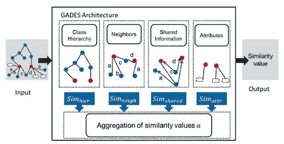

语义相似度是多种因素的综合。来自 GADES 的论文(见参考文献)

# 等级相似性

用于计算语义相似性的第一个也是最流行的资源特征是分级相似性，其测量对象在本体分级树中有多远以及它们的最低共同祖先(LCA)有多深。直觉是，相似的实体有一个深刻而密切的最低共同祖先。计算等级距离有两种常用方法。两者都使用 LCA 和距离“d ”,距离“d”是仅考虑 *rdfs:subClassOf* 和 *rdf:type* 关系(即边)的两个节点之间的跳数。

# Dtax

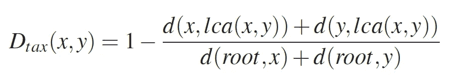

# 二苯砜

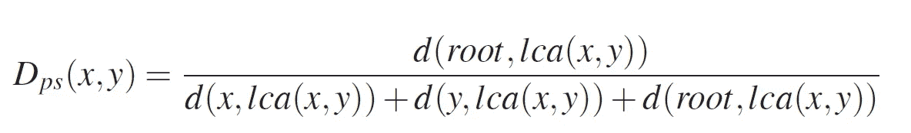

使用一个或另一个没有明显的优势，两者在语义相似性框架中同样受欢迎。

相似度只是距离的倒数，或者换句话说:

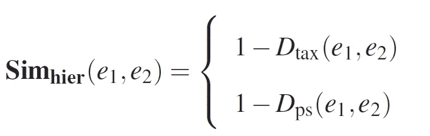

# 邻域相似性

告诉我你的邻居，我会告诉你你是谁。邻域相似性基于定义其邻域的关系来测量两个实体之间的相似性。

邻域是关系实体对 N(e)的集合，其实体在源实体(e)的一跳距离处。

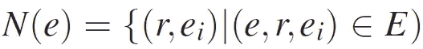

对于每个邻居，我们需要使用知识图(即本体)的关系和类层次中编码的知识来考虑邻居实体(e)和边的关系类型(r)

让我们称之为“邻居对”。p =(r；e)。由于实体的邻域是邻域对的集合，为了计算实体 e1 和 e2 的邻域的相似性，我们首先需要知道如何比较两个个体对的相似性:P1 =(R1；e1)和 p2 =(R2；e2)。

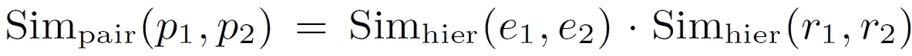

既然我们知道如何计算邻域对的相似性，我们就可以计算两个实体的整个邻域之间的相似性。
为了聚集两个邻域之间的相似性，GADES 使用度量来组合配对比较。

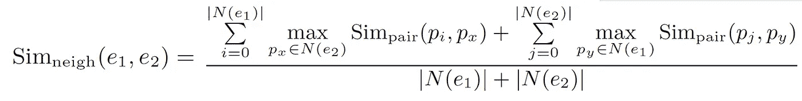

编写相同计算的另一种方法是:

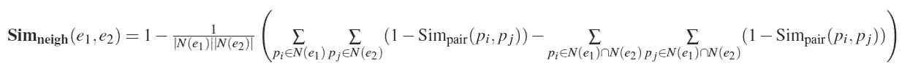

# 共享信息的特殊性

这里的直觉是，两个实体共享的特定信息越多，我们就会认为它们越相似。同样，一个概念出现的次数越少，它就被认为越具体。如果两个实体在语料库中被类似地使用，则它们被认为共享大量信息。将知识图视为语料库，由两个实体 x 和 y 共享的信息与在它们的邻域中 x 和 y 在一起的实体的数量成正比，即，x 和 y 在实体的邻域中的同现。

让我们把它放入一个公式:
首先让我们定义:事件(e)为在其邻域中有 e 的实体的集合。

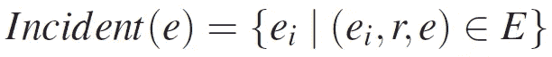

有了它，我们可以计算相似性:

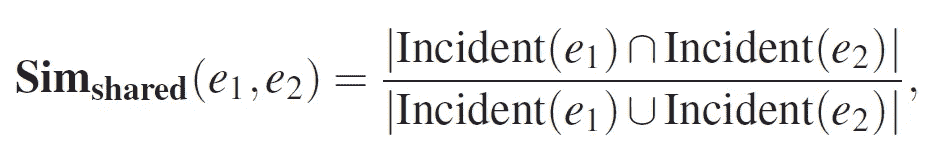

该公式的分母有助于降低关于抽象或非信息实体的相似性，这些实体在语料库中是常见的，因此不被认为是特定的。

# 属性相似度

知识图中的实体不仅与其他实体相关，还通过数据类型属性与属性相关，例如温度、日期等。这些属性可以告诉我们很多关于给定上下文中实体的相似性。例如，查看出生日期属性可以在长期投资建议的上下文中驱动相似性计算。

GADES 只考虑共享属性，即通过相同的 datatype 属性连接到实体的属性(例如，DateOfBirth 是 *rdfs:subClassOf* 和 *rdf:type* human *)* 实体的所有实例的共享属性)。
考虑到属性可以与领域相似性度量进行比较(例如，向量的余弦、曼哈顿、欧几里德距离)，GADES 没有描述用于比较各种属性的特定度量。根据领域的不同，专家将为每种类型的属性选择一个相似性度量。

# 总体相似性

上面描述的每个相似性就其本身而言都是有价值的，但是 GADES 的力量来自于将所有的相似性组合成一个单一的度量α。
GADES 使用聚合函数的组合来组合个体相似性度量以产生相似性值。不同聚集函数β和γ的详细定义以及组合它们的三角范数 T 是特定于域的。

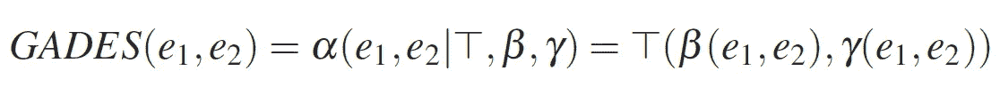

摘自论文:[语义相似性度量框架
提高知识图质量](https://publikationen.bibliothek.kit.edu/1000073179/4294222)

例如，在长期投资推荐用例的上下文中，领域专家可能决定放大属性相似性，因为客户的年龄是要考虑的首要因素，所以 T 的系数表达了这一点。

# GADES 实施

GADES 是一篇学术论文,不幸的是没有商业实现。下面的存储库包含一个 java [实现](https://github.com/collarad/GADES)。

# 推荐的相似性

协同过滤(CF)推荐算法使用某种相似性函数来预测用户行为，即推荐。这可以是用户行为之间的相似性，或者是项目之间的相似性，因为它们以相似的模式被喜欢或不喜欢。因为相似性是根据评级矩阵计算的，所以它是设计行为，并不反映所涉及项目的语义。有时，这正是业务对算法的期望，但在其他情况下，忽略语义会产生没有意义或没有反映业务最佳利益的结果。用语义相似性补充行为相似性并将其插入推荐引擎可以提高其性能，因为它将为企业和客户产生更有效的结果。

# 项目-项目协同过滤

Item-Item CF 查找与用户已经评分的项目相似的项目，并推荐最相似的项目。项目-项目 CR 相似性是行为性的，即人们如何根据喜欢和不喜欢来对待两个相同的项目。通过对目标用户在这些相似项目上的评级(V)进行加权平均来计算预测(即，推荐)。换句话说，为了计算用户 u 对项目 I 的预测，我们计算用户对类似于 I 的项目给出的评级的总和。每个评级由项目 I 和 j 之间的相应相似性 si，j 加权。

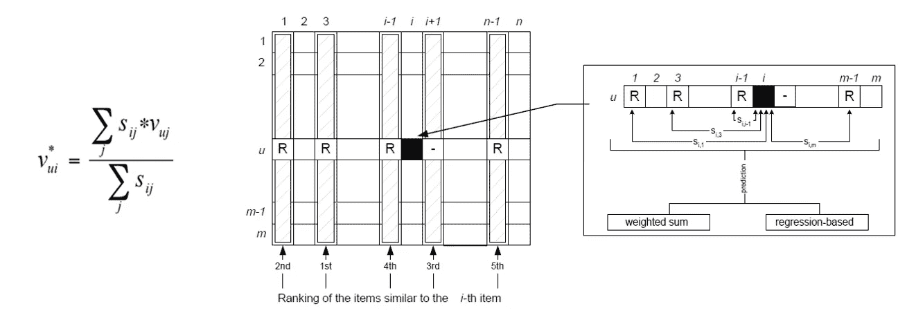

项目-项目协同过滤

为了学习更多关于算法的知识，我推荐阅读原始的[论文](http://files.grouplens.org/papers/www10_sarwar.pdf)，它清晰易懂。
该算法的一个好处是相似度计算是可插拔的。最初的[论文](http://files.grouplens.org/papers/www10_sarwar.pdf)建议使用皮尔逊-r 相关或余弦相似度，但它对任何其他有意义的相似度计算都是开放的。我们建议使用从评级矩阵中提取的行为相似性与使用 GADES 从知识图中提取的语义相似性的组合。

# 用户-用户

用户-用户协同过滤可能是最流行的 CF 推荐算法，可能是因为它很容易理解。
从评分矩阵中，我们找到在喜好和厌恶方面与目标用户行为相似的用户，然后我们对他们的评分进行加权平均，对他们进行排序，并使用最佳列表作为推荐。

这里关于语义的问题是，相似性是用户行为之间的，而不是属于目标领域的概念之间的，所以开箱即用，我们不能将语义相似性插入到算法中。为了解决这个问题，我们必须将评级矩阵映射到属于目标领域但仍然保留用户行为的东西。论文[基于语义的协同过滤增强推荐](https://www.researchgate.net/publication/269633066_Semantic-based_Collaborative_Filtering_for_Enhancing_Recommendation)提出了一种方法。从评分矩阵中，我们创建了一个基于语义相似度和[传播激活](https://en.wikipedia.org/wiki/Spreading_activation)算法的兴趣矩阵(IS)。
IS(C j，u)和 IS(C j，v)分别是用户 u 和 v 的简档中与概念 j 相关联的兴趣得分。现在，我们可以计算相似性(或距离)并将其插入用户-用户算法。

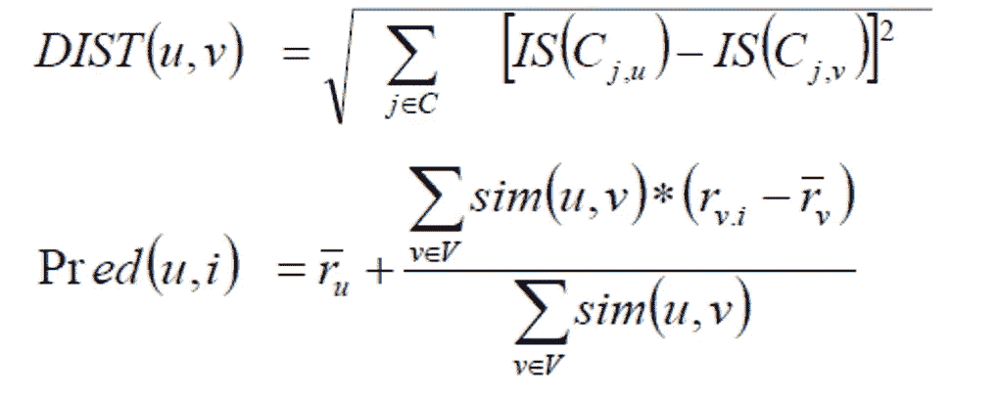

来自论文:[一个语义相似性度量的框架来增强知识
图的质量](https://publikationen.bibliothek.kit.edu/1000073179/4294222)

# 学术研究成果

我想强调几篇相关学术论文中的两个结果。

*   在精确度、召回率和 F1 指标方面，使用行为和语义相似性的组合，CF 算法的性能得到显著提高。

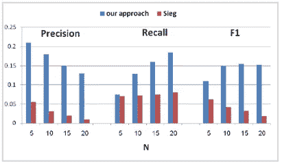

摘自论文:[语义相似度度量框架增强知识
图质量](https://publikationen.bibliothek.kit.edu/1000073179/4294222)

*   GADES 在准确性方面表现出最佳的性能结果。

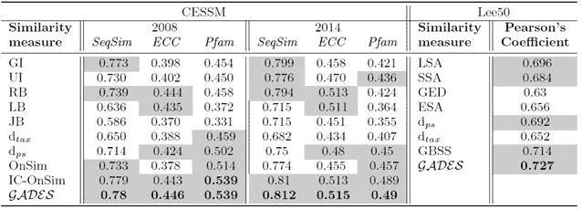

来自 GADES 的论文(见参考文献)

下表显示了在 CESSM 2008 和 2014 上采用黄金标准 ECC、Pfam 和 SeqSim 的最新相似性度量和 GADES 之间的皮尔逊系数。
我们观察到，在 2008 年和 2014 年两个版本的知识图中，GADES 是与三个金标准度量最相关的度量。

# 我们的实验

第一步是实现项目-项目 CF 算法的 python jupyter 记事本。我们用于健全性测试的[数据集](https://datasets.imdbws.com/)是来自 iMDB 数据库的电影用户评级的集合。我们基于流派、演员和导演实现了一个简单的语义相似度，并将其与上述权重为 20%的行为相似度相结合。

我们看到性能平均值**精度**提高了 0.935897，**召回率**提高了 0.941935，但最重要的是，我们看到推荐的结果共享了一个类别。在现实生活中，这可能不是企业想要的电影推荐引擎，但对于其他用例，如产品推荐，这样的行为是可取的。

# 结论

语义相似度可以使用 GADES 等方法从知识图中有效地计算出来。一旦计算出来，它就可以用于许多数据科学任务。在本文中，我们展示了如何在推荐的上下文中使用语义相似性，通过增加语义的行为相似性，使推荐更好地符合业务和客户的最佳利益。

# 参考

[基于语义的协同过滤增强推荐](https://www.researchgate.net/publication/269633066_Semantic-based_Collaborative_Filtering_for_Enhancing_Recommendation)

[加迪斯](https://github.com/RDF-Molecules/GADES)

[增强知识的语义相似性度量框架
图形质量](https://publikationen.bibliothek.kit.edu/1000073179/4294222)