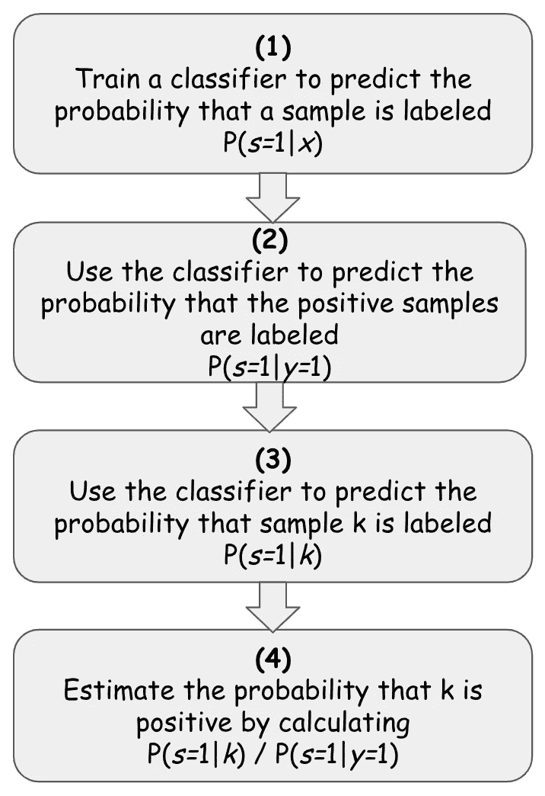

# 未标记数据的半监督分类(PU 学习)

> 原文：<https://towardsdatascience.com/semi-supervised-classification-of-unlabeled-data-pu-learning-81f96e96f7cb?source=collection_archive---------7----------------------->


布鲁诺·马丁斯在 [Unsplash](https://unsplash.com?utm_source=medium&utm_medium=referral) 上的照片

# 当你只有几个正样本时，如何对未标记数据进行分类

假设您有一个支付交易的数据集。一些交易被标记为欺诈，其余的被标记为真实，您需要设计一个模型来区分欺诈和真实的交易。假设您有足够的数据和良好的特征，这似乎是一个简单的分类任务。但是，假设只有 15%的数据被标记，并且被标记的样本仅属于一个类，因此您的训练集由 15%被标记为真实的样本组成，而其余的样本未被标记，并且可能是真实的或欺诈的。你将如何对它们进行分类？需求的这种扭曲是否只是将这项任务变成了一个无人监督的学习问题？嗯，不一定。

这个问题通常被称为 PU(阳性和未标记)分类问题，应该首先与两个类似的常见“标记问题”区分开来，这两个问题使许多分类任务变得复杂。第一个也是最常见的标签问题是*小训练集*的问题。虽然你有大量的数据，但实际上只有一小部分是有标签的。这个问题有很多种类，也有不少具体的训练方法。另一个常见的标记问题(经常与 PU 问题混淆)涉及我们的训练数据集被完全标记的情况，但是它只包含*一个类*。例如，假设我们只有一个非欺诈性交易的数据集，我们需要使用这个数据集来训练一个模型，以区分(类似的)非欺诈性交易和欺诈性交易。这也是一个常见的问题，通常被视为无监督的离群点检测问题，尽管在 ML 环境中也有相当多的工具广泛可用，专门用于处理这些场景(OneClassSVM 可能是最著名的)。

相比之下，PU 分类问题是一种涉及训练集的情况，其中只有*部分数据被标记为正，而其余部分未被标记，可能是正的也可能是负的*。例如，假设你的雇主是一家银行，它可以为你提供大量交易数据，但只能确认其中一部分是 100%真实的。我将在这里使用的例子涉及到一个关于假钞的类似场景。它包括 1200 张钞票的数据集，其中大部分没有标签，只有一部分被确认为真实的。虽然 PU 问题也很常见，但与前面提到的两个分类问题相比，它们通常很少被讨论，而且很少有实际操作的例子或库可以广泛使用。

这篇文章的目的是提出一种可能的方法来解决我最近在一个分类项目中使用的 PU 问题。它基于查尔斯·埃尔坎和基思·诺托写的论文“仅从正面和未标记的数据中学习分类器”(2008)，以及由[亚历山大·德鲁因](https://github.com/aldro61)写的一些代码。尽管在科学出版物中有更多的 PU 学习方法(我打算在以后的文章中讨论另一种相当流行的方法)，Elkan 和 Noto 的(E & N)方法非常简单，可以很容易地用 Python 实现。

# 一点理论(请耐心听我说……)


照片由[安托万·道特里](https://unsplash.com/@antoine1003?utm_source=medium&utm_medium=referral)在 [Unsplash](https://unsplash.com?utm_source=medium&utm_medium=referral) 上拍摄

E&N 本质上声称，给定一个数据集，其中我们有正的和未标记的数据，某个样本为正的概率[ P( *y* =1| *x* )]等于该样本被标记的概率[P( *s* =1| *x* )]除以在我们的数据集中正样本被标记的概率[P( *s* =1| *y 【T19*

如果这种说法是真的(我不打算证明或捍卫它——你可以阅读论文本身的证明，并用代码进行实验)，那么它似乎相对容易实现。这是因为虽然我们没有足够的标记数据来训练分类器来告诉我们样本是阳性还是阴性，但在 PU 场景中，我们有足够的标记数据来告诉我们*阳性样本是否可能被标记*，并且根据 E & N，这足以估计它是阳性的可能性有多大。

更正式地说，给定一个只有一组标记为正的样本的未标记数据集，如果我们估计**P(*s*= 1 |*x*)/P(*s*= 1 |*y*= 1)**，我们就可以估计出未标记样本 *x* 为正的概率。幸运的是，我们可以根据以下步骤使用几乎任何基于 sklearn 的分类器来估计这一点:



**(1)** 在使用无标签指示器作为目标的同时，在包含有标签和无标签数据的数据集上安装分类器 *y* 。以这种方式拟合分类器将训练它预测给定样本 *x* 被标记的概率— P( *s* =1| *x* )。

**(2)** 使用分类器预测数据集中***已知阳性样本*被标记的概率，从而预测结果将代表阳性样本被标记为—P(*s*= 1 |*y*= 1 |*x*)的*概率***

**计算这些预测概率的平均值，这就是我们的**P(*s*= 1 |*y*= 1)***。***

**已经估计了 P( *s* =1| *y* =1)，为了根据 E & N 预测数据点 *k* 为正的概率，我们需要做的就是估计 P( *s* =1| *k* )或它被标记的概率，这正是我们训练的分类器(1)知道如何做的。**

****(3)** 用我们在 **(1)** 上训练过的分类器来估计 *k* 被标注的概率或者**P(*s*= 1 |*k*)**。**

****(4)** 一旦我们估算出了**P(*s*= 1 |*k*)**，我们实际上就可以将 *k* 除以第**P(*s*= 1 |*y*= 1)**(已经在第**(2)**步估算过了)**

# **现在让我们对此进行编码和测试**

**上述步骤 1-4 可以按如下方式实施:**

```
****# prepare data**x_data = *the training set*
y_data = *target var (1 for the positives and not-1 for the rest)***# fit the classifier and estimate P(s=1|y=1)**classifier, ps1y1 = 
       fit_PU_estimator(x_data, y_data, 0.2, Estimator())**# estimate the prob that x_data is labeled P(s=1|X)**predicted_s = classifier.predict_proba(x_data)**# estimate the actual probabilities that X is positive
# by calculating P(s=1|X) / P(s=1|y=1)**predicted_y = estimated_s / ps1y1**
```

**先说这里的主招: *fit_PU_estimator()* 方法。**

***fit_PU_estimator()* 方法完成两个主要任务:它将您选择的分类器拟合到阳性和未标记训练集的样本上，然后估计阳性样本被标记的概率。相应地，它返回拟合的分类器(学会估计给定样本被标记的概率)和估计的概率**P(*s*= 1 |*y*= 1)**。之后我们要做的就是求 P( *s* =1| *x* )或者说 *x* 被标注的概率。因为这就是我们的分类器被训练要做的，我们只需要调用它的 *predict_proba()* 方法。最后，为了对样本 *x* 进行实际分类，我们只需要将结果除以我们已经找到的**P(*s*= 1 |*y*= 1)**。这可以用代码表示为:**

***fit_PU_estimator* ()方法的实现本身是不言自明的:**

**为了测试这一点，我使用了[钞票认证数据集](http://archive.ics.uci.edu/ml/datasets/banknote+authentication)，它基于从真钞和伪钞图像中提取的 4 个数据点。我首先在带标签的数据集上使用分类器，以便设置基线，然后移除 75%样本的标签，以便测试它在 P & U 数据集上的表现。正如输出所示，这个数据集确实不是最难分类的数据集之一，但是您可以看到，虽然 PU 分类器仅“知道”大约 153 个阳性样本，而所有其余的 1219 个样本都是未标记的，但是与具有所有可用标签的分类器相比，它表现得相当好。然而，它确实丢失了大约 17%的召回，因此丢失了相当多的真阳性。然而，当这是我们所拥有的一切时，我相信这些结果与其他选择相比是相当令人满意的。**

```
****===>> load data set <<===**data size: (1372, 5)**Target variable (fraud or not)**:
0    762
1    610***===>> create baseline classification results <<===*****Classification results:**f1: 99.57%
roc: 99.57%
recall: 99.15%
precision: 100.00%***===>> classify on all the data set <<===*****Target variable (labeled or not)**:
-1    1219
1     153**Classification results**:f1: 90.24%
roc: 91.11%
recall: 82.62%
precision: 99.41%**
```

**几个重要的笔记。首先，这种方法的性能很大程度上取决于数据集的大小。在这个例子中，我使用了大约 150 个阳性样本和大约 1200 个未标记的样本。这远远不是这种方法的理想数据集。例如，如果我们只有 100 个样本，我们的分类器就会表现很差。第二，如附件所示，有几个变量需要调整(例如要留出的样本大小、用于分类的概率阈值等)，但最重要的可能是所选择的分类器及其参数。我选择使用 XGBoost，因为它在具有很少特性的小数据集上表现相对较好，但是需要注意的是，它不会在每个场景中都表现最佳，并且测试正确的分类器也很重要。**

**笔记本在[这里](https://github.com/a-agmon/pu-learn/blob/master/PU_Learning_EN.ipynb)有售。**

**尽情享受吧！**