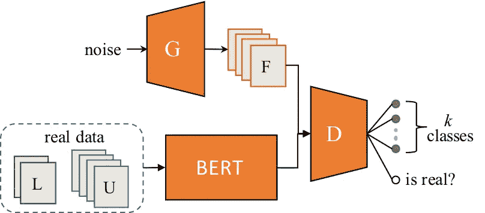
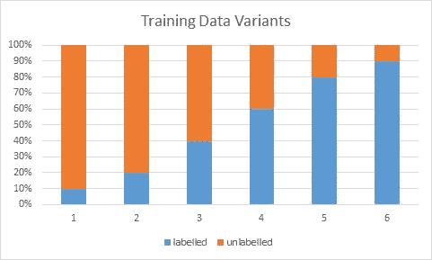
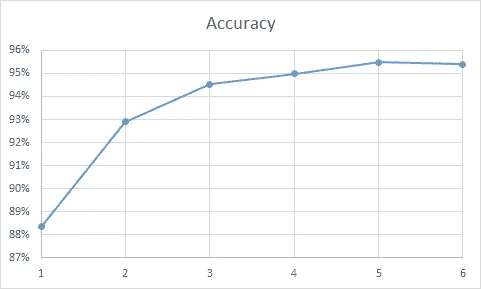

# 基于 GAN-BERT 的半监督意图分类

> 原文：<https://towardsdatascience.com/semi-supervised-intent-classification-with-gan-bert-934d8659bca2?source=collection_archive---------21----------------------->

## 基于 GAN-BERT 的半监督学习方法在 CLINC150 数据集上的意图分类

甘伯特建筑。来源:" [GAN-BERT:健壮文本分类的生成式对抗学习](https://www.aclweb.org/anthology/2020.acl-main.191.pdf)"

> 有没有可能对 150 个目标类别进行文本分类，每个类别只使用 10 个标记样本，但仍能获得良好的性能？

从那个简单的问题开始，我开始做研究，以便回答那个问题。花了几个小时后，我终于和甘伯特在一起了。甘伯特是什么？我用甘博特做了什么实验？在本文中，我将尝试简要介绍 GAN-BERT，并使用 [CLINC150 数据集](https://www.aclweb.org/anthology/D19-1131.pdf)实现其意图分类。

在自然语言处理(NLP)领域， [BERT 或来自 Transformers](https://github.com/google-research/bert) 的双向编码器表示是一种基于 Transformers 架构的众所周知的技术，用于执行广泛的任务，包括文本分类。然而，当有“足够”的标记训练数据要利用时，这种技术可以很好地执行，而获得标记数据是耗时且昂贵的过程。对此的潜在解决方案是使用半监督学习方法。

半监督学习是机器学习领域中的一种方法，它在训练过程中结合了标记数据和未标记数据。目标与监督学习方法相同，即在给定具有若干特征的数据的情况下预测目标变量。当我们没有这么多标记数据，而我们的模型需要大量训练数据才能表现良好时，这种方法是至关重要的。

最近在 2020 年 7 月，一篇名为[“GAN-BERT:具有一堆标记示例的健壮文本分类的生成对抗学习”](https://www.aclweb.org/anthology/2020.acl-main.191.pdf)的论文，试图在生成对抗设置中扩展具有未标记数据的 BERT 类架构的微调。在高层，他们试图从 [SS-GAN](http://papers.nips.cc/paper/6125-improved-techniques-for-training-gans.pdf) (半监督 GAN)的角度丰富 BERT 微调过程。

> “在本文中，我们在生成性对抗设置中使用未标记数据来扩展 BERT 训练。特别是，我们在所谓的 GAN-BERT 模型中，从 SS-GAN 的角度丰富了 BERT 微调过程

# 甘伯特

这种体系结构结合了 BERT 和 SS-GAN 的能力来进行文本分类。生成器通过从高斯分布中提取 100 维噪声向量的输入来产生“假”示例。鉴别器是在 BERT 上的 MLP，它接收输入向量或者是由发生器产生的假向量或者是来自 BERT 产生的真实数据的向量。鉴别器的最后一层是 softmax 层，它输出 logits 的 k+1 维向量，其中 k 是数据集中类的数量。这里，真实数据被分成两部分，它们被标记为(L)和未标记的(U)数据。

甘伯特建筑。来源:" [GAN-BERT:健壮文本分类的生成式对抗学习](https://www.aclweb.org/anthology/2020.acl-main.191.pdf)"

鉴别器旨在对输入是否为真实实例进行分类。如果它预测输入是真实的实例，那么它必须预测输入属于哪个类。

训练过程试图优化**两个竞争损耗**，它们是鉴别器损耗和发电机损耗。**鉴别器损耗**是另外两个损耗的总和:监督损耗和非监督损耗。监督损失测量将错误的类别分配给原始 k 个类别中的真实示例的误差，而非监督损失测量不正确地将真实(未标记的)示例识别为假的并且不识别假的示例的误差。**发电机损耗**也是另外两个损耗求和的结果:特征匹配和无监督损耗。特征匹配损失旨在确保生成器应该产生其在输入到鉴别器时提供的中间表示与真实表示非常相似的示例，而无监督损失测量由鉴别器正确识别的虚假示例引起的误差。

基思·约翰斯顿在 [Unsplash](https://unsplash.com?utm_source=medium&utm_medium=referral) 上拍摄的照片

在训练期间，每一类中的样本以 *log* (2|U|/|L|)的因子被复制，以保证在每一批中存在一些标记的实例，从而避免由于对抗训练的无监督成分而导致的发散。在推理过程中，生成器被从体系结构中丢弃，而保留其余部分。

> 这意味着相对于标准的 BERT 模型，在推断时没有额外的成本。

# 实验设置

在本实验中，使用了 [CLINC150](https://www.aclweb.org/anthology/D19-1131.pdf) 数据集。该数据集由 10 个领域的 150 个意图类组成。提供的数据有 4 种变型:*满*、*小*、*不平衡*、 *OOS+、*这里用的是*满*变型*。*对于每个意图，有 100 个训练话语、20 个验证话语和 30 个测试话语。实际上，除了 150 个意向范围内类之外，该数据还提供了范围外类(OOS)。但是，在这个实验中，我只关注范围内的类预测。

由于实际的 CLINC150 数据集不是为半监督学习设置而构建的，因此在这里，我尝试用 6 种不同的训练数据进行实验。对于每个变体，训练数据被分成标记的和未标记的集合。第一个变体由 10%标记的和 90%未标记的数据集组成。因为训练数据中的话语总数是 100，所以对于第一种变型，有标记集合有 10 个话语，无标记集合有 90 个话语。

训练数据的变量。来源:作者的财产

我对所有训练数据变量使用完全相同的参数设置。唯一的区别是训练时期的数量。我使用 *20、18、16、14、12、10* 个历元数分别表示第一个到最后一个变量。

# 实验结果

CLINC150 论文上的结果表明，通过利用 BERT，他们在测试数据集上获得了 **96.2%的准确率**。这里使用相同的测试数据集是跨越 6 个训练数据变化的 GAN-BERT 的结果。

跨 6 个训练数据变量的测试数据集的准确性。来源:作者的财产

我们可以看到，在训练过程中，即使在每个意图中仅使用 10 个标记的话语，GAN-BERT 也能够给出合理的性能。甘伯特的性能随着标记话语数量的增加而增加。第四、第五和第六变型的性能彼此相似。这表明，即使仅使用 60%的标记训练数据，GAN-BERT 的性能也类似于使用 80%甚至 90%的标记训练数据训练的模型。

# 最后的话

GAN-BERT 在多文本分类任务的半监督学习中具有很大的潜力。仅给定有限的标记训练数据，它表现良好。然而，这只是在文本分类任务中处理有限标记训练数据的方法之一。还有另一种方法叫做少镜头文本分类。如果你有更多的兴趣，你可以阅读这篇[论文](https://arxiv.org/pdf/2003.04807.pdf)，它也使用 CLINC150 作为他们的训练数据。

> 您可以在这里找到本文[中使用的所有代码。](https://github.com/louisowen6/GAN_BERT_CLINC150)

# 关于作者

Louis Owen 是一名数据科学爱好者，他总是渴望获得新知识。他获得了最后一年的全额奖学金，在印尼顶尖大学 [*的万隆技术学院*](https://www.itb.ac.id/) 攻读数学专业。

Louis 曾在多个行业领域担任分析/机器学习实习生，包括 OTA ( [*Traveloka*](https://www.linkedin.com/company/traveloka-com/) )、电子商务( [*Tokopedia*](https://www.linkedin.com/company/pt--tokopedia/) )、fin tech([*Do-it*](https://www.linkedin.com/company/doitglotech/))、智慧城市 App ( [*Qlue 智慧城市*](https://www.linkedin.com/company/qluesmartcity/) )，目前在*世界银行担任数据科学顾问。*

*查看路易斯的网站，了解更多关于他的信息！最后，如果您有任何疑问或需要讨论的话题，请通过 LinkedIn 联系 Louis。*