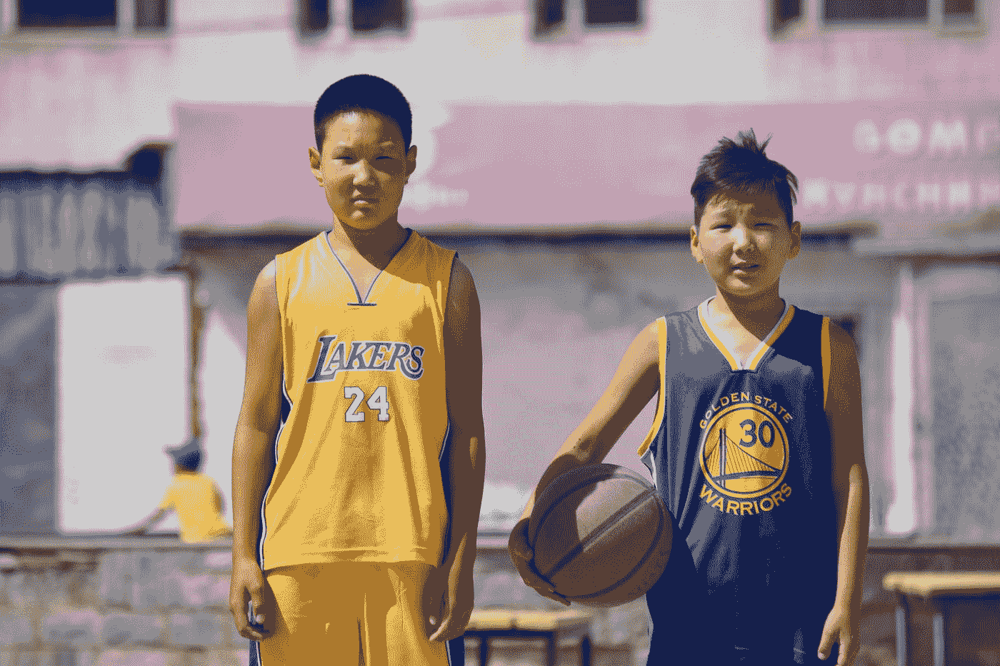
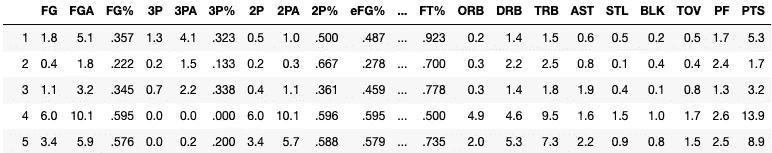

# 基于 K 均值聚类的半监督学习

> 原文：<https://towardsdatascience.com/semi-supervised-learning-with-k-means-clustering-6e837158c54a?source=collection_archive---------19----------------------->

## 机器学习

## 有限数据标签下 NBA 球员位置预测的半监督学习案例研究。



照片由[бодьсанал·布吉](https://unsplash.com/@bodisanal?utm_source=medium&utm_medium=referral)在 [Unsplash](https://unsplash.com?utm_source=medium&utm_medium=referral) 拍摄

有监督学习和无监督学习是机器学习中的两大任务。当所有实例的输出可用时，使用监督学习模型，而当我们没有“真实标签”时，应用无监督学习。

尽管无监督学习的探索在未来的研究中具有巨大的潜力，但有监督学习仍然主导着该领域。然而，当我们的数据中没有足够的标记样本时，我们通常需要建立一个监督学习模型。

在这种情况下，可以考虑半监督学习。其思想是基于非监督学习过程的输出来构建监督学习模型。

我想举一个简单的例子。

## 问题:我们可以根据 NBA 球员的比赛数据来对他们的位置进行分类吗？

我收集了 2018-2019 赛季 NBA 球员的场均数据。球员的位置被定义为传统的篮球位置:控球后卫(PG)、得分后卫(SG)、小前锋(SF)、大前锋(PF)和中锋(C)。

在建模过程之前，我对数据集做了一些预处理。首先，去掉每场比赛上场时间不到 10 分钟的球员。然后，用 0 填充 NA 值(比如中锋球员从来不投三分球)。

```
df_used = df_num.loc[df.MP.astype('float32') >= 10]
df_used.fillna(0,inplace=True)
```

预处理后，数据如下所示:

```
df_used.head()
```



数据头

然后，我将数据分离到训练集和测试集。

```
from sklearn.model_selection import train_test_split
X_train, X_test, y_train, y_test = train_test_split(df_used, labels_)
```

## 监督学习(给出所有玩家的位置)

如果所有标签(玩家位置)都给了，那就是一个简单的监督分类问题。我用一个简单的逻辑回归模型来拟合训练数据集。

```
from sklearn.linear_model import LogisticRegression 
from sklearn.pipeline import Pipeline
from sklearn.preprocessing import StandardScalerpipeline = Pipeline([
        ("scaler", StandardScaler()),
        ("log_reg", LogisticRegression()),
    ])pipeline.fit(X_train, y_train)
```

我在测试数据集上评估了这个模型。

```
pipeline.score(X_test, y_test)
```

这个过程给出 0.644，这意味着 64.4%的预测是正确的。从这个结果中，我们知道分类器的改进空间非常大。然而，在本文中，我并不关注分类器的开发。

我将讨论数据标签仅部分可见的情况。

## 半监督学习(只给出 100 个玩家的位置)

如果只允许我看到训练数据中 100 个球员的位置信息，会对模型的性能产生怎样的变化？有许多策略可以用来选择 100 个玩家作为分类器的输入。

第一种策略是随机选择 100 个玩家，比如前 100 个玩家。我检查了只在这个子集上训练的逻辑回归模型的性能。

```
n_labeled = 100pipeline.fit(X_train[:n_labeled], y_train[:n_labeled])
pipeline.score(X_test, y_test)
```

这次我只得到 56.8%的准确率。这是意料之中的，因为我只看到了真实标签的一个子集。

然而，我们可以通过选择 100 个标签的不同子集来提高性能吗？答案是肯定的。

第二种策略是应用无监督学习过程来对整个训练数据集中的数据进行聚类，并暴露每个聚类的代表的标签。这样，我们可以假设在聚类空间中彼此接近的数据点应该有很高的机会拥有相同的标签。

换句话说，比赛数据相似的球员应该在场上打同样的位置。

```
from sklearn.cluster import KMeansk=100
kmeans = KMeans(n_clusters=k)
X_dist = kmeans.fit_transform(X_train) 
representative_idx = np.argmin(X_dist, axis=0) 
X_representative = X_train.values[representative_idx]
```

在代码中，X_dist 是到聚类质心的距离矩阵。representative_idx 是最接近每个聚类质心的数据点的索引。

在选择了特征空间中的代表之后，我们收集了这些数据点的真实标签。这里，我只需要从原始数据中提取标签。

```
y_representative = [list(y_train)[x] for x in representative_idx]
```

但是请注意，实际情况是我们不知道有什么真正的标签，所以需要手动标注这些选中的数据点。

让我们来检查在这个训练数据子集上训练的模型的性能。

```
pipeline.fit(X_representative, y_representative)
pipeline.score(X_test, y_test)
```

我得到了 59.6%的准确率！尽管它不能与在整个训练集上训练的模型相比，但它比随机选择的 100 个数据点要好。

## 讨论

随着篮球的发展，根据球员的比赛数据来判断他们的位置变得越来越困难。这就是为什么我们只有 60%左右的准确率。

尽管在聚类质心上训练的模型的性能比在随机数据点上训练的模型的性能好，但是改进是有限的。这可以解释为，在目前的 NBA 中，同一位置的球员的比赛数据可能会有很大的差异。

# 参考资料:

1.  [用 scikit 动手机器学习——学习 keras 和 tensorflow](https://github.com/quantumahesh/Hands-On-Machine-Learning-Book/blob/master/Hands-on-Machine-Learning.pdf)
2.  [篮球参考。](https://www.basketball-reference.com/)

希望这篇短文对你有用！干杯！