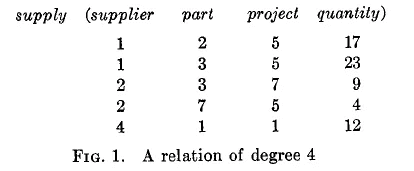
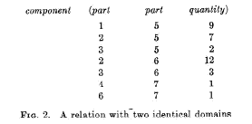
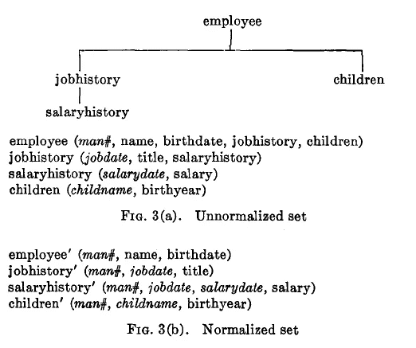
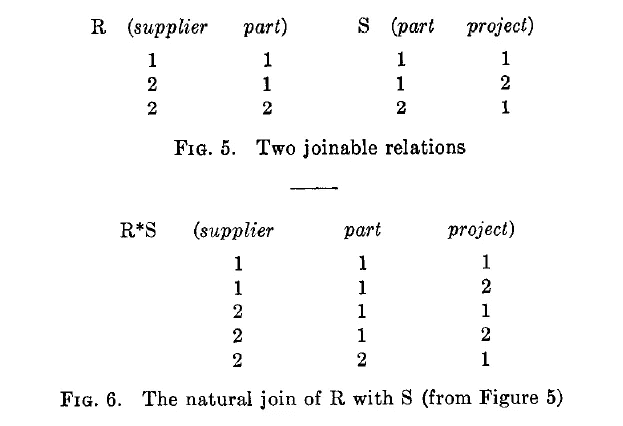

# 数据科学的开创性论文:大型共享数据库的关系模型

> 原文：<https://towardsdatascience.com/seminal-papers-in-data-science-a-relational-model-for-large-shared-data-banks-892fccf97fd1?source=collection_archive---------34----------------------->

## 50 年后，回顾了 e . f . Codd 1970 年论文中的一些主要概念，这些概念为关系数据库和 SQL 奠定了基础

弗兰基·查马基在 [Unsplash](https://unsplash.com?utm_source=medium&utm_medium=referral) 上拍摄的照片

即使 NoSQL[越来越受欢迎，大多数公司仍然在使用某种形式的基于 SQL 的关系数据库管理系统](https://scalegrid.io/blog/2019-database-trends-sql-vs-nosql-top-databases-single-vs-multiple-database-use/)。虽然 SQL(当时叫做 SEQUEL)是由 IBM 的 Donald D. Chamberlain 和 Raymond F. Boyce 在 1974 年首次引入的，但是他们的工作是建立在 Edgar F. Codd 的思想之上的。Codd 是另一位 IBM 计算机科学家，他在 1970 年提出了数据库管理的关系模型。在这篇文章中，我讨论了 Codd 有影响力的论文中的一些主要观点，以及他的观点如何与我们现代使用 SQL 相关联。

## 关系

Codd 使用术语*关系*来描述他的模型的基石。该关系正式描述如下:

> 给定集合 S1，S2，…，Sn(不一定不同)，R 是这 n 个集合上的一个关系，如果它是一个 n 元组的集合，每个元组的第一个元素来自 S1，第二个元素来自 S2，等等。我们将 Sj 称为 R 的第 j 个域。如上所述，R 的阶数为 n。阶数为 1 的关系通常称为一元关系、阶数为 2 的关系、阶数为 3 的关系和阶数为 n 的关系。
> 
> -Codd (1970 年)

这个定义可能看起来完全陌生，但是如果您熟悉 SQL，那么 Codd 实际上是指一些非常熟悉的东西。Codd 建议可以基于以下条件将关系表示为数组:

> 代表 n 元关系 R 的数组具有以下属性:
> 
> (1)每行代表 r 的一个 n 元组。
> 
> (2)行的顺序并不重要。
> 
> (3)所有行都是不同的。
> 
> (4)列的排序是重要的——它对应于定义 R 的定义域的 S1，S2，…，Sn 的排序(然而，参见下面关于定义域有序和定义域无序关系的注释)。
> 
> (5)通过用相应域的名称对其进行标记，来部分传达每个列的意义。"
> 
> -Codd (1970 年)

Codd 还展示了下面图 1 中关系的数组表示示例。

Codd (1970 年)

乍一看，Codd 的关系数组表示与现代 SQL 表有许多相似之处。例如，上面的 4 度关系(或者，与四个域的关系)看起来类似于我们在 SQL 中称之为具有四列的表。这个表将被命名为 *supply* ，Codd 的域将对应于 SQL 列。SQL 表也类似于 Codd 的关系，因为行的顺序并不重要，行是不同的，每一列都有标签。

然而，Codd 的关系和 SQL 表之间有一个显著的区别:Codd 规定列的排序是重要的，而在 SQL 中肯定不是这样。这与 Codd 的断言是一致的，即关系的每一行都是一个*n*-元组——在 SQL 中，由于表的列顺序通常是不相关的，所以 SQL 表的每一行不需要都是元组。

那么，为什么 Codd 会提出在关系中需要列排序呢？他用论文中的图 2 给出了一个例子(见下文)。

Codd (1970 年)

在**图 2** 中的组件关系中，Codd 呈现了两个域(列)同名的情况——*part*。为了跟踪这两个*零件*列，为这些列分配一个固定的顺序是有意义的。虽然 Codd 在 1970 年的论文中认为这是一个合理的问题，但现在情况不同了，因为现代 SQL 数据库不允许同一个表中的两列具有相同的名称。

## 规范化集合

Codd 将规范化称为从关系中消除非简单域。但是 Codd 所说的非简单域是什么意思呢？

> “非原子值可以在关系框架内讨论。因此，一些域可能具有作为元素的关系。反过来，这些关系可以在非简单域上定义，等等。”
> 
> -Codd (1970 年)

在下面的**图 3(a)** 中，Codd 通过绘制一组非规范化关系的树形图示例进一步阐述。*员工*关系由简单域*男号*、*姓名*、*生日*和非简单域*工作历史*和*子女*组成。这些非简单域本身可以被认为是关系，包含它们自己的简单和非简单域。

Codd 注意到，这种非规范化的关系集不能用一个二维数组来表示。但归一化后，这组关系可以表示为**四个**二维数组(见**图 3(b)** )。

Codd (1970 年)

但是，究竟应该如何执行这种规范化呢？Codd 阐述了:

> 从树顶部的关系开始，取其主键，并通过插入该主键域或域组合来展开每个直接的从属关系。每个扩展关系的主键由扩展前的主键和从父关系复制下来的主键组成。现在，从父关系中删除所有非简单域，删除树的顶部节点，并对每个剩余的子树重复相同的操作序列。”
> 
> -Codd (1970 年)

因此，**图 3(a)** 中基于树的关系被转换为**图 3(b)** 中的规范化形式，去掉了非简单域，并且定义了一个主键来唯一标识每个关系中的行。主键可以是单个域(对于*雇员*关系为*人员#* )，也可以是多个域(对于*工作历史*关系为*人员#、工作日期*)。此外，每个关系可以使用 *man#* 域相互交叉引用。这几乎类似于现代 SQL 模式中的一个基本概念——一个表的主键可以作为另一个表的外键，因此，当表保持独立的二维数组时，可以保留表之间的关系。

## 连接

Codd 概述了许多可以在关系(表)上执行的操作，其中之一是连接。

> “假设我们有两个二元关系，它们有一些共同的领域。在什么情况下，我们可以将这些关系组合起来，形成一个三元关系，保留给定关系中的所有信息？”
> 
> -Codd (1970 年)

Codd 提供了两个关系 *R* 和 *S* 如何使用各自的 *part* 域连接的示例:

Codd (1970 年)

由于每个关系的*零件*域具有不唯一的值，由于相同的*零件*值可能导致*供应商*和*项目*的多个组合，因此 *R* 和 *S* 的“自然连接”包含的行(5)比两个表(3)中的任何一个都多。

如果我们假设 ***r*** 和 ***s*** 是 SQL 数据库中的表，下面的 SELECT 语句将产生与 Codd 的“自然连接”相同的结果:

**从 s.part = r.part 上的 r JOIN s 中选择供应商、r.part、项目；**

**SELECT * FROM r 自然联接 s；**

在 SQL 中，自然联接默认执行与内部联接相同的任务，但是每个表中同名的列只会出现一次。

## 关闭

Codd 1970 年的论文中还有很多我没有讨论的概念，但在这篇文章中我将把它们留在这里。如果您有兴趣进一步了解关系数据库和 SQL 的基础是如何形成的，请查阅下面参考资料中的文章。

## 参考

 [## 2019 年数据库趋势- SQL 与 NoSQL、顶级数据库、单数据库与多数据库使用

### 想知道哪些数据库是 2019 年的趋势？我们询问了数百名开发人员、工程师、软件架构师、开发人员…

scalegrid.io](https://scalegrid.io/blog/2019-database-trends-sql-vs-nosql-top-databases-single-vs-multiple-database-use/)