# 向 BigQuery 发送 Google Analytics 点击量数据

> 原文：<https://towardsdatascience.com/send-google-analytics-hit-level-data-to-bigquery-5093e2db481b?source=collection_archive---------17----------------------->

## 如何发送标准的谷歌分析点击量数据到 BigQuery？

由 [Graphicssc](https://pixabay.com/users/graphicssc-1426978/) ，来源 [pixabay](https://pixabay.com/illustrations/graphic-analytics-statistics-1142957/)

标准的谷歌分析不提供其点击量数据，我们必须购买 GA 360 来获得它，这是非常昂贵的。

在本指南中，我将帮助您建立一个数据管道，允许您在 BigQuery 中存储 GA 的数据。这将是一个命中水平的数据，不仅可以让你生成谷歌分析提供的所有报告，还可以应用先进的机器学习技术，将你的业务提升到一个新的水平。

# 为什么发送命中水平数据？

以下是存储 GA 命中水平数据的许多使用案例中的一些:

1.  **无数据抽样。**存储点击量数据让我们在不进行任何采样的情况下创建报告。对于那些每天流量都很大的网站来说，这是一个巨大的进步。
2.  **构建任何报告**。GA 报告有限。点击级别数据允许您使用任何配置构建包含任何分段的任何报告。
3.  **机器学习。**应用先进的机器学习技术，获得对你的业务有用的细分和预测。
4.  **数据仓库**将 GA 数据与其他营销活动数据联系起来，以便更全面地了解您的营销工作
5.  **可视化**。在你喜欢的任何地方可视化数据(不仅仅是在谷歌数据工作室)

**还有很多！**

# 数据管道

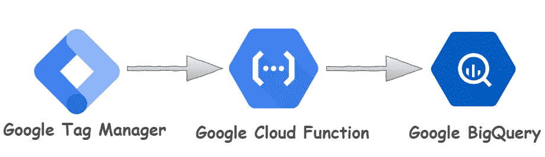

由 Muffaddal 创建的 GTM 到 BigQuery 数据管道

> 这难道不是一个简单的数据管道吗？确实是！

我们的 ELT 数据管道使用 Google Tag Manager 来获取发送到 GA 的 hit，使用 Cloud 函数来获取和处理从 Tag Manager 收到的 hit，使用 BigQuery 来存储数据。我们还将使用 Bigquery 的查询调度器进行原始数据转换。

我从 Simo Ahava 在 [tag monitor guide](https://www.simoahava.com/analytics/google-tag-manager-monitor/?utm_source=medium&utm_medium=referral&utm_campaign=muffaddal.qutbuddin&utm_content=send_ga_hit_data_to_bigquery) 上的帖子中获得了这个想法，并将其用于将 GA 的数据发送给 BigQuery。所以，如果你对监控你的标签感兴趣的话，一定要去看看

**注** : *我将使用 GTM 发送和谷歌云平台处理和存储点击数据，但这些工具不是强制性的。一旦您理解了数据如何在这些组件之间移动，任何技术栈都可以用来实现这个数据管道。而且如果你有兴趣探索 GCP 这边的东西我会推荐* [*谷歌的 GCP 课程*](https://bit.ly/2X4kefM) *。*

# 谷歌标签管理器

测量协议是一个向 Google Analytics 发送数据的 API。我们发送到 GA 的任何调用，无论是使用代码片段还是使用标记管理器，都将被发送到测量协议。我们的想法是捕获相同的击中，这将是测量协议，并将其发送到我们的数据仓库。

但是怎么做呢？嗯，Google analytics 对象提供了一个回调函数，当调用被发送到 GA 时触发该函数。使用该功能，我们可以访问正在发送的命中级别数据。该功能被称为`[customTask](https://www.simoahava.com/analytics/customtask-the-guide/?utm_source=medium&utm_medium=referral&utm_campaign=muffaddal.qutbuddin&utm_content=send_ga_hit_data_to_bigquery)`

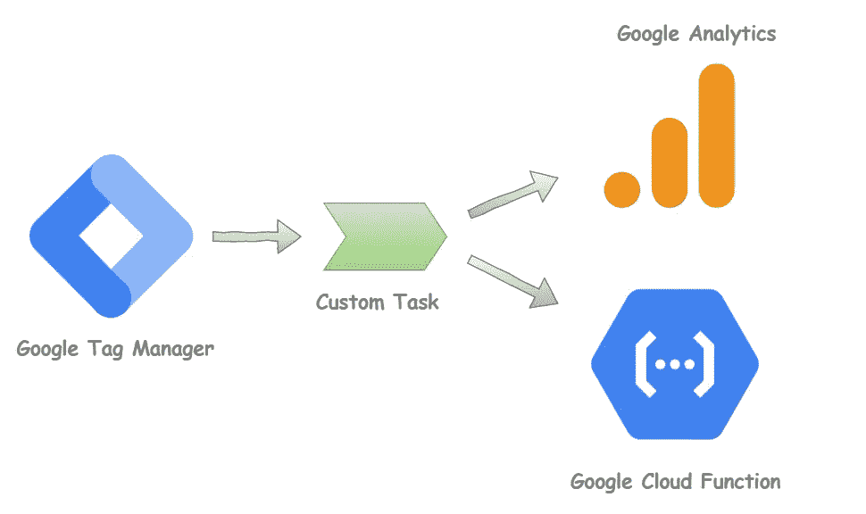

显示数据如何在自定义任务和其他工具之间移动的数据流图，由 Muffaddal

让我们使用自定义函数类型的变量在 Google 标签管理器中创建一个自定义任务句柄函数

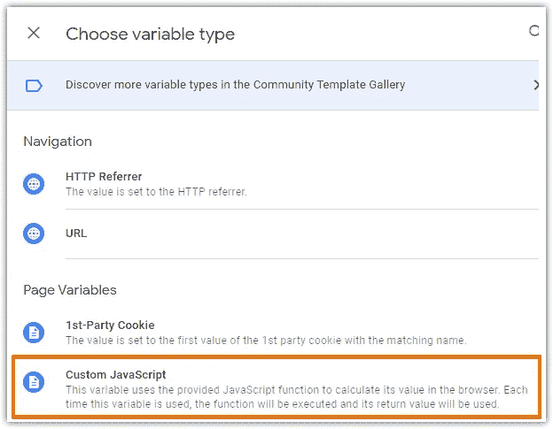

通过 Muffaddal 为 customTask 选择自定义 JavaScript

并按原样粘贴下面的代码。

通过 Muffaddal 向云函数发送 hit 的自定义任务代码

你只需要在一个名为“云函数 URL”的常量变量中提供到云函数的链接，GTM 就会开始向云函数发送 GA 的数据。

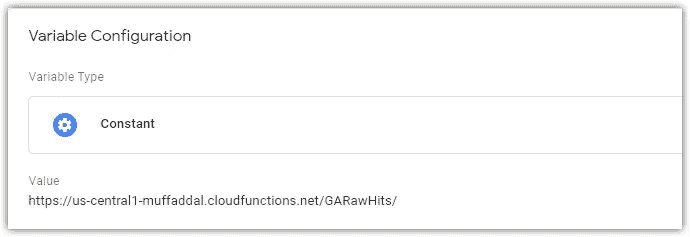

与云函数链接的 GTM 常量变量，由 Muffaddal

将自定义函数变量命名为“自定义任务”。接下来，转到您的设置变量，在“要设置的字段”中添加 customTask，并为其提供我们的变量。

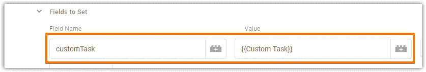

通过 Muffaddal 在设置变量中添加 customTask 字段

将 customTask 直接添加到 GA 设置变量可以确保我们的函数在每次命中 GA 时触发。

# 谷歌云功能

接下来，我们必须设置我们的云函数来接收来自 GTM 的点击，并将其发送给 BigQuery。我将在本指南中使用 Node.js，但它也可以用任何其他语言实现，比如 Python。首先让我们配置我们的云功能

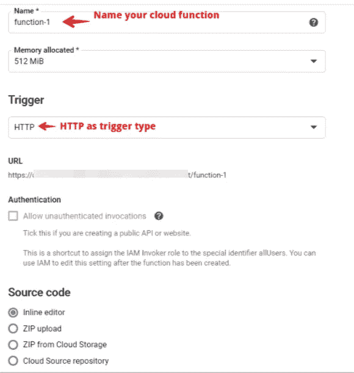

云功能配置，由 muffaddal

我已经将分配的内存设置为 512 MB。您可能希望根据您预期收到的点击量来更新此信息。但大多数情况下，512 MB 应该就可以了。

将下面的代码复制到`package.json`文件中，告诉我们的云函数使用的节点依赖关系。我们将在 Node.js 代码中使用 BigQuery 和云存储。

*为什么选择云存储？稍后会详细介绍。*

云函数的 Package.json，由 Muffaddal

接下来，在您的`index.js`文件中添加下面的 **Node.js 8** 代码，并根据您的 GCP 环境设置‘projectId’、‘dataset’、‘tableName’和‘bucket name’。

用于处理 GA 命中的云函数代码，由 Muffaddal 编写

在上面的代码中，我们还在原始的 hit 对象中包含了时间戳(*第 38 行*)。这是为了在我们的数据集中有一个日期参数。这将允许我们对数据执行基于日期的操作。

此外，如果我们在向 BigQuery 插入原始命中时遇到任何错误，我们会将该命中存储到云存储中。这样做确保我们至少不会错过击中。一旦进入云存储，就可以根据错误进行处理并转发给 BigQuery。

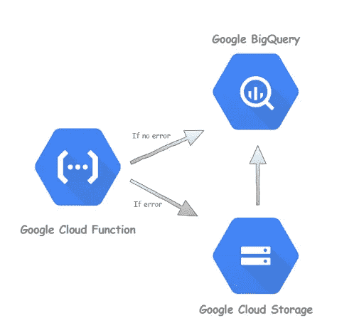

有无错误的数据流，由 Muffaddal

我根据错误类型在 bucket 中创建了一个子文件夹。这将有助于区分点击，并允许我们相应地处理它们。

我已经在文章的最后提到了错误的可能原因。

# 谷歌大查询

用类型字符串创建一个包含两列`hit_timestamp`和`payload`的表。确保该表的名称与您在云函数中添加的名称相同。

这是它的样子。

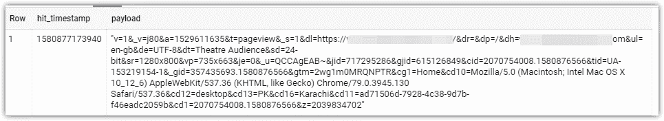

BigQuery 中的原始数据表，由 Muffaddal

有效负载栏中长而怪异的字符串正是 Google analytics 从网站接收点击的方式，也是我们存储它的方式。它将所有数据点格式化为查询参数。在本节的后面，我们将把它转换成可读的格式。时间戳是我们在云函数代码中添加的列。

一旦表被创建，我们的数据管道接收谷歌分析点击量数据准备好了！

接下来，我们将把这些原始数据转换成可读的格式。

# 转换原始数据

想法是从有效负载列中提取参数值，并将它们存储在转换后的表中。为此，我们将使用 SQL 查询。查询将做的是每天从原始数据中提取我们需要的值，并将其附加到转换后的表中。

下面是一个从原始点击中提取数据的查询

通过 Muffaddal 转换原始数据的查询

我将 hit_timestamp 转换为纽约时间，因为我的 Google Analytics 时间设置为纽约。我希望我的 BigQuery 数据能够与谷歌分析的数据相媲美，我建议你也这样做。这有助于匹配事物。

*您可能还会问为什么查询只从以前的数据中提取日期？这是有原因的。我将在下一节讨论这一点。*

运行上述查询将获得以下转换格式的数据

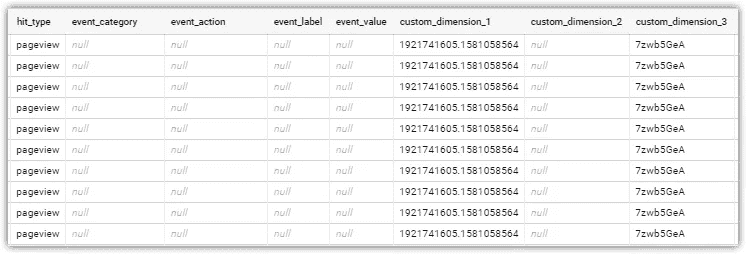

由 Muffaddal 转换的 GA 数据表

# BigQuery 查询调度程序

接下来，我们希望我们的转换查询能够每天获取格式数据，这样我们就不必在处理数据集时自己转换它。查询调度器可以帮助我们做到这一点。它将在每天的 **00:30** 运行，并提取前一天收到的数据，对其进行转换，并将其添加到我们转换后的数据表中。

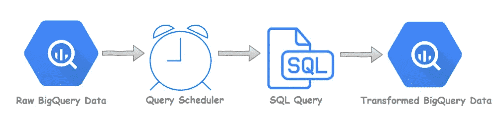

数据转换流程，由 Muffaddal

下面是要使用的计划程序设置。

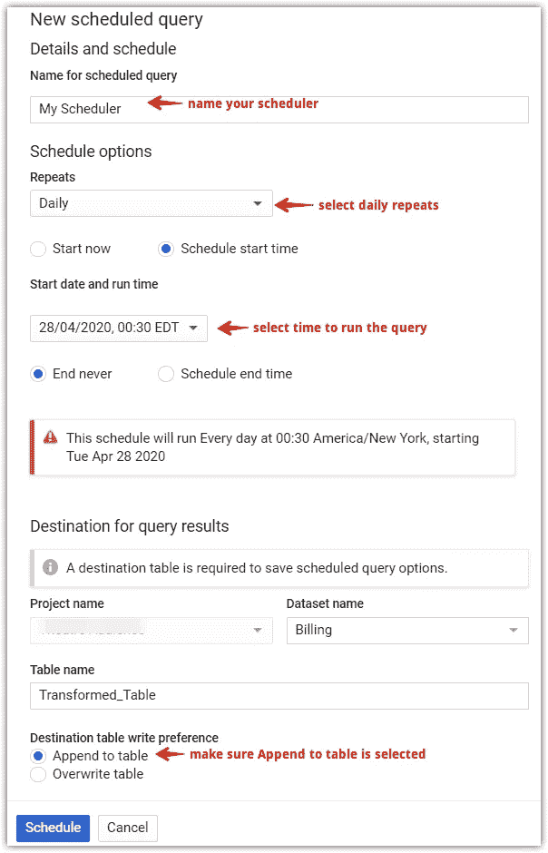

Muffaddal 的 BigQuery 查询调度程序设置

为什么我把它安排在 00:30？

调度程序的工作是运行 SQL 查询。该查询从运行时开始获取前一天的所有内容。因此，日期一改变，我就运行调度程序，这样我们就能得到前一天收到的所有信息。这确保我们获得前一天的所有用户活动，并将其存储在转换后的表中。

调度器还被设置为将查询结果追加到目标表中。因此，每天结束时，我们都会在 BigQuery 中获得转换后的数据。

下面是基于上述 SQL 查询的转换表的模式。

转换的数据表架构，bu Muffaddal

搞定了。

好了，我们的数据管道已经完成，可以捕获 GA hit，并将其发送到云功能。后者将其转发给 BigQuery。在 BigQuery 查询调度器中处理原始数据，对其进行格式化，并将其存储在我们的表中，以便能够构建报告并对其进行分析。

# 我们为什么不直接在云函数中转换命中数据？

在 BigQuery 中存储 Google analytics 的原始点击比只存储转换后的点击数据有很多优势。其中一些是:

1.  变换过程中的任何错误都可能导致整个命中的丢失。这本身就是巨大的损失。
2.  谷歌分析跟踪的变化可能会改变整个转型过程。
3.  转换后的表模式中的任何变化都会导致转换过程在存储新的命中之前发生变化。

**在 BigQuery 中直接存储原始命中数据的优势:**

1.  可以直接查询原始数据。
2.  在转换后的数据或表格中出现任何错误的情况下，回溯变得更加容易。
3.  您可以随时从原始数据中直接过滤数据点，以便在转换后的版本中包括(或排除)数据点。
4.  您可以用类似的方式从原始数据中提取任何新的维度或值。
5.  转换后的表可以随时从原始数据重建。

# 需要注意的几个要点

实现以上内容将使您能够在 BigQuery 中处理 GA 数据。然而，我想指出的是，在实现数据管道时，应该考虑几件事情。

## Google Analytics 自定义维度

并不是所有的东西都通过它的 API 发送到 GA。因此，我建议在你的谷歌分析中实现以下自定义维度，这将丰富你的点击量数据。

1.  **地理定位**:获取用户在你的数据集中的位置
2.  **设备类型**:每次点击获取设备信息。
3.  **用户代理**:这个维度可以让你得到多个其他维度，比如浏览器及其版本。它还可以帮助您过滤垃圾邮件流量，因为垃圾邮件发送者没有用户代理。
4.  **会话 Id** :这将有助于按会话分组和过滤你的数据集。发送显式会话 id 有助于简化会话级分析过程。

> 如果你需要我的帮助来建立这个端到端的数据管道，请在 LinkedIn 上告诉我。

请注意，在 GA 中设置 session-id 维度的传统方式不起作用。与传统方式一样，我们将随机 id 发送给 GA，GA 将收到的最后一个 id 作为会话 id 存储在自定义维度中。在我们的例子中，您必须为整个会话发送相同的 id 值，以便在 BigQuery 中，您可以在会话的每次点击中看到相同的 id。

## 人口统计信息

由于人口统计信息是从 GA 的后端添加到 GA 中的，所以我们将无法在我们的点击量数据中获得人口统计信息。尽管您可以使用来自 hit 数据集的客户端 id 或用户 id 从 GA 的 API 中提取此类数据。

## **SQL 查询中的查询参数**

上面转换原始数据的 SQL 查询涵盖了 GA hit 拥有的许多参数，但不是全部，比如增强的电子商务的参数。您可能需要根据您的 google analytics 实现来更新查询。

## **错误**

如上所述，如果我们的云函数遇到错误，我们的管道会将命中结果存储在云存储中。云函数中可能会出现错误，原因有很多，其中包括:

*   已达到 BigQuery 报价限制。
*   云函数收到了不必要的点击(例如，由于垃圾邮件),这可能会导致我们的代码中出现错误。
*   由于不需要的架构命中架构，BigQuery 拒绝插入。
*   可能还有其他不可预见的运行时错误

在任何情况下，这个想法是至少存储 GA 命中，以便我们不会错过它。

云存储中的数据需要根据其存储在云存储中的错误进行处理。

## 时区

您将不得不更新 SQL 查询，以匹配您的谷歌分析的时间，使数字具有可比性。

## GCP 组件限制

云函数和 BigQuery 都有限制，根据你的流量，你可能需要增加两个组件的配额限制。

*   云函数可以每 100 秒处理 [1 亿次调用。](https://cloud.google.com/functions/quotas)
*   BigQuery 接受每个项目每秒 100，000 行。

您还可以在将数据发送到 BigQuery 之前，使用一个中间组件临时批处理数据。

# 实时数据管道

还可以进行管道转换，并在 Bigquery 中实时存储数据，而不是由调度程序引起的延迟。这个想法是，你从云函数接收到的有效载荷中提取参数，直接发送给 BQ。

如果你使用实时管道，我会建议你仍然存储原始的点击，因为它有助于在事情发生时进行回溯。

# 结束了

尽管标准的谷歌分析并不提供其点击率数据。通过实现一个简单的数据管道，我们可以在我们的数据仓库中捕获谷歌分析点击。

我们使用 GTM 将 GA 命中结果发送给云函数，云函数将命中结果以原始格式转发给 BigQuery。其中我们利用了一个查询调度器来将原始数据转换成转换格式。这样做允许我们将 Google Analytics 的点击量数据存储在我们的数据仓库中。它可以用于执行任何类型的分析和/或创建我们喜欢的报告。

**类似的读数**

1.  [使用 GCP 自动将数据导入谷歌分析](/automate-data-import-to-google-analytics-471de2c3fc76)
2.  [使用 BigQuery ML](/rfm-analysis-using-bigquery-ml-bfaa51b83086) 执行 RFM 分析

# 参考

**Github 代码**

 [## muffaddal 52/Send-Google-Analytics-Hits-to-big query

### 这个回购有代码来帮助发送谷歌分析点击量数据到 BigQuery。它使用了 GTM，云函数，BigQuery 和…

github.com](https://github.com/muffaddal52/Send-Google-Analytics-Hits-to-BigQuery)