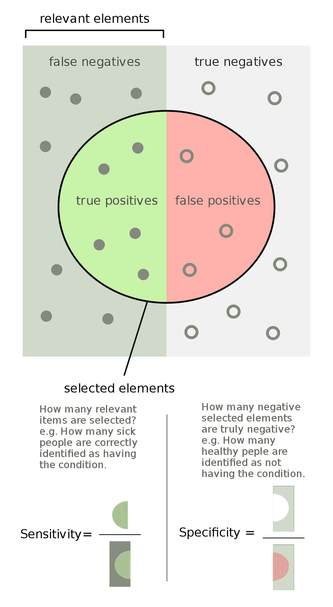
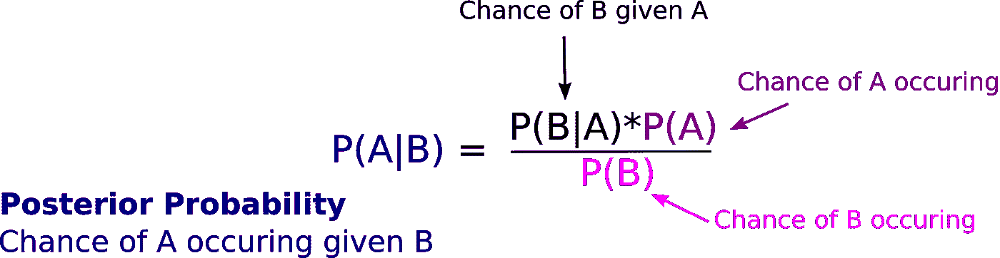

# 敏感性、特异性和有意义的分类器

> 原文：<https://towardsdatascience.com/sensitivity-specificity-and-meaningful-classifiers-8326738ec5c2?source=collection_archive---------37----------------------->

## *解释冠状病毒检测时有时会混淆的概念*

[肯德尔](https://unsplash.com/@hikendal?utm_source=medium&utm_medium=referral)在 [Unsplash](https://unsplash.com?utm_source=medium&utm_medium=referral) 上的照片

我们如何评估机器学习分类器或测试模型的表现？我们如何知道一项医学测试是否足够可靠，可以用于临床？

虽然高度准确的冠状病毒检测在发病率较高的地方可能有用，但为什么它在发病率较低的人群中信息较少？这听起来违反直觉，令人困惑，但确实可以应用于确定您自己的二元分类器的效用！

我们通过测量测试的特异性和敏感性来定义测试的有效性。很简单，我们想知道该测试多久识别一次真阳性和真阴性。

我们的**灵敏度**描述了我们的测试捕捉所有阳性病例的能力。**灵敏度**的计算方法是将真阳性结果的数量除以阳性总数(包括假阳性)。

我们的**特异性**描述了我们的测试如何将阴性病例归类为阴性。**特异性**的计算方法是将真阴性结果的数量除以阴性总数(包括假阴性)。

[费安多](https://commons.wikimedia.org/wiki/File:Sensitivity_and_specificity.svg)/CC BY-SA([https://creativecommons.org/licenses/by-sa/4.0](https://creativecommons.org/licenses/by-sa/4.0))

重要的问题是一个模型是否有意义？仅仅依靠敏感性和特异性是不够的！为了确定一项检测对一个人群的意义或临床用途，我们需要关于疾病的预期发病率或流行率的基础信息。我们使用贝叶斯定理来理解这一点:

我们有 1 00 万人口，其中 10%的人患有某种疾病。我们使用一种非常可靠的测试，具有 98%的特异性和敏感性。在这里,**事件 A** 描述了这种疾病在人群中的无条件概率。 **P(A) = 0.10** 。

事件 B 是我们测试结果为阳性的无条件概率。我们可以通过查看我们将得到的总阳性数来计算 **P(B)** 。在该人群中，我们预计有 98 000 例真阳性，通过将发病率乘以总人群和敏感性计算得出。对于假阳性，我们取不患这种疾病的概率 **(0.90)** ，乘以人群和**(1-特异性)**。所以在这种情况下我们得到了 18 000 个误报。我们的总阳性率是 11.6%。

现在事情变得有点复杂了。所有这些值描述了该测试对于该人群的准确性。但是它没有告诉我们一个检测呈阳性的人患这种疾病的几率。我们需要应用贝叶斯定理，使用这些无条件值作为我们的先验假设。

由你友好的邻居作者创作

那么，如果有人检测结果呈阳性，那么这种疾病存在的概率是多少？

这里我们可以开始定义我们的变量。

*   **P(A) = 0.10**
*   **P(B) = 0.116**
*   **P(B|A)** 描述得到阳性结果的概率，不管它是否是真阳性，而 P(A)是疾病的存在。因此 P(B|A)是我们的灵敏度。 **P(B|A) =** **0.98。**
*   **P(A | B)**= 0.98 * 0.1/0.116 =**84.5%**

因此，我们在这里看到，即使有很高的灵敏度和特异性，该测试在某些人群中可能不准确。使用贝叶斯定理，我们可以很容易地计算出来。

如果这种疾病在我们的人口中不那么常见，会发生什么呢？回想一下，灵敏度和特异性保持在 98%。

*   **P(A)** = 0.01
*   **P(B)** =(真阳性+真阴性)/总人口=(0.01 * 0.98+0.02 * 0.99)/10000000 =(9800+19800)/1000000 = 0.0296
*   **P(A | B)**= 0.98 * 0.01/0.296 =**33.1%**

由于这种疾病现在越来越少，当你患病时，获得阳性检测结果的后验概率更低。随着人群中疾病患病率的下降，我们的**阳性预测值**也在下降！

**生成生物医学测试或另一个二元分类模型时，请记住它可能有用的时间。看看我们的测试对我们的特定人群有多有效，因为疾病的患病率足够低——这可能不是很有用！**

**因此，如果您正在为一般人群中可能罕见的事物生成分类器，您需要非常高的灵敏度和特异性，以获得高阳性预测值！**