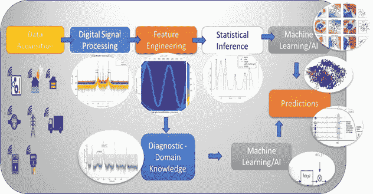
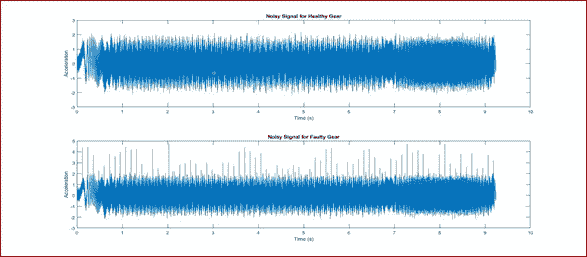
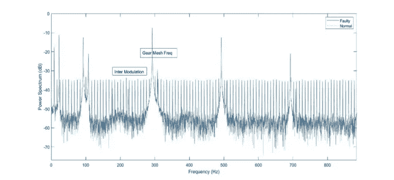
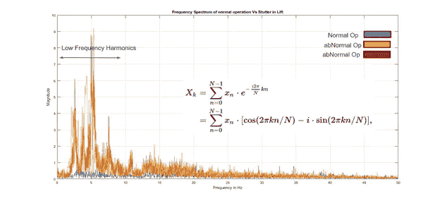
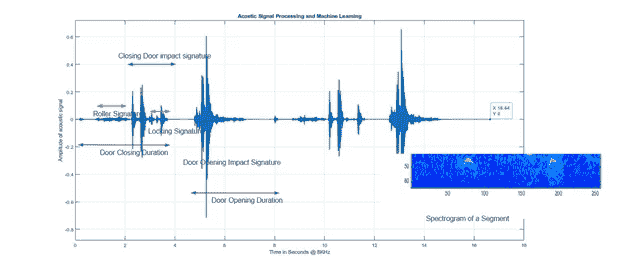
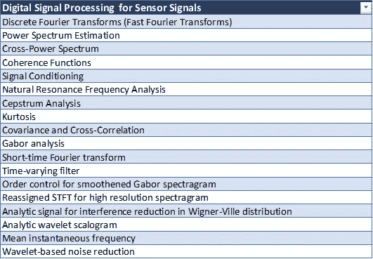
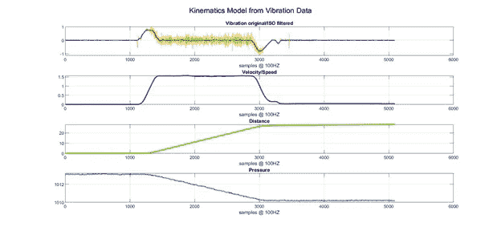
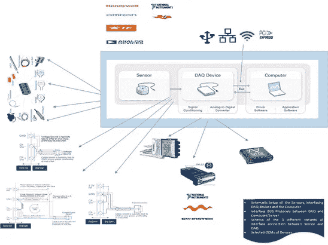

# 基于传感器的物联网预测性维护——为什么数字信号处理是机器学习的必备条件

> 原文：<https://towardsdatascience.com/sensor-based-iot-predictive-maintenance-why-digital-signal-processing-is-must-for-machine-880e30df5804?source=collection_archive---------32----------------------->

DSP+AI 工作流程。@版权

工厂由几种类型的资产组成。基于传感器的物联网用于资产诊断和预测。机器资产的旋转部件经常遭受机械磨损。如果没有对这种磨损进行监控，可能会导致机器故障和工厂意外停机。除了机械故障，机器也可能出现电气故障。因此，这些机器的状态监控对于早期故障检测非常重要，以避免计划外维修，最大限度地减少停机时间，从而保证机器的可靠性、正常运行时间和可持续性。几种非侵入式机器状态监控技术使用传感器。大多数是基于感应电流、振动、机器的声发射[2]。为了获得这些信号，需要传感器。远程监控需要物联网管道到位。

设备(电气和非电气)的状态监控是工业物联网工业 4.0 的主要要求之一。虽然基于传感器的数据驱动解决方案看起来像一个机器学习问题，但它不可能用 ML 解决组件级诊断。例如，感官数据可能有噪声；并且根据 SNR，传统的 ML 方法将训练噪声而不是所需的信号本身。另一个问题是，如果没有像傅立叶、小波、时间-频率、希尔伯特等的信号变换，时域数据签名不能区分、隔离或理解机器的下划线问题。

小齿轮故障电机的时域振动特征(时间序列)

在上面的例子中，小齿轮故障数据显示在时域中。当在 ML 上训练时，信号将很难推断出任何东西，因为它不能区分噪声和异常。在动态负载和噪声下，阈值方法也不是一个好主意。

通过对信号进行傅立叶变换，我们可以绘制出指向机器中特定异常的许多特征。由于模式具有不同的特征，这种方法是**无监督的**并且不需要**大量历史数据**来创建推断。

时域签名的频谱能够识别带有互调的小齿轮问题

让我们看看电梯系统振动的另一个例子。正常操作和异常模式特征之间的差异在谱域中清晰可见。

正常和异常操作的频谱@版权所有

该系统的时域特征不能区分正常和异常模式。低频谐波尖峰在频谱域中清晰可见。

另一个例子是门操作的声学频谱图。该信号包含门的各种操作，并且可以使用信号处理来识别某些操作并创建退化模型。

不同签名的时域门操作及其谱图@版权所有

# 什么是数字信号处理

看完上面的例子，让我们先来识别什么不是 DSP。嗯，**数字** **信号处理不是** **关于傅里叶变换(FFT)或者 FFT 不是 DSP** 在数据科学界被广泛误解。数字信号处理领域有数百种算法。另一个趋势是统计学和信号处理的融合——统计信号处理。它应用 ML 和信号处理来推导推论。

下表显示了一些选定的算法

表 1-信号处理的几种算法@版权所有

在下面的示例中，数字滤波器应用于 ISO 规范定义的特定截止频率，以滤除特定频率成分的噪声信号。否则使用移动平均线是不可能实现的。数据是电梯在 100 赫兹时的 3 个轴向加速度曲线。

ISO 标准巴特沃兹低通滤波器应用于振动信号@版权所有

数字信号处理和模拟信号处理是工程中处理传感器信号的两个分支。DSP 应用包括音频和语音处理、声纳、雷达和其它传感器阵列处理、频谱密度估计、统计信号处理、数字图像处理、数据压缩、视频编码、音频编码、图像压缩、电信信号处理、控制系统、生物医学工程和地震学等。

DSP 可能涉及线性或非线性运算。非线性信号处理与非线性系统识别密切相关，可以在时域、频域和时空域中实现。[1]

# **如何使用 DSP 进行 AI/ML**

DSP 有两种应用方式。

**基于 DSP 的数据转换—**

在这种方法中，DSP 被简单地用作 ETL 工具。转换后的数据用作数据集的另一个要素。ML/AI 的下游块在统计意义上消耗数据，并学习下划线模式以得出推断。大多数数据科学家都使用这种方法，但是在许多用例中，由于缺少领域推理和对转换理解，这种方法并不理想。

**基于 DSP 的设计和推理-**

在这种方法中，使用 DSP 对数据进行预处理/转换到其他域，但是使用 DSP 的域知识来导出进一步用于增强下游 AI/ML 算法的推理。在这里，对信号和系统的深刻理解是创建最佳 ML 模型的先决条件。

在用例中，需要对资产的内部组件进行诊断——不仅仅是趋势——那么这种方法是强制性的。如图 1 所示，原始 ML 或 DSP 无法将齿轮-小齿轮问题检测为 ETL + ML。我们需要了解谐波的含义、频带中能量的含义、噪声水平、衰减、相位关系、区分信号和噪声的能力等。这适用于几乎所有的资产类别——电机、泵、压缩机、发电机、输送机、发动机等。

# 物联网传感器应用的 DSP 和 AI 工作流程

DSP+AI 工作流程。@版权

基于 DSP 的人工智能应用的工作流程如上图所示。

**数据采集过程**

这个过程对于任何应用都是最关键的。选择传感器类型、传感器规格、采样频率、模数转换、传感器接口的决策对诊断和预测性维护最终目标的成功起着至关重要的作用。

我在下图中强调了传感器接口的一些关键组件。在这个过程中，我分析了一些供应商，所以他们的名字是可见的。然而，市场上有许多具有不同规格的参与者，特定组件的选择取决于感兴趣的机器/源的许多领域相关规格和最终目标。

许多现成的**智能传感器**提供商已经集成了 ADC、接口和连接。

传感器接口规范@版权所有

接下来是 DSP 的**关键模块**，如前所述，该模块执行信号处理操作，从滤波、变换到多个域，如表 1 所示

DSP 之后是**特征工程部分**，从转换后的数据中提取特征。这些要素是对数据集中原始要素的补充，提供了对数据的深刻见解，否则这是不可能的。

接下来我们分成两个分支。在**领域特定路径中，**我们从领域角度推断通过多重转换得到的签名，并从中导出诊断模型。进一步向下，具有诊断特征的高级模型训练可用于训练 AI 模型，以导出 RUL 和其他预测性维护相关的度量。

另一条路径是基于**统计推断**的方法，用于为模型构建提供额外信息，但本质上是纯统计的。

# 结论

我们了解了什么是数字信号处理，以及它对基于物联网传感器的用例有何意义。

我们看到了传统的基于统计的人工智能建模和基于信号处理的方法之间的差异。

我们看到传感器接口规格涉及上游和下游集成、ADC、采样速率、连接性。

我们讨论了基于 DSP 的人工智能工作流。

# 参考

1.  [https://en.wikipedia.org/wiki/Digital_signal_processing](https://en.wikipedia.org/wiki/Digital_signal_processing)
2.  使用压缩信号处理、Meenu Rani、Sanjay Dhok 和 Raghavendra Deshmukh 传感器的机器状态监控框架。
3.  数字信号处理:原理、算法和应用，J.Proakis，2007。
4.  统计信号处理基础，第三卷:实用算法开发。
5.  智能传感器与系统— 2015，[林永龙](https://www.amazon.in/s/ref=dp_byline_sr_book_1?ie=UTF8&field-author=Youn-Long+Lin&search-alias=stripbooks)，等人，施普林格。