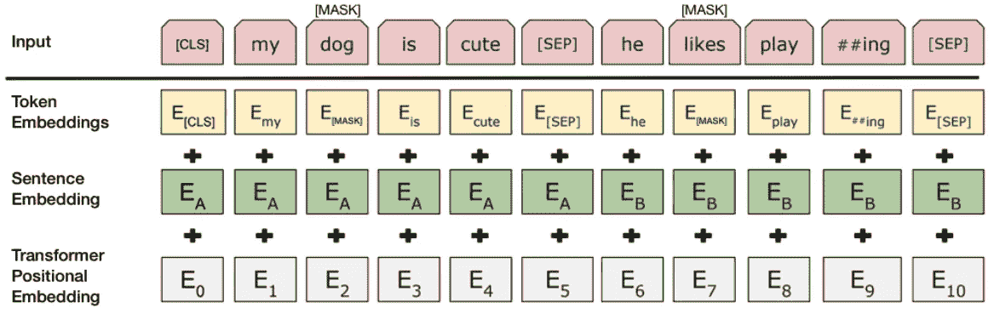
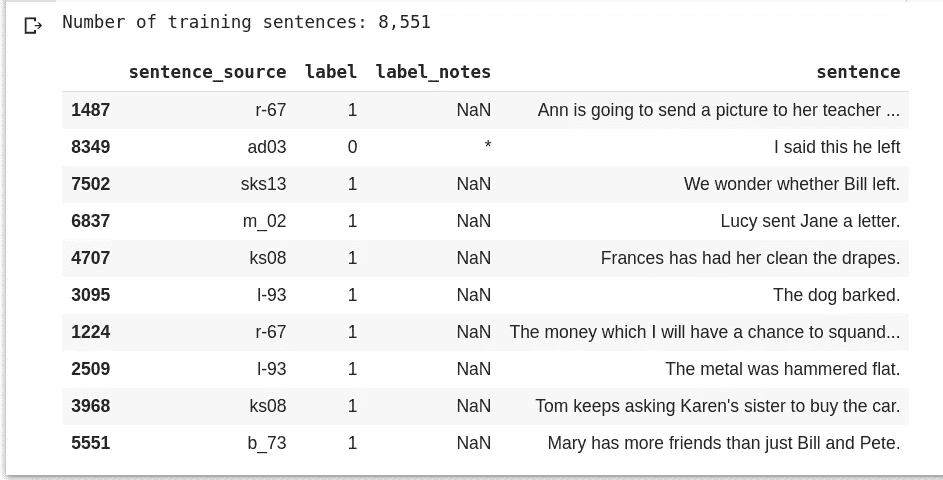
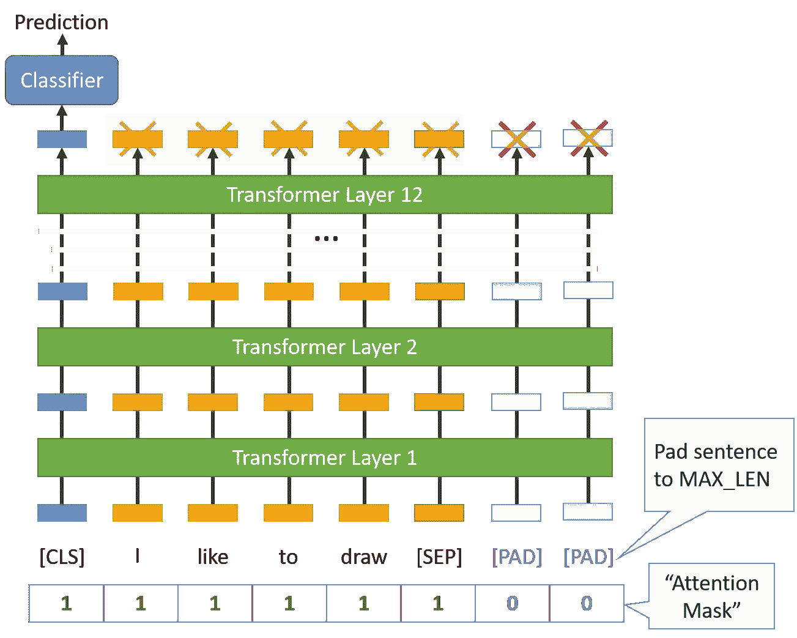
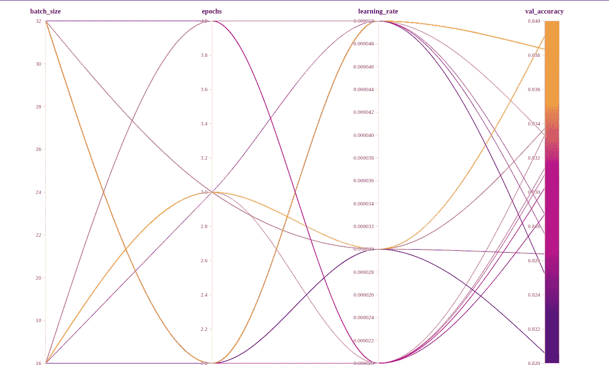
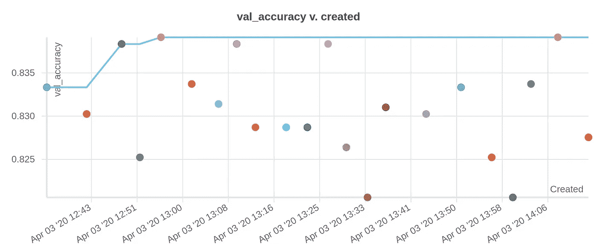
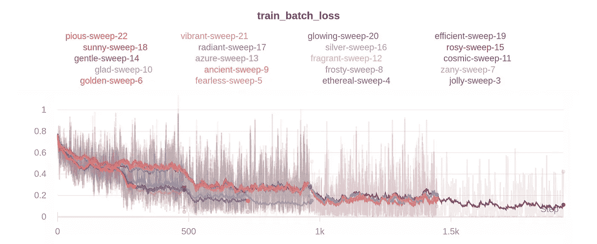
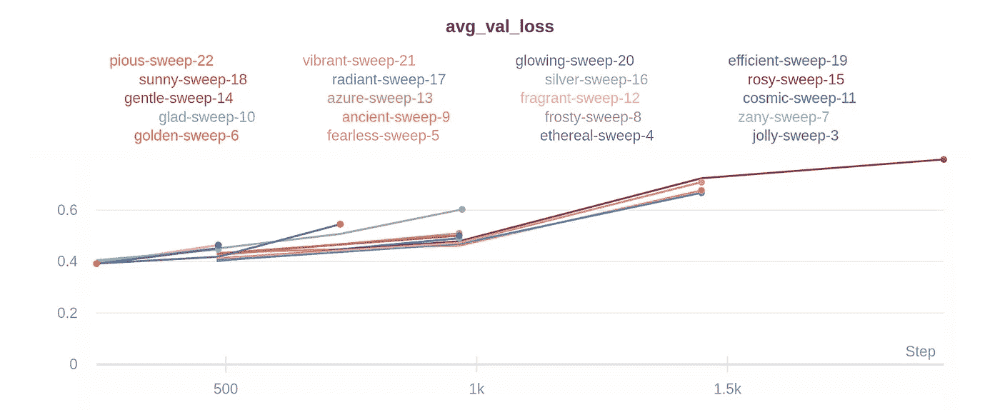
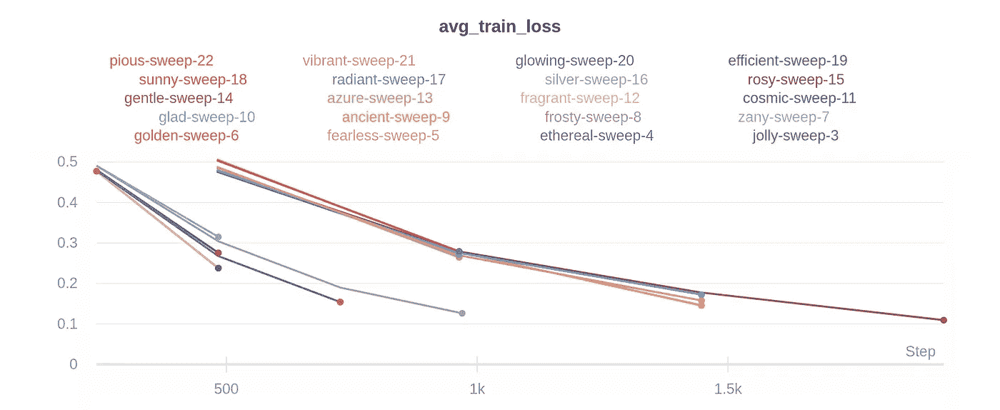
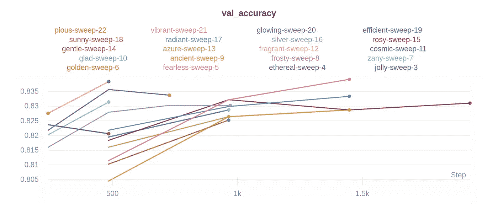

# 基于迁移学习的句子正确性分类器

> 原文：<https://towardsdatascience.com/sentence-correctness-classifier-using-transfer-learning-with-huggingface-bert-8884795ba5ca?source=collection_archive---------24----------------------->

学习简单地使用 huggingface 构建生产级 NLP 应用程序


来源-[https://blog . Rosetta . ai/learn-hugging-face-transformers-Bert-with-py torch-in-5-minutes-acee 1 e 3 be 63d？gi=ec612e84d08d](https://blog.rosetta.ai/learn-hugging-face-transformers-bert-with-pytorch-in-5-minutes-acee1e3be63d?gi=ec612e84d08d)

[**下面是**](https://app.wandb.ai/cayush/bert-finetuning/reports/Sentence-classification-with-Huggingface-BERT-and-W%26B--Vmlldzo4MDMwNA) **链接直播仪表盘**

在本文中，我们将利用自然语言处理领域的最新突破，构建一个接近艺术水平的句子分类器。我们将重点关注迁移学习在 NLP 中的应用，以在一系列 NLP 任务中以最小的努力创建高性能模型。

# 介绍

在过去两年左右的时间里，与应用深度学习的其他领域相比，NLP 的研究一直非常迅速。Allen AI 的 ELMO、OpenAI 的开放 GPT 和谷歌的 BERT 等模型允许研究人员在特定任务中以最小的微调打破多个基准。因此，NLP 研究复制和实验变得更加容易。

# 伯特

谷歌研究人员在 2018 年底发布的 BERT(来自变压器的双向编码器表示)是我们将用来训练句子分类器的模型。

我们将在预训练的 BERT 模型上使用迁移学习。这种方法比从零开始训练像 GRU 或 LSTM 这样的深度模型要好，因为:

*   预先训练的 BERT 模型权重已经编码了许多关于我们语言的信息。因此，训练我们的微调模型所需的时间要少得多。我们将使用超参数扫描来训练我们的模型，以便在 colab 上在一个小时内找到最佳组合，而在 GPU 上从头训练单个深度 RNN 模型将需要数百个小时以上！
*   因为我们本质上是在进行迁移学习，所以我们需要少得多的数据来建立一个精确的系统。与从头开始训练一个模型所需的数百万个数据点相比，我们只需要几千个数据点就可以完成同样的任务。



图片来源—[https://towards data science . com/Bert-explained-state-of-art-language-model-for-NLP-F8 b 21 a9b 6270](/bert-explained-state-of-the-art-language-model-for-nlp-f8b21a9b6270)

基于 transformer network 的 BERT 是一个双向网络，它为建模、分类等各种任务生成语言编码。

谷歌表示，BERT 有助于更好地理解搜索中单词的细微差别和上下文，并更好地将这些查询与更相关的结果匹配起来。它也用于特色片段。这里有一个例子。


图片来源——blog.google.com

让我们看看这个模型的另一个令人兴奋的应用，即句子分类。

# 正在安装 Huggingface 库

现在，我们将快速进入培训和实验，但如果你想了解更多关于环境和数据集的细节，请查看克里斯·麦考密克的[本教程](https://mccormickml.com/2019/07/22/BERT-fine-tuning/)。

让我们首先在 colab 上安装 huggingface 库:

`!pip install transformers`

这个库带有各种预先训练的艺术模型。对于我们的句子分类，我们将使用**BertForSequenceClassification**模型。

# 可乐数据集

我们将使用[语言可接受性语料库(CoLA)](https://nyu-mll.github.io/CoLA/) 数据集进行单句分类。它是一组被标记为语法正确或不正确的句子。它于 2018 年 5 月首次发布，是“GLUE Benchmark”中包括的测试之一，BERT 等模型正在进行竞争。

让我们下载并解压缩数据集

如果一切执行无误，您将获得以下文件:

如你所见，我们已经有了数据集的标记化版本，但我们需要再次标记它，因为为了应用预训练的 BERT，我们*必须*使用模型提供的标记化器。这是因为:

*   该模型具有特定的、固定的词汇表，并且
*   BERT 记号赋予器有一种特殊的方式来处理词汇表之外的单词。

# 解析数据集

让我们通过使用 pandas 解析数据集来看看数据集的格式



这里需要注意一些事情:

*   我们只有 8551 个数据点，通过使用迁移学习来训练 SOTA 深度模型。
*   我们关心的属性是**句子**和 it **标签**。
*   可接受性判断，其中 0 =不可接受，1 =可接受。

最后，我们来列出这些句子。

# 标记化

如前所述，要输入到 BERT 模型中的句子必须使用 BERT 记号化器进行记号化。让我们看一个例子。

```
Using this tokenizer on a sentence would result into something like this:Original:  Our friends won't buy this analysis, let alone the next one we propose.Tokenized:  ['our', 'friends', 'won', "'", 't', 'buy', 'this', 'analysis', ',', 'let', 'alone', 'the', 'next', 'one', 'we', 'propose', '.']Token IDs:  [2256, 2814, 2180, 1005, 1056, 4965, 2023, 4106, 1010, 2292, 2894, 1996, 2279, 2028, 2057, 16599, 1012]
```

在我们使用这个记号赋予器处理整个数据集之前，我们需要满足几个条件，以便为 BERT 设置训练数据:

*   在每句话的开头和结尾添加特殊标记。在每句话的末尾，我们需要添加特殊的[SEP]标记，对于分类任务，我们必须在每句话的开头添加特殊的[CLS]标记。
*   填充和截断所有句子，使其长度保持不变
*   明确区分真实标记和带有“注意掩码”的填充标记。“注意屏蔽”只是一个由 1 和 0 组成的数组，表示哪些标记是填充的，哪些不是

以下是经过所有预处理后，网络架构如何对特定输入进行操作。



图片来源—[http://www.mccormickml.com/assets/BERT/padding_and_mask.png](http://www.mccormickml.com/assets/BERT/padding_and_mask.png)

第一个任务是决定一个句子的最大长度。

输出

```
Max sentence length:  47
```

为了遵循大小应该是 2 的幂的一般惯例，我们将选择最接近的 2 的幂的数字，即 64。

现在，我们准备执行真正的标记化。但是当我们使用变压器时，我们可以使用一个内置函数 **tokenizer.encode_plus** ，它可以自动完成以下所有任务:

1.  把句子分成几个标记。
2.  添加特殊的[CLS]和[SEP]标记。
3.  将令牌映射到它们的 id。
4.  将所有句子填充或截短至相同长度。
5.  创建注意屏蔽，明确区分真实令牌和[PAD]令牌。

我们将把数据分成训练集和测试集。将我们的训练集划分为 90%用于训练，10%用于验证。

# 加载数据

接下来的步骤需要我们猜测各种超参数值。我们将通过扫描所有参数的所有值组合来自动完成这项任务。为此，我们将在开始训练循环之前初始化一个 **wandb** 对象。当前运行的超参数值保存在 **wandb.config.parameter_name 中。**

这里，我们使用 **RandomSampler** 对训练集进行采样，使用 **SequentialSampler** 对验证集进行采样。

# 建立培训模型

我们将使用经过预先训练的[机器人进行序列分类](https://huggingface.co/transformers/v2.2.0/model_doc/bert.html#bertforsequenceclassification)。我们将添加单个密集或全连接图层来执行二进制分类任务。我们将把程序的每个部分作为一个独立的功能块。

**num_labels** 参数描述了最终输出神经元的数量。

我们将使用由 huggingface 提供的内置权重衰减机制的 **Adam** 优化器的实现。学习率将由 **wandb.config** 提供

我们还将初始化一个学习率调度程序来执行学习率衰减。训练时期也是一个超参数，所以我们将使用 **wandb.config** 来初始化它。

# 初始化权重和偏差

在我们训练我们的模型之前只剩下一步了。我们将设置一个配置文件，列出一个超参数可以取的所有值。然后，我们将初始化我们的 wandb sweep 代理，以记录、比较和可视化每个组合的性能。

我们希望最大化的指标是 **val_accuracy** ，我们将在训练循环中记录它。

在 BERT 论文中，作者描述了执行迁移学习的最佳超参数集，我们对超参数使用了相同的值集。

现在我们有了运行扫描所需的扫描 id。我们现在只需要一个 **train** 函数，它将在每次扫描中被重复调用。

# 训练模型

# 选择最佳模型超参数

在运行 wandb 扫描时，除了我们手动记录的图像之外，您还会获得一些自动可视化图像。现在是做扣除的时候了。

关于模型性能的一些最重要的信息可以直接从参数相关图中推导出来。



Wandb 的平行坐标图-报告中的链接

在这里，我们可以看到在最大化验证准确性的任务中所有运行是如何执行的。我们可以推断出最佳的超参数组合是**批量为 16，学习率为 3e-5，训练 3 个时期**，这将导致大约 84%的准确率。

如果您想要一个更简单的可视化，只比较每次运行所用的时间以及它在优化所需指标方面的表现，您可以参考仪表板中的另一个有用的可视化，它比较验证准确性与特定运行的时间。



现在，让我们看看我们记录的指标的可视化效果。



扫描中每次运行的分批列车损失



扫描中每次运行的平均验证损失



扫描中运行的平均训练损失比较



多次运行记录的验证准确度的比较

现在，您已经有了在最佳超参数值集上训练的 BERT，用于执行句子分类以及支持参数选择的各种统计可视化。

这篇文章演示了使用预训练的 BERT 模型，您可以根据您感兴趣的特定 NLP 任务，使用 huggingface 界面通过最小的微调和数据快速创建模型。

我希望这是一本好书。本文中的所有结果都可以使用[这个 colab 笔记本](https://colab.research.google.com/drive/13ErkLg5FZHIbnUGZRkKlL-9WNCNQPIow)重现，并且可以在这个 [wandb 扫描页面](https://app.wandb.ai/cayush/uncategorized/sweeps/nox60oau?workspace=user-cayush)中查看比较各种运行的可视化效果。