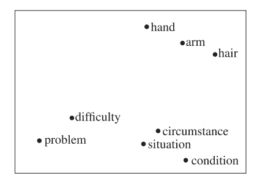
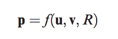
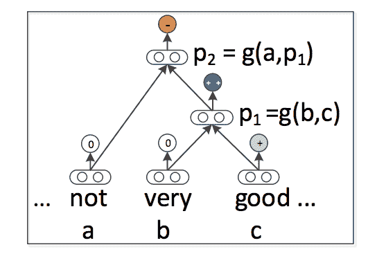
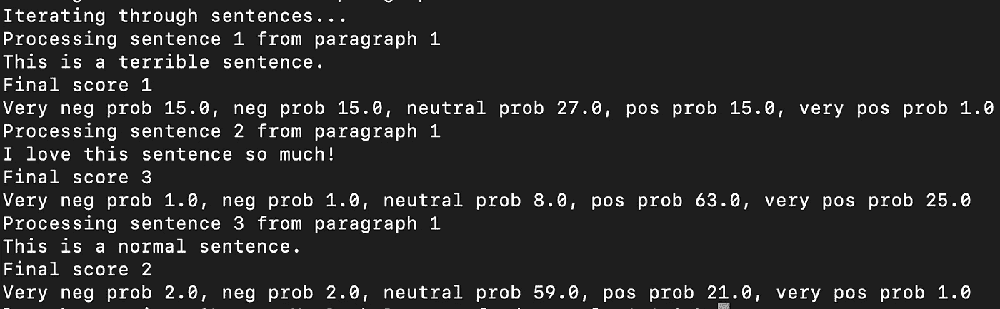
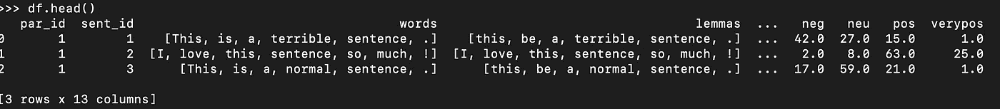

# 句子嵌入与 CoreNLP 的递归情感模型

> 原文：<https://towardsdatascience.com/sentence-embeddings-and-corenlps-recursive-sentiment-model-d88af7f7b4f5?source=collection_archive---------32----------------------->

## [入门](https://towardsdatascience.com/tagged/getting-started)

## 理解并实现 CoreNLP 的情感模型。

你好。几周前，我发布了关于库 coreNLP**和更具体的情感分析模型的**系列文章** **的第一篇[。第一篇文章](/intro-to-stanfords-corenlp-and-java-for-python-programmers-c2586215aab6)**是对 Java 包及其主要特性的介绍，特别针对像我这样习惯于使用 Python 的人。正如所承诺的，本系列的第二篇文章将更深入地探讨 CoreNLP 的情感注释器:为什么它不是你常用的情感分类器，它背后的递归模型，以及如何用一些简单的 Java 脚本来实现它(你可以在我的 github 上找到它！).**

我想，在我开始之前，我应该警告读者:⛔️这篇文章很少谈到情感分析和很多关于句子嵌入的⛔️.不要害怕，希望在你阅读的时候这对你有意义！


[梁杰森](https://unsplash.com/@ninjason?utm_source=medium&utm_medium=referral)在 [Unsplash](https://unsplash.com?utm_source=medium&utm_medium=referral) 上的照片

让我们从…谷歌一下 CoreNLP 情绪模型开始！当点击进入 coreNLP 情感分类器的[官方页面时，我们发现了以下**描述**](https://nlp.stanford.edu/sentiment/)

> 大多数情绪预测系统的工作原理只是孤立地看单词，对正面单词给出正面分，对负面单词给出负面分，然后将这些分相加。那样的话，单词的顺序会被忽略，重要的信息也会丢失。相比之下，我们新的深度学习模型实际上基于句子结构建立了整个句子的表示。它根据单词如何组成更长短语的意思来计算情感。这样模型就不像以前的模型那么容易被忽悠了。

看完这一段，我们已经可以分辨出两件事:

1.  这不是一个普通的情绪预测器，而是更有趣的东西(可能更有效！)
2.  这个模型和其他情感模型之间的核心区别似乎不是分类器本身，而是输入文本的表示(T2)。

第二点已经揭示了这篇文章的中心主题:**文本表示**。为了深入了解为什么 CoreNLP 的情感模型如此强大和有效，我们首先需要理解**恰当地表示输入文本的重要性。**而这就是我们下面要讲的！

我先介绍一下文本表示的复杂性(我称之为**语义建模**)是什么，以及 word2vec 等知名单词嵌入模型的**局限性** **。然后我将谈论语义组合性的概念以及 coreNLP 如何使用它来创建一个非常强大的递归情感分析模型。最后，我将给出一个 Java 中的简单实现**的例子。我们走吧！****

## 文本表示或语义建模

我喜欢把**语义建模**想成这样:人类可以阅读和理解一系列字母和符号(就像这句话)，然而，ML 算法只能理解数字序列。为了让情感分类器或任何其他模型处理文本，必须将文本从人类可读形式翻译成计算机可读形式。

原来有许多方法来表示文本:作为一个单词包，一个热编码，基于逻辑的框架，嵌入空间上的语义向量…并且重要的是**选择最好的一个**，因为这将直接影响你的模型的性能。想想看:如果模型连输入的文本都不能理解，我们怎么能指望它去分类呢！

在我上面提到的所有语义建模技术中，**语义向量**的使用被认为是 NLP 文献中**首选文本表示选项**之一。特别是，近年来，单词嵌入已经成为一种非常流行的方法并引起了很多关注。想想 **word2vec** ， **GloVe** ， **FastText** …

*   **单词嵌入及其局限性**

单词嵌入是建立在这样一个理念上的:从语境中推断出一个给定单词的意思是可能的**(Mitchell and la pata，2010)。**

**在这个框架中，**单词** **基本上由向量**来表示，这些向量携带特定单词的潜在语义信息(Socher，2013)。**图 1** 表示简单的**语义二维空间**。请注意，相似的单词看起来更接近。**

****

**图 1 (Mitchell 和 Lapata，2010 年，图 1，第 1390 页)语义向量空间中表示的单词。它们之间的接近表明语义相似。**

**然而，尽管它们被广泛使用，当我们对计算一个短语或句子的表示感兴趣时，这些模型的局限性变得非常明显。单词嵌入模型**只能孤立地表示单词**并且不能说明它们之间的句法和语法关联。**

**当我们想要表示一个句子，但是我们只有它的单词的嵌入时，更常用的解决方案之一是**平均它的单词向量**以获得一个句子向量。这种方法已经被证明在某些情况下足够有效，但是我个人认为它非常简单，因为句子的特定句法、语法和依赖性都被忽略了。**

*   ****复合性****

**作为一个有语言学和文学背景的人，在做文本分析时考虑句法、语法和词序是我甚至不会质疑的事情！！在亲身经历了单词嵌入的局限性之后，我偶然发现了语义组合的原则，并开始思考将它应用到语义建模任务中会有多酷。这项原则规定:**

> **“一个(句法上复杂的)整体的意义只是它的(句法)部分的意义以及这些部分组合的方法的函数”(Pelletier，1994 年，第 11 页)。**

**在 **NLP 文献**中，弗雷格原理最常见的解释和使用是作为一个理论基础**它规定一个人应该能够根据短语来解释一个完整句子的意思，同样，也应该能够根据单词来解释这些短语。****

**因此，当涉及到语言的表示时，建模者应该意识到**每个句法操作额外隐含了一个语义操作** (Mitchell and Lapata，2010)。Partee (1995，第 313 页)正式提出了表达两个元素 **u** 和 **v** 的组合的**公式 1** ，其中 ***f*** 是作用于两个成分的**组合函数**和 *R* 说明了 **u** 和 **v** 之间的句法关系(Mitchell and Lapata**

****

**公式 1 (Mitchell 和 Lapata，2010 年，第 1393 页)**

**在单词嵌入的基础上，一些作者试图包含不同的组合方法，目的是嵌入语言的各个方面，如词序和句法(Socher，2013)。这方面的一个例子是理查德·索赫尔和他的递归模型。**

## **用于句子嵌入的递归神经网络**

**当我了解到 Socher 的工作时，我变得非常兴奋，因为他基本上是在试图将这种作曲的想法融入到他的模型中，以构建一种更完整的嵌入句子的形式。为此，他提出了一种基于**递归神经网络(RecNN)的新方法。****

**该模型基于这样的思想:从更简单的元素(即单词)开始**计算句子嵌入，然后**以自下而上的方式递归使用相同的合成函数**。这种分解句子然后以递归的、自下而上的方式构建句子的方式将允许最终输出更好地捕捉关于句子的语义、句法和情感的复杂信息。我觉得这太酷了！****

*   ****型号概述****

**现在，我将概述一下 **Socher 等人(2013)** 提出的方法背后的直觉。**图 2** 展示了构建递归模型的组合思想的简化版本。在本节中，我将使用这个三元组作为例子。**

**图 2 将句子及其内部元素描述为解析树的**节点。**这种解析树被称为**二进制**，因为每个父节点只有两个子节点。RecNN 模型的基本元素是树的叶子，因此处理从**将句子**分割成单词和**计算每个单词的单词嵌入量**开始。在上面的例子中，第一步是分别计算单词“not”、“very”和“good”的表示法 *a* 、 *b* 和 *c* 。**

****

**图 2 (Socher 等人，2013 年，图 4，第 4 页)**

**随后，这些单词表示中的两个将被**配对**，以便计算一个**更高级别的短语表示**。计算将由**合成函数**完成。在图 2 中， *p* 1 是通过将组合函数 *g* 应用于单词嵌入 *b* 和 *c* 来计算的。**

**这种用于配对节点的组合方法将自底向上递归重复，直到到达树的根。在图 2 中，根节点是 *p* 2，它是通过将组合应用于单词嵌入 *a* 和短语嵌入 *p* 1 来计算的。根节点是树中最高的节点，通常**代表完整的句子**。**

**值得注意的是，在本例中，组合函数 *g* 对于两个组合是相同的。类似地，对于更长的句子，合成函数**将始终保持不变**，并将始终将任何一对向量作为输入。这些**向量**可以表示任何级别的任何节点(例如，单词、子短语、短语)，但是它们**必须总是具有相同的大小**。当组合向量 *b* 和 *c* 时，组合 *p* 1 的输出也将具有与 *b* 和 *c* 相同的维数。同样的，组合 *a* 和 *p* 1 的输出 *p* 2 也将具有相同的大小。为了允许递归使用相同的复合函数，这是基本的。**

*   **Sooo，感情在哪里？**

**你可能想知道这其中的情绪在哪里！**

****使用 **softmax 分类器**在每个节点**实际预测情感，该分类器使用**节点向量作为输入特征**。这在图 2 中由从节点 *c* 、 *p1* 和 *p2* 出现的彩色圆圈表示。**

**此外，情感分类是**多标签**，因此情感得分将在 0-4 之间变化:0 表示非常负面，1 表示负面，2 表示中性，3 表示正面，4 表示非常正面。**

**在树的根节点预测的**情感将是分配给特定句子的**最终情感**。在图 2 的例子中，我们可以看到根节点被归类为否定，因此整个句子将是否定的。****

## **实施**

**我现在将呈现一个非常简短的[前一篇文章](/intro-to-stanfords-corenlp-and-java-for-python-programmers-c2586215aab6?source=your_stories_page-------------------------------------)的脚本扩展，以便通过情感分类器运行一些输入文本，并获得一些关于预测输出的指标。**

**第一步是将*解析*和*情感*包含在我们的注释器列表中(我们需要解析来运行情感分析)。**

```
// set the list of annotators to run
props.**setProperty**("annotators", "tokenize,ssplit,pos,lemma,ner,depparse,parse,sentiment");
```

**这样，我们知道输入文本现在将通过情感预测器，因此我们只需检索结果。我们首先想知道特定句子的最终情感得分是多少(在根节点的预测)。**

```
**Tree** tree = sentence.**sentimentTree**();//get overall score
**int** sentimentScore = RNNCoreAnnotations.**getPredictedClass**(tree);//print score to terminal 
System.out.println("Final score " + sentimentScore );
```

**我们这样做是为了将最终得分保存在一个名为 sentimentScore 的变量中。这个数字总是 0、1、2、3 或 4。**

**此外，我们想知道预测者分配一个句子属于每个类别的概率是多少。我们通过以下方式获得此类信息:**

```
**SimpleMatrix** simpleMatrix = RNNCoreAnnotations.**getPredictions**(tree);//Gets probability for each sentiment using the elements of the sentiment matrix**float** veryneg = (float)Math.round((simpleMatrix.**get**(0)*100d));
**float** neg = (float)Math.round((simpleMatrix.**get**(1)*100d));
**float** neutral = (float)Math.round((simpleMatrix.**get**(2)*100d));
**float** pos = (float)Math.round((simpleMatrix.**get**(3)*100d));
**float** verypos = (float)Math.round((simpleMatrix.**get**(4)*100d));
```

**概率将存储在变量 *veryneg* 、 *neg* 、*neary*、 *pos* 和 *verypos* 中。**

**现在让我们运行整个文件*coreNLP _ pipeline 3 _ LBP . Java*来获得一个示例输出。我们将使用以下文本作为输入，以便观察预测中的变化:“*这是一个可怕的句子。我太喜欢这句话了！这是正常的一句话*”。该文本保存为 *coreNLPinput_2.txt* 。使用以下命令运行脚本:**

```
java -cp "*" coreNLP_pipeline3_LBP.java
```

**一手牌的结果将打印在终端上，如下图所示。我们可以观察到分配的分数(“*最终分数*”)对句子有意义:否定、肯定和中性。我们也看到概率是一致的，加起来是 100。**

****

**终端输出**

**此外，所有结果都被打印到一个. txt 文档 *coreNLP_output2.txt* 中，使用下面的命令可以很容易地将该文档作为 DataFrame 导入 python。结果数据帧将有 13 列:' par_id '，' sent_id '，' words '，' lemmas '，' posTags '，' nerTags '，' depParse '，' perspective '，' veryneg '，' neg '，' neu '，' pos '和' verypos '。**

```
import pandas as pd
df = pd.read_csv('coreNLP_output.txt', delimiter=';',header=0)
```

****

**从输出创建的数据帧。txt 文件**

## **下次……**

**暂时就这样吧！希望您喜欢它，并且像我第一次看到这个模型时一样，对在句子向量中包含语法感到兴奋！我觉得对于像我这样的文学专业学生来说，这是一个非常令人满意的模式，因为它建立在实际的语言学基础上。**

****下次**我们将继续讨论句子嵌入！我们将介绍如何从 coreNLP 注释对象中提取它们，将它们与其他更基本的句子嵌入进行比较，并使用一些特征约简和可视化方法探索它们的信息性。我们还将进一步使用这些向量来计算更全面的文档嵌入，以便在文档级别执行情感分析！✌🏻**

**GitHub:【https://github.com/laurabravopriegue/coreNLP_tutorial **

## **文献学**

**弗雷格，g .，1980 年。算术的基础:对数字概念的逻辑数学探究。西北大学出版社。**

**米切尔，j .和拉帕塔，m .，2010 年。语义分布模型中的合成。*认知科学*， *34* (8)，第 1388–1429 页。可从以下网址获得:[https://online library . Wiley . com/doi/full/10.1111/j . 1551-6709 . 2010 . 01106 . x](https://onlinelibrary.wiley.com/doi/full/10.1111/j.1551-6709.2010.01106.x)**

**帕蒂，b，1995 年。词汇语义和组合性。*认知科学的邀请:语言*， *1* ，第 311–360 页。**

**罗瑟尔，曼宁，C.D .和 ng，纽约，2010 年 12 月。用递归神经网络学习连续短语表示和句法分析。在*NIPS-2010 深度学习和无监督特征学习研讨会的会议录*(2010 卷，第 1–9 页)。可在:[https://nlp.stanford.edu/pubs/2010SocherManningNg.pdf](https://nlp.stanford.edu/pubs/2010SocherManningNg.pdf)**

**Socher，Lin c . c .，Manning c .和 ng，A.Y .，2011 年。用递归神经网络解析自然场景和自然语言。在*第 28 届机器学习国际会议(ICML-11)的会议记录中*(第 129-136 页)。可在:[https://NLP . Stanford . edu/pubs/SocherLinNgManning _ icml 2011 . pdf](https://nlp.stanford.edu/pubs/SocherLinNgManning_ICML2011.pdf)查阅**

**Socher，b . Hu val，c . d . Manning 和 a . y . Ng，2012 年 7 月。通过递归矩阵向量空间的语义合成。在*2012 年自然语言处理和计算自然语言学习经验方法联合会议记录*(第 1201-1211 页)。计算语言学协会。**

**Socher，r .，Perelygin，a .，Wu，j .，Chuang，j .，Manning，C.D .，ng，a .，Potts，c .，2013 年 10 月。情感树库语义合成的递归深度模型。在*2013 年自然语言处理经验方法会议记录*(第 1631-1642 页)。可在:[https://www.aclweb.org/anthology/D13-1170](https://www.aclweb.org/anthology/D13-1170)**

**[](https://stanfordnlp.github.io/CoreNLP/) [## 概观

### 高性能人类语言分析工具，现在带有 Python 中的原生深度学习模块，可用于许多…

stanfordnlp.github.io](https://stanfordnlp.github.io/CoreNLP/) [](/introduction-to-word-embedding-and-word2vec-652d0c2060fa) [## 单词嵌入和 Word2Vec 简介

### 单词嵌入是最流行的文档词汇表示之一。它能够捕捉…的上下文

towardsdatascience.com](/introduction-to-word-embedding-and-word2vec-652d0c2060fa) [](https://nlp.stanford.edu/sentiment/) [## 感人至深:用于情感分析的深度学习

### 这个网站提供了预测电影评论情绪的现场演示。大多数情绪预测系统都有效…

nlp.stanford.edu](https://nlp.stanford.edu/sentiment/)**