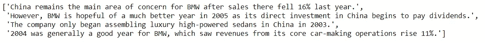

# 基于名词和数值的句子评分

> 原文：<https://towardsdatascience.com/sentence-scoring-based-on-noun-and-numerical-values-d7ac4dd787f2?source=collection_archive---------22----------------------->


在处理文本数据时，句子评分是自然语言处理(NLP)领域中最常用的过程之一。这是一个根据所用算法的优先级将数值与句子相关联的过程。

这个过程尤其在文本摘要中被高度使用。有许多流行的句子评分方法，如 TF-IDF、TextRank 等。在这里，我们将检查一种新的方法，根据名词、数值和 word2vec 的相似性对句子进行评分。

**步骤 1:导入库**

**步骤 2:文本处理和方法**

从 BBC 的一篇随机新闻文章中随机选取了一段进行研究。处理步骤如下所述:

1.  使用 NLTK sent_tokenize 中的句子标记器拆分每个句子。



2.诸如%、$、#、@等特殊字符已被删除。

3.每个句子的所有单词都被标记了。

4.停用字词列表中包含的停用字词(如 and、but、or)已被删除。

5.确保一个句子中的所有单词只出现一次。

6.词汇化已经被用来寻找词根

**加工**

***方法***

**步骤 3: Gensim Word2Vec**

使用 Gensim Word2Vec skip-gram 方法创建一个词汇化文本列表的向量列表。

**第四步:句子评分**

为了给一个句子打分，使用了两种方法:meanOfWord()和 checkNum()。这个方法有两个 pos 值列表，包括名词和数字。但问题是像“234”、“34.5”(数字前的空格)这样的数字在 NLTK pos_tag()中被视为名词。因此，使用了另一种方法 checkNum()来确认它是否是一个数字。meanOfWord()中使用的程序已经在下面提到:

1.  从 word2vec 模型中找出每个单词的相似度，并计算平均相似度
2.  检查这个单词是否是一个数字
3.  如果是数字，则平均相似度加 1，如果是名词，则平均相似度加 0.25
4.  返回更新后的平均值

对于词汇化列表中的每个句子，已经计算了平均分数并将其推入分数列表中。分数的输出将是该句子的索引号和该句子的数值分数。

我的输出是:

[[0, 2.875715106488629], [1, 3.3718763930364872], [2,2.117822954338044], [3, 4.115576311542342]]

这表明:

```
'China remains the main area of concern for BMW after sales there fell 16% last year.' got 2.875715106488629 score.'However, BMW is hopeful of a much better year in 2005 as its direct investment in China begins to pay dividends.' got 3.3718763930364872 score.'The company only began assembling luxury high-powered sedans in China in 2003.' got 2.117822954338044 score.'2004 was generally a good year for BMW, which saw revenues from its core car-making operations rise 11%.' got 4.115576311542342 score.
```

第四个句子得分最高，因为它比其他句子包含更多的名词和数值。它可能会有所不同，因为 word2vec 模型可能会为不同的迭代生成不同的向量。

**完整代码如下:**

**注意:**

在名词和数值数量非常多的情况下，这种方法会提供更好的性能。

如果你觉得这个方法有用，你可以使用它并与他人分享。欢迎在评论区写下你的建议。

**谢谢你！**