# 亚马逊电子数据集评论的情感分析和产品推荐——第一部分

> 原文：<https://towardsdatascience.com/sentiment-analysis-and-product-recommendation-on-amazons-electronics-dataset-reviews-part-1-6b340de660c2?source=collection_archive---------8----------------------->

## 第 1 部分:探索性数据分析(EDA)

# 介绍

互联网彻底改变了我们购买产品的方式。在在线市场的零售电子商务世界中，体验产品是不可行的。还有，在今天的零售营销世界里，每天都有如此多的新产品涌现出来。因此，客户需要在很大程度上依靠产品评论来做出更好的购买决策。然而，搜索和比较文本评论可能会让用户感到沮丧。因此，我们需要更好的数字评级系统的基础上审查，这将使客户购买决策容易。

在他们的决策过程中，消费者希望使用评级系统尽快找到有用的评论。因此，能够从文本评论中预测用户评级的模型至关重要。获得文本评论的整体感觉反过来可以改善消费者体验。此外，它可以帮助企业增加销售，并通过了解客户的需求来改进产品。

考虑了电子产品的亚马逊评论数据集。还考虑了用户对不同产品给出的评论和评级，以及关于用户对产品的体验的评论。

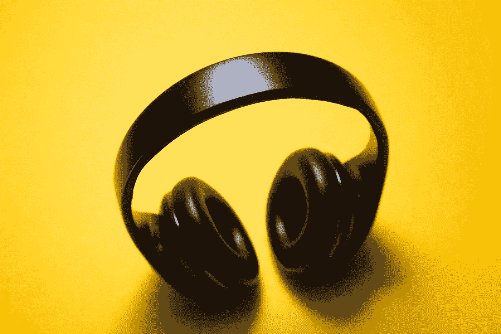

由[马尔特·温根](https://unsplash.com/@maltewingen?utm_source=unsplash&utm_medium=referral&utm_content=creditCopyText)在 [Unsplash](https://unsplash.com/s/photos/wireless-headphones?utm_source=unsplash&utm_medium=referral&utm_content=creditCopyText) 上拍摄的照片

# 问题陈述

目标是开发一个模型来预测用户评级、评论的有用性，并基于协同过滤向用户推荐最相似的项目。

# 数据收集

电子数据集由来自亚马逊的评论和产品信息组成。该数据集包括评论(评级、文本、有用性投票)和产品元数据(描述、类别信息、价格、品牌和图像特征)。

**产品完整点评数据**

该数据集包括电子产品评论，如评级、文本、有用性投票。这个数据集是从[http://jmcauley.ucsd.edu/data/amazon/](http://jmcauley.ucsd.edu/data/amazon/)获得的。原始数据是 json 格式的。json 被导入并解码，以将 json 格式转换为 csv 格式。样本数据集如下所示:

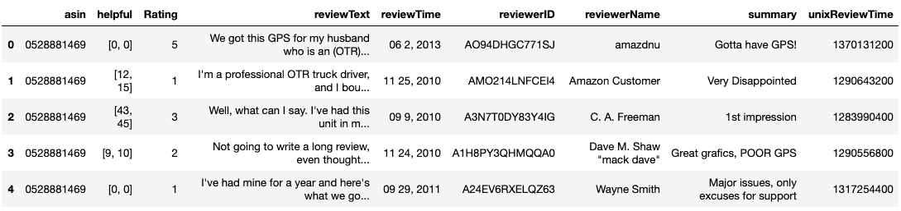

示例产品评论数据集

每行对应一个客户评论，包括以下变量:

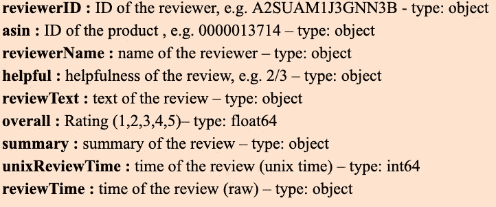

**产品元数据**

该数据集包括电子产品元数据，例如描述、类别信息、价格、品牌和图像特征。这个数据集是从[http://jmcauley.ucsd.edu/data/amazon/](http://jmcauley.ucsd.edu/data/amazon/)获得的。json 被导入并解码，以将 json 格式转换为 csv 格式。示例产品元数据数据集如下所示:

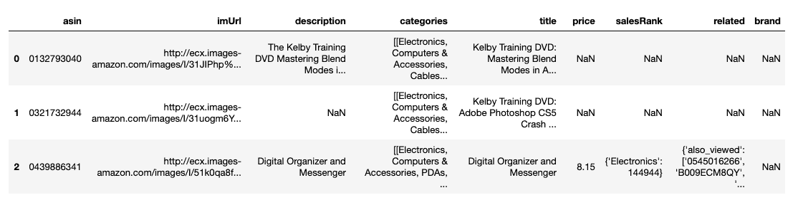

示例产品元数据集

每一行对应于产品，包括以下变量:

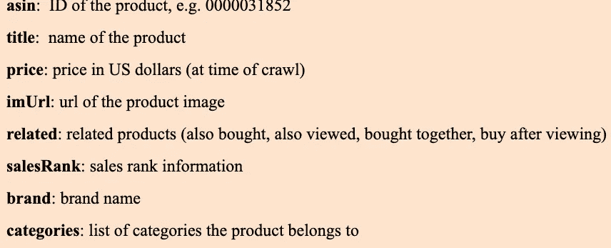

# 数据争论

## 合并数据帧

json 文件中的产品评论和元数据集保存在不同的数据框架中。使用左连接将两个数据帧合并在一起，并将“asin”保留为普通合并。最终合并的数据框描述如下所示:

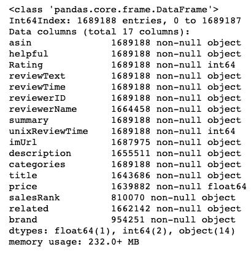

合并数据帧信息

为了减少运行模型的时间消耗，只选择了耳机产品，并采用了以下方法。

1.  在 1689188 行中，45502 行在产品标题中为空值。这些行被删除。
2.  从合并的数据帧中提取产品名称为“耳机”、“头戴式耳机”、“头戴式耳机”的数据集。最终的耳机数据集是 64305 行(观察值)。

## 处理重复项、缺失值

1.  brand 列中有 22699 行被视为空值。为了解决这个问题，从标题中提取品牌名称，并替换品牌中的空值。
2.  已删除“审阅者姓名”、“价格”、“描述”和“相关”中缺少的值。
3.  “审查文本”和“总结”连接在一起，并保存在“审查文本”功能下
4.  有益的功能被分为正面和负面反馈。
5.  大于或等于 3 的评级被归类为“好”，小于 3 的评级被归类为“差”。
6.  有用性比率是基于该评论发布反馈/总反馈来计算的
7.  已删除基于“asin”、“reviewerName”、“unixReviewTime”的重复项。删除重复项后，数据集由 61129 行和 18 个要素组成。
8.  ReviewTime 已转换为 datetime“% m % d % Y”格式。
9.  为清楚起见，对列进行了重命名。

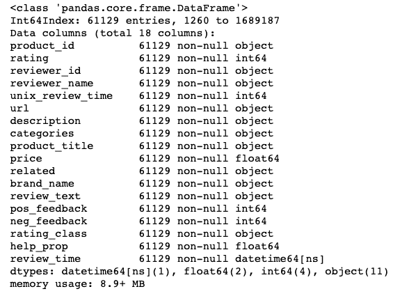

耳机数据集的描述

## 描述统计学

获得了以下汇总统计数据

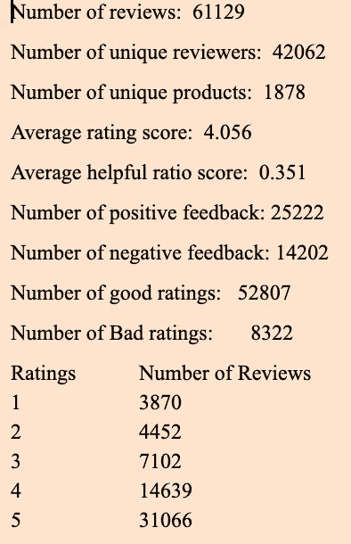

耳机数据集的汇总统计如下所示:

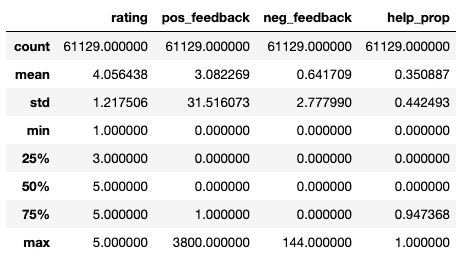

汇总统计数据

## 预处理文本

因为文本是所有可用数据中最不结构化的形式，所以文本中存在各种类型的噪声，并且在没有任何预处理的情况下，数据不容易分析。对文本进行清理和标准化，使其无噪声并可供分析的整个过程称为文本预处理。在本节中，应用了以下文本预处理。

**移除 HTML 标签**

HTML 标签，它通常不会为理解和分析文本增加多少价值。HTML 单词已从文本中删除。

**去除重音字符**

重音字符/字母被转换并标准化为 ASCII 字符。

**扩张收缩**

缩写是单词或音节的缩写。它们以书面或口头的形式存在。现有单词的缩短版本是通过删除特定的字母和声音创建的。在英语缩写的情况下，它们通常是通过从单词中去掉一个元音而产生的。

本质上，缩写确实给 NLP 和文本分析带来了问题，因为首先，我们在单词中有一个特殊的撇号字符。理想情况下，我们可以为缩写和它们相应的展开建立一个适当的映射，然后用它来展开文本中的所有缩写。

**删除特殊字符**

文本规范化的一个重要任务是去除不必要的和特殊的字符。这些可能是出现在句子中的特殊符号，甚至是标点符号。该步骤通常在标记化之前或之后执行。这样做的主要原因是因为当我们分析文本并利用它来提取基于 NLP 和 ML 的特征或信息时，标点符号或特殊字符通常没有多大意义。

**词汇化**

词汇化的过程是去除词缀以获得单词的基本形式。基本形式也被称为词根，或引理，将始终存在于字典中。

**删除停用词**

停用词是意义不大或没有意义的词。它们通常在处理过程中从文本中删除，以保留具有最大意义和上下文的单词。停用词通常是在你根据单数标记聚合任何文本语料库并检查它们的频率时出现次数最多的词。像 a、the、me 等词是停用词。

**构建文本规范化器**

基于我们上面写的函数和附加的文本校正技术(例如小写文本，并删除多余的换行符、空格、撇号)，我们构建了一个文本规范化器，以帮助我们预处理 new_text 文档。

在对“review_text”文档应用文本规范化器之后，我们应用标记化器为干净的文本创建标记。结果，我们总共有 3070479 个单词。清洗后，我们有 25276 个观察值。

干净的数据集将允许模型学习有意义的特征，而不会过度适应不相关的噪声。在完成这些步骤并检查其他错误之后，我们可以开始使用干净的、带标签的数据在建模部分训练模型。

# 探索性数据分析

收集数据后，对数据进行辩论，然后进行探索性分析。通过探索性分析探讨了以下见解。

*   根据评论预测评分
*   对大量评论有用
*   评分与评论数量
*   评级与评论比例
*   有用比例与评论数量
*   评级与有用性比率
*   最受欢迎的 20 种产品
*   垫底的 20 种受评产品
*   积极和消极的话
*   不同评级、品牌等的世界云

## **20 大最受关注品牌**

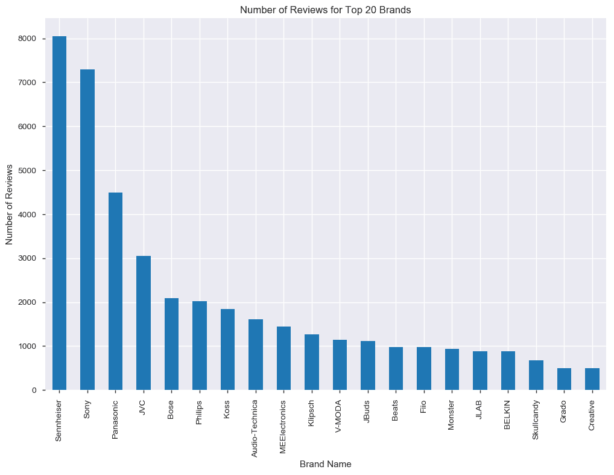

评论最多的 20 大品牌

## **20 大最少评论品牌**

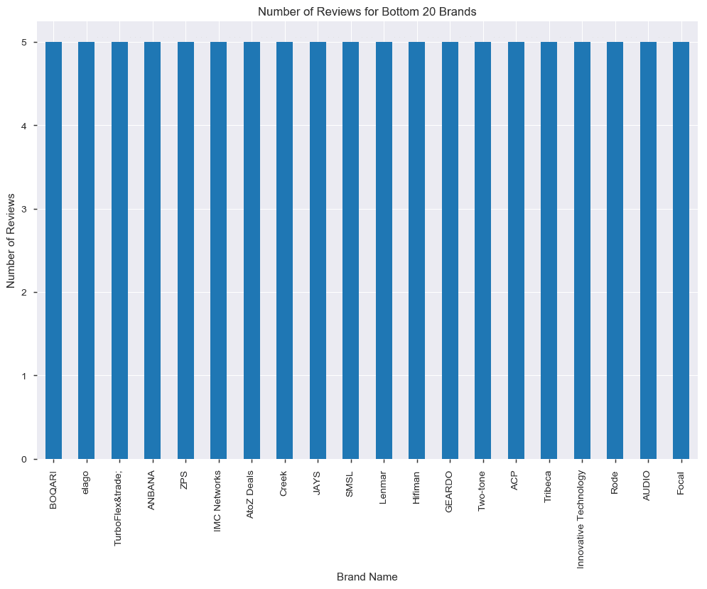

前 20 个评论最少的品牌

## **20 大最受关注产品**

20 大最受关注的产品

## **评论最积极的耳机**

亚马逊在耳机类别下评价最高的产品是“松下 ErgoFit 入耳式耳塞耳机 RP-HJE120-D(橙色)动态晶莹剔透的声音，符合人体工程学的舒适贴合”。该产品总体优良率超过 3。

## **以上产品几年后会怎么样？**

从 2010 年起，松下耳塞耳机获得了总体正面评价。评级在一段时间内的分布如下所示。该产品的总体良好均值评级超过 4。

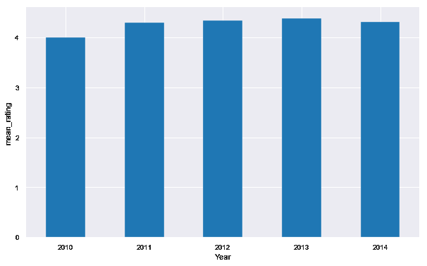

松下耳塞耳机的年平均额定值对比

这个词来自对上述产品的良好评级评论。从卖家的角度来看，它显示了主要的洞察力。**表示大部分积极的客户同意“非常合适”、“价格合理”，最不同意“音质”。**同样，该词来源于对上述产品的不良评级评论。**表示大部分客户认可“质量差”和“声音太差”。** **从卖家的角度来看，本产品需要更新“更好的声音”和“质量”，以获得客户的积极反馈。**

来自松下耳机良好评级评论的真知灼见

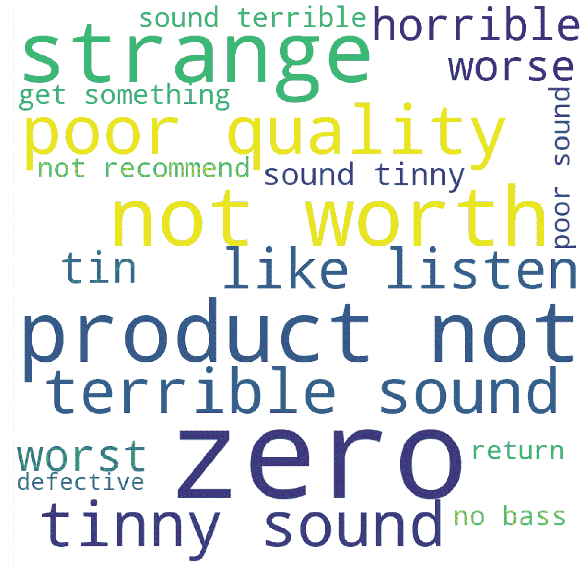

来自松下耳机不良评级评论的真知灼见

## **评论最负面的耳机**

亚马逊耳机类别中评论最负面的产品是“我的区域无线耳机”。该产品的整体不良评级低于 3。

## **以上产品几年后会怎么样？**

除 2012 年外，从 2010 年起，我的 zone 无线耳机受到了全面的负面评价。评级在一段时间内的分布如下所示。该产品的总体不良均值评级约为 2.5。

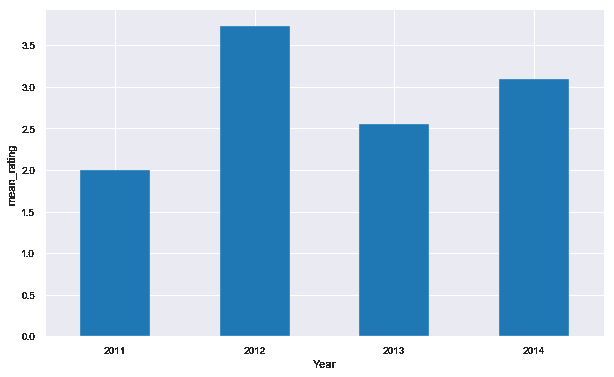

My zone 无线耳机的年度与平均等级对比

下面显示了来自上述产品的良好评级评论的词云。从卖家的角度来看，它显示了主要的洞察力。**表示大部分积极的客户同意“轻松设置”、“配合电视工作”，而不太同意“工作出色”。**同样，上述产品的不良评级引发的“云”一词也显示如下。**表示大部分客户认同“电池问题”、“糟糕的接收”、“静电干扰”。** **从卖家角度看，本产品需要更新“优质电池”、“收货问题”、“静态问题”，以获得客户的积极反馈。**

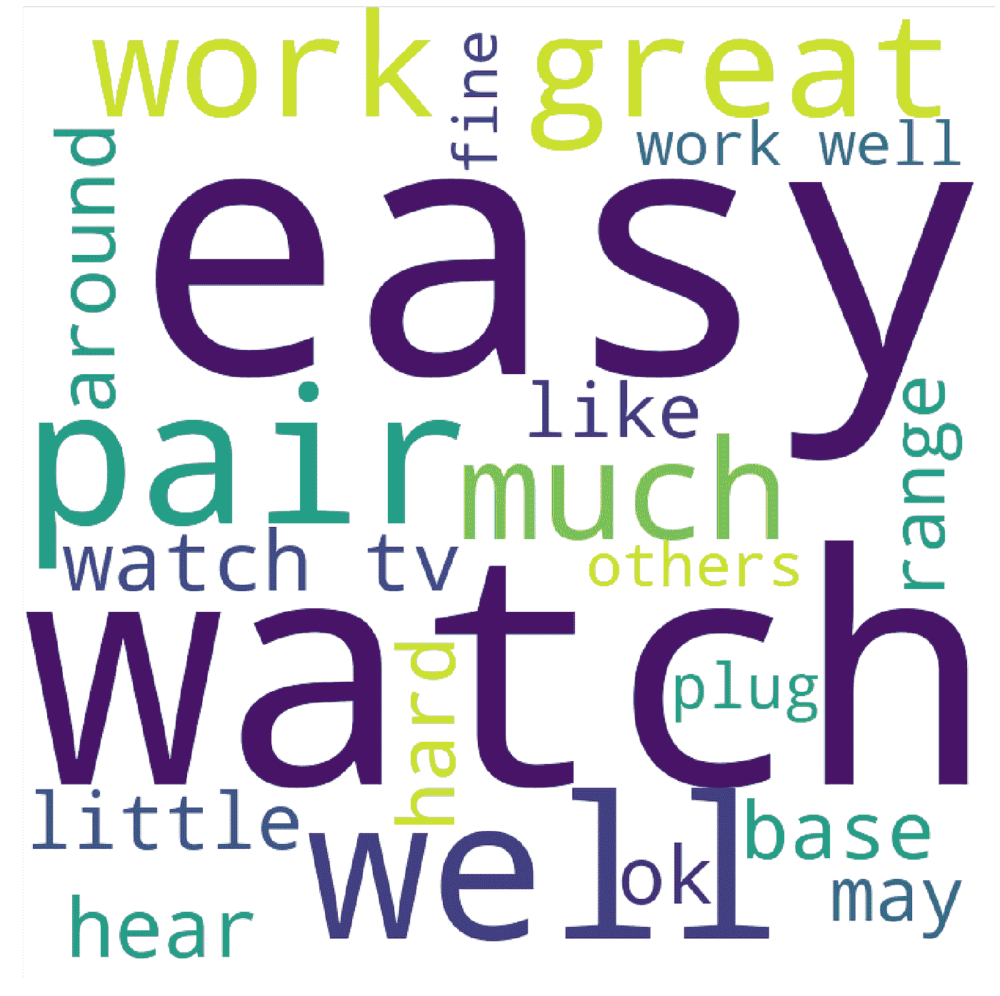

我的区域无线耳机好评中的真知灼见

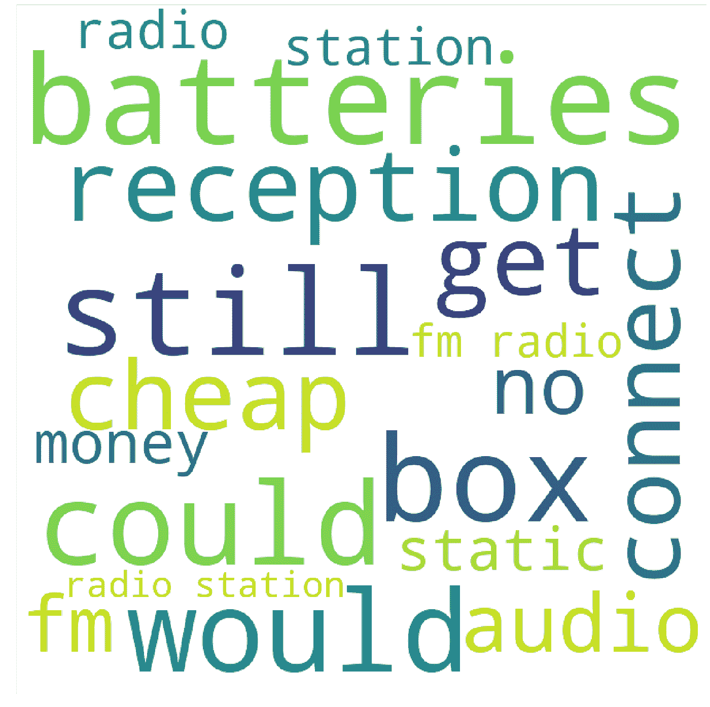

我的区域无线耳机差评中的真知灼见

## 哪个评分获得的评论数最高？

顾客对他们在 2000 年至 2014 年期间从亚马逊购买的耳机写了评论，评级从 1 到 5。评级与评论数量的分布和百分比如下所示。与其他评级相比，评级为 5 的评论数量较高。总的来说，顾客对他们购买的产品很满意。大约 50%的顾客给他们购买的产品打了 5 分。只有 15%的顾客给出了低于 3 分的评价。

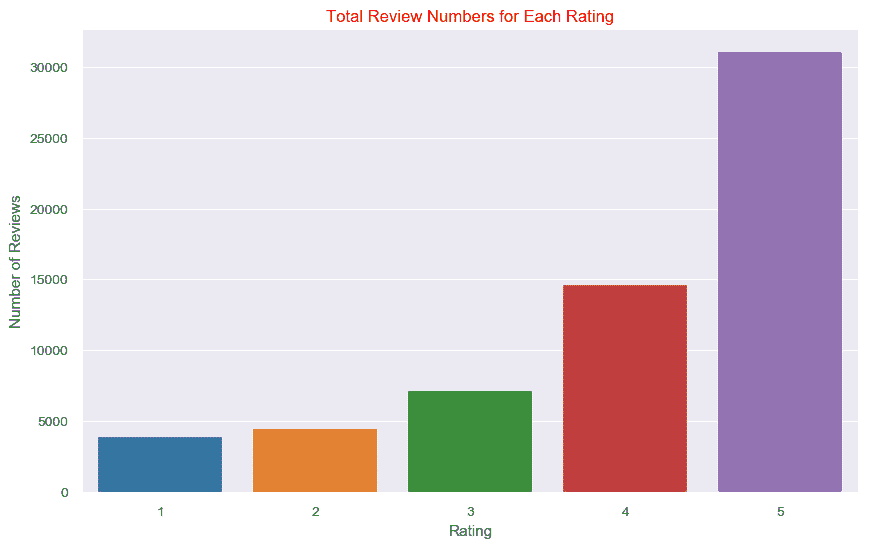

评分与评论数量

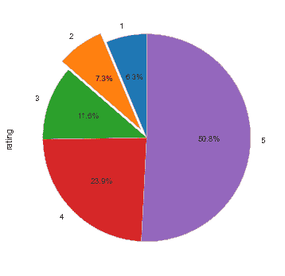

评分分布与评论数量

评级分为两类。低于 3 的评级被分类为“差”,其余的评级被分类为“好”。评级类别与评论数量的分布如下所示。它表明，约有 50000 条评论被评为良好评级。

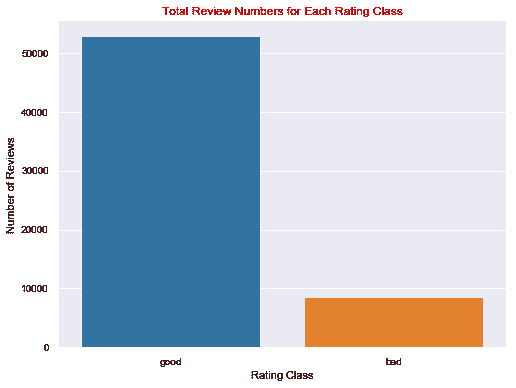

每个评级类别的审核总数

评级与有用性比率的分布如下所示。这表明所有评级都具有相同的有用性比率。

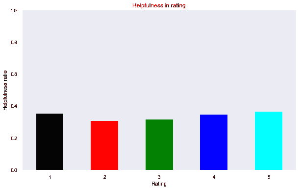

评级中的有用性

## **哪个评分获得了最高数量的评论长度？**

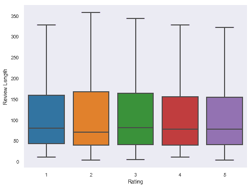

评分与评论长度

## **哪一年的评论数最高？**

每年的审查总数如下所示。2000 年至 2010 年期间，审查数量较少。2013 年评论数最高。

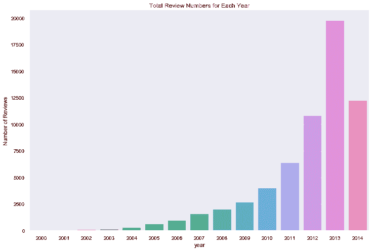

评分与评论长度

## **哪一年的客户数量最多？**

每年的独立客户总数如下所示。在 2000 年至 2010 年期间，独立客户数量较低。2013 年的客户数量最多。

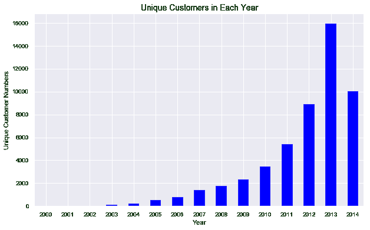

每年的独特客户

## **哪一年的产品数量最多？**

每年的独特产品总数如下所示。2000 年至 2010 年期间，独特产品的数量很少。2013 年产品数量最多。

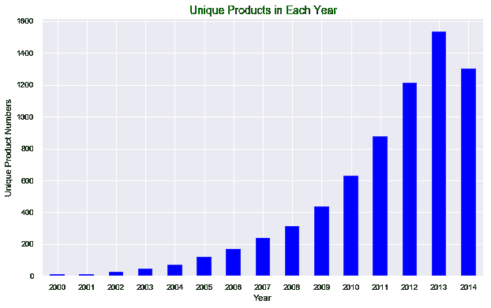

每年独特的产品

## **哪一年的产品数量最高？**

除了 2001 年，“良好评级”的百分比超过了 80%。2001 年的整体满意度最低，为 69%。在 2000 年，良好评级的百分比是 90%。从图表中可以看出，耳机产品的总体好评率在 81%到 90%之间。

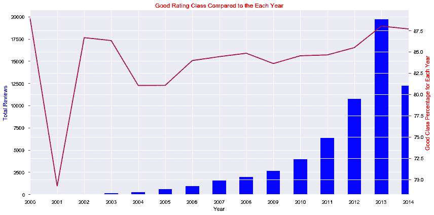

一段时间内良好评级等级的分布

## **产品的平均有用性**

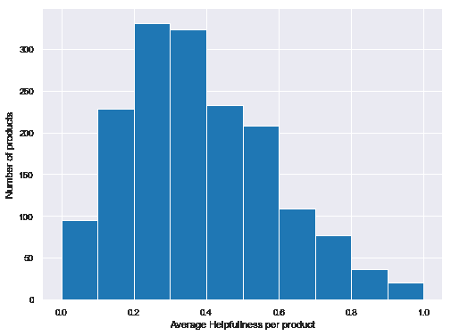

每个产品的平均有用性分布

## **评审长度分布**

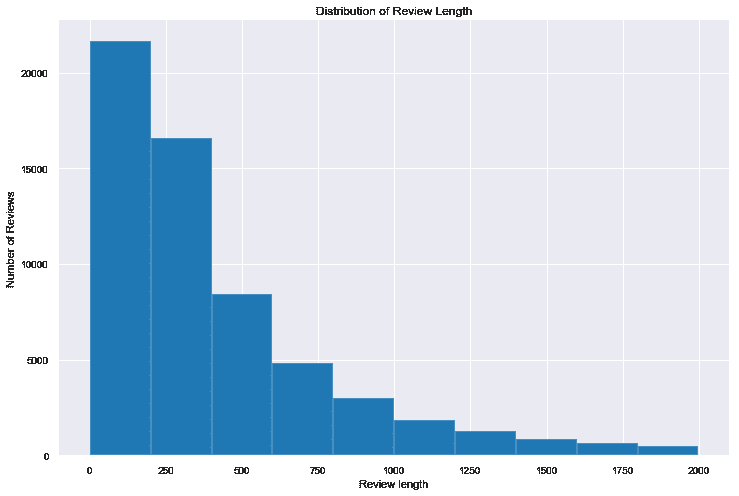

评论长度的分布

## **哪个评论长度 bin 的好评率最高？**

如下图所示，96 %的好评在 0-1000 字之间，而 80%的好评在 1700-1800 字之间。随着审查时间的延长，良好评级会增加。一般来说，写了较长评论(超过 1900 字)的客户往往会给出好的评价。

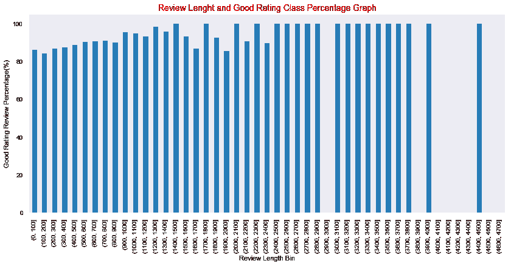

评论长度与良好评级的分布

## **哪个评论长度 bin 的有用性比率最高？**

从下面可以看出，最高的帮助率在 0-1200 个单词之间，0.8，而最低的帮助率在 1200-1300 个单词之间，0.6。随着审查时间的延长，有用性比率趋于增加。一般来说，写了较长评论(超过 1300 字)的客户往往有较高的有用性比率。

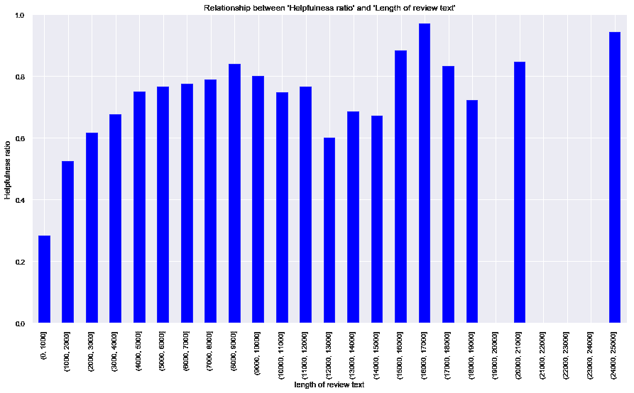

综述长度与有用性比率的分布

有益和无益的审查长度的频率如下所示。它表明，总的有益和无益的比例是相同的较长的审查长度。在小篇幅评论情况下，无用比率较高。

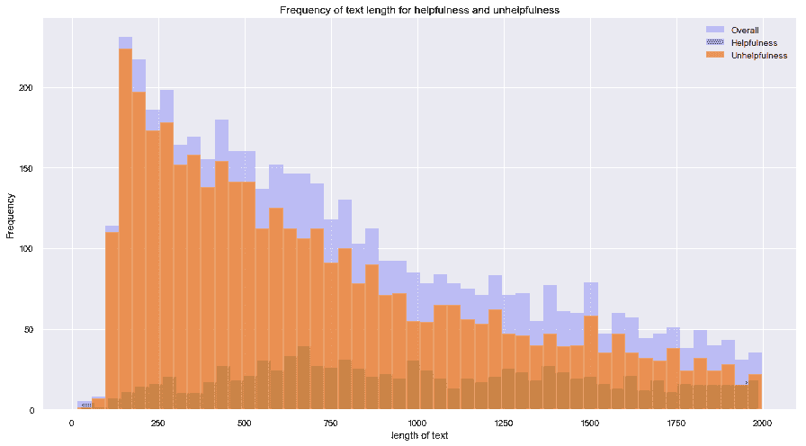

评论长度与有益和无益的分布

## **获得好评的热门词汇？**

下面列出了最常见的 50 个单词，这些单词属于良好评级类别。它展示了顾客对产品的所有好评。

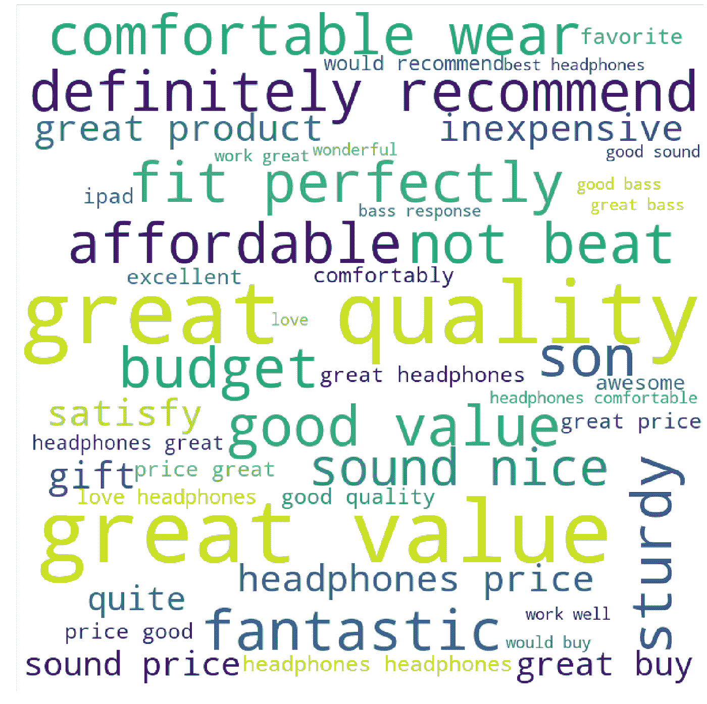

好的评价词

## **差评热门词汇？**

同样，最常见的单词，属于差评类，如下所示。它显示了顾客对产品的所有负面评价。

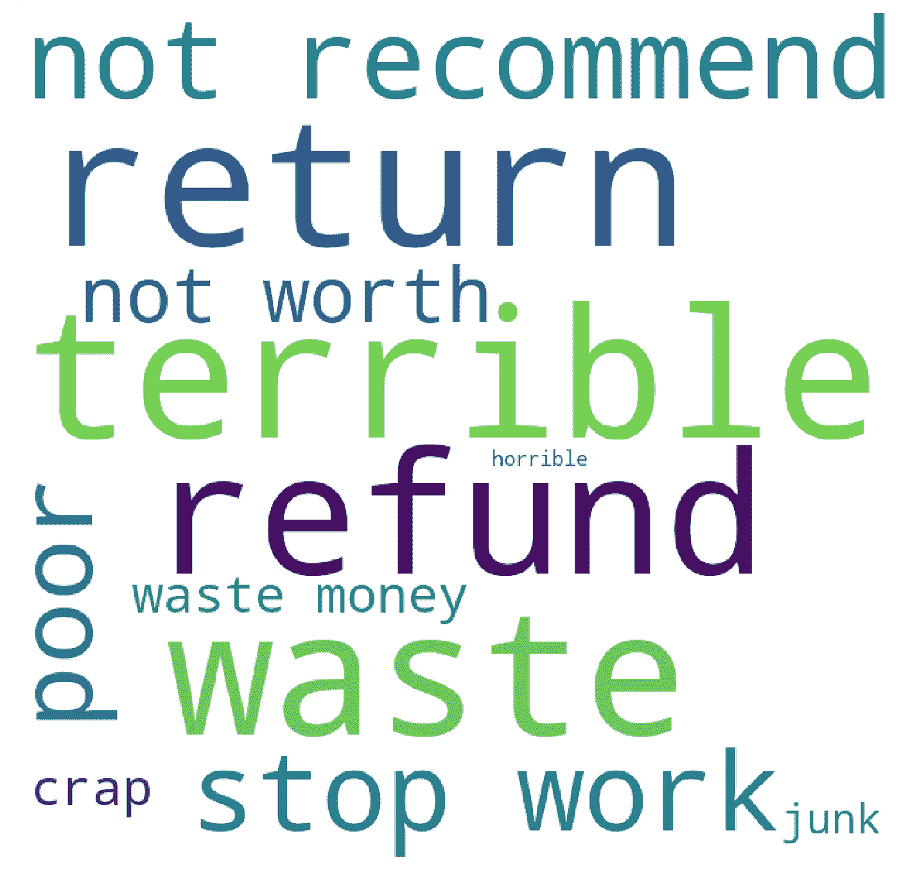

不良评价词

## ***代码:***

## 数据争论:

[https://github . com/umar aju 18/Capstone _ project _ 2/blob/master/code/Amazon-Headphones _ data _ wrangling . ipynb](https://github.com/umaraju18/Capstone_project_2/blob/master/code/Amazon-Headphones_data_wrangling.ipynb)

## EDA:

 [## umaraju18/Capstone_project_2

### permalink dissolve GitHub 是超过 5000 万开发人员的家园，他们一起工作来托管和审查代码，管理…

github.com](https://github.com/umaraju18/Capstone_project_2/blob/master/code/Amazon-headphones_EDA.ipynb) 

## [第二部分:情感分析和产品推荐](https://medium.com/@umacivil2003/sentiment-analysis-and-product-recommendation-on-amazons-electronics-dataset-reviews-part-2-de71649de42b)