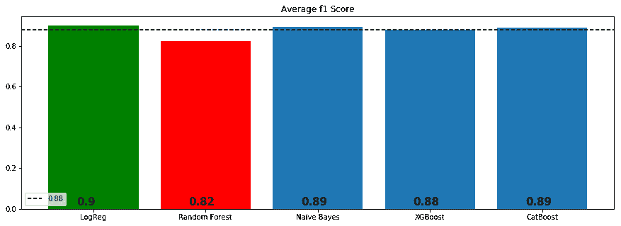
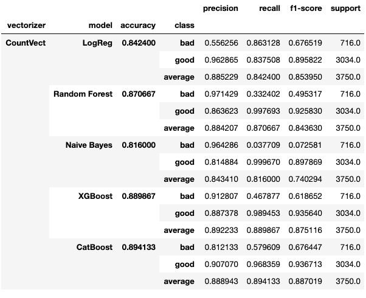
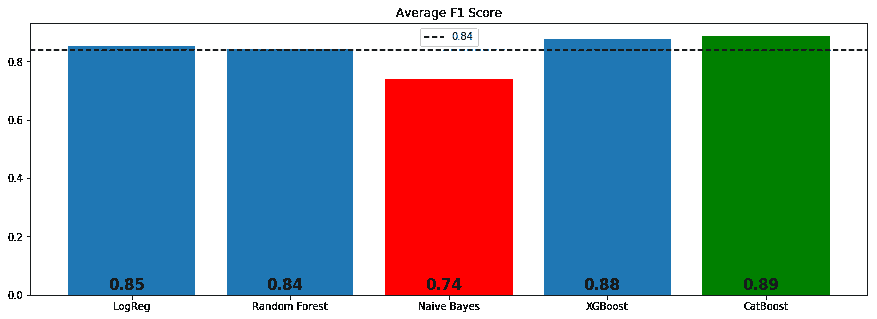
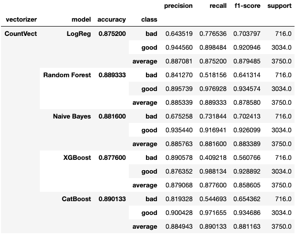
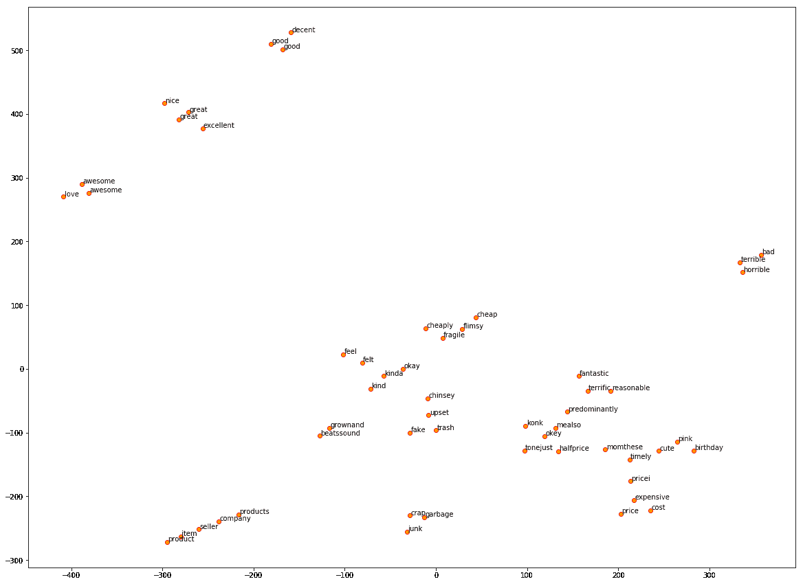
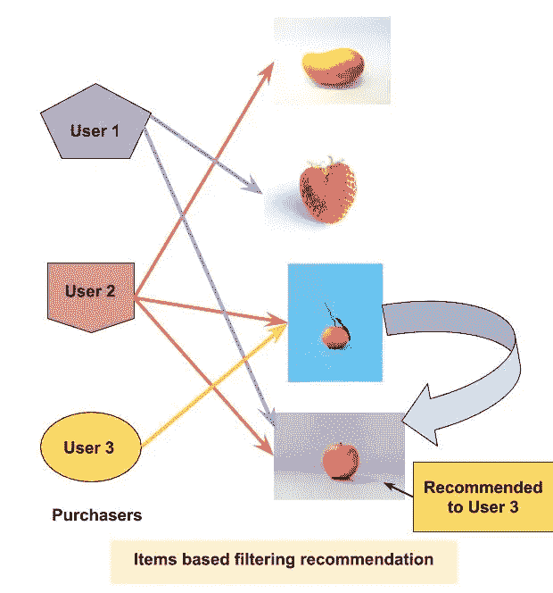
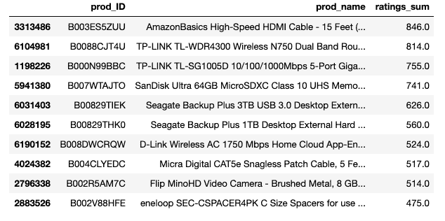

# 亚马逊电子数据集评论的情感分析和产品推荐——第二部分

> 原文：<https://towardsdatascience.com/sentiment-analysis-and-product-recommendation-on-amazons-electronics-dataset-reviews-part-2-de71649de42b?source=collection_archive---------22----------------------->

## 第 2 部分:情感分析和产品推荐

# 情感分析

机器学习模型以数值作为输入。评论是由句子组成的，所以为了从数据中提取模式；我们需要找到一种方法，以机器学习算法可以理解的方式来表示它，即作为一系列数字。

# 特征抽出

特征工程是使用数据的领域知识来创建使机器学习算法工作的特征的过程。要素本质上通常是数字，可以是绝对数值或分类要素，可以使用一种称为“一键编码”的过程将这些要素编码为列表中每个类别的二进制要素。提取和选择特征的过程既是艺术又是科学，这个过程称为特征提取或特征工程。

作为其中的一部分，单词包模型、TF-IDF、哈希矢量器、Word2Vec 以及将最常见的单词添加到停用词列表、SMOTE、PCA 和截断 SVD 技术作为特征工程和选择的一部分添加到以下部分中的分类模型中。

# 数据预处理

出于计算方面的考虑，2010 年早些时候评论的 good_rating_class_reviews 超过 150 个单词的功能被删除。最终的数据集由 15000 个观察值组成。从数据集中，“干净文本”和“评级类别”分别被视为“X”(特征)和“Y”(变量)。数据集被分成 75%作为训练，25%作为测试。

# 机器学习模型

该模型需要根据从亚马逊购买耳机的客户撰写的评论来预测情绪。这是一个有监督的二元分类问题。Python 的 Scikit 库被用来解决这个问题。实现了以下机器学习算法。

## **逻辑回归**

逻辑回归，尽管它的名字，是一个线性模型的分类，而不是回归。逻辑回归在文献中也称为 logit 回归、最大熵分类(MaxEnt)或对数线性分类器。在这个模型中，描述单个试验的可能结果的概率使用逻辑函数建模。

## **朴素贝叶斯**

朴素贝叶斯为多项式分布数据实现了朴素贝叶斯算法，并且是文本分类中使用的两种经典朴素贝叶斯变体之一(其中数据通常表示为词向量计数)。该算法是流行的朴素贝叶斯算法的一个特例，它专门用于我们有两个以上类的预测和分类任务。

## **随机森林分类器**

随机森林是一种元估计器，它在数据集的各个子样本上拟合多个决策树分类器，并使用平均来提高预测精度和控制过拟合。子样本大小始终与原始输入样本大小相同，但如果 bootstrap=True(默认)，则使用替换来绘制样本。

## **XGBoost 分类器**

XGBoost 的意思是极端的梯度增强。XGBoost 是一个基于决策树的集成机器学习算法，它使用了一个[梯度推进](https://en.wikipedia.org/wiki/Gradient_boosting?source=post_page---------------------------)框架。在涉及非结构化数据(图像、文本等)的预测问题中。)人工神经网络往往优于所有其他算法或框架。然而，当涉及到中小型结构化/表格数据时，基于决策树的算法目前被认为是同类最佳的。

## **CatBoost 分类器**

CatBoost 是一种在决策树上进行梯度提升的算法。“CatBoost”名字来源于两个词“Category”和“Boosting”。该库适用于多种类别的数据，如音频、文本、图像，包括历史数据。

# 评估指标

由于我们的案例中存在数据不平衡，因此必须使用适当的度量来评估分类器的性能，以便考虑类别分布并更多地关注少数类别。基于这一思想，使用 f1 分数作为我的评估标准，f1 分数是精确度和召回率的调和平均值。

理解我们的模型产生的错误类型是很重要的。可视化信息的一个好方法是使用混淆矩阵，它将我们的模型做出的预测与真实标签进行比较。考虑到这一点，除了我们的评估指标(f1 分数)之外，还使用了混淆矩阵。

# 建模

由于评论的等级不是正态分布的，等级 1-2 被归类为“差”，等级 3-4-5 被归类为“好”。在特征选择方面，使用了最小/最大方向图、主成分分析和奇异值分解的单词出现阈值。对于特征工程，将计数矢量器、TF-IDF、散列矢量器和 Word2Vec 应用于文本数据，以便将文本文档集合转化为数字特征向量。

## **袋字模型**

单词袋模型可能是从文本文档中提取特征的最简单也是最强大的技术之一。这种特定的策略(标记化、计数和规范化)被称为单词袋或“n-grams 袋”表示法。该模型的本质是将文本文档转换成向量，使得每个文档都被转换成表示该特定文档的文档向量空间中存在的所有不同单词的频率的向量。下图显示**逻辑回归以 0.896267 胜出。**

F1 平均分数

## **TF-IDF 型号**

TF-IDF 代表术语频率-逆文档频率，这是两个指标的组合:术语频率和逆文档频率。为了更多地关注有意义的单词，TF-IDF 得分(术语频率-逆文档频率)被用于我们的单词袋模型之上。TF-IDF 根据单词在我们的数据集中的稀有程度来衡量单词，忽略那些过于频繁并且只会增加噪音的单词。-IDF 的工作方式是通过为这些常用词分配较低的权重来惩罚它们，同时对出现在特定文档的子集中的词给予重视。下图显示 **CatBoosting 以 0.896533 分胜出。**

F1 平均分数

## **哈希矢量器**

哈希矢量器被设计成尽可能地节省内存。矢量器不是将记号存储为字符串，而是应用哈希技巧将它们编码为数字索引。这种方法的缺点是，一旦矢量化，就无法再检索要素的名称。下图显示 **CatBoosting 以 0.894133 分胜出。**

F1 平均分数

## **将最常用和最不常用的词添加到停用词表(计数矢量器)**

因为在不同的类中没有太多不同的词，所以应用添加到停用词列表和模型中的最常见和最不常见的 70 个词，以便查看评估度量中的任何变化。下图显示 **CatBoosting** **以 0.890133 分**胜出。将最常用和最不常用的单词添加到停用词表中对模型的性能没有影响。

F1 平均分数

## **应用 Word2Vec 和简单神经网络**

我们使用 Word2Vec 创建了单词向量，该模型有 26548 个唯一的单词，其中每个单词的向量长度为 100。然后我们在一个简单的神经网络中使用这些密集的向量——单词嵌入——来进行预测。在训练和验证准确度图中，模型在第一个时期后开始过度拟合。这个简单神经网络的精度是 0.7992。

上面给出了在用 t-SNE 将感兴趣的单词和它们的相似单词的维数减少到 2-D 空间之后，使用它们的嵌入向量对它们进行可视化。也可以查看基于 gensim 模型的类似单词。

# 产品推荐

直到最近，人们通常倾向于购买朋友或信任的人推荐给他们的产品。这曾经是对产品有任何疑问时的主要购买方法。但随着数字时代的到来，这个圈子已经扩大到包括利用某种推荐引擎的在线网站。

推荐引擎使用不同的算法过滤数据，并向用户推荐最相关的项目。它首先捕捉客户过去的行为，并在此基础上推荐用户可能会购买的产品。

如果我们能够根据客户的需求和兴趣向他们推荐一些商品，这将对用户体验产生积极的影响，并导致频繁的访问。因此，现在的企业正在通过研究用户过去的行为来构建智能的推荐引擎。使用项目-项目协同过滤。

# 数据处理

在将电子评级数据集与产品元数据合并后，空值将从数据集中删除。总特征是 7530925。最终数据集如下所示。

产品推荐的最终数据集

# 项目-项目协同过滤

当用户数量多于推荐的项目时，这种协作过滤是有用的。用户数(4053964)大于项目数(469625)。

在该过滤中，计算每个项目对之间的相似度，并基于该相似度推荐用户过去喜欢的相似项目。采用“项目用户”评级的加权总和。基于项目的过滤过程如下所示。

作者绘图。来自 Unsplash 的免费图片

## **用户评分总和排名前十的热门产品**

按用户评分总和列出的十大热门产品

## **产品推荐**

产品推荐

# 结论

使用计数向量、TF-IDF、散列向量、Word2Vec、分类模型和简单神经网络，并向 CountVect 添加最常用和最不常用的词，来预测基于顾客留下的评论的评级分数。从分析中发现，具有 TF-IDF 的 CatBoosting 得分为 0.890586)或具有计数矢量化的 Logistic 回归(f1 得分为 0.899891)是最佳模型。将最常用和最不常用的单词添加到停用词表中并不会对模型的性能产生影响。

# **代码:**

情感分析:

[https://github . com/umar aju 18/Capstone _ project _ 2/blob/master/code/Amazon _ headphones _ Analysis _ CV _ IF _ IDF _ hash . ipynb](https://github.com/umaraju18/Capstone_project_2/blob/master/code/Amazon_headphones_Sentiment_Analysis_CV_IF_IDF_HASH.ipynb)

[https://github . com/umar aju 18/Capstone _ project _ 2/blob/master/code/Amazon _ headphones _ word vec . ipynb](https://github.com/umaraju18/Capstone_project_2/blob/master/code/Amazon_headphones_wordvec.ipynb)

推荐系统:

[https://github . com/umar aju 18/Capstone _ project _ 2/blob/master/code/Amazon _ electronics _ recommendation . ipyn](https://github.com/umaraju18/Capstone_project_2/blob/master/code/amazon_electronics_recommendation.ipynb)b

## [第一部分:探索性数据分析](https://medium.com/@umacivil2003/sentiment-analysis-and-product-recommendation-on-amazons-electronics-dataset-reviews-part-1-6b340de660c2)