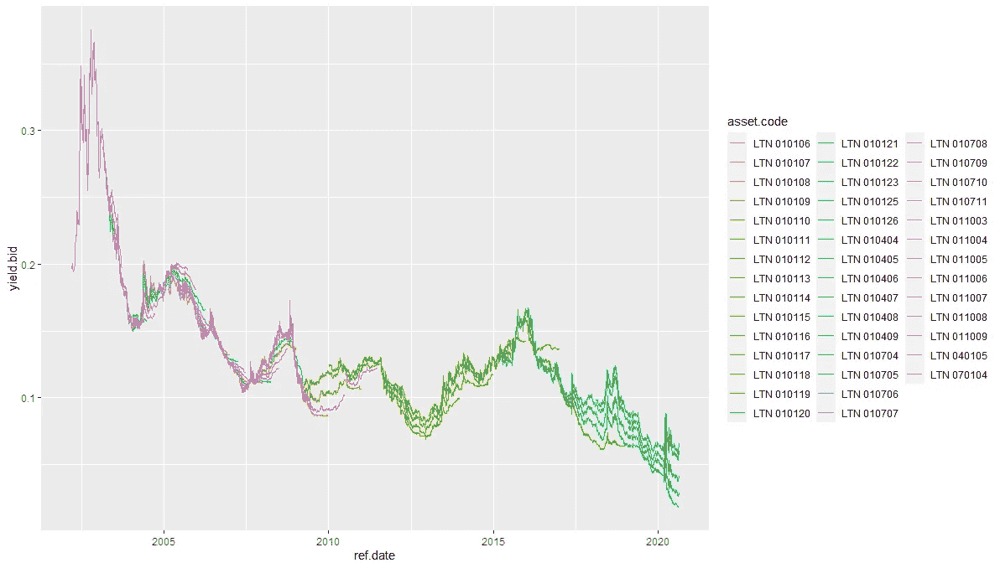
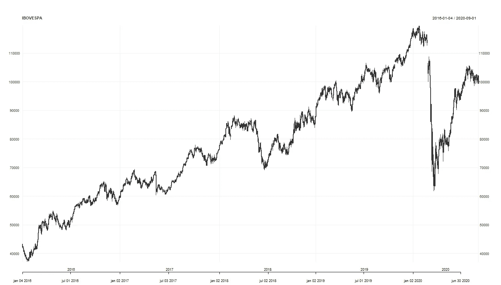
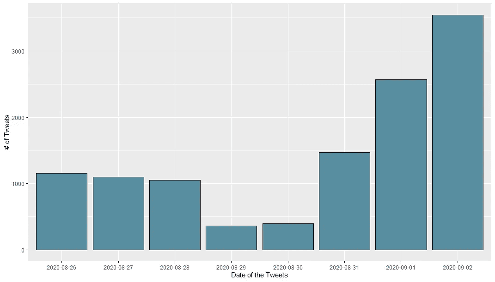
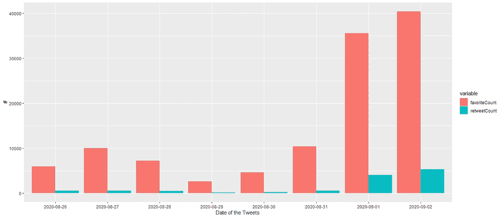
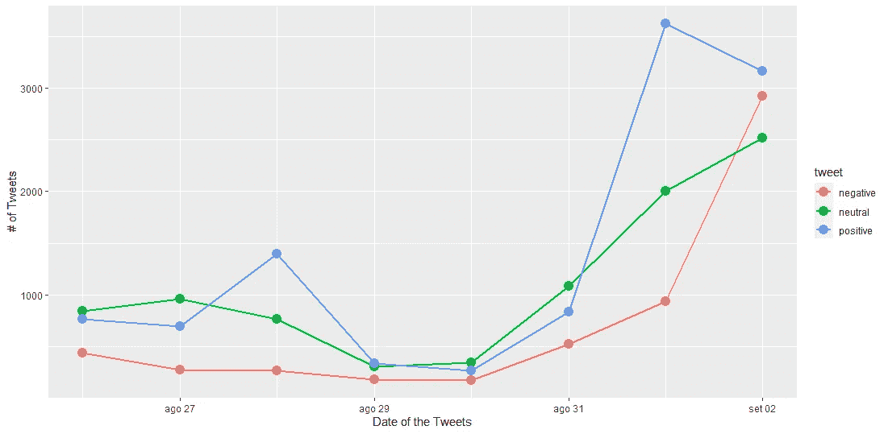

# 情绪分析和股票市场:一个新的巴西故事？

> 原文：<https://towardsdatascience.com/sentiment-analysis-and-the-stock-market-a-brazilian-tale-be128098787e?source=collection_archive---------45----------------------->

## 尽管规模很小，但巴西 Fintwit 增长迅速，引发了人们对巴西股市泡沫的担忧。


[自由股票](https://unsplash.com/@freestocks?utm_source=unsplash&utm_medium=referral&utm_content=creditCopyText)在 [Unsplash](https://unsplash.com/photos/Lh_sFxD8AkI?utm_source=unsplash&utm_medium=referral&utm_content=creditCopyText) 上的照片

***来自《走向数据科学》编辑的提示:*** *虽然我们允许独立作者根据我们的* [*规则和指导方针*](/questions-96667b06af5) *发表文章，但我们并不认可每个作者的贡献。你不应该在没有寻求专业建议的情况下依赖一个作者的作品。详见我们的* [*读者术语*](/readers-terms-b5d780a700a4) *。*

巴西经济最近的周期性变化导致大量个人进入股票市场。由于该国的历史高利率，这些投资者习惯于将资金投资于政府债券或储蓄账户，但是，一旦通胀自 2016 年以来似乎得到控制，随着央行降低基本利率(即 SELIC)，低风险投资的回报开始受到影响。

正如我们在下图中看到的，LTN 债券的年回报率曾经超过 10%，但目前的名义收益率不超过 6%。



LTN 自 2002 年起放弃申办

随着巴西投资者开始寻找新的替代投资方式，Ibovespa(巴西市场的主要指数)开始无情地上涨，直到最近冠状病毒爆发。正如我们在下图中看到的，在冠状病毒爆发后，巴西股市跟随世界其他市场的趋势，恢复得非常快。



Ibovespa 指数(2016–2020)

尽管目前尚不清楚价格是否会回到 2019 年 12 月的水平，但许多基金经理已经提出了资产价格可能已经过高的可能性，因为这一运动涉及巴西投资者资源的重新分配。无论如何，其中一位经理最近[提出了一种可能性，即巴西的 fintwit 社区可能会引发查尔斯·金德尔伯格(Charles Kindleberger)所说的“欣快症”](https://valor.globo.com/financas/noticia/2020/08/06/squadra-ve-possivel-bolha-em-acoes-inflada-por-redes-sociais.ghtml)——为股市泡沫铺平道路。这真的会发生吗？

本文的目标是评估这种可能性，首先提供该社区规模的概述。最后，应用情感分析算法，了解这些推文中的观点是否在总体上保持平衡趋势。重要提示:我们不打算分析这些观点最终是推动市场，还是受市场影响。而仅仅是为了了解这些观点是否过于积极，以这种方式营造出一种欣快的氛围。这样，我不仅会使用 tweets，还会使用 retweets，因为这让我们更清楚地知道有多少人可能会查看这些信息。

当然，我们的第一步是收集推文。我不打算对此进行过多的探讨，因为这里有无数的文本在讨论不同的程序和技术。对于这个分析，我将使用 R 和 twitteR 包。这个包有一个限制:我们不能收集超过七天的推文。尽管有这个限制，让我们看看这个短时间范围能告诉我们什么。我搜索的术语是:

*   *IBOVESPA*
*   *投资*
*   *Ibov*
*   *Ibovespa 指数中的所有资产(76 项资产)*

因此，我们的时间范围和搜索的术语如下所示:

```
setup_twitter_oauth(consumerKey, consumerSecret, 
                    access_token = accessToken, 
                    access_secret = accessTokenSecret)#Collect the tweets into lists
list1 <- searchTwitter('Ibovespa',n=10000, lang="pt", 
                       since='2020-08-26', until ='2020-09-03')
list2 <- searchTwitter('Investimento', n=10000,  lang="pt", 
                       since='2020-08-26', until ='2020-09-03')
list3 <- searchTwitter('Ibov', n=10000, lang="pt", 
                       since='2020-08-26', until ='2020-09-03')
list4 <- searchTwitter(list_of_assets, n=10000, lang="pt",
                       since='2020-08-26', until ='2020-09-03')#Concatenate them
list_ <- c(list1, list2, list3, list4)#Create a df from the list_assets
df_assets <- twListToDF(list_assets)
df_assets <- df_ativos[, order(names(df_assets))]
df_assets$created <- strftime(df_assets$created, '%Y-%m-%d')
```

有了我们的 df，我们可以看到每天有多少 tweets 是用搜索词生成的。首先，我不会考虑 RTs，正如我们在下图中看到的，图表显示，每天人们可以在 Twitter 上找到至少 1400 条关于这些术语的推文，我认为这是很重要的，因为尽管巴西股市最近有所扩张，但它仍然高度集中。因此，能够在 Twitter 上生成内容或单独发表观点的用户数量非常少。

```
#Df with number of tweets each day
df_q <- data.frame(df_assets %>% count(created))
ggplot(df_q, aes(created, n)) + 
  geom_bar(stat = "identity", color="black", fill=rgb(0.1,0.4,0.5,0.7)) +
  labs(y="# of Tweets", x = "Date of the Tweets")
```



每天的推文

所有这 22，000 条推文都是由大约 5，000 名用户创建的，这意味着在此期间，每个用户都发了 4 次关于这些主题的推文。但是我们忽略了一些东西:有多少用户真正加入了这个社区。虽然不可能说有多少其他用户看到了这些推文，但我们可以评估他们的参与度。我们可以很容易地看到波纹管。“favoriteCount”变量的平均值为 14，547，retweetCount 的平均值为 1，437。这就是为什么我们可以说，参与度并不真正重要:每天 1400 条推文中的每一条，平均来说，都不会超过 10 个 Favs 和 1 个 Rt。

```
#Df with sum of favs and rts for each tweet per day
df_favs <- aggregate(favoriteCount ~ created, df_assets, sum)
df_rts <- aggregate(retweetCount ~ created, df_assets, sum)
df_interac <- merge(df_favs, df_rts)df_interac2 <- melt(df_interac)ggplot(df_interac2, aes(x=created, y=value, fill=variable)) +
  geom_bar(stat='identity', position='dodge') +
  labs(y="#", x = "Date of the Tweets")
```



每天的交互(Favs 和 Rts)

在我们的样本中，这种参与是由 11，700 个独立用户产生的，仅占当前投资者总数的 0.44%。这并不真正具有代表性，但我们至少可以说，在这个社交网络中真的有一种欣快感，最终可能会影响股票市场吗？为了进行分析，我们需要一个函数，它能够根据之前选择的正面和负面单词来确定每个文本的得分。

```
#Positive and Negative Word
pos <- scan('positive_words.txt', what='character', comment.char=';') 
neg <- scan('negative_words.txt', what='character', comment.char=';')#Sentiment score model
score.sentiment <- function(sentences, pos.words, neg.words){
  scores <- laply(sentences, function(sentence, pos, neg){
    sentence <- gsub('[[:punct:]]', "", sentence)
    sentence <- gsub('[[:cntrl:]]', "", sentence)
    sentence <- gsub('\\d+', "", sentence)
    sentence <- str_replace_all(sentence, "[^[:alnum:]]", " ")
    sentence <- tolower(sentence)
    word.list <- str_split(sentence, '\\s+')
    words <- unlist(word.list)
    pos.matches <- match(words, pos.words)
    neg.matches <- match(words, neg.words)
    pos.matches <- !is.na(pos.matches)
    neg.matches <- !is.na(neg.matches)
    score <- sum(pos.matches) - sum(neg.matches)
    return(score)
  }, pos.words, neg.words)
  scores.df <- data.frame(score=scores, text=sentences)
  return(scores.df)
}#Applying the model to the dataset
Dataset <- df_assets
Dataset$text <- as.factor(Dataset$stripped_text)
scores <- score.sentiment(Dataset$stripped_text, pos.words, neg.words)stat <- scores
stat$created <- stripped_text$created
stat$created <- as.Date(stat$created)
stat <- mutate(stat, tweet=ifelse(stat$score > 0, 'positive', 
                                  ifelse(stat$score < 0, 'negative', 'neutral')))
by.tweet <- group_by(stat, tweet, created)
by.tweet <- summarise(by.tweet, number=n())ggplot(by.tweet, aes(created, number)) + geom_line(aes(group=tweet, color=tweet), size=1) +
  geom_point(aes(group=tweet, color=tweet), size=4) +
  labs(y="# of Tweets", x = "Date of the Tweets")
theme(text = element_text(size=10), axis.text.x = element_text(angle=90, vjust=1)) +
  ggtitle('cted tweets: FintwitBr')
```

该图向我们展示了 3 种类型的类别，它们是正面的(得分> 1)，负面的(得分<1) and neutral. At least in our sample, there is clear evidence that tweets are likely to be more positive than negative. And the proportion changed significantly on August 28th and September 1st. But, since the community is not representative in relation to the market as a whole, it would be an exaggeration to claim that the euphoria on Twitter is impacting the market.



Sentiment Analysis

That doesn’t mean that there isn’t something happening in the Brazilian stock market; I really think it is. It just means that, for the moment, there is a little bit of alarmism — and with some reason. Especially because, when Robert Shiller warned the market about the irrational exuberance that could bring the financial market to a breakdown in his 2005 book, nobody took him seriously. I mean, nowadays you can find several profiles, either on Twitter, YouTube or Instagram talking about investments, for an audience that until the last few years used to see this as something no more than obscurantism.

¹ You can find Charles Kindleberger’s book in Portuguese ( [Manias，p nicos e Crises:Uma históRIA das catástrofes econ micas mundiais](https://amzn.to/3jDl5NP))或英文( [Manias，Panics，and Crashes:A History of Financial crisis](https://amzn.to/2EVixfc))。