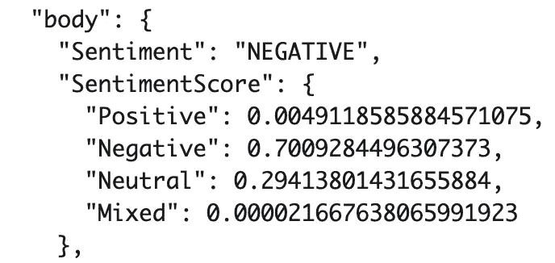
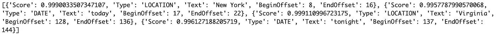

# AWS 理解的情感分析和实体提取

> 原文：<https://towardsdatascience.com/sentiment-analysis-entity-extraction-with-aws-comprehend-618a7bec60b8?source=collection_archive---------17----------------------->

## 在 Python 中使用 AWS Lambda、Boto3 和 understand 执行高级 NLP 任务的快速概述

图片来自 [Unsplash](https://unsplash.com/photos/oyXis2kALVg)

# 介绍

亚马逊网络服务(AWS)一直在不断扩展其在各个领域的机器学习服务。 **AWS 领悟**是自然语言处理的 AWS 发电站( **NLP** )。NLP 中常见的两个项目有**情感分析**和**实体提取**。我们经常使用 NLTK、Spacy、Transformers 等库从头开始构建定制模型**。虽然定制模型肯定有它们的用途，并且当你对你要解决的问题有领域知识时表现得特别好，但是从头开始构建它们也是非常耗时的。这就是 AWS intensive 的用武之地，它为情感分析和其他 NLP 任务提供高级服务。对于本文，我们将使用理解进行情感分析和实体检测。为了通过 AWS understand 访问这些服务，我们使用了另一个名为 **AWS Lambda** 的 AWS 服务。Lambda 是一个无服务器的计算平台，允许你通过 **Boto3** 、Python**T21 的 AWS SDK 调用这些服务。我将提供一个我们将要使用的服务列表，并在此广告之后提供更深入的定义，但是如果您已经熟悉这些服务，可以随意跳到情感分析&实体提取的代码演示。****

# 目录

1.  AWS 服务
2.  带有 AWS 理解的情感分析
3.  AWS 综合实体检测
4.  代码和结论

# AWS 服务

**AWS 领悟** : AWS NLP 服务，使用 ML 来执行诸如情感分析、实体提取、主题建模等任务。对于这个例子，我们只探索其中的两个任务。

 [## 亚马逊理解-自然语言处理(NLP)和机器学习(ML)

### 发现文本中的见解和关系亚马逊理解是一种自然语言处理(NLP)服务，使用…

aws.amazon.com](https://aws.amazon.com/comprehend/) 

AWS Lambda:一种无服务器计算服务，允许开发人员在不管理或供应服务器的情况下运行代码。

 [## AWS Lambda -无服务器计算-亚马逊网络服务

### 运行代码时不考虑服务器。只为您消耗的计算时间付费。AWS Lambda 让你运行代码…

aws.amazon.com](https://aws.amazon.com/lambda/) 

**Boto3** :针对 Python 开发者的 AWS 软件开发工具包(SDK)，可以在你的 Lambda 函数中使用这个来调用领悟 API 及其特定服务。

 [## Boto3 文档- Boto3 文档 1.16.6 文档

### Boto 是 Python 的 Amazon Web Services (AWS) SDK。它使 Python 开发人员能够创建、配置和管理 AWS…

boto3.amazonaws.com](https://boto3.amazonaws.com/v1/documentation/api/latest/index.html) 

AWS SageMaker :允许构建、培训和部署定制的 ML 模型。还包括各种预训练的 AWS 模型，可用于特定任务。

 [## 亚马逊 SageMaker

### Amazon SageMaker 是一个完全托管的服务，为每个开发人员和数据科学家提供构建…

aws.amazon.com](https://aws.amazon.com/sagemaker/) 

# 带有 AWS 理解的情感分析

## 数据

您可以通过多种方式在 AWS 中访问数据。 **S3** 是大多数开发人员最受欢迎的数据**存储**选择，它最常用于实时项目或大型数据集。然而，由于我们所拥有的只是一个基本的例子，我们将使用几个 **JSON** 格式的文本句子供我们的 AWS Lambda 函数访问。

例如数据

## 情感分析的代码和解释

一旦您通过 JSON、S3 或您正在使用的任何存储格式提取了数据，就该见识一下 understand 的魔力了。在将近 5 行代码中，定制模型构建和调优中所做的脏工作被处理掉了。您必须输入的两个参数**是您正在分析的**文本**和您的文本所在的**语言**。正如您在下面的结果中看到的，返回了一个总体情绪**正面、负面或中性**，以及这些情绪各自的百分比**。****

**从 JSON 和情感分析中提取数据**

****

**情感分析呼叫的结果(作者截图)。**

**使用**detect _ 情操**调用需要注意的一个关键点是文本字符串**不能大于 UTF-8 编码字符的 5000 字节**。当处理较大的文档或字符串时，可以使用**batch _ detect _ perspection**调用来解决这个问题，这允许**最多 25 个字符串/文档**都以 5000 字节为上限。批处理调用中的过程也非常相似，但是根据您的具体用例，您可以弄清楚如何为批处理调用预处理/分割数据。**

# **基于 AWS 理解的实体提取**

**与情感分析调用类似，detect_entities 调用接受文本输入和文本语言中的两个参数。定制模型还有第三个参数**，使用端点 ARN 来访问您为实体提取创建的模型，而不是默认的理解模型。正如您在下面的结果中看到的，调用返回了它在检测中的**置信度**、实体的**类型**、被识别为实体的**文本**以及文本的**位置**。例如，我们在实体的位置类型中看到纽约和弗吉尼亚。****

## **代码和解释实体提取**

**实体检测代码**

****

**实体检测调用的结果(作者截图)。**

**与 detect _ opposition 类似，detect_entities 不能接受大于 5000 字节的 UTF-8 编码字符的字符串。幸运的是，我们还有一个 **batch_detect_entities** 调用，它也允许**最多 25 个字符串/文档**都限制在 5000 字节。**

# **整个代码和结论**

** [## RamVegiraju/comprehende demo

### 使用 AWS 理解进行情感分析和实体提取的代码演示 GitHub 拥有超过 5000 万…

github.com](https://github.com/RamVegiraju/ComprehendDemo) 

Boto3 与 AWS intensive 配合使用，可以让非 ML 工程师或数据科学家轻松完成许多通常需要几个小时的任务。当然，如果给定领域知识和分析问题的时间，定制模型将执行得更准确，但是 understand 消除了预处理、清理、构建和训练您自己的模型所花费的大量时间。对于那些对在 NLP 或 ML 的任何其他领域中构建**定制模型**感兴趣的人来说， **AWS SageMaker** 允许您在 Jupyter 笔记本环境和更加传统的 ML 工作流中构建、训练和部署您自己的模型。

我希望这篇文章对试图使用 AWS 服务和 NLP 的人有用。如果您对 ML &数据科学感兴趣，请随时在评论中留下任何反馈或通过 [Linkedln](https://www.linkedin.com/in/ram-vegiraju-81272b162/) 与我联系。感谢您的阅读！**