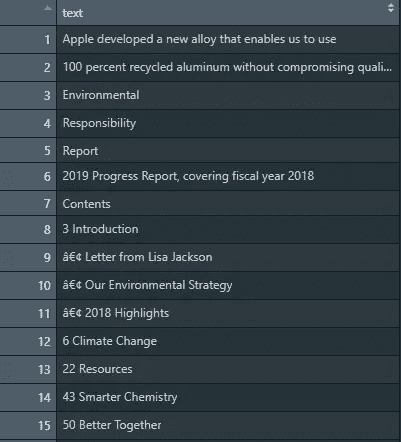
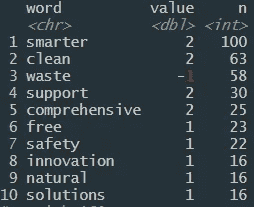
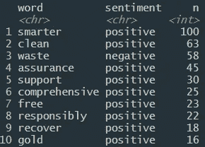
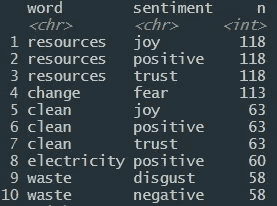

# 苹果企业社会责任报告的情感分析

> 原文：<https://towardsdatascience.com/sentiment-analysis-for-apples-csr-report-92e94b18b1ef?source=collection_archive---------23----------------------->

## R 中的情感分析简介


由[梅达·达伍德](https://unsplash.com/@medhatdawoud?utm_source=medium&utm_medium=referral)在 [Unsplash](https://unsplash.com?utm_source=medium&utm_medium=referral) 拍摄的照片

> 你曾经想了解一份报告试图传达的语言或语气的类型吗？

有数百万的报告、文章、网站、书籍等。这个过程允许用户更快地理解焦点的主要主题，而不需要深入文本。

从本教程开始，您需要具备使用 R Studio 的初级/中级工作知识。如果你没有访问我的其他帖子来了解更多—[**R 中的文本分析**](/text-analytics-in-r-ae23df8ee928)

# 文件

访问苹果(或任何其他网站)获取其 [**2019 企业社会责任**](https://www.apple.com/environment/pdf/Apple_Environmental_Responsibility_Report_2019.pdf) (CSR)报告。我更喜欢阅读文本格式的数据。

下面是我为准备加载到 R Studio 中的文件所做的工作。

1.  全选—突出显示文档中的所有内容
2.  复制和粘贴—将整个报告粘贴到您计算机上的文本文件应用程序中。(Windows —记事本和 Macs 文本编辑器)
3.  将文件保存到您的工作目录中，或者记住您的文件位置。

如果你在这一步遇到困难，请下载我的[**apple . txt**](https://github.com/jasonmchlee/text-analytics/blob/master/Corporate%20Social%20Responsibility%20Reports/apple.txt)**文件。**

# **图书馆**

```
library(textreadr)
library(tidytext)
library(stopwords)
library(dplyr)
```

# **在文件中读取**

**如果你没有把你的工作目录设置到和你的 Apple.txt 文件相同的位置，那么你需要粘贴完整的路径。如果您已经设置了工作目录，下面是代码。**

```
apple <- read_document(file="apple.txt")
```

# **设置数据框架**

**我们需要采取三个步骤来准备好数据帧。**

1.  **将我们加载的文件转换成数据帧**
2.  **将列名重命名为“text”(这将有助于我们以后的工作更轻松)**
3.  **将数据帧转换成字符，这样我们就可以使用文本分析**

```
**#setup the dataframe** apple_df <- as.data.frame(apple)**#rename column to text** colnames(apple_df) <- c("text")**#convert column type to character** ap_df <- data.frame(lapply(apple_df, as.character), stringsAsFactors=FALSE)
```

****

**前 15 排。**

# **情感库**

**现在我们已经准备好要分析的文本，我们可以使用任何 3 R 库。我们将使用 get _ opinions 函数来获得洞察力。**

*   **`AFINN`来自[芬恩·厄普·尼尔森](http://www2.imm.dtu.dk/pubdb/views/publication_details.php?id=6010)，**
*   **`bing`出自[刘兵和合作者](https://www.cs.uic.edu/~liub/FBS/sentiment-analysis.html)，以及**
*   **`nrc` [赛义夫穆罕默德和彼得特尼](http://saifmohammad.com/WebPages/NRC-Emotion-Lexicon.htm)。**

**要使用情感函数，我们需要对单词进行标记，同时过滤掉停用词。**

**标记化是将每个单词分离出来的过程，使每个单词成为一个独立的点用于分析。例如，使用标记化，句子“棕色狐狸跳了”，将是“the”、“brown”、“fox”和“jumped”**

**停用词将过滤掉报告中任何不必要的词，例如，“我”、“我”、“the”等。**

# **阿芬**

**`[AFINN](https://www.tidytextmining.com/sentiment.html)` [](https://www.tidytextmining.com/sentiment.html)词典给单词打分在-5 到 5 之间，负分表示负面情绪，正面评分表示正面情绪。**

```
afinn_ap <- ap_df %>%
  unnest_tokens(word, text) %>% **#tokenizing the dataframe**
  anti_join(stop_words) %>% **#filtering out the top words**
  inner_join(get_sentiments("afinn")) %>% **#getting the sentiment**
  count(word, value, sort=T) **#sorting for most frequent words**
```

****

**基于字数的前 10 个单词**

# **堆**

**`[bing](https://www.tidytextmining.com/sentiment.html)`词典以二元方式将单词分为积极和消极两类。按照同样的结构，我们可以得到对 bing 库的看法。**

```
bing_ap <- ap_df %>%
  unnest_tokens(word, text) %>%
  anti_join(stop_words) %>%
  inner_join(get_sentiments("**bing**")) %>%
  count(word, **sentiment**, sort=T)
```

**请注意我们的代码中有两件事发生了变化。第一个是加载了“bing”库。另一个变化是单词*代替了***值*** (Afinn 代码)。这是因为这两个图书馆以不同的方式标注他们的情感。***

******

***必应最常用的 10 个词***

***我们可以看到 Bing 和 Afinn 的结果几乎相同。***

# ***(美国)全国科学研究委员会(National Research Council)***

***现在，我最喜欢的图书馆——NRC。`[nrc](https://www.tidytextmining.com/sentiment.html)`词典以二元方式(“是”/“否”)将单词分为积极、消极、愤怒、期待、厌恶、恐惧、快乐、悲伤、惊讶和信任等类别。***

***同样，我们可以看到与前面的库类似的结构。***

```
*nrc_ap <- ap_df %>%
  unnest_tokens(word, text) %>%
  anti_join(stop_words) %>%
  inner_join(get_sentiments("**nrc**"))%>%
  count(word, sentiment, sort=T)*
```

******

***NRC 图书馆中出现频率最高的单词***

***有趣的是看 R 怎么把同一个词分成不同的情感类别。我们把**资源**这个词归类为*喜悦、*积极、*信任。****

# ***后续步骤***

***既然我们有了从报告中获取情感值的基本想法，现在我们可以使用文本分析为更高级的技术做准备了。我将发布一个后续教程，深入研究 r 中的 wordcloud 分析。***

# ***辅导的***

***如果你想更多地练习 R 中的文本分析，可以看看我的其他帖子。***

*   ***[将推文拉入 R](/pulling-tweets-into-r-e17d4981cfe2)***
*   ***[R 中的文本分析](/text-analytics-in-r-ae23df8ee928)***

# ***资源***

*   ***[Github 资源库](https://github.com/jasonmchlee/text-analytics)***
*   ***[整理文本挖掘](https://www.tidytextmining.com/sentiment.html)***
*   ***[苹果 2019 年企业社会责任报告](https://www.apple.com/environment/pdf/Apple_Environmental_Responsibility_Report_2019.pdf)***