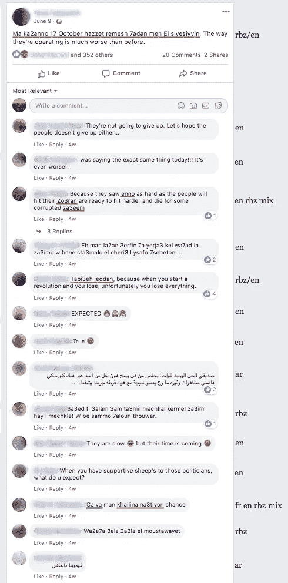
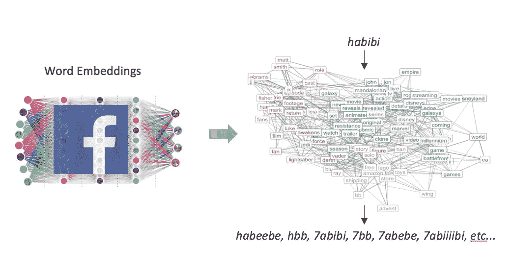
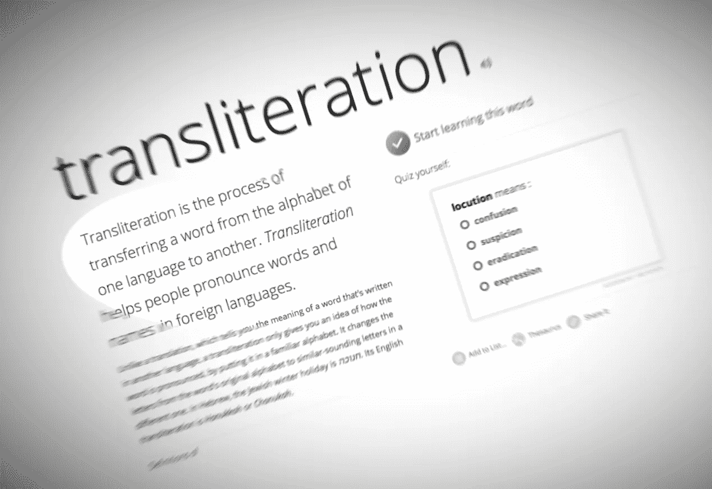
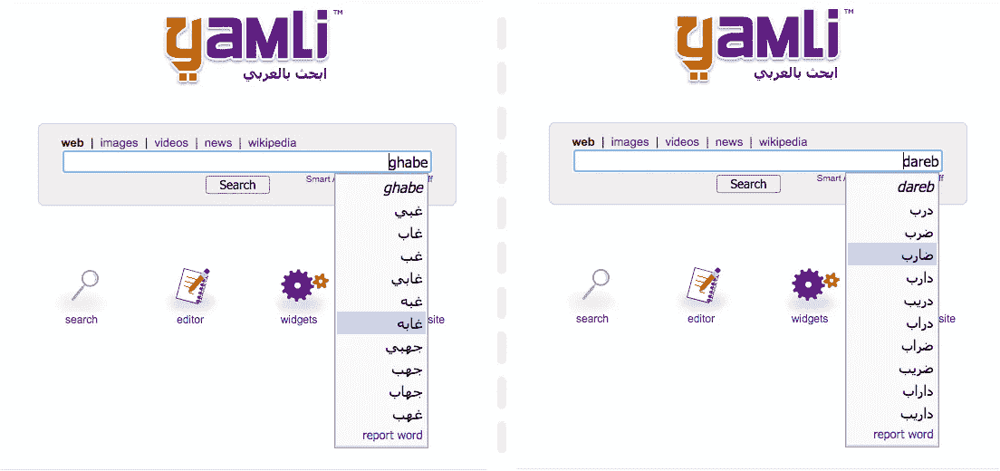
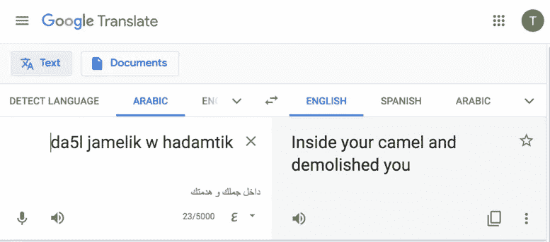
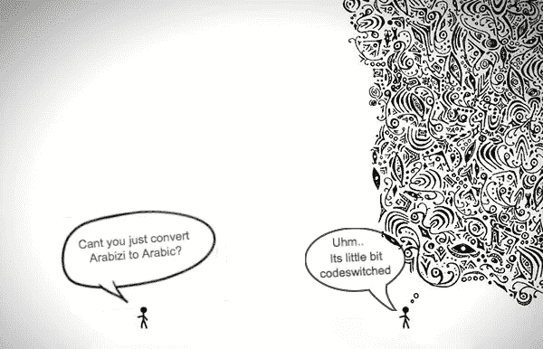

# 社交媒体上低资源语言的情感分析

> 原文：<https://towardsdatascience.com/sentiment-analysis-for-low-resourced-languages-on-social-media-128bf01f2547?source=collection_archive---------39----------------------->

## 进入真正的语言混乱的 NLP 之旅

最近，社交媒体风暴席卷了整个世界，它赋予了每个连接到互联网的人在地球上任何时间任何地点公开表达意见的特权。由此产生的互联网上流行的有意见的文本为数据科学研究和行业提供了一个挖掘这些数据进行情感分析的机会，这是一种快速人工方法，用于衡量大众对产品、新闻、事件和政策的意见，其中每条文本都会自动分类为积极、消极或中立。

然而，将单词分类为情感类别的复杂性因语言而异。它极大地依赖于语言资源的可用性和语言的自然稀疏性。例如，丰富的数字词典、语料库和带标签的数据集很好地推进了英语情感分析科学，但对于资源较少的语言，如阿拉伯方言口语，即我博士研究的更广泛领域，则没有那么好或那么快。

# 词汇稀疏性

稀疏性是一种语言中单词的词汇数量，属于一种语言的单词的形式数量越多，该语言的稀疏性就越高:

*稀疏度= ∑单词 x 形式【单词】*

在英语中，屈折形式*享受、享受、*和衍生形式*享受*可以很容易地与积极情感词*享受*对应起来。对于形态丰富的语言来说，词形变化不仅限于时态和数，还包括主语、宾语、代词、阴蒂和性别。一个简单的例子是阿拉伯语中的*爱*حبّ*t11】一词；它可以屈折为*我爱你(男性)* احبكَ *、我爱你(女性)* احبكِ *、我爱你(复数)* احبكم *、我们爱他们* احببناهم *、我们将爱你(复数)* سنحبكم 在这条战线上达到 100 多个屈折。另一方面，源自一个词的词汇由前缀、中缀、后缀和音调符号组成，例如*情感* محبة *，亲昵* تحابب *，合意* محبب *，优选* مستحب *，友好* متحاب *，有利* محبذ 所有都源自同一个词*爱*。*

背景来自 [myfreetextures](https://www.myfreetextures.com/category/paper/)

> “交一个在友谊中诚实的朋友，因为友谊的真诚在一个诚实的朋友身上”——未知。(*所有名词都源于صدق* 诚实)。

阿拉伯语的派生词法与三个字面量的单词非常和谐，只是太复杂了，无法通过词干分析器、词尾分析器或分词器进行分类。例如，单词استنكار *否认*的行为可以映射成 11 个不同意思的单词:استنارانارسترستارسارسكركرتنكتنكرنكرنار。

如果没有一致的正字法，一种形态丰富的语言的词汇稀疏性会变得非常大，在这种情况下，一个单词的每种形式都可能有不同的拼写。拼写不一致对于纯口语的语言来说是常见的，这样，如果转录，就没有标准的拼写可以遵循，结果每个人在文本中以不同的方式表达他们的舌头。方言阿拉伯语就是这种情况，这是一种对[4 . 2 亿本地人](http://istizada.com/complete-list-of-arabic-speaking-countries-2014/)的每个地区来说都是深奥的阿拉伯语口语。不同地区的不同阿拉伯方言在词汇选择、解释、词法、发音和语速方面都有所不同，而且由于英语、法语、西班牙语、意大利语和土耳其语等外语在该地区历史上的影响，外来词也有所不同。

让-巴蒂斯特·希莱尔，耶尼·卡米伊和 i̇stanbul 港，18 世纪晚期

## 阿拉比齐

在大约 30 年前数字通信兴起之前，方言阿拉伯语一直被认为是一种口语语言，当时一种新的阿拉伯语变体 Arabizi 诞生了，Arabizi 是 Araby 和 Englizi 的组合，是我博士研究的主要重点。Arabizi 是一个非常非正式的拉丁脚本口语方言阿拉伯语转录。更不用说方言阿拉伯语在拼写上自然缺乏共识，阿拉伯人开始试探性地用一种不同语言的文字来映射他们的音素。这进一步扩大了正字法的不一致性，因为:

1.  一个单词是根据它的发音来转录的，因此同一个单词的不同发音会有不同的转录:例如，在阳性 wordخير *fine* 中的一个字母元音音素ي /yā/发音为/y/KHāyr 或/eh/ kher，因此常见的是同一个单词既有 *khayr* 又有 *kher* 的转录。
2.  关于如何转录不同的元音音素，没有一致的正字法。同一个单词的读音 *khāyr* 或 *kher* 可以被转录为 *kher、kheir、khair、kheyr、khayr、*或者甚至省略掉大部分或全部元音字母 *khyr* 。
3.  在如何转录不同的辅音音素方面几乎没有一致性，例如在口腔的后舌音区发音的喉音حḥā'、خ·卡瓦、ع ᶜayn、غ·盖恩和喉塞音ء·哈姆扎。例如，来自同一个 wordخير khāyr 的خ Khā'在某些地区在某种程度上被标准化为复合字母 *kh* 或数字 5 甚至 7 '。这立即使 wordخير Khāyr 的拼写法数量增加了三倍。

因此，简单三字基 wordخير Khāyr 可能的正字法有: *kher，kheir，khair，kheyr，khayr，khyr，5er，5eir，5air，5eyr，5yr，7'er，7'eir，7'air，7'eyr，7'ayr，7'yr。*

现在很明显，词汇稀疏度的大小等于每个单词的屈折变化的数量乘以其可能的正字法的数量。

*稀疏度= ∑单词 x(形态学 x 正投影)形式【单词】*

## 代码转换

最后，词汇稀疏性以代码转换为顶点，将阿拉伯语与其他拉丁脚本语言混合，主要是英语或法语。几个地区的阿拉伯青年在说话时不断地在阿拉伯语和法语或英语之间转换；因为阿拉伯语是口语的转录，所以在他们的文本中看到这一点并不奇怪。在阿尔及利亚、摩洛哥和 Tunisia⁴，阿拉伯语和法语的混合很正常，在 Lebanon⁵和 Egypt⁶.，阿拉伯语和英语的混合也很正常语码转换可能发生在各部分使用不同语言的对话中，每个分句都使用不同语言的句子中，或者是断断续续使用语码转换词的句子中。这可以从黎巴嫩的一份《脸书邮报》中得到证明:

脸书会话中的语码转换

这种语码转换意味着阿拉伯语不是一种独立的语言，而是与其他语言紧密相连的。因此，为阿拉伯人解决自然语言处理(NLP)任务的努力，尤其是情感分析，需要与阿拉伯本地人在社交文本中使用的英语或法语单词和短语相集成。这就造成了两种语言之间的重叠，对词语歧义的另一个挑战，如*诱饵* (بيت家)、*该死(* ضمن *投保或包含)、罚款(* فيني *I-can)、杀死(* كل *凡)、*或*疯狂(* انساني *人道)。*

因此，词汇稀疏性变成了:

*稀疏度= ∑单词 x(形态学 x 正投影)形式[单词] +(英语和法语)单词*

为了弄清楚这能达到多大，我们需要先解决我的一个博士研究问题:

*如何将阿拉伯语情感词与其屈折变体和正字法变体进行映射？*

## 单词匹配

别忘了，阿拉伯语资源极其匮乏，我们没有起点，尤其是黎凡特方言。我们创建了带标签的数据集，并训练了一个语言识别器，从语码转换的脸书数据中汇编了一个包含 100 万条评论的阿拉伯语语料库。

我们在脸书语料库上训练了[单词嵌入](http://jalammar.github.io/illustrated-word2vec/)，由此语料库中的每个单词都被神经网络架构作为实数值向量投影到新的阿拉比齐嵌入空间中。然后，我们将余弦向量相似度与基于规则的方法相结合，从该嵌入空间中发现输入情感词的屈折形式及其拼写变体。

图片由作者使用[神经网络背景](https://blog.ttro.com/wpcontent/uploads/2017/01/TB010-Deep-Neural-Network.jpg)

我们发现几乎每一个我们输入的情感词都有屈折和正字法形式，但令我们惊讶的是，有些词达到了 1K 多种形式！如字 *i7tiram* احترام *尊敬*:

1，069 个表单匹配积极情感阿拉伯语单词 i7tiram(尊重)

# 情感分析

*一个词的 1K+形式对情感分析意味着什么？*

情感分析的基本技术是无监督和有监督的 approaches⁷，称为基于词典和机器学习的方法。

在基于词典的方法中，在预定义的正面和负面单词列表或具有情感得分的单词列表中搜索输入文本中的每个单词，凭直觉判断句子中正面或负面单词的数量决定了该句子的情感。这在很大程度上是正确的，但是它对缺乏情感词的肯定句或否定句无效，例如在讽刺或多词表达中。

在一种更智能的方法中，机器学习，一种算法通过从训练数据中学习来学习将输入文本分类为正面、负面或中性，这些训练数据是由人类注释者预先标记为正面、负面或中性的句子。为算法提供的训练数据越多，它在学习哪些模式、单词或单词共现导致正确的情感类别方面就变得越好。这种方法在对缺乏情感词的句子进行分类时应该表现得更好，但是创建大型数据集在时间和价格方面都非常昂贵。

非常大的词汇稀疏性挑战了这两种技术:

我们怎样才能创建一个包含所有形式的情感词汇的词典呢？另一方面，有标签的数据集应该有多大才能覆盖所有形式的情感词？

预计到这两种方法面临的挑战的复杂性，我决定尽可能自动地为 Arabizi 归纳出形态上和拼写上丰富的情感词典。我们在[项目-rbz](https://tahatobaili.github.io/project-rbz/) 上发布这项工作的成果出版物和资源。

# 音译

尽管阿拉伯语是用拉丁字母书写的，但它毕竟是阿拉伯语，所以为什么我要把它当作一种新的语言，并赋予它感情；*我们就不能把它音译成阿拉伯文字吗？*

作者图片

首先，这种非正统的转录产生了严重的单词歧义。因为阿拉伯语有短元音和长元音音位，以及轻声和重读辅音音位，所以一个阿拉伯语单词很容易与两个或更多的阿拉伯语单词混淆。

短元音是音调符号，长元音是元音字母ا و ي / ā、σ(或 wā)和 yā(或ī)/，为此，单词 **غابة** ghābeh *森林*与长元音 *ā* 会与黎凡特方言阿拉伯语中的否定词غبي·加贝*愚蠢*与短元音 *a* 混淆。由于没有长短元音之分，两者都可以转录为 *ghabeh。*

至于轻声和重读辅音音素对应词，ذ د ك س ت和ظ ض ق ص ط是两个不同的字母组，分别代表轻声和重读字母 *th、d、k、s、*和 *t* 。阿拉伯语单词 *dareb* 可能是否定的ضربḍarb(强调)*击中或物理打击*或درب darb(软 d) *路径或路线的转录。*

因此，映射到两个或更多阿拉伯字母的元音字母和拉丁辅音字母的拼写不一致会影响音译，从而为大多数阿拉伯语单词提供了几种可能性。音译在线进行，逐字逐句，用户在输入每个阿拉伯语单词后，从可能的音译列表中手动选择他们想要的阿拉伯语单词。 [Yamli](https://www.yamli.com/) 以此闻名:

Yamli 阿拉伯音译

其次，Arabizi 是方言阿拉伯语的转录，而不是现代标准阿拉伯语(MSA ),其中的单词选择和表达因地区而异。因此，开发一个适合所有人的音译方法而不去迎合每一种方言是幼稚的。这是谷歌对整个文本进行自动化音译的努力，我们测试了一条来自黎巴嫩的积极的阿拉伯语推文:*da5l Jame lik w hadam tik/oh-my*(表情)*你的美丽和你的幽默*(女性)。

2019 年谷歌翻译；2020 年，它给出了:走进你的句子，摧毁你

在这种情况下，与将其音译为错误的阿拉伯语单词并试图在之后对其进行分类相比，包含屈折的积极单词 *jamelik (your-beauty)* 和*hadam tik(your-hum)*的阿拉伯语情感词典将更好地将该句子分类为积极的。

第三，出于情感分析的目的，方言阿拉伯语是资源贫乏的:*把一种资源贫乏的语言的文字转换成另一种文字有什么意义？*

原图: [Benhance 画廊，我所想我所说的 Ghonemi](https://www.behance.net/gallery/8961081/What-i-think-what-i-say)

# 结论

简而言之，我通过我的研究了解到，充分吸收一种语言带来的挑战，并在处理任务之前评估所需 NLP 任务的可用或所需资源是至关重要的。

虽然阿拉伯语包含了太多的挑战，但不一致的拼写和拉丁化并不是新现象。例如，爪哇方言和 Alsatian⁸语是启发式转录的；希腊语、波斯语、印地语、孟加拉语、乌尔都语、泰卢固语和泰米尔语也被转录成拉丁文字，称为希腊语、芬利语、 [Hinglish、Binglish](https://www.open.edu/openlearn/education/educational-technology-and-practice/educational-practice/hinglish-pinglish-binglish-minglish) …

我希望我对这篇文章中详细描述的 Arabizi 的词汇挑战的理解能够对社交媒体上低资源语言的情感分析的复杂性有所启发，并激励 NLP 社区探索为其他高稀疏性语言提供资源的类似方法。

[1] Baly，Ramy 等人，“情感树库和形态学丰富的递归深度模型，用于有效的阿拉伯语情感分析。” *ACM 亚洲和低资源语言信息处理汇刊(TALLIP)*16.4(2017):1–21。

[2]法尔哈、易卜拉欣·阿布和瓦利德·马格迪。" Mazajak:一个在线阿拉伯情感分析器."第四届阿拉伯语自然语言处理研讨会会议录。2019.

[3]穆罕默德·阿里·亚甘。"“Arabizi”:阿拉伯俚语的一种当代风格."*设计问题*24.2(2008):39–52。

[4] Seddah，Djamé等人，“建立一个用户生成内容的北非阿拉伯语树库:应对地狱”*计算语言学协会第 58 届年会论文集*。2020.

[5]沙利文，娜塔莉。*写阿拉伯语:在推特上用罗马化的黎巴嫩阿拉伯语拼写变体*。Diss。2017.

[6]马里亚姆·阿布莱兹。"拉丁化的阿拉伯语和双语能力的联系."兰卡斯特大学语言学研究生会议语言教学。英国兰卡斯特。第三卷。2009.

[7]张，雷，，刘兵."用于情感分析的深度学习:一项调查." *Wiley 跨学科评论:数据挖掘与知识发现* 8.4 (2018): e1253。

[8]米勒、爱丽丝和卡伦堡。"文本语料库和新书写语言的挑战."*第一届资源不足语言口语技术(SLTU)和资源不足语言协作与计算(CCURL)联合研讨会会议录*。2020.

希望你喜欢这篇文章，我有时会在推特上发一些关于资源匮乏的自然语言处理的东西: [@TahaTobaili](https://twitter.com/TahaTobaili)