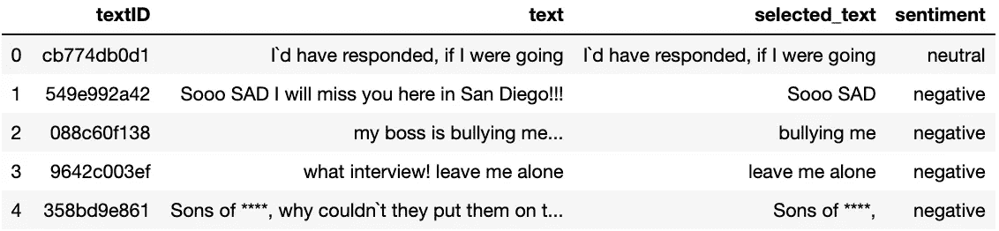
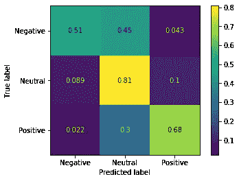
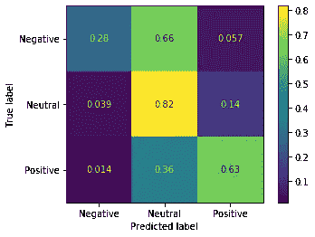

# 不到 50 行 Python 代码中的情感分析

> 原文：<https://towardsdatascience.com/sentiment-analysis-in-less-than-50-lines-of-python-fc6451114c6?source=collection_archive---------45----------------------->

## *神经网络并不总是答案……*


照片由 pixabay 上的 [Free-Photos-242387](https://pixabay.com/users/Free-Photos-242387/) 拍摄

自然语言处理(NLP)可能是一个难以理解的话题。NLP 涵盖了大量不同的学科和建模技术，从主题分析到机器翻译和语音识别到语音合成。情感分析包含在 NLP 系列中，是对一段文本中表达的情感进行量化的过程。通常，情感是根据文本的积极或消极程度来评估的。

最先进的情感分析技术通常涉及循环神经网络，如长期短期记忆模型(LSTMs)或计算成本高昂的 BERT 嵌入，大量的[优秀材料](/sentiment-analysis-using-lstm-step-by-step-50d074f09948)已被写入如何创建和训练这些。然而，也许你不需要复杂的建模或大量的代码来实现有竞争力的性能。

那么，我们如何着手创建自己的情感分析模型呢？

## 数据

这里使用的数据可以在 [Kaggle](https://www.kaggle.com/c/tweet-sentiment-extraction/overview) 上找到，包括训练集中的 27，481 条带标签的推文和测试集中的 3，534 条推文。因此，让我们继续使用每个数据科学家最好的朋友熊猫来加载数据:

```
import pandas as pdtraining_df = pd.read_csv("train.csv")
training_df.head()
```



让我们对测试集做同样的事情:

```
test_df = pd.read_csv("train.csv")
test_df.head()
```


注意，测试集没有`selected_text`列。因此，让我们确保我们所做的任何数据清理都适用于训练集和测试集的`text`列。

## 数据处理

为了简单起见，我们不想在清理方面做得太多，但我们可以做一些简单的事情来帮助任何模型识别情绪。数据清理过程如下:

1.  删除推文中的所有超链接
2.  替换常见的缩写
3.  删除标点符号(分词器为我们做了这件事)

在我们清理的同时，我们还可以将情感标签映射到整数，并从同一个函数返回它们。

```
import reCONTRACTIONS_DICT = {"can`t":"can not",
                     "won`t":"will not",
                     "don`t":"do not",
                     "aren`t":"are not",
                     "i`d":"i would",
                     "couldn`t": "could not",
                     "shouldn`t": "should not",
                     "wouldn`t": "would not",
                     "isn`t": "is not",
                     "it`s": "it is",
                     "didn`t": "did not",
                     "weren`t": "were not",
                     "mustn`t": "must not",
                    }def prepare_data(df:pd.DataFrame) -> pd.DataFrame:

    df["text"] = df["text"] \
              .apply(lambda x: re.split('http:\/\/.*', str(x))[0]) \
              .str.lower() \
              .apply(lambda x: replace_words(x,contractions_dict))

    df["label"] = df["sentiment"].map(
                        {"neutral": 1, "negative":0, "positive":2 }
                        )
    return df.text.values, df.label.valuesdef replace_words(string:str, dictionary:dict):
    for k, v in dictionary.items():
        string = string.replace(k, v)
    return stringtrain_tweets, train_labels = prepare_data(train_df)
test_tweets, test_labels = prepare_data(test_df)
```

## 句子分词器:

现在我们需要将每条 tweet 标记成一个固定长度的向量——特别是一个嵌入了的 [TFIFD。为了实现这一点，我们可以使用 Keras 的内置`Tokenizer()`，适合训练数据。](/tf-idf-for-document-ranking-from-scratch-in-python-on-real-world-dataset-796d339a4089)

```
from keras.preprocessing.text import Tokenizertokenizer = Tokenizer()
tokenizer.fit(train_tweets)train_tokenized = tokenizer.texts_to_matrix(
                             train_tweets,
                             mode='tfidf'
                             )test_tokenized = tokenizer.texts_to_matrix(
                             test_tweets,
                             mode='tfidf'
                             )
```

## 系统模型化

接下来，我们需要选择我们的模型。当谈到情感分析时，世界是你的牡蛎，然而为了长话短说，我们求助于每个数据科学家的第二好朋友， [sk-learn 的随机森林分类器](https://scikit-learn.org/stable/modules/generated/sklearn.ensemble.RandomForestClassifier.html#sklearn.ensemble.RandomForestClassifier.fit):

```
from  sklearn.ensemble import RandomForestClassifierforest = RandomForestClassifier(
                                n_estimators=500, 
                                min_samples_leaf=2,
                                oob_score=True,
                                n_jobs=-1,
                                )
forest.fit(train_tokenized,train_labels)print(f"Train score: {forest.score(train_tokenized,train_labels)}")
print(f"OOB score: {forest.oob_score_}")
```

选择`n_estimators`和`num_samples_leaf`时进行了少量的超参数调整，以尝试最大化分数，同时避免过度拟合。这给了我们 0.77 的训练得分和 0.69 的出袋得分(关于出袋得分的更多信息，[这篇](/what-is-out-of-bag-oob-score-in-random-forest-a7fa23d710)文章很好地解释了这一点，但是 TL；DR 是随机森林的验证分数的代理)。

现在，让我们来看看测试集上的性能:

```
print("Test score: {forest.score(test_tokenized,test_labels)"}
```

这个值为 0.69，所以到目前为止，我们进展顺利！

## 混淆矩阵

sk-learn 可以轻松获取分类器和测试数据来生成混淆矩阵，显示测试集的性能，如下所示:

```
from sklearn.metrics import plot_confusion_matrixplot_confusion_matrix(
    forest,
    test_encoded_docs,
    test_labels,
    display_labels=["Negative","Neutral","Positive"],
    normalize='true'
)
```



正如混淆矩阵所显示的，到目前为止，当谈到我们卑微的随机森林时，一切都很好。

这告诉我们很多关于我们所犯错误的类型。大多数错误发生在预测积极和中性情绪以及消极和中性情绪之间的差异时，在错误的大格局中，这并不是最糟糕的。然而值得庆幸的是，我们很少混淆积极情绪和消极情绪，反之亦然。

## 我们与 VADER 相比如何？

VADER 是一个“基于规则的情绪分析工具，专门针对社交媒体表达的情绪”。但是，对我们来说重要的是，这是一个现成的模型，可以用作基准。

```
from vaderSentiment.vaderSentiment import SentimentIntensityAnalyzeranalyzer = SentimentIntensityAnalyzer()
vs=[]
for sentence in test_tweets:
    vs.append(analyzer.polarity_scores(sentence)["compound"])vader_scores = []
for v in vs:
    if v < -0.5:
        score = 0
    elif v < 0.5:
        score = 1
    else:
        score = 2
    vader_scores.append(score)
```



给定阈值 0.5，VADER 在中性情绪类上实现了大致相同的真阳性率，但在积极和消极情绪类上的表现都比我们的模型差——很高兴知道训练我们自己的模型是值得的！

## 那么我们在这里学到了什么？

情绪分析并不像看起来那么神秘。当然，如果我们增加模型的复杂性，改进数据清理和使用更复杂的嵌入，我们可以做得更好，我们仍然能够实现合理的性能，而不需要任何东西。当你考虑到当前 Kaggle 竞赛的领先者得了 0.73 分，而我们用不到 50 行代码就达到了 0.69 分，我很高兴把它留在那里…