# 情感分析:朴素贝叶斯算法介绍

> 原文：<https://towardsdatascience.com/sentiment-analysis-introduction-to-naive-bayes-algorithm-96831d77ac91?source=collection_archive---------3----------------------->

来源:stocksnap.io

数据集:[https://www . ka ggle . com/c/情操分析电影评论/数据](https://www.kaggle.com/c/sentiment-analysis-on-movie-reviews/data)

本教程假设读者对贝叶斯定理和文本分析完全无知。你只需要按照教程和一切都解释了一个新鲜的人工智能/毫升。如果你是专业用户，希望快速修改概念**，你可以访问** [**我的 github 库**](https://github.com/DrManishSharma/NLP.git)**(Senti _ analysis . ipynb)**上的代码。

对于任何类型的数据科学项目，您需要做的第一件事就是加载数据并使用它。我更喜欢(也是我认识的大多数数据科学家)用二手熊猫来下载数据(图 1)。给定数据以*为单位。tsv 格式(制表符分隔变量)。我已经把它转换成*。csv 使用 excel，同时可以使用*。tsv 格式也是。当我加载数据时，我遇到了一个小问题，因为在一些行中使用了特殊字符(大约 4 行包含\/、分隔符和反斜杠)。在加载数据之前，我必须手动删除这些字符。

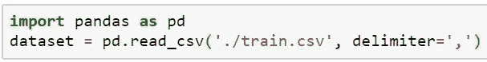

图 1:加载数据

我强烈建议新用户使用基本的熊猫指令来玩游戏。您可以使用:dataset.info()来获得不同列的汇总，如果任何列包含任何带有 NAN 数据的行(如果是，那么有多少？).请使用 dataset.head()、dataset.tail()、dataset.describe()、dataset['$ColumnName'] e.t.c 来深入了解数据集。例如(图 2)使用数据集。$ColumnName.value_counts()给出每种情绪的计数(设 0 为一星评价，4 为五星评价)。从这里我们可以猜测，平均来说这部电影似乎是一部三星级电影。

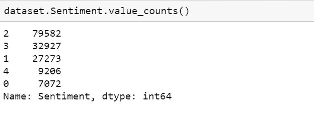

图 2:基本 pandas 命令的使用

为了进一步进行情感分析，我们需要进行文本分类。我们可以用“词袋(BOW)”模型进行分析。用外行人的话来说，BOW 模型将文本转换成数字形式，然后可以在算法中用于分析。

具体来说，BOW 模型用于文本数据中的特征提取。它返回一个包含所有单词和每个单词重复次数的向量。它被称为 BOW，因为它只关心一个单词重复的次数，而不是单词的顺序。让我们举一个例子来更好地理解它(假设每个文档只包含一个句子):

文件 1:瑞士是一个美丽的国家。文档 2:印度是一个拥有聪明的 IT 专业人士的国家。美国是一个充满机遇的国家。

下表称为文档术语矩阵(DTM)。
———————
| Words->Swzld 是一个聪明的 IT 教授美丽的国家印度美国 opport
| Doc 1 Vector->1 1 1 1 1 0 0 0 0 0 0
Doc 2 Vector->0 1 1 0 1 1 1 1 1 1 1 1 1 1 1 0 0
| Doc 3 Vector->0 1 1 0 1 0 1 0 1 0 1 1 1
|累计->1 3 1 3 1 2 1 1 1 1 1 1 1 1 1 1 1
———————
上图所示型号为 monogram 型号。 如果一次取两个单词(例如:瑞士是一个美丽的国家……)，那么它被称为双字母模型，同样地，一次取 N 个单词，它将是 N 字母模型。较高克数的模型往往比 monogram 模型效果更好。

每个文档中的内容越长，每个向量的长度就越长(将包含许多零)。如果文档太大，文档向量将是稀疏向量。稀疏向量需要大量内存来存储，并且由于长度的原因，即使是计算也会变得很慢。为了减少稀疏向量的长度，可以使用诸如词干化、词汇化、转换成小写或忽略停用词等技术

现在，我们将使用 sci-kit-learn 的 CountVectorizer 模块生成 DTM(图 3)。要阅读更多关于 CountVectorizer 的参数，您可以访问 [**这里**](https://scikit-learn.org/stable/modules/generated/sklearn.feature_extraction.text.CountVectorizer.html) 。如上所述，我们将使用:

*   tokenizer =覆盖字符串记号化步骤，我们从 NLTK 的 Regex 记号化器生成记号化器(缺省情况下:None)
*   lowercase = True(不需要使用，因为默认情况下设置为 True)
*   stop_words = 'english '(默认情况下不使用，为了改善结果，我们可以提供一个自定义的停用词列表)
*   ngram_range = (1，1)(默认情况下，将使用 its (1，1)，即严格的单字母组合，(2，2)仅使用双字母组合，而(1，2)两者都使用)

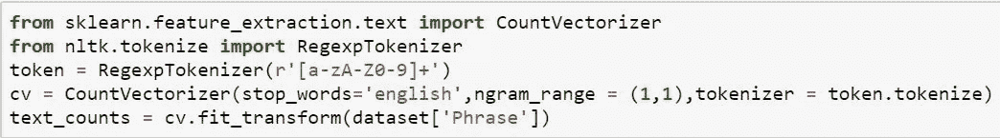

图 3:使用计数矢量器准备“单词包”

我们现在将分割数据用于训练和测试，以检查我们的模型表现如何(图 3)。此外，我们将随机化数据，以防我们的数据首先包括所有积极的，然后是所有消极的或其他类型的偏见。我们将使用:scikit_learn 的[**train _ test _ split()**](https://scikit-learn.org/stable/modules/generated/sklearn.model_selection.train_test_split.html)来拆分 text_count(其中包含我们的 X)和 dataset[‘情绪’](其中包含 Y)。

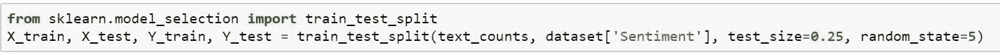

图 4:使用 train_test_split 将数据分为训练和测试数据集。

现在我们有了训练和测试数据。我们应该开始分析了。我们的分析(和大多数 ML 分析一样)将分为 5 个步骤(记住它们的一个助记法是 **DC-FEM** 记住哥伦比亚特区消防和紧急医疗服务):

1.  定义模型
2.  编译模型
3.  拟合模型
4.  评估模型
5.  用模型做预测

# 1.定义模型

我们将使用 [**朴素贝叶斯【NB】**](https://scikit-learn.org/stable/modules/naive_bayes.html)分类器之一来定义模型。具体来说，我们将使用 [**多项式分类器**](https://scikit-learn.org/stable/modules/naive_bayes.html) 。作为一个 ML 的新生，你可以使用 sklearn [**这里**](https://scikit-learn.org/stable/tutorial/machine_learning_map/index.html) 给出的备忘单来决定用于特定问题的最佳模型。它告诉我们使用 NB 分类器。让我们绕道了解更多关于 NB 模式的信息。

## 朴素贝叶斯模型

该模型应用贝叶斯定理，并天真地假设不同特征之间没有关系。根据贝叶斯定理:

后验=可能性*命题/证据

或者

P(A|B) = P(B|A) * P(A)/P(B)

**举个例子:在一副扑克牌中，选择一张牌。假定一张牌是一张脸牌，那么这张牌成为皇后的概率是多少？**
这个可以用贝叶斯定理解决。
P(皇后给脸牌)= P(皇后|脸)
P(给脸皇后)= P(脸|皇后)= 1
P(皇后)= 4/52 = 1/13 P(脸)= 3/13 从贝叶斯定理:
P(皇后|脸)= P(脸|皇后)P(皇后)/P(脸)= 1/3

对于具有多个变量的输入:
P(y|x1，x2，… xn) = P(x1，x2，… xn|y)* P(y)/P(x1，x2，…xn)
使用朴素贝叶斯我们假设 x1，x2 … xn 相互独立，即:
P(x1，x2，…xn | y)= P(x1 | y)* P(x2 | y)…* P(xn | y)
P(Xi)分布中的假设例如，假设高斯分布将产生高斯朴素贝叶斯(GNB)，或者多项式分布将产生多项式朴素贝叶斯(MNB)。

朴素贝叶斯模型特别适用于文本分类和垃圾邮件过滤。**使用 NB 算法的优点**是:

*   需要少量的训练数据来学习参数
*   与复杂的模型相比，可以相对快速地进行训练

**NB 算法的主要缺点**是:

*   这是一个不错的分类器，但却是一个糟糕的估计器
*   它适用于离散值，但不适用于连续值(不能用于回归)

## NB 算法的困境

关于 NB 算法的一个具有挑战性的问题是:尽管 NB 算法中的条件独立性假设在现实生活中几乎不成立，但是 NB 算法作为分类器是如何工作得如此之好的呢？我不会在这里讨论解决方案，而是将您引向包含解决方案的资源( [**这里**](https://www.cs.unb.ca/~hzhang/publications/FLAIRS04ZhangH.pdf) )。简而言之，答案在于依赖性的分布，而不是依赖性，不知何故，由于分布，依赖性的影响抵消了。

## NB 分类的损失函数

NB 分类使用零一损失函数。在此函数中，错误=错误分类的数量。这里，误差函数不考虑概率估计的准确性，假设具有最高概率的类被正确预测。比如说有 A 和 B 两个类，给了不同的属性(x1，x2，… xn)。P(A |所有属性)= 0.95，P(B |所有属性)=0.05，但是 NB 可能估计 P(A |所有属性)= 0.7，P(B |所有属性)= 0.3。这里虽然估计得远不准确，但分类是正确的。

让我们回到我们的分析。定义和编译模型的前两步简化为从 sklearn 中识别和导入模型(正如 sklearn 给出的预编译模型)。

# 2.编译模型

因为我们使用 sklearn 的模块和类，我们只需要导入预编译的类。Sklearn 在这里 给出了所有 [**职业的信息。**](https://scikit-learn.org/stable/modules/classes.html)

图 5:从 sklearn 库中导入多项式朴素贝叶斯模型

# 3.拟合模型

在这一步中，我们在多项式 b 中生成模型拟合数据集。为了寻找拟合模型时可以传递的参数，建议查看正在使用的模块的 sklearn 网页。对于 MNB 可以在这里勾选****。****

**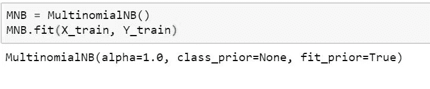**

**图 6:在多项式朴素贝叶斯中拟合数据。**

# **4.评估模型**

**这里我们量化我们模型的质量。我们使用 sklearn 库中的 [**度量**](https://scikit-learn.org/stable/modules/model_evaluation.html#model-evaluation) 模块来评估预测(图 7)。**

**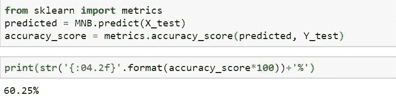**

**图 7:使用 sklearn 的度量来评估模型**

# **调整模型**

**我们观察到我们的模型的准确率超过 60%。我们现在可以利用我们的模型来增加它的准确性。**

## **尝试不同的 n-grams**

**详情见图 8(二元模型)和图 9(三元模型)。**

**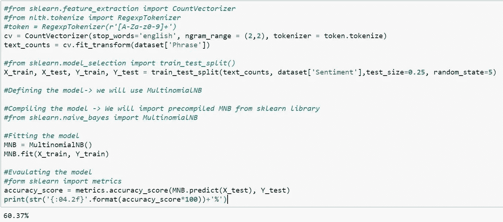**

**图 8:文本矢量化的二元模型。**

**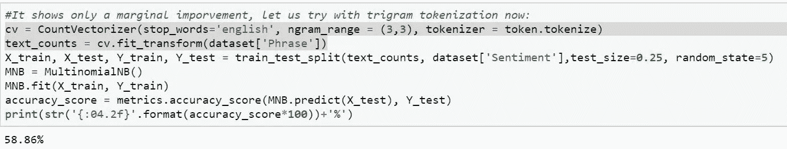**

**图 9:文本矢量化的三元模型。**

## **尝试不同的朴素贝叶斯算法**

**参考图 10(补码 NB)、图 11(高斯 NB)、图 12(伯努利 NB)。**

**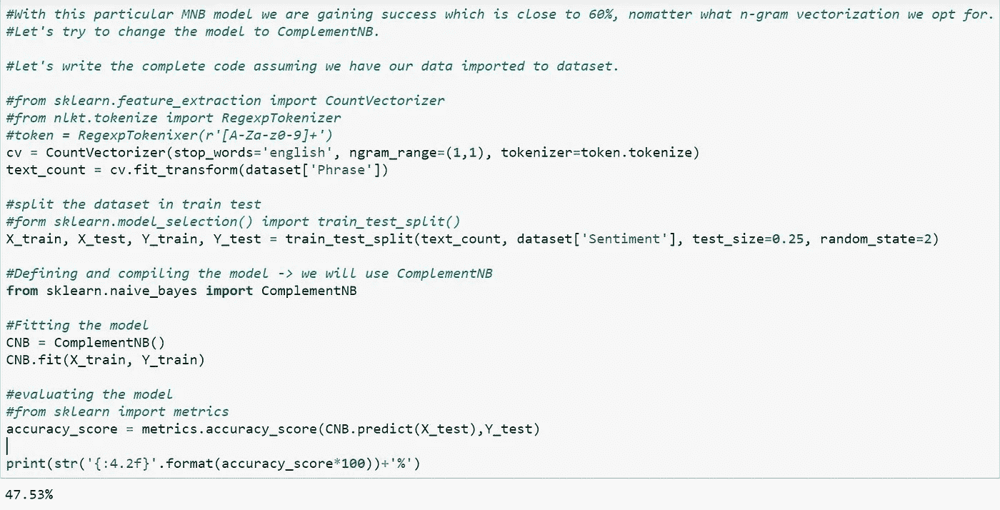**

**图 10:使用互补朴素贝叶斯模型进行情感分析**

**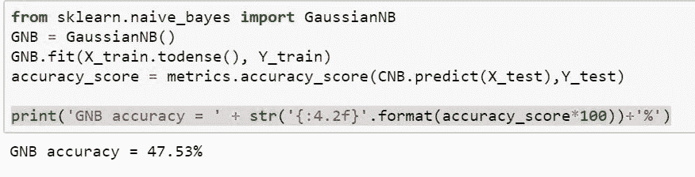**

**图 11:使用高斯朴素贝叶斯模型进行情感分析**

**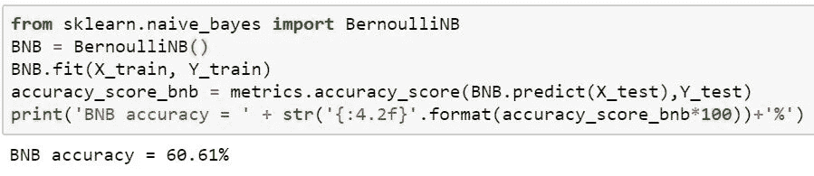**

**图 12:使用伯努利朴素贝叶斯模型进行情感分析**

# **提高准确性**

**我们已经尝试使用不同的 n-grams 和不同的朴素贝叶斯模型，但最高准确率徘徊在 60%左右。为了改进我们的模型，让我们尝试改变方式，创建弓。目前，我们用 CountVectorizer 创建了 BOW，它计算文本中单词的出现次数。一个词出现的次数越多，它对分类就变得越重要。**

# **术语频率-逆文档频率**

**让我们使用 TF-IDF，它考虑了术语频率和逆文档频率的乘积。术语频率是一个术语在文档中出现的频率。假设一个术语在一个文档中出现了“f”次，带有“d”个单词。
词频= f/d
IDF 为‘逆文档频率’。如果一个语料库包含 N 个文档，而我们感兴趣的术语只出现在 D 个文档中，那么 IDF 是:
IDF = log(N/D) TF-IDF 是术语频率和逆文档频率的乘积。 **TF-IDF 显示了一个词在语料库中的稀有度。**如果一个词很少见，那么它可能是某个特定情感/信息的标志性词汇。**

**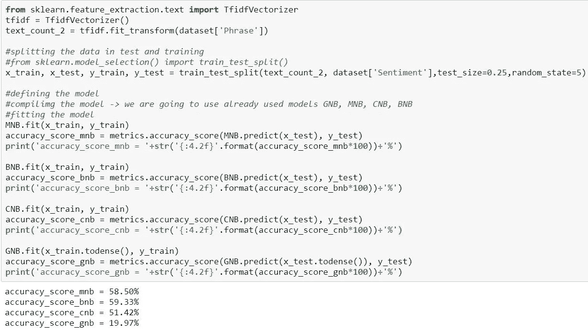**

**图 13:使用中的 TfidfVectorizer**

# **尝试非贝叶斯算法**

**即使是 Tfidf 矢量器(即创建不同的弓)也无助于提高模型的准确性。除了朴素贝叶斯算法，我们还可以选择随机梯度下降分类器或线性支持向量分类器。众所周知，这两种方法都能很好地处理文本数据分类。让我们试着用这些:**

**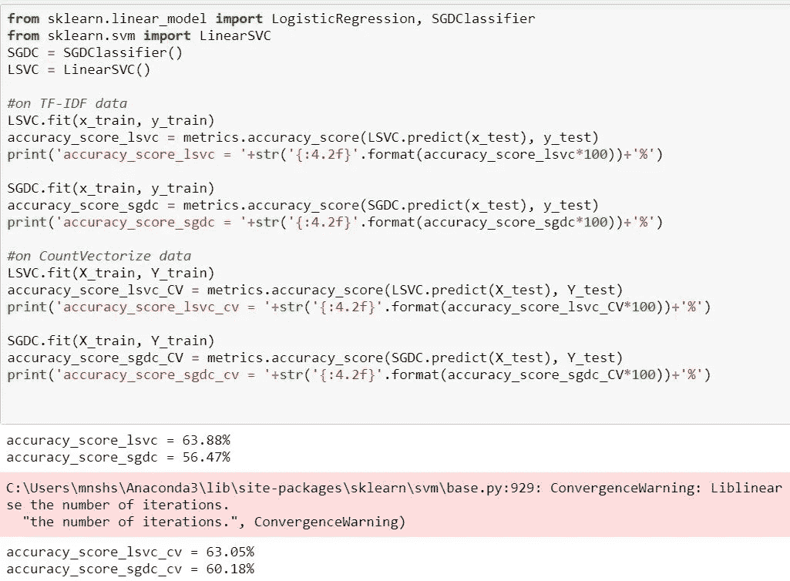**

**图 14:尝试不同的文本分类算法**

# **推理**

**我们观察到，使用 TF-IDF 创建的 BOW 的线性支持向量分类器给出了最好的结果，准确率达到 63.88%。虽然准确性仍然很低，但仍需要对模型进行改进，以给出更好的结果。**

**祝贺大家完成教程。您应该已经了解了如何使用不同的分类器，以及朴素贝叶斯定理和与之相关的不同算法。我已经分享了一个关于建立和评估模型(DC-FEM)的广泛策略。还讨论了与朴素贝叶斯算法相关的挑战。我们讨论了“单词包”(BOW)模型以及使用 CountVectorizer 和 TfidfVetorizer 创建 BOW 的两种不同方式。**

****建议读数**:**

**在[我的 github 库](https://github.com/DrManishSharma/NLP.git)访问完整代码。**

**从零开始展开朴素贝叶斯**

**[使用 NLTK 的初学者文本分析](https://www.datacamp.com/community/tutorials/text-analytics-beginners-nltk)**