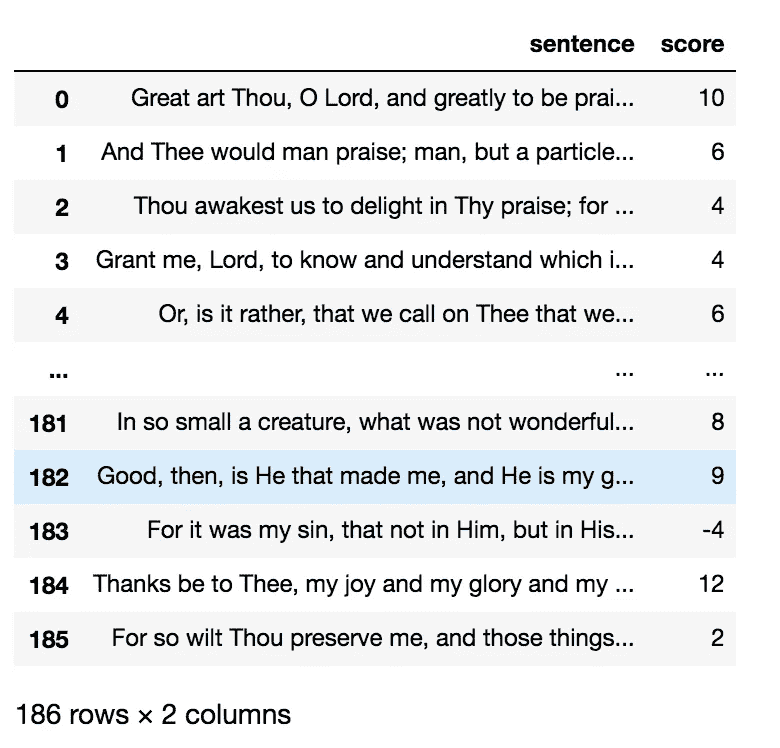
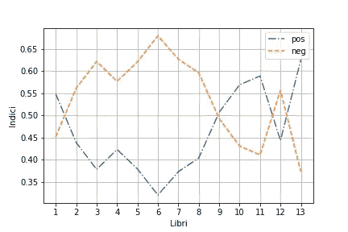
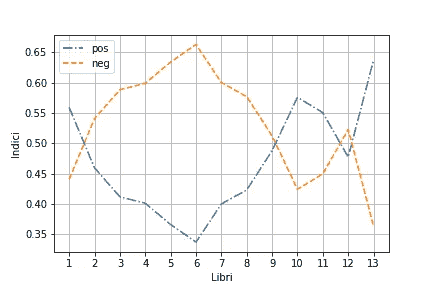

# 基于监督学习的书籍情感分析

> 原文：<https://towardsdatascience.com/sentiment-analysis-of-a-book-through-supervised-learning-d56ba8946c64?source=collection_archive---------38----------------------->

## *用 Python 和 scikit 分析一本书的情感的简单教程——学习*


图片来自 [Pixabay](https://pixabay.com/?utm_source=link-attribution&utm_medium=referral&utm_campaign=image&utm_content=5450708) 的[马雷克·斯图津斯基](https://pixabay.com/users/jc_cards-13855161/?utm_source=link-attribution&utm_medium=referral&utm_campaign=image&utm_content=5450708)

在本教程中，我将解释如何通过基于支持向量机(SVM)的监督学习技术来计算一本书的情感。

本教程计算圣奥古斯丁忏悔录的情感分析，可以从[古腾堡项目页面](https://www.gutenberg.org/files/3296/3296-h/3296-h.htm)下载。这部杰作分为 13 本书(章)。我们将每本书存储在不同的文件中，名为 number.text(例如 1.txt 和 2.txt)。每个文件的每一行只包含一个句子。

jupyter 笔记本可以从我的 Github 资源库下载:[https://github.com/alod83/papers/tree/master/aiucd2021](https://github.com/alod83/papers/tree/master/aiucd2021)

一本书的情感分析的类似实验可以在下面的链接找到:[https://towards data science . com/perspective-analysis-of-a-book-through-unsupervised-learning-df 876563 dd1b](/sentiment-analysis-of-a-book-through-unsupervised-learning-df876563dd1b)。在这种情况下，我解释了如何利用无监督学习技术来执行情感分析。

# 入门指南

监督学习需要一些带注释的文本来训练模型。因此，第一步包括读取注释文件并将其存储到数据帧中。注释文件包含每个句子的相关分数，该分数是正数、负数或空值。

```
import pandas as pddf = pd.read_csv('sources/annotations.csv')
df
```



我们可以计算一些关于注释的统计数据，比如正面、负面和中性分数的数量，以及注释的总数。我们可以使用应用于数据帧的`count()`方法。

```
df.count()
df[df['score'] > 0].count()
df[df['score'] < 0].count()
df[df['score'] == 0].count()
```

# 准备训练集和测试集

为了计算每个句子的情感，我们将利用监督学习技术，该技术利用二进制分类模型。该模型将一个句子作为输入，根据句子是否被正面评价，返回 1 或 0。因为我们的模型是二进制的，所以我们必须删除所有带有中性分数的注释。

```
import numpy as np
# Remove any 'neutral' ratings equal to 0
df = df[df['score'] != 0]
```

现在我们可以向 dataframe 添加一列，称为`Positively Rated`，包含 1 或 0，这取决于一个正的或负的分数。我们使用`where()`方法为数据帧的这个新列分配适当的值。

```
df['Positively Rated'] = np.where(df['score'] > 0, 1, 0)
```

# 计算情绪

我们定义一个辅助函数，称为`calculate_indexes()`，它接收监督学习模型(将在后面描述)和`CountVectorizer`向量作为输入，如后面所述。

在该函数中，我们通过`open()`函数打开对应于每本书的文件，我们通过函数`file.readlines()`读取所有行，并通过将`predict()`函数应用于模型来计算每一行的分数。

那么，我们可以定义三个指数来计算一本书的情绪:正面情绪指数(pi)、负面情绪指数(ni)和中性情绪指数(nui)。一本书的圆周率对应于一本书中的肯定句的数量除以该书的总句子数量。同样，我们可以计算一本书的 ni 和 nui。

```
def calculte_indexes(model,vect):
    pos_index = []
    neg_index = []
    neutral_index = []
    all_text = ""
    for book in range(1,14):
        file = open('sources/' + str(book) + '.txt')
        lines = file.readlines()
        pos = 0
        neg = 0

        for line in lines:
            score = model.predict(vect.transform([line]))

            if score == 1:
                pos += 1
            else:
                neg += 1
            all_text += ' ' + line.lower() 

        n = len(lines)
        pos_index.append(pos / n)
        neg_index.append(neg / n)

    return pos_index,neg_index
```

现在我们可以训练算法了。我们定义了两种不同的情况:第一种情况我们不考虑 ngrams，第二种情况我们考虑。我们定义了一个名为`train_algorithm()`的函数，可以通过指定 ngrams 的用法来调用它。

在函数中，我们首先通过名为`train_test_split()`的`scikit-learn`函数将数据集分为训练集和测试集两部分。训练集将用于训练算法，测试集将用于测试算法的性能。

```
X_train, X_test, y_train, y_test = train_test_split(df['sentence'], 
                            df['Positively Rated'], random_state=0)
```

然后，我们构建标记计数矩阵，即包含每个句子哪些标记可用的矩阵。这可以通过类`CountVectorizer`来完成，该类接收要考虑的 ngrams 数量作为输入。在本教程中，只考虑两个 ngrams。我们只考虑最小文档频率等于 5 的标记。

```
vect = CountVectorizer(min_df=5).fit(X_train)
```

然后我们可以构建模型:我们使用包含在`scikit-learn`中的`LinearSVC()`类，并用训练集`model.fit(X_train_vectorized, y_train)`训练它。

```
model = LinearSVC()
model.fit(X_train_vectorized, y_train)
```

最后，我们通过预测测试集的输出并将结果与测试集中包含的真实输出进行比较来测试算法的性能。作为指标，我们测量 AUC，但我们也可以计算其他指标。

```
predictions = model.predict(vect.transform(X_test))
print('AUC: ', roc_auc_score(y_test, predictions))
```

一旦训练好模型，我们就可以通过`calculte_indexes()`函数来计算指标。最后，我们绘制结果。

这里是功能`train_algorithm()`的全部代码。

```
from sklearn.model_selection import train_test_split
from sklearn.feature_extraction.text import CountVectorizer
from sklearn.svm import LinearSVC
from sklearn.metrics import roc_auc_score
import matplotlib.pyplot as pltdef train_algorithm(df, ngrams=False):
    # Split data into training and test sets
    X_train, X_test, y_train, y_test = train_test_split(df['sentence'], 
                                                    df['Positively Rated'], 
                                                    random_state=0)

    # Fit the CountVectorizer to the training data
    vect = CountVectorizer(min_df=5).fit(X_train)
    if ngrams:
        # Fit the CountVectorizer to the training data specifiying a minimum 
        # document frequency of 5 and extracting 1-grams and 2-grams
        vect = CountVectorizer(min_df=5, ngram_range=(1,2)).fit(X_train)
        print('NGRAMS')
    else:
        print('WITHOUT N-GRAMS')
    # transform the documents in the training data to a document-term matrix
    X_train_vectorized = vect.transform(X_train)
    # Train the model
    model = LinearSVC()
    model.fit(X_train_vectorized, y_train)

    # Predict the transformed test documents
    predictions = model.predict(vect.transform(X_test))print('AUC: ', roc_auc_score(y_test, predictions))

    pos_index, neg_index = calculte_indexes(model,vect)

    X = np.arange(1,14)
    plt.plot(X,pos_index,'-.',label='pos')
    plt.plot(X,neg_index, '--',label='neg')
    #plt.plot(X,neutral_index,'-',label='neu')
    plt.legend()
    plt.xticks(X)
    plt.xlabel('Libri')
    plt.ylabel('Indici')
    plt.grid()
    if ngrams:
        plt.savefig('plots/svm-ngram-bsi.png')
    else:
        plt.savefig('plots/svm-1gram-bsi.png')
    plt.show()
```

# 进行实验

现在我们可以在启用和禁用 ngrams 的情况下运行实验。

```
train_algorithm(df, ngrams=False)
train_algorithm(df, ngrams=True)
```



没有 n-grams 的实验



用 n-grams 做实验

# 吸取的教训

在本教程中，我向你展示了如何通过监督学习技术来计算一本书每一章的情感:

*   监督学习需要一些训练集，即一些手动标注的数据。因此，在开始玩模型之前，您应该做注释数据的(小)部分这一枯燥的任务。训练集越大，算法的性能越好；
*   要计算一个句子的情感，你应该使用一个(二进制)分类算法，比如支持向量机(SVM)。scikit-learn 库提供了许多分类算法；
*   一旦选择了模型，就可以用训练集对其进行训练；
*   别忘了测试模型的性能:)