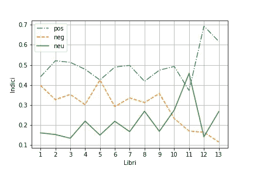

# 基于无监督学习的书籍情感分析

> 原文：<https://towardsdatascience.com/sentiment-analysis-of-a-book-through-unsupervised-learning-df876563dd1b?source=collection_archive---------44----------------------->

*用 Python 分析一本书情感的简单教程*


foto di[Chen spec](https://pixabay.com/it/users/chenspec-7784448/?utm_source=link-attribution&utm_medium=referral&utm_campaign=image&utm_content=5477735)da[Pixabay](https://pixabay.com/it/?utm_source=link-attribution&utm_medium=referral&utm_campaign=image&utm_content=5477735)

# 入门指南

在本教程中，我将向您展示如何通过基于 AFINN 词典的无监督学习(UL)技术，对包含在书中的文本进行情感分析。本教程利用了仅适用于英语和丹麦语的`afinn` Python 包。如果你的文本被写成不同的语言，你可以先翻译成英文，然后使用`afinn`包。

这个笔记本应用了情绪分析圣奥古斯丁忏悔，可以从[古腾堡项目页面](https://www.gutenberg.org/files/3296/3296-h/3296-h.htm)下载。这部杰作分为 13 本书(或 13 章)。我们将每本书存储在不同的文件中，名为 number.text(例如 1.txt 和 2.txt)。每个文件的每一行只包含一个句子。

你可以从我的 Github 库下载代码:[https://github.com/alod83/papers/tree/master/aiucd2021](https://github.com/alod83/papers/tree/master/aiucd2021)

首先从`afinn`包中导入`Afinn`类。

```
from afinn import Afinn
```

然后通过指定使用的语言创建一个新的`Afinn`对象。

```
afinn = Afinn(language=’en’)
```

# 计算情绪

## 使用 Afinn 给出的分数来计算情感

`afinn`对象包含一个名为`score()`的方法，该方法接收一个句子作为输入，并返回一个分数作为输出。分数可以是正的、负的或中性的。我们计算一本书的分数，只需简单地将该书所有句子的分数相加。我们定义了三个变量> pos、neg 和 neutral，分别存储一本书所有句子的所有正面、负面和中性得分的总和。

首先，我们定义三个索引，它们将在后面使用。

```
pos_index = []
neg_index = []
neutral_index = []
```

我们通过`open()`函数打开对应于每本书的文件，我们通过`file.readlines()`函数读取所有行，并为每一行计算分数。

那么，我们可以定义三个指数来计算一本书的情绪:正面情绪指数(pi)、负面情绪指数(ni)和中性情绪指数(nui)。一本书的圆周率对应于一本书中的肯定句的数量除以该书的总句子数量。同样，我们可以计算一本书的 ni 和 nui。

```
for book in range(1,14):
    file = open('sources/' + str(book) + '.txt')
    lines = file.readlines()
    pos = 0
    neg = 0
    neutral = 0

    for line in lines:
        score = int(afinn.score(line))

        if score > 0:
            pos += 1
        elif score < 0:
            neg += 1
        else:
            neutral += 1

    n = len(lines)
    pos_index.append(pos / n)
    neg_index.append(neg / n)
    neutral_index.append(neutral / n)
```

# 绘图结果

## 以图形方式显示结果

最后，我们可以通过使用`matplotlib`包来绘制结果。

```
import matplotlib.pyplot as plt
import numpy as npX = np.arange(1,14)
plt.plot(X,pos_index,'-.',label='pos')
plt.plot(X,neg_index, '--',label='neg')
plt.plot(X,neutral_index,'-',label='neu')
plt.legend()
plt.xticks(X)
plt.xlabel('Libri')
plt.ylabel('Indici')
plt.grid()
plt.savefig('plots/afinn-bsi.png')
plt.show()
```



# 吸取的教训

在本教程中，我向您展示了一个简单的策略来计算包含在一本书中的文本的情感。这可以通过 Python 提供的`afinn`包来实现。您可以遵循以下步骤:

*   把书的正文分成几章，然后把每一章存放在一个单独的文件里
*   把每一章的所有句子分成不同的行
*   通过`Afinn`类提供的`score()`方法分别计算每个句子的分数
*   计算每个章节的正面情感指数、负面情感指数和中性情感指数
*   绘图结果。

如果想应用监督学习技术进行情感分析，可以继续关注:)。