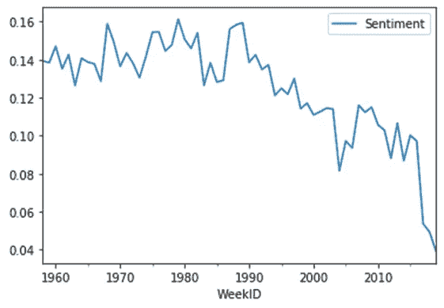

# 一段时间内(1958 年至 2019 年)所有 Billboard 热门 100 首歌曲的情感分析

> 原文：<https://towardsdatascience.com/sentiment-analysis-of-all-billboard-hot-100-songs-over-time-1958-2019-3329439e7c1a?source=collection_archive---------32----------------------->

## 流行音乐歌词平均每年多得 1.3%的负面！

马里乌斯·马萨拉尔在 [Unsplash](https://unsplash.com?utm_source=medium&utm_medium=referral) 上的照片

我是老派灵魂乐和说唱音乐的粉丝。我还是一名数据科学家，专攻自然语言处理(NLP)和自然语言理解(NLU)。在听音乐的时候，我发现自己在想，为什么旧学校的音乐似乎比现代音乐更积极、更有益健康。

在我看来，我听的大多数老校魂歌曲都是关于爱情和舞蹈的，而且它们通常含有相对较少的亵渎性语言。他们似乎更快乐，总体上也更积极。与此同时，我听的大多数当代说唱歌曲对亵渎性语言的使用要慷慨得多，而且总体上看起来更加愤怒和消极。我想知道这是否真的是普遍的情况。作为一名数据科学家，我为了满足自己的好奇心，对数据进行了深入研究。

我决定对过去几十年的代表性音乐样本进行情感分析，看看音乐是否变得越来越消极。我想知道随着时间的推移，流行音乐歌词中使用的语言的积极性得分是否有显著变化。

# **数据**

我决定用 Billboard Hot 100 作为代表样本。Billboard Hot 100 是美国追踪一周前 100 首最流行歌曲的标准图表。我使用了一个[数据集](https://data.world/kcmillersean/billboard-hot-100-1958-2017)，包含了从 1958 年 8 月 2 日到 2019 年 6 月 22 日的所有 Billboard Hot 100 条目。

在获得 Billboard Hot 100 数据集后，我使用 LyricsGenius API 客户端抓取了 genius.com 上所有条目的歌词。我成功地为 26138 首独特的歌曲搜集了歌词。我对歌词进行了情感分析，以下是我的结果:

# **结果**

1.  平均而言，进入 Billboard Hot 100 的歌词倾向于接近中性。数据集中所有歌词的平均情感极性是 0.125。其中-1 完全为负，1 完全为正。
2.  2019 年记录了最多的负面歌词，1979 年记录了最多的正面歌词。
3.  2019 年的歌词比 1979 年的歌词**负面 4 倍**。
4.  平均而言，在 1958 年至 2019 年期间，歌词情绪每年比 **多 **1.3%。****

5.**1958 年歌词热门关键词**包括:【“喜欢”、“来了”、“渺小”、“曼宁”、“知道”、“跳喜欢”、“好”、“时间”】

6.**2019 年歌词热门关键词**包括:["喜欢"、"耶"、"黑鬼"、"婊子"、"小婊子"、"爱"、"需要"、"操"]

# **分析**

在这里，我详细说明了我得到结果的步骤。

1.  **安装和导入库:**我使用了一些流行的 Python 模块进行文本处理。我还用 LyricsGenius 刮过 genius.com。

2. **API 认证**:在使用 LyricsGenius 包之前，我注册了一个 [Genius 客户端](https://genius.com/api-clients)访问令牌。

3.**下载 Billboard Hot 100 数据集**:我从[数据世界](https://data.world/kcmillersean/billboard-hot-100-1958-2017)获得 Billboard Hot 100 数据集。

4.定义函数:我为这个项目写了四个函数。

a.一个从 genius 中抓取歌词的功能。

b.一个获取歌词情感的函数。

c.一个处理所有文本预处理的函数。

d.一个函数，以获取歌词中的关键词。

5.**把所有的东西放在一起**:在导入包和数据，然后定义函数之后，我把函数应用到数据上，得到我的结果。

# **结论**

这是什么意思？这一分析表明，流行音乐歌词可能越来越消极。然而，从这项分析中不清楚的是，这是否反映了社会趋势。作为一个社会，我们变得越来越消极了吗？根据我们创造和消费的文化艺术品，我们能对人类状况做出多少假设？这些是我在分析中没有探讨的问题。然而，这些问题很有趣，可以作为后续研究的基础。

如果您有兴趣自己探索这些数据，或者有兴趣查看我关于这个项目的 Jupyter 笔记本，请随意查看项目 [GitHub 资源库](https://github.com/salimzubair/lyric-sentiment)。