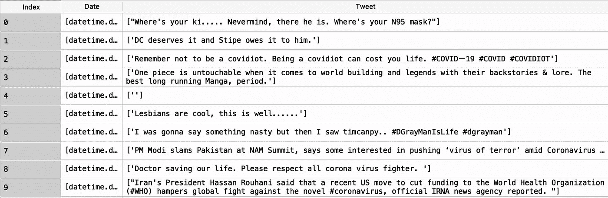
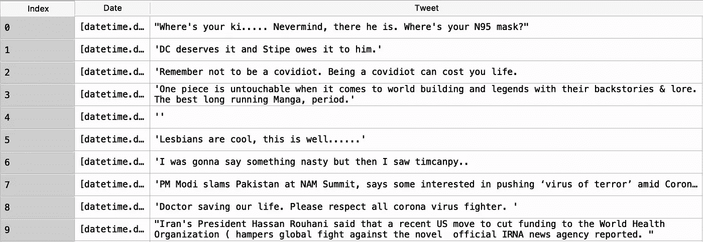
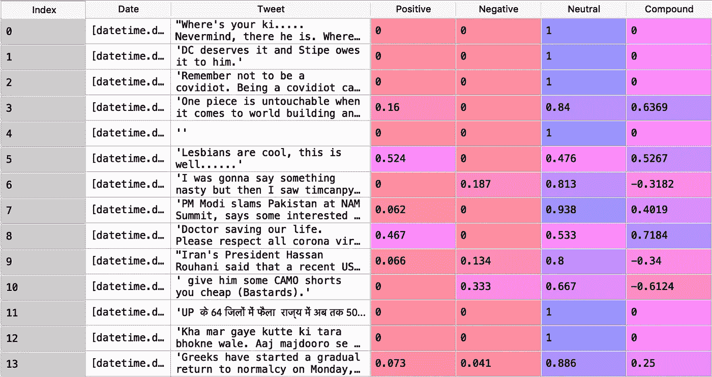
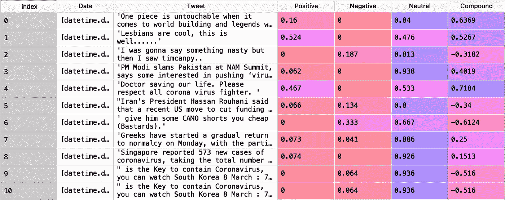
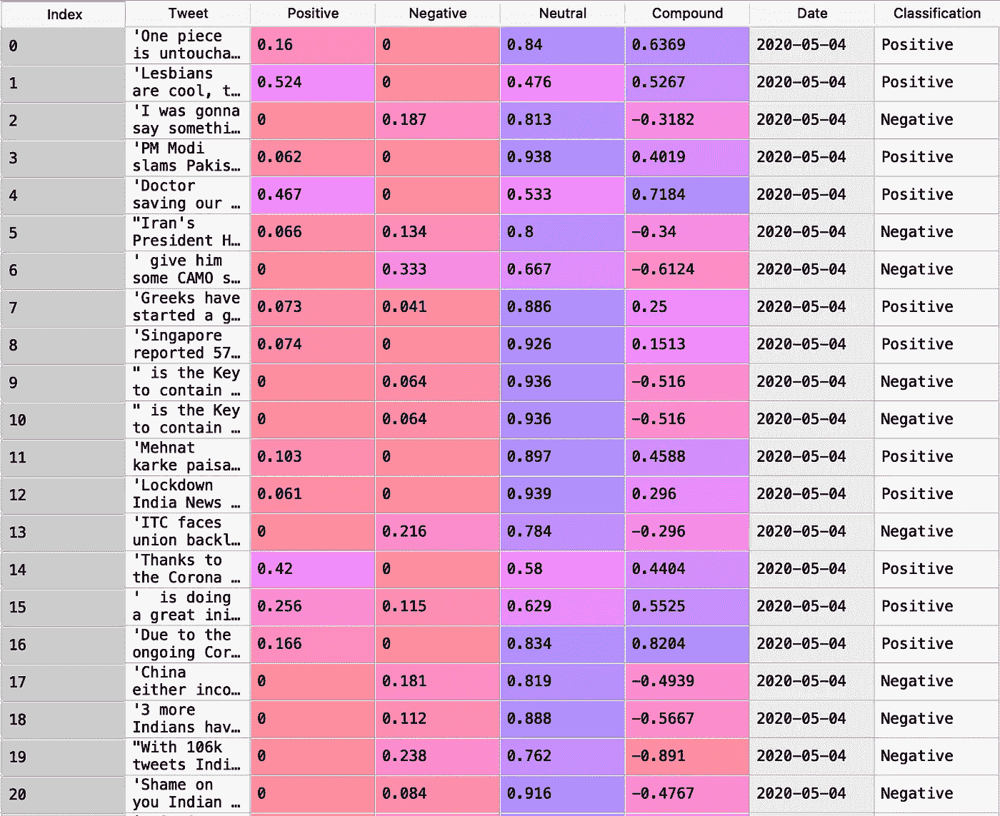

# 德里推特的情感分析

> 原文：<https://towardsdatascience.com/sentiment-analysis-of-delhi-tweets-877e060823b1?source=collection_archive---------43----------------------->


演职员表:莎拉·库菲斯，Unsplash

## 估计推文中的正面/负面分数

数据是一个比许多人认为的更广泛的术语。它不仅包含 Excel 文件或等效的结构化表格数据，还包含文本文件、音频文件、图片等非结构化数据。考虑到所有数据格式的详尽列表，可以很好地认识到结构化数据只是冰山一角。尤其是文本数据，可以在大多数主题中找到。

本文旨在使用关键词和特定位置的技术从 Twitter 上抓取推文。此外，我还将展示可以用来评估一条 tweet 的情绪的软件包。我感谢 Twitter 社区允许我们访问这些数据。使用的编程语言是 Python 3.3，使用的 IDE 是 Spyder 3.3.3。

# 检索推文

Python 提供了一些有趣的包来从 Twitter 中抓取 tweets。GetOldTweets3 就是这样一个包(我觉得它很方便，因为它很灵活)。

```
#Importing the Packages
import pandas as pd
import numpy as np
import matplotlib.pyplot as plt
import seaborn as sns
import GetOldTweets3 as got#Setting the Parameters
text_query = 'coronavirus'
location = 'Delhi'

tweetCriteria = got.manager.TweetCriteria()
.setQuerySearch(text_query).setNear(location)
.setSince("2020-03-01").setUntil("2020-05-05")#Creating a list of all tweets
tweets = got.manager.TweetManager.getTweets(tweetCriteria)#Creating list of chosen tweet data
text_tweets = [[tweet.text] for tweet in tweets]
text_date = [[tweet.date] for tweet in tweets]tweets = pd.DataFrame(list(zip(text_date, text_tweets)), 
columns = ['Date', 'Tweet'])
```

在导入基本的和必需的包之后，我们首先设置服务于我们目的的基本参数。这些参数包括:

*setQuerySearch* :一条推文应该包含的关键词或短语。

*setNear* :推文的参考位置。

*setSince* :需要抓取推文的日期。

set until:tweets 需要被抓取的日期。

出于这个分析的目的，我将参考位置设置为*德里*，将文本查询设置为*冠状病毒*(因为这是人们目前在推特上谈论的主要内容)。开始日期设定为*2020–03–01*(2020 年 3 月 1 日)至*2020–05–05*(2020 年 5 月 5 日)。这是两个月多一点。

运行时间主要取决于 tweets 被抓取的数量和互联网速度。

一旦 tweet 被抓取，就会创建一个带有单独的日期和 tweet 列的数据框。该数据集包含 37，135 条推文和 2 列(日期和推文)。

```
In [2]: tweets.shape
Out[2]: (37135, 2)
```

# 清理推文以供进一步分析



Tweets 预清理

一旦创建了基本的数据框架，清理推文以供进一步分析就变得非常重要。这包括删除不必要的括号、撇号、用户名等。

```
#Cleaning the Tweetsfrom nltk.corpus import stopwords
date = []
tweet = []
words = set(nltk.corpus.words.words())
for i in range(0,len(tweets)):
 date.append(tweets.iloc[i,0])
 string = tweets.iloc[i,1]
 string = re.sub(r”http\S+”, “”, string) #Removes Hyperlink
 string = re.sub(‘@[^\s]+’,’’,string) #Removes Usernames
 string = re.sub(‘#[^\s]+’,’’,string) #Removes Hashtags
 tweet.append(string.strip(“[“).strip(“]”))new_tweet = pd.DataFrame(list(zip(date, tweet)), columns = [‘Date’, ‘Tweet’])
```

上面几行代码删除了特殊字符和短语，如标签、超链接、用户名和括号。最后，我们得到一个相对干净的数据框架。



清理后的推文

# 寻找推文的情感分数

Python 提供了多个包来评估文本的情感。在这个实例中使用的包是*Vader perspection。更多关于这个包的信息可以在找到。*

```
#Checking the Polarity
from vaderSentiment.vaderSentiment import SentimentIntensityAnalyzer
sent = SentimentIntensityAnalyzer()
sentiment_dict = []
for i in range(0,len(new_tweet)):
 sentiment_dict.append(sent.polarity_scores(new_tweet.iloc[i,1]))positive = []
neutral = []
negative = []
compound = []
for item in sentiment_dict:
 positive.append(item[‘pos’])
 neutral.append(item[‘neu’])
 negative.append(item[‘neg’])
 compound.append(item[‘compound’])sentiment_df = pd.DataFrame(list(zip(positive, neutral, negative, compound)), columns = [‘Positive’, ‘Neutral’, ‘Negative’, ‘Compound’])

new_tweet[‘Positive’] = sentiment_df[‘Positive’]
new_tweet[‘Negative’] = sentiment_df[‘Negative’]
new_tweet[‘Neutral’] = sentiment_df[‘Neutral’]
new_tweet[‘Compound’] = sentiment_df[‘Compound’]
```

*Vader perspection*以字典的形式返回输出，包含 4 个键( *pos，neu，neg，compound* )。 *pos、neu* 和 *neg* 的值介于 0 和 1 之间，0 表示不具有该词的任何特征，1 表示很可能是*正面、负面或中性评论。*最后一项*复合*表示根据 *pos、neu* 和 *neg* 得分计算的范围(-1，1)内的最终得分。

运行代码，我们得到以下输出:



情感得分

让我们讨论上面输出中的一些实例。

索引 11 上的推文:推文是用印地语写的。因此，该算法无法为其分配任何情感，并且默认给出完美的*中性*分数。

指数 4 上的推文:空白推文被分配一个完美的*中性*分数。

索引 12 上的推文:用英语写的印地语推文也被分配为*中性。*

有许多推文是用印地语写的，因为参考地点是德里。反击的一个方法是删除所有中立的推文。这符合逻辑，因为我们主要关注的是正面和负面的推文。

```
#Removing all the neutral comments
wf_tweet = new_tweet.loc[new_tweet[‘Neutral’] != 1].reset_index()
wf_tweet = wf_tweet.drop(‘index’, axis = 1)
```



最终输出

我们现在已经给所有的推文分配了情感分数。具有负*复合*值的推文描绘负面情绪，而具有正*复合*值的推文描绘正面情绪。

我们现在可以将*复合*值分为正值和负值。



输出

# 结论

我们有一个如上给出的最终输出。可以对数据框进行进一步分析，以挖掘信息，从而有趣地洞察德里(印度)民众对冠状病毒的看法。*日期*列可以证明是一个重要的属性，也可以看出人们的态度/情绪是如何随时间变化的。根据情绪得分，人们还可以发现哪些标签在负面和正面的推文中使用最多。然而，这种分析超出了本文的范围。

*感谢您的阅读。我真诚地希望它对你有所帮助，我一如既往地欢迎讨论和建设性的反馈。*

给我发邮件:**icy.algorithms@gmail.com**

你可以在[领英](https://www.linkedin.com/company/enka-analytics/?viewAsMember=true)上找到我。

***编者按:*** [*走向数据科学*](http://towardsdatascience.com) *是一份以数据科学和机器学习研究为主的中型刊物。我们不是健康专家或流行病学家，本文的观点不应被解释为专业建议。想了解更多关于疫情冠状病毒的信息，可以点击* [*这里*](https://www.who.int/emergencies/diseases/novel-coronavirus-2019/situation-reports) *。*