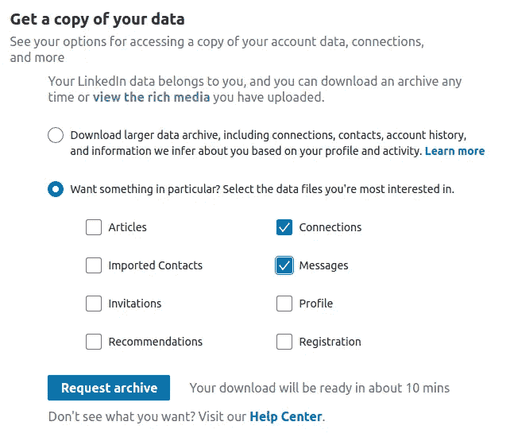
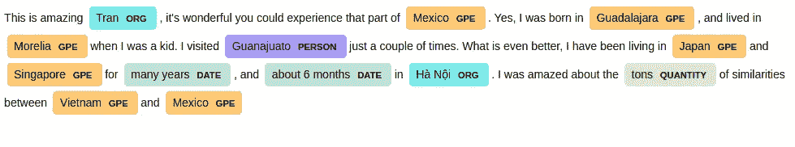

# 使用 Python 和情感分析探索和可视化您的 LinkedIn 网络

> 原文：<https://towardsdatascience.com/sentiment-analysis-of-linkedin-messages-3bb152307f84?source=collection_archive---------18----------------------->

## 希望优化您的 LinkedIn 个人资料？为什么不让数据为你服务呢？


照片由[亚当·索罗门](https://unsplash.com/@solomac?utm_source=medium&utm_medium=referral)在 [Unsplash](https://unsplash.com?utm_source=medium&utm_medium=referral) 拍摄

# 动机

如果你是 LinkedIn 的用户，你有没有想过你的社交网络中的人群？如果你正在努力拓展你在数据科学领域的人脉，你的人脉中的大多数人都在数据科学相关领域工作吗？

你的留言呢？它们是否大多是积极的，关于与你兴趣相关的话题？

作为 LinkedIn 上的一名活跃用户，我有超过 500 个联系，我对我的网络中的人的统计数据以及我在过去两年中收到的消息感到好奇。

分析 LinkedIn 数据有什么好处？好吧，如果你正在为工作机会优化你的 LinkedIn 档案，为什么不使用可用的数据作为你的工具呢？

在本文中，我将结合可视化和自然语言处理来分析我的网络和消息。读完这篇文章后，你应该能够分析自己的 LinkedIn 数据，并从中获得见解！

# 数据

我没花太多力气就拿到了数据，因为你可以直接从 LinkedIn 上下载。这里的[是你可以怎么做的。](https://www.linkedin.com/help/linkedin/answer/50191/downloading-your-account-data?lang=en)



具体来说，我导入了消息和连接数据。

我将使用 [Datapane](https://datapane.com/) 嵌入来自每个库的可视化，这是一个用于发布和共享 Python 报告的 Python 框架和 API。如果您想**为我下面的任何一个图或表格留下评论**，请随时点击左上角的“查看完整报告”留下您的评论，我会尽快回复您！

这里是这篇文章的[笔记本](https://github.com/khuyentran1401/Data_science_on_Medium/tree/master/nlp/linkedin_analysis),这样你就可以跟随文章并可视化你自己的数据！

# 网络

## 连接的日期

从导入开始并检查数据

在上表中，我只展示了我最近的 10 个关系作为例子。`Connected On`表示我与那个人联系的日期。我将把该列转换成日期-时间并用 Plotly 可视化

我每天的新连接数都有一个峰值，特别是 2020 年 1 月到 2020 年 7 月，是我在 LinkedIn 上最活跃的时期。

## 公司

我网络中的人在哪些组织工作？我可以用这样的条形图:

但是在这种情况下，也许 treemap 在可视化公司方面做得更好？

树形图将分层数据显示为一组**嵌套矩形**。每个组由一个矩形表示，矩形的面积与其值成比例。

有了树形图，比较一家公司与其他公司的相关比例就更容易了！看起来我的网络中有很大一部分人来自拜耳作物科学。第二大百分比来自我的大学。

## 位置

哇！没想到会看到这么多数据科学家。我人际网络中最常见的职位是我的人际网络目标群体，这很好。

有些人的头衔可能以“数据科学家”开头，但头衔中也有更多的词。找出所有以“数据科学家”开头的职位

```
>>> network.Position.str.startswith('Data Scientist').sum()
268
```

# 消息

是时候分析消息了！在过去两年的 3895 封邮件中，我可以发现哪些隐藏的事实？

这些数据中有一些有趣的栏目。既然我们对消息的内容感兴趣，那就让我们更深入地挖掘一下。

## 语言检测

除了英语，我的一些信息是越南语，一些是其他语言(我不知道它们是什么意思)。由于我只想分析英文消息，所以我将使用来自 [spacy_langdetect](https://spacy.io/universe/project/spacy-langdetect) 的 LanguageDetector 从其余消息中提取英文消息。

例如，我将检查文本“这是英语测试”是否被检测为英语文本

```
{'language': 'en', 'score': 0.9999987378584019}
This is an english text. {'language': 'en', 'score': 0.999998324978528}
```

99%认为是英语考试。让我们用越南语文本再试一次

```
{'language': 'vi', 'score': 0.9999995883738908}
Đây là Tiếng Việt {'language': 'vi', 'score': 0.9999981449655853}
```

而且被检测出是越南人！现在让我们用它来表达整个信息

厉害！现在我们所有的信息都是英文的。

## 命名实体

**命名实体**是一个现实世界的对象，如人、地点、组织、产品等..比如，巴拉克·奥巴马是人名还是地名？纽约是一个地点还是一个组织？

有很多方法可以检测命名实体，但是 [SpaCy](https://spacy.io/) 是我喜欢的工具。让我们用这条消息来测试一下:

```
"This is amazing Tran, it's wonderful you could experience that part of Mexico. Yes, I was born in Guadalajara, and lived in Morelia when I was a kid. I visited Guanajuato just a couple of times. What is even better, I have been living in Japan and Singapore for many years, and about 6 months in Hà Nội. I was amazed about the tons of similarities between Vietnam and Mexico "
```

```
[(Tran, 'ORG'),
 (Mexico, 'GPE'),
 (Guadalajara, 'GPE'),
 (Morelia, 'GPE'),
 (Guanajuato, 'PERSON'),
 (Japan, 'GPE'),
 (Singapore, 'GPE'),
 (many years, 'DATE'),
 (about 6 months, 'DATE'),
 (Hà Nội, 'ORG'),
 (tons, 'QUANTITY'),
 (Vietnam, 'GPE'),
 (Mexico, 'GPE')]
```

`ORG`是组织，`GPE`是地缘政治实体，`PERSON`是人名，`DATE`是日期实体，`QUANTITY`是数量实体。

```
displacy.serve(message1, style=’ent’)
```

我们甚至可以想象句子中的命名实体



其中一些分类不正确，如 Tran(人名)或 Guanajuato(地点)，但大多数都是正确的！让我们找到所有消息的命名实体

我的消息中的大多数命名实体都是个人实体！这看起来像是我们在消息中获得了许多个人实体，但是我们也应该小心模型的正确性。虽然大部分分类正确，但也有部分不正确。

## 最常见的单词

我的 LinkedIn 留言里最常见的词是什么？

从一些基本的数据处理开始

清理完文本后，让我们想象一下我们得到了什么

这些大词是我们希望从 LinkedIn 信息中看到的词。我们也知道我的谈话是真的进入数据。相当酷！

## 情感分析

我的 LinkedIn 消息的情绪是什么？我猜大部分都是正面的，但是有多少百分比呢？因为我没有可用的训练数据集，所以我使用预训练数据集。来自 [NLTK](https://www.nltk.org/) 的 SentimentIntensityAnalyzer 是一个完美的工具。

```
{'neg': 0.0, 'neu': 0.323, 'pos': 0.677, 'compound': 0.6369}
```

SentimentIntensityAnalyzer 分析中性、消极和积极的百分比。`Compound`是百分比组合的最终结果。因此，我们可以创建基于复合的情感分析功能

使用此函数预测样本文本的情感

```
>>> predict_sentiment
('Negative', 62.9)>>> predict_sentiment('It is super useful')
('Positive', 77.3)>>> predict_sentiment('It is just okay')
('Positive', 38.8)
```

这似乎工作得很好！如果对你的文本不起作用，在这里找到提取情绪的其他方法[。](https://neptune.ai/blog/sentiment-analysis-python-textblob-vs-vader-vs-flair)

现在我们可以将这一点应用到我们所有的信息中

正如所料，大多数信息都是积极的。我不记得什么时候我的信息是负面的。有哪些负面信息，哪些词让它们变得负面？

让我们看看一些消极的词汇，并把它们形象化

```
>>> sample = list(sentiment_df[sentiment_df['Sentiment'] == 'Negative'].Message)[2]
>>> sample'lots code gets shipped w technical debt'
```

因为词债是负的！

正面词的指标有哪些？我们拿一个肯定句的例子来找出答案

“高兴”这个词使句子更加积极！

# 结论

恭喜你！您刚刚学习了如何使用自然语言处理来分析您自己的 LinkedIn 数据或者类似的文本数据。我们不知道数据中隐藏着什么，直到我们努力去发现它。分析你自己的数据，你会对你所看到的感到惊讶，并且学到一些有用的东西！

如果你有任何问题，请给我留言！你可以在这篇报道的文章[中找到所有的图表！](https://datapane.com/khuyentran1401/reports/visualize_linkedin_d6675bfe/)

想要**根据您的 LinkedIn 数据生成您自己的报告**？这篇文章的笔记本可以在[这里](https://github.com/khuyentran1401/Data_science_on_Medium/tree/master/nlp/linkedin_analysis)找到。一定要在笔记本的目录下添加 CSV 文件，准备好分析！

我喜欢写一些基本的数据科学概念，并尝试不同的算法和数据科学工具。你可以在 LinkedIn 和 T2 Twitter 上与我联系。

星[这个回购](https://github.com/khuyentran1401/Data-science)如果你想检查我写的所有文章的代码。在 Medium 上关注我，了解我的最新数据科学文章，例如:

[](/find-common-words-in-article-with-python-module-newspaper-and-nltk-8c7d6c75733) [## 用 Python 模块 Newspaper 和 NLTK 查找文章中的常用词

### 使用 newspaper3k 和 NLTK 从报纸中提取信息和发现见解的分步指南

towardsdatascience.com](/find-common-words-in-article-with-python-module-newspaper-and-nltk-8c7d6c75733) [](/an-introduction-to-tweettokenizer-for-processing-tweets-9879389f8fe7) [## 如何用 Python 对 Tweets 进行标记

### 我们应该选择 TweetTokenizers 还是其他 4 种常见的 Tokenizers？

towardsdatascience.com](/an-introduction-to-tweettokenizer-for-processing-tweets-9879389f8fe7) [](/what-is-pytorch-a84e4559f0e3) [## PyTorch 是什么？

### 想想 Numpy，但是有强大的 GPU 加速

towardsdatascience.com](/what-is-pytorch-a84e4559f0e3) [](/convolutional-neural-network-in-natural-language-processing-96d67f91275c) [## 自然语言处理中的卷积神经网络

### 什么是卷积神经网络，如何利用它进行情感分析？

towardsdatascience.com](/convolutional-neural-network-in-natural-language-processing-96d67f91275c) [](/i-scraped-more-than-1k-top-machine-learning-github-profiles-and-this-is-what-i-found-1ab4fb0c0474) [## 我收集了超过 1k 的顶级机器学习 Github 配置文件，这就是我的发现

### 从 Github 上的顶级机器学习档案中获得见解

towardsdatascience.com](/i-scraped-more-than-1k-top-machine-learning-github-profiles-and-this-is-what-i-found-1ab4fb0c0474)