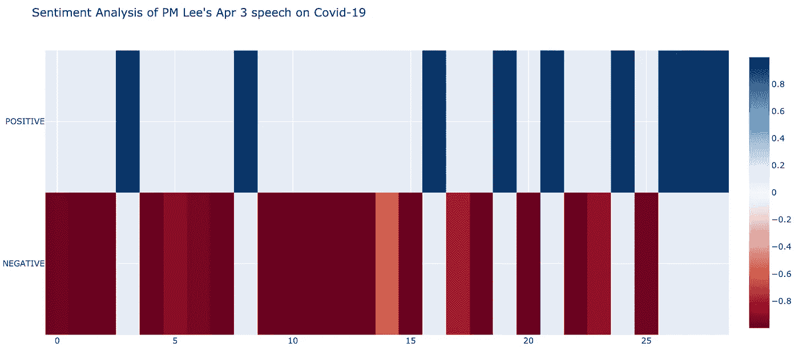
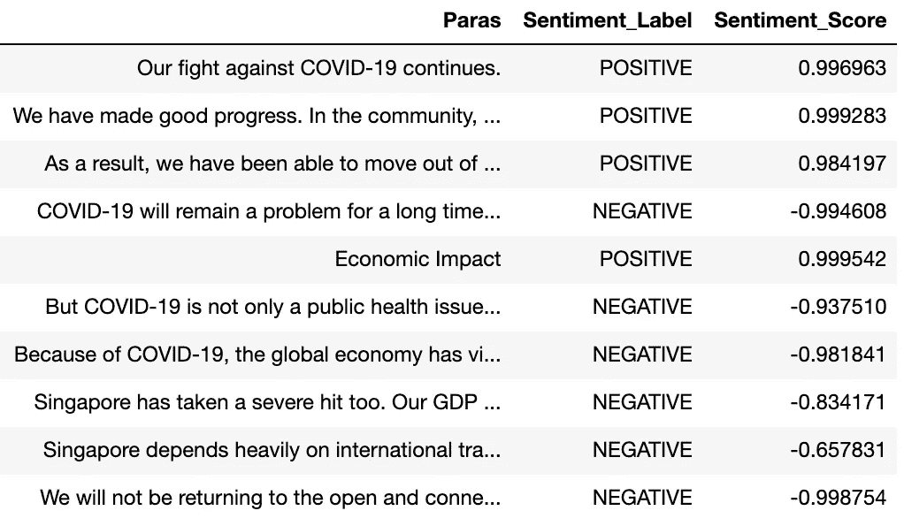
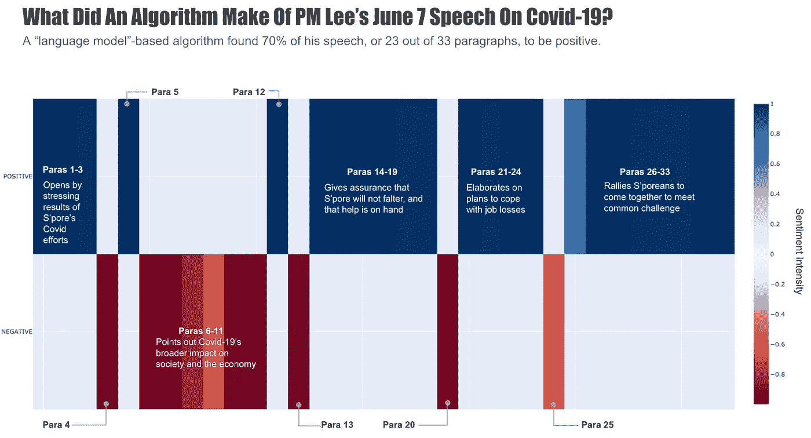
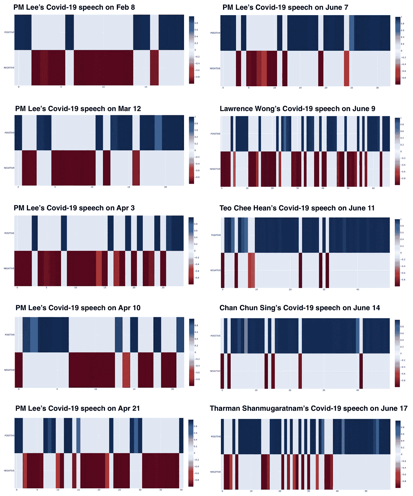
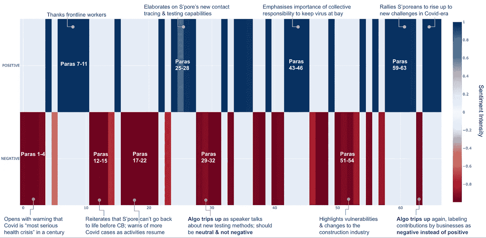
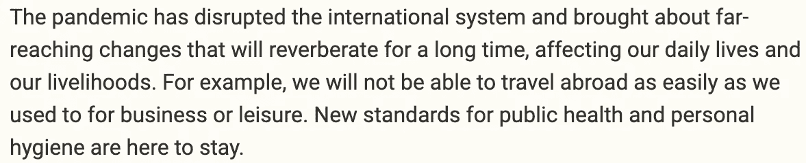

# 基于拥抱脸管道特征的政治演讲情感分析

> 原文：<https://towardsdatascience.com/sentiment-analysis-of-political-speeches-using-hugging-faces-pipeline-feature-3109c121d351?source=collection_archive---------51----------------------->

## 在评估政治演讲时，你更相信谁——人类专家还是算法？2020 年 2 月至 6 月期间，在新加坡对新冠肺炎的演讲进行了测试，得出了一些有趣的结果。

选举季节让我们许多人充满恐惧。但这也是一个很好的机会，可以用一个实际的用例来测试一些新的 NLP 特性。

最近几周，我一直在试验[拥抱脸(Hugging Face)的 HF 管道](https://huggingface.co/transformers/main_classes/pipelines.html)功能，看看如何轻松快速地使用它们来分析/总结新加坡的政治演讲。这篇文章将概述我对上述演讲进行短期和长期情绪分析的尝试，这些演讲在 2020 年 2 月至 6 月之间发表，具有 HF 的管道特征。

我发现结果相当令人印象深刻，尽管只是使用默认模型，没有对本地数据进行额外的微调。随着美国和新加坡等国家的选举即将到来，测试这些基于变形金刚的模型在不同政治环境下的表现还有进一步的空间。

# 回购、数据和警告

这篇文章的 Github [repo 包含一个笔记本和生成这篇文章中的一些图表所需的数据，以及 Plotly 图表和 CSV 结果表的样本。如果您希望一次生成多个演讲的结果，可以很容易地调整代码。](https://github.com/chuachinhon/practical_nlp)

这些数据包括来自新加坡政府和总理办公室网站的六份官方演讲记录。这些演讲的重点是政府应对新冠肺炎挑战的计划，并将为即将到来的大选提供更广泛的辩论框架。为了更公平地评估情绪，一些过长的文本被分成了更小的段落，但绝大多数演讲都是以原始形式进行分析的。

更严格的情感分析应用需要使用特定领域的数据对模型进行微调，尤其是在涉及医学或法律问题等专业主题的情况下。然而，在这篇文章中，我使用 HF 管道进行“开箱即用”的情感分析，这意味着结果是基于[默认蒸馏模型](https://github.com/huggingface/transformers/blob/master/src/transformers/pipelines.py#L1581)(更具体地说:[蒸馏-基础-未装箱-微调-SST-2-英语](https://huggingface.co/distilbert-base-uncased-finetuned-sst-2-english))。HF 的网站上有一个与情感分析和文本分类任务兼容的其他模型的[列表，如果你想进一步实验的话。](https://huggingface.co/models?filter=text-classification)

# 分析一篇演讲的情感

感谢 HF 的优秀员工，pipeline API 处理了复杂编码方面的繁重工作。在简单的文本预处理(分成段落)和清理之后，执行情感分析只需要[几行代码](https://github.com/chuachinhon/practical_nlp/blob/master/notebooks/1.0_speech_sentiment_cch.ipynb)。

管道生成情感标签以及分数。通过将标签和分数提取到一个单独的数据框中，我们可以轻松地检查结果，并查看模型可能出现错误的地方:

对我来说，更棘手的任务是找到一种可视化和注释结果的好方法。为了清晰和易于使用，我最终选定了一个组合 [Plotly](https://plotly.com/python/heatmaps/) 和谷歌幻灯片。请随意切换到您选择的可视化库。

这是来自数据集中第一个语音的情感分析的样本结果:

HF 的情绪分析管道对这次演讲的 33 个段落中的 23 个段落进行了积极的评估。

一眼看去，你就能知道说话者在积极或消极的领域停留了多长时间。在这种情况下，我们可以看到新加坡总理李显龙如何平衡新冠肺炎经济影响的严峻警告与政府计划帮助新加坡人应对失业的保证。他还以积极的方式结束了 6 月 7 日的演讲，将全国人民团结在一个共同的挑战周围。

# 分析一组演讲的情绪

如果我们将一系列的“情绪结构”图表组合在一起，我们可以很快了解来自同一机构的发言者是否在以不同的语气传递一致的信息，或者每个人是否在唱不同的调子。你也可以用这个来观察一个主题的情绪是如何随着时间而变化的。

下图以 10 次演讲为例，展示了新加坡政治领导人在 2 月至 6 月期间，在预期的民意调查之前，是如何改变他们在新冠肺炎问题上的讲话语气的。如果你比较左右两边的专栏，你会注意到整体情绪(对新冠肺炎)有明显的转变，从 2 月到 4 月底以消极为主，到 6 月份变得更加积极:

这一结果并不令人惊讶，因为在政府于 5 月份成功控制疫情之前，新加坡 4 月份的疫情明显恶化。随着选举的临近，高层政治领导人显然需要转向一种新的沟通策略——和语气——他们在 6 月份就这么做了。

2 月和 4 月下旬的讲话不包括在回购中，但可以在上述两个政府网站的链接中找到。

我认为这可以用来分析，比如说，川普在新冠肺炎疫情爆发初期和后期的语调变化。我也很想在拜登和特朗普的辩论中验证这一点。

# 算法出错的地方

这篇文章中的演讲分析结果可以从[这里下载](https://www.dropbox.com/sh/b9fpmlrpznkglzr/AACUi32duA9EC1gqBd_hNQuja)快速浏览。看看你是否同意算法的评估。

当然也有错误。下面的图表显示，在分析新加坡国家发展部长王冠逸的新冠肺炎 6 月 9 日在 T4 的演讲时，Distilbert 模型至少在两个方面出现了错误:

该算法错误地将他演讲中讨论新加坡新的测试和接触者追踪能力的一部分贴上了负面标签，而这一部分本应被视为中性或积极的。在演讲接近尾声时，它再次出错，错误地将一段赞扬商界贡献的段落标为负面。

在其他地方，这种算法可能会被对一种可怕情况的模糊而笼统的描述所“击败”,比如新加坡内阁资政张志勇·何岸 6 月 11 日演讲的第二段:

上一段中的语言大大低估了新冠肺炎造成的破坏的程度和严重性，有趣的是，算法将其标记为积极的。人类分析师会得出相反的结论。

# 结束注释+进一步工作

一个显而易见的改进是用一个关于新加坡政治和/或新冠肺炎的定制数据集对模型进行微调。然而，这个任务看起来并不简单(至少对我来说)，找到一个相关的*和*标记的训练数据集并不容易。

我也很有兴趣看看 HF 的 pipeline 的结果如何与[其他已知的情感分析方法相比较。](https://algorithmia.com/blog/using-machine-learning-for-sentiment-analysis-a-deep-dive)

但总的来说，尽管这种方法有明显的局限性，我还是对 HF 管道的结果印象深刻。显然，围绕演讲的情绪不仅仅取决于所用的词语，还取决于演讲者的演讲和举止。

一个完整的基于人工智能的演讲情感分析应该理想地结合使用[计算机视觉](https://arxiv.org/pdf/1804.08348.pdf)和音频取证，以更好地理解演讲者的面部表情和说话声音如何增加演讲的整体情感。但是这超出了本文的范围。

同时，如果您发现了错误或者用这种方法做了一些有趣的事情，请告诉我。在以下时间 Ping 我:

推特:[蔡振鸿](https://medium.com/u/b3d8090c0aee?source=post_page-----aad7f2e1d0a0----------------------)

领英:[www.linkedin.com/in/chuachinhon](http://www.linkedin.com/in/chuachinhon)