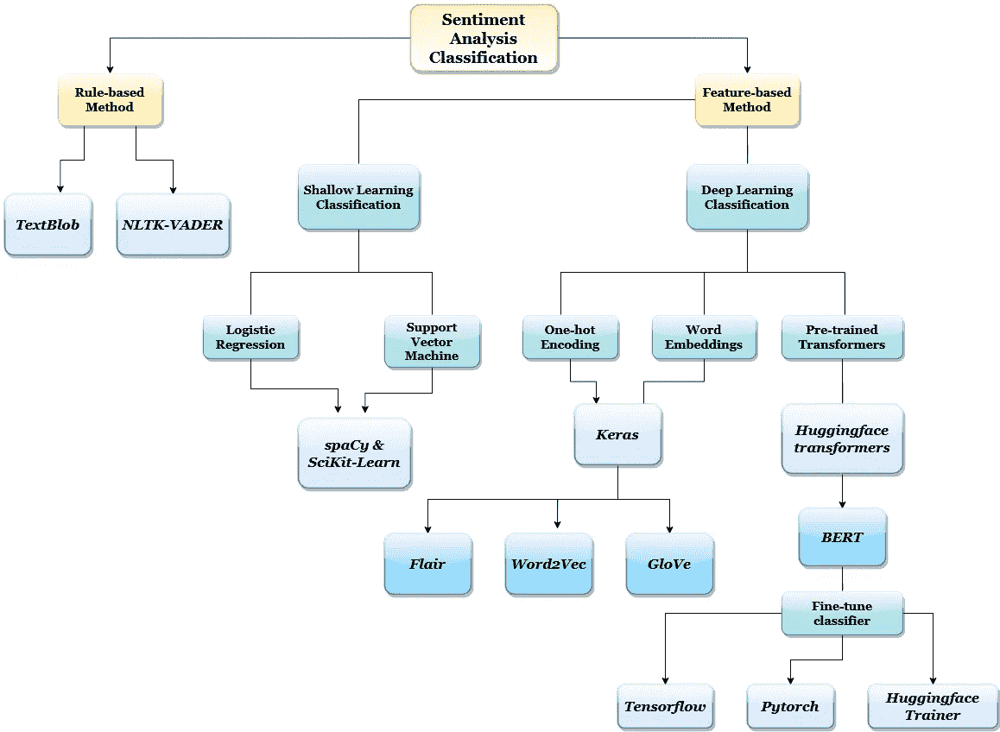

# 基于 Python 的社交媒体情感分析

> 原文：<https://towardsdatascience.com/sentiment-analysis-of-social-media-with-python-45268dc8f23f?source=collection_archive---------12----------------------->

## 用于对社交媒体文本中的情感进行分类的 Python 工具的初学者友好概述。我讨论了我使用不同工具的经历，并提供了一些建议，帮助您开始自己的 Python 情感分析之旅！

[T. Selin Erkan](https://unsplash.com/@enfemtre?utm_source=medium&utm_medium=referral) 在 [Unsplash](https://unsplash.com?utm_source=medium&utm_medium=referral) 上的照片

在古罗马，公共话语发生在城市中心的广场上。人们聚集在一起交流思想，讨论与社会相关的话题。如今，这种公共话语已经转移到 Reddit 等网站的数字论坛、Twitter 的微博平台和其他社交媒体上。也许作为一名研究人员，你很好奇人们对某个特定话题的看法，或者作为一名分析师，你希望研究贵公司最近营销活动的效果。用情感分析监控社交媒体是衡量公众意见的好方法。幸运的是，使用 Python 有许多选择，我将讨论我已经试验过的方法和工具，以及我对这种体验的想法。

在我的学习之旅中，我从最简单的选项 *TextBlob* 开始，通过 *Pytorch* 和 *Tensorflow* 逐步使用 transformers 进行深度学习。如果您是 Python 和情绪分析的初学者，不要担心，下一节将提供背景知识。否则，请随意跳到下面的图表，查看 Python 自然语言处理(NLP)领域的可视化概述。

**情感分析简介**

情感分析是 NLP 的一部分；文本可以通过情感(有时称为极性)进行分类，可以是粗粒度的，也可以是细粒度的。粗略情感分析可以是二元(正面或负面)分类，或者是包括中性的 3 分等级。而 5 分制是精细分析，代表高度积极、积极、中立、消极和高度消极。早期的分析依赖于基于规则的方法，如 Python 库 *TextBlob* 和 *NLTK-VADER* 所使用的方法，这两种方法在初学者中很受欢迎。大多数机器学习(ML)方法都是基于[特征的](/the-art-of-finding-the-best-features-for-machine-learning-a9074e2ca60d)，并且涉及浅度或深度学习。浅层方法包括在单层神经网络中使用分类算法，而 NLP 的深度学习需要神经网络中的多层。这些层中的一层(第一个隐藏层)将是一个[嵌入层](https://machinelearningmastery.com/use-word-embedding-layers-deep-learning-keras/)，它包含上下文信息。

对神经网络的详细解释超出了本文的范围，但是对于我们的目的来说，过于简化就足够了:神经网络是一组算法，它们以模拟人脑中神经元网络的方式来学习关于数据的关系。为了更深入地探究神经网络背后的迷人理论，我建议这篇[介绍性文章](/introducing-deep-learning-and-neural-networks-deep-learning-for-rookies-1-bd68f9cf5883)。

我注意到的一个共同的主题是，一种方法越善于从上下文中捕捉细微差别，情感分类的准确性就越高。有几种技术可以以捕捉上下文的方式编码或嵌入文本，以获得更高的准确性。因此，嵌入层对于深度学习模型的成功是不可或缺的。今天，深度学习正在以令人兴奋的速度推进 NLP 领域。深度学习的前沿是 [transformers](http://jalammar.github.io/illustrated-transformer/) ，预训练的语言模型可能有数十亿个参数，它们是开源的，可以用于最先进的准确度分数。我创建了下面的图表来展示可用于情感分析的 Python 库和 ML 框架，但是不要感到不知所措，有几个选项可供初学者使用。

*可用于情感分析的 Python 库和机器学习框架。图片作者。*

**基于规则的 Python 库**

TextBlob 很受欢迎，因为它使用简单，如果您是 Python 新手，这是一个很好的起点。我的一个早期项目涉及用 *TextBlob* 计算的极性和主观性分数的数据可视化。下面的代码片段显示了对从 Twitter 实时流出的 tweets 的 *TextBlob* 的简单实现，完整代码请查看我的[要点](https://gist.github.com/haayanau/63d03cad7db813a3f77577038c3f0d5f)。

虽然使用 *TextBlob* 很容易，但不幸的是它不是很准确，因为自然语言，尤其是社交媒体语言，很复杂，并且基于规则的方法会忽略上下文的细微差别。 *NLTK-VADER* 是一个专门为处理社交媒体文本而开发的 NLP 包。我建议，如果你正在处理 tweets，并且正在为 *TextBlob* 寻找一个比较点，那就去看看吧。

TextBlob 示例，完整的[要点](https://gist.github.com/haayanau/63d03cad7db813a3f77577038c3f0d5f)和实时 Twitter 流可用。

**基于特征方法的机器学习**

我意识到，如果我想要更高的准确性，我需要使用机器学习；语境化是关键。我从传统的浅层学习方法开始，如单层神经网络中使用的逻辑回归和支持向量机算法。除了比深度学习需要更少的工作之外，其优势还在于从原始数据中自动提取特征，只需很少或不需要预处理。我使用 NLP 软件包 *spaCy* 和 ML 软件包 *scikit-learn* 来运行简单的实验。我受到了一篇[博文](/using-scikit-learn-to-find-bullies-c47a1045d92f)的启发，作者使用这两个包来检测社会评论中的侮辱，以识别欺凌者。对于细粒度的情感分类，机器学习(基于特征)比基于规则的方法有优势，这篇[优秀的帖子](/fine-grained-sentiment-analysis-in-python-part-1-2697bb111ed4)在 [5 级斯坦福情感树库(SST-5)数据集](https://nlp.stanford.edu/sentiment/)上比较了基于规则的方法和基于特征的方法的准确性。

**深度学习:嵌入和变形金刚**

深度学习和单词嵌入进一步提高了情感分析的准确度。2013 年，谷歌创建了 [Word2Vec 嵌入算法](http://jalammar.github.io/illustrated-word2vec/)，它与[手套算法](https://medium.com/sciforce/word-vectors-in-natural-language-processing-global-vectors-glove-51339db89639)一起仍然是最受欢迎的两种单词嵌入方法。要进行实际演练，请查看[的这篇文章](/neural-network-embeddings-explained-4d028e6f0526)，作者在文章中使用嵌入式技术创建了一个图书推荐系统。传统上，对于深度学习分类，单词嵌入将被用作[递归](https://medium.com/paper-club/recurrent-convolutional-neural-networks-for-text-classification-107020765e52)或[卷积神经网络](/how-to-build-a-gated-convolutional-neural-network-gcnn-for-natural-language-processing-nlp-5ba3ee730bfb)的一部分。然而，这些网络需要很长时间来训练，因为递归和卷积很难并行化。注意力机制提高了这些网络的准确性，然后在 2017 年，transformer 架构引入了一种使用注意力机制的方法，没有递归或卷积。因此，在过去几年中，NLP 在深度学习方面的最大发展无疑是变形金刚的出现。

**Python 深度学习库**

当我开始研究深度学习时，我依靠 Reddit 的建议选择了一个 Python 框架作为起点。对初学者的最大建议是 Python 库， *Keras* ，它是一个功能 API。我发现它非常容易理解，特别是因为它建立在 *Tensorflow* 框架之上，具有足够的抽象性，细节不会变得令人不知所措，并且足够简单，初学者可以通过玩代码来学习。仅仅因为 *Keras* 简化了深度学习，这并不意味着它不具备以复杂的方式处理复杂问题的能力。在必要时，用 *Tensorflow* 工具来增加 *Keras* 相对容易，以便在较低的抽象层次上调整细节，因此 *Keras* 是深度学习战场上的有力竞争者。在下面的代码片段中，我试图从预训练的语言模型中构建一个分类器，同时尝试使用[多样本丢失](/multi-sample-dropout-in-keras-ea8b8a9bfd83)和[分层 k 折叠交叉验证](https://medium.com/@xzz201920/stratifiedkfold-v-s-kfold-v-s-stratifiedshufflesplit-ffcae5bfdf)，所有这些都可以使用 *Keras* 实现。

多辍学模型的 Keras 代码片段，带有分层 k-fold 交叉验证的抽样。

我对变形金刚的介绍是可爱命名的 Python 库，*拥抱变形金刚*。这个库使得将变形金刚与主要的机器学习框架、 *TensorFlow* 和 *Pytorch* 一起使用变得简单，并且提供他们自己的*hugging face*Trainer*来微调他们提供的预训练模型的分类。最受欢迎的 transformer BERT 是一个在巨大语料库上预先训练的语言模型；基本模型有 1.1 亿个参数，大型模型有 3.4 亿个参数。对于情感分类，BERT 必须在下游分类任务中使用带有情感标签的数据集进行微调。这被称为迁移学习，它利用预先训练的模型权重的力量，允许在微调过程中迁移上下文嵌入的细微差别。还有其他几个变压器，如罗伯塔，阿尔伯特和伊莱克特拉，仅举几例。除了非常容易使用之外， *Huggingface* 还有很好的文档，如果你有兴趣探索其他模型的话，[链接于此](https://huggingface.co/transformers/)。此外，由于在 CPU 上进行微调需要时间，我建议利用 Colab 笔记本，这将允许你在谷歌的云 GPU 上免费运行实验(有每月速率限制)，以加快训练时间。*

***哪个机器学习框架适合你？***

*我可以根据我的经验提供我对我更喜欢哪个机器学习框架的看法，但我的建议是至少尝试一次。OG 框架 *Tensorflow* 是一个优秀的 ML 框架，但是在我的 NLP transformers 实验中，我主要使用的是 *Pytorch* 框架(富于表现力、非常快速、完全控制)或 HF Trainer(直接、快速、简单)。我对 Pytorch 的偏爱是因为它允许在设计和修补实验时进行控制——而且它比 Keras 更快。如果你喜欢面向对象编程胜过函数式编程，我建议你使用 Pytorch 框架，因为它的代码使用了类，因此简洁明了。在下面使用 *Pytorch* 的代码片段中，我创建了一个分类器类，并使用构造函数从该类创建一个对象，然后由该类的 forward pass 方法执行。*

*使用 Huggingface 预训练模型的 BERT py torch 实现片段。*

*需要额外的代码来运行向后传递，并使用优化器来计算损失和更新权重。 *Pytorch* 的代码明显比 *Keras* 所需的代码长。如果你喜欢快速编写代码，而不是详细说明每一个训练步骤，那么 *Keras* 是你更好的选择。然而，如果你想了解训练中发生的一切， *Pytorch* 让这成为可能。要获得带示例的 *Pytorch* 的分步指南，请查看这篇[介绍性帖子](/understanding-pytorch-with-an-example-a-step-by-step-tutorial-81fc5f8c4e8e)。对于一个使用 *Pytorch* 的很酷的项目，我推荐维尼林·瓦尔科夫的这个[很棒的教程](https://www.curiousily.com/posts/sentiment-analysis-with-bert-and-hugging-face-using-pytorch-and-python/)，他向你展示了如何使用 BERT 和*hugging face transformers*和 *Pytorch* ，然后用 *FASTAPI* 部署那个模型。*

*希望这篇文章能让你明白从哪里开始用 Python 进行情感分析，以及随着你的进步你有什么选择。就我个人而言，我期待了解更多关于 NLP 的最新进展，这样我就可以更好地利用现有的令人惊叹的 Python 工具。*