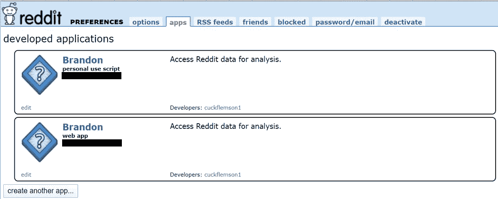
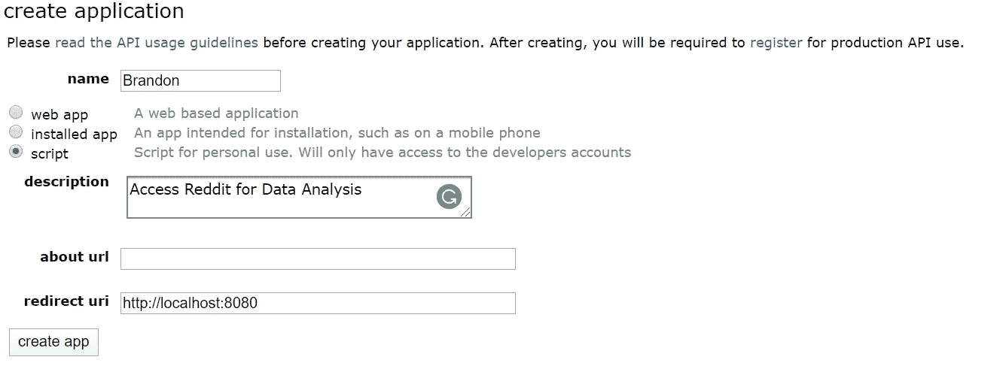
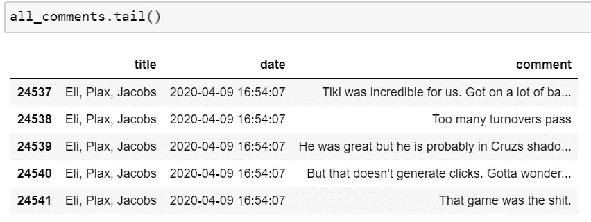
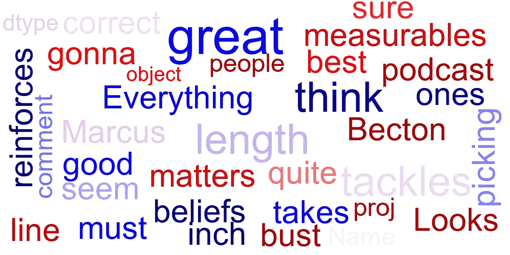
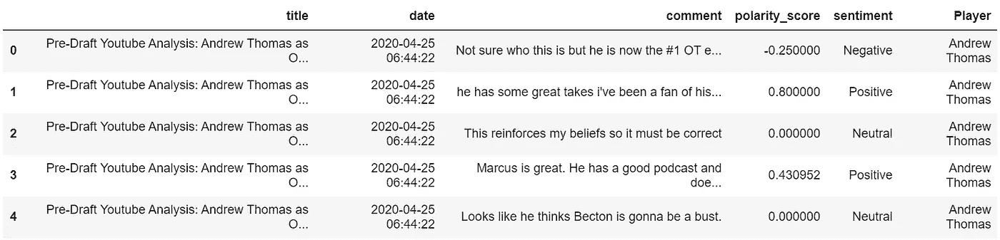
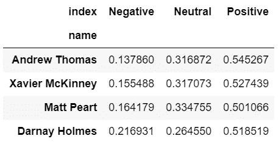

# 纽约巨人队 2020 年选秀的情感分析

> 原文：<https://towardsdatascience.com/sentiment-analysis-of-the-new-york-giants-2020-draft-6f095e2363af?source=collection_archive---------84----------------------->


图片来源于[NorthJersey.com 的克里斯·佩多塔——今日美国网](https://www.northjersey.com/story/sports/nfl/giants/2019/10/25/golden-tate-seeks-validation-win-ny-giants-return-detroit-against-lions/2453836001/)

## 体育分析

## 对巨人队选秀权的球迷情绪的深入观察

对于纽约巨人队的球迷来说，过去 10 年左右的选秀之夜传递了各种各样的情感。有高潮也有低谷。根据选秀之夜的反应和在球场上的表现，前台已经确定了几个人选，最著名的是小奥黛尔·贝克汉姆和萨昆·巴克利。不幸的是，对于每一个 Saquon 或 Odell，都有一些 Ereck Flowers 或 Eli Apples 加入其中。

不久前，球迷对 NFL 选秀的反应主要是通过现场球队球迷的嘘声或欢呼声来衡量的。然而，在当今世界，球迷们迅速涌向 Twitter 或 Reddit 等社交媒体网站，让人们听到他们对球队未来发展方向的看法。我开始通过 Python 使用网络抓取和情感分析来捕捉这种反应。

我决定收集 Reddit 的评论，而不是 Twitter，因为在我看来，Reddit 用户的反应往往比 Twitter 上常见的“烧掉它”人群更合理。本文将介绍通过情感分析获取、探索和分析数据的过程。我的目标是足够详细，读者可以为他们自己喜欢的 NFL 球队复制这一分析。

我将使用 Python 和 Jupyter Notebook 作为 IDE 来进行这个分析。下面列出了使用的包和依赖项。

# 获取数据

一旦包被导入，第一步是获得实际的 Reddit 评论数据。幸运的是，PRAW 包(Python Reddit API Wrapper)让这个任务变得简单了。

要打开一个连接，登录 Reddit，然后跟随[这个链接](https://www.reddit.com/prefs/apps)。接下来，点击下面截图左下角显示的“创建另一个应用程序”按钮。



然后填写申请表。填写您的姓名，选择一个脚本，并添加您计划如何使用从 API 提取的数据的简短描述。对于重定向 URL，请始终输入“http//localhost:8080”。



现在已经创建了应用程序，返回到 Jupyter 笔记本，并使用 praw.Reddit 创建一个到 Reddit 的连接。client_id 是一个 14 个字符的字符串，它将出现在上面访问的 Reddit 应用程序页面上您的姓名和“个人使用脚本”下。你可以在创建 app 后找到“client_secret”，它是一个 27 个字符串。其余的字段非常简单明了，包括输入 Reddit 帐户信息。

一旦连接建立，您将能够访问 PRAW 提供的所有强大功能。出于我的目的，我只需要从 Reddit 访问标题、时间戳和评论数据。然而，你还可以获得更多的特性，比如文章正文、投票数和评论数。

为了访问我正在寻找的信息，我从 NYGiants subreddit 中的最后 750 个帖子中提取了帖子 id。这样，我确信我会涵盖 4 月 23 日至 25 日发生的整个 NFL 草案。

在访问了 post ids 之后，我编写了一个嵌套的 for 循环来捕获我正在寻找的信息。首先，我遍历每个 id，从相关帖子中提取评论。然后我循环浏览每一条评论，找出它们的标题和日期。Praw 文档提供了可以从 Reddit 帖子中提取的提交对象的详尽列表。



结果数据帧

# 争论数据

上面的数据框提供了必要的数据来捕捉今年选秀期间纽约巨人队球迷的时代精神。运行这个循环需要相当长的时间，所以我复制了一份数据，并将其写入一个 CSV 文件，以便以后访问。我还过滤了数据，以便它只包含从 4 月 23 日开始到 4 月 25 日午夜结束的 Reddit 评论，以确保我只查看 NFL 选秀日。顺便提一下:我已经养成了从数据帧的一部分复制数据的习惯。这个习惯确保我不会遇到任何来自熊猫的复制警告的[场景。](https://www.dataquest.io/blog/settingwithcopywarning/)

然而，我不想只是全面地探索草案评论，所以我还为巨人的每个顶级选秀(前 4 轮)创建了一个特定的草案名称。为了实现这个目标，我使用了一个正则表达式来查找包含每个选秀名称的 Reddit 帖子标题。我将正则表达式设置为选择每个草稿的名字或姓氏，而忽略字母大小写。当然还有更彻底的表达方式可以使用，但我觉得这种方法抓住了绝大多数的评论。仅安德鲁·托马斯一人就在 3 天内发表了 972 条评论。不出所料，球员被选中的时间越晚，他们从巨人队球迷那里得到的评论就越少。

# 可视化数据

现在数据准备好了，我可以研究数据，看看它显示了什么。我最喜欢的一种可视化文本数据的方式是单词云的形式。我认为这是一种有趣而简单的方式来理解纽约巨人队球迷对选秀的看法。

要生成单词云，您需要安装软件包并编写一个函数来生成图像。通过调用 WordCloud 函数，您可以轻松地定制单词云的不同方面，如最大字数、字体大小和配色方案。包含一个停用词列表是非常重要的，这样你的词云就不会被诸如 I、and、am 等填充词所占据。向海王星实验室人工智能大声喊出来，获得如何生成单词云的精彩教程。

戴夫·盖特勒曼在 2020 年 NFL 选秀中以第四顺位选中了安德鲁·托马斯，这多少有些出人意料。然而，许多球迷(包括我自己)对这个选择感到高兴，因为它有助于巩固过去几年来糟糕透顶的进攻线。下面是一个单词云，描述了巨人队球迷对安德鲁·托马斯的选择的感受。作为参考，在其他单词的上下文中较大的单词比其他单词包含在更多的 Reddit 帖子中。有几个词会立即出现，比如“棒极了”，这可能代表了许多发帖人对该作品质量的看法。“加强”和“铲球”对我来说也很突出，显然是关于修复纽约巨人队进攻线的上述问题。



安德鲁·托马斯词云

单词云并不是一种分析文本的复杂方法，但它确实提供了一种快速查看数据集中哪些单词最常见的方法。为了简洁起见，我不会包括其他选秀状元的词云。但是，如果您感兴趣，一旦编写了函数，代码很容易被其他玩家复制。

# 基本情感分析

情感分析使用自然语言处理(NLP)来确定一串文本是否具有正面、中性或负面的含义。这是快速解决我正在试图解决的问题的完美工具…巨人队的球迷对 2020 年 NFL 选秀有什么感觉？

我将使用一个名为 TextBlob 的包来完成这项任务。通过 TextBlob 运行情感分析将返回两个值，一个极性得分和一个主观性得分。极性分值的范围从-1 到 1，适用于字符串中的每个单词。肯定暗示的单词得分为 1，而否定暗示的单词标记为-1。串中这些分数的平均值产生最终的极性分数。主观性得分的范围是从 0 到 1，简单地衡量一个字符串的主观程度。例如，句子“我午餐吃了一份鸡肉三明治”的主观性得分较低，因为这是事实，因此没有解释的余地。在本文中，我将更多地关注极性得分。 [TextBlob 网站](https://textblob.readthedocs.io/en/dev/quickstart.html#sentiment-analysis)有更多与其情感分析功能相关的信息。

下面的函数允许我将极性得分应用到每个球员的数据框中的每个评论。使用这个函数，我将一个字符串放入一个 TextBlob 中，然后删除停止的单词，最后计算剩余单词的极性得分。有必要删除停用词，以免夸大中性评论的数量。

一旦创建了“polarity_score”函数，就可以很容易地将它应用于每个球员的数据框，以计算每个评论的情绪。

在我分析的这一点上，我意识到我想要容易地分析每个玩家对彼此的情绪。所以我运行了几行代码，将每个玩家组合到一个数据框中。首先，我添加了一个名为“Player”的特性来识别评论是针对哪个玩家的。接下来，我将每个球员添加到一个名为“draft_class”的数据帧中。

现在，我可以轻松地比较 2020 年每个选秀权的球迷情绪了。为了完成这个任务，我决定使用 [Plotly express](https://plotly.com/python/plotly-express/) ，因为它能够交付交互式可视化。这对于关注数据的特定部分以及悬停在数据点上查看特定值非常有用。

```
import plotly.express as px
```

我决定首先探索巨人的前四个选秀权的极性得分的分布。为了做到这一点，我创建了一个直方图，每个玩家都有不同的分布。Plotly express 还允许用户轻松调整直方图仓的数量、图表颜色和图表/轴标签，如下面的代码所示。下面的缩写循环删除了图表右侧自动生成的球员姓名的文本标签。我觉得包括这些标签是多余的，因为图例也是可用的。

## 注意:我为这篇文章中没有直接嵌入的可视化图形道歉。Embed.ly，支持媒体嵌入的技术遇到了一些技术问题。

[](https://chart-studio.plotly.com/~bkmurphy/1.embed) [## 巨人选秀的极性得分分布| Bkmurphy 制作的直方图| Plotly

### Bkmurphy 的“巨人选秀极性得分分布”交互图和数据是一个直方图，显示…

chart-studio.plotly.com](https://chart-studio.plotly.com/~bkmurphy/1.embed) 

数据显示，所有 2020 年巨人队的选择都遵循类似的极性得分分布。对每个球员的大部分评论都围绕着一个中性的内涵。不过我们也看到 2020 选秀班正面评价明显多于负面。这可能预示着一些事情。首先，这可能意味着巨人的粉丝群对选秀的整体方向感到满意，对前台的工作感到满意。我认为这将是一个有点合理的结论，考虑到许多球迷希望看到今年选秀中的进攻线和防守。或者，这可能意味着球迷们正在合理化，选择的球员是最好的，有助于巨人未来的改善。

在查看了极性得分分布后，我对了解每个玩家正面、中立或负面评论的百分比很感兴趣。我很快编写了一个函数，将大于 0 的值分类为“正”，如果值等于 0 则为“中性”，如果小于 0 则为“负”。

然后，我将这个函数应用于每个玩家数据框的极性得分，为情绪创建一个新列。生成的数据框如下图所示。



每个草图拾取的最终数据框

此时，我可以操纵数据来显示每个玩家的每种情绪类型的百分比。我决定将数据可视化在一个堆积条形图中。这样做需要对上面显示的数据框进行一些额外的数据操作。对于每个玩家，我创建了一个新的数据框，通过将每个情感类型的值计数除以数据长度来实现。然后，我必须组合这些数据框，并将值放入数据透视表中，以正确格式化堆积条形图的数据。生成的数据透视表如下所示。



情感价值数据透视表

这个数据透视表提供了一种在交互式条形图中可视化结果的方式。我选择不包含开发数据透视表的代码，因为它有些冗长。如果有人感兴趣，我很乐意与大家分享本文之外的代码。

[](https://chart-studio.plotly.com/~bkmurphy/13.embed) [## 纽约巨人 2020 选秀阶级情绪| Bkmurphy 制作的堆积条形图| plotly

### Bkmurphy 的“纽约巨人队 2020 选秀阶层情绪”互动图和数据是一个堆积条形图，显示…

chart-studio.plotly.com](https://chart-studio.plotly.com/~bkmurphy/13.embed) 

快速浏览一下 2020 年选秀班的情绪可以发现，大约 55%与安德鲁·托马斯有关的评论都有积极的内涵。相反，约 14%的评论对选择他持负面看法。再次，这支持了巨人队的球迷对安德鲁·托马斯作为第一轮选秀权感到满意的想法。

大多数选秀权都和安德鲁·托马斯有相似的正面/负面评论比例。我确实注意到负面评论的比例在高轮选秀中显著增加。这让我很惊讶，因为我预计中性评论的数量会增加，因为球迷不太可能熟悉后面几轮的球员。我怀疑负面评论的增加是因为许多球迷在选秀中更倾向于选择某个球员。也许他们认为这个球员是偷来的，认为巨人不选他是疯了。当巨人不选择这个球员时，我认为球迷更有可能消极地看待最终的选秀权。当然，这更多的是个人偏见的反映，而不是对真正的巨人选秀权的损害。

# 结论

好了，现在您应该能够通过从 Reddit API 中提取评论来运行完整的情感分析。情感分析是一种快速了解人们对某个特定话题的感受的方法。

虽然我将这个过程应用于 NFL 草案评论，但这个过程在许多不同的应用程序中是可重复的。例如，一家企业可以收集 Twitter 或 Reddit 上的评论来了解客户的声音，或者《星球大战》等电影系列的粉丝可以分析粉丝对最新电影发行的感受。可能性是广泛的，并为一些创造性的项目留下了很大的空间。

我希望这个教程是有用的。如果你有任何问题，评论，建设性的批评，或其他想法，请随时在下面的评论中告诉我！