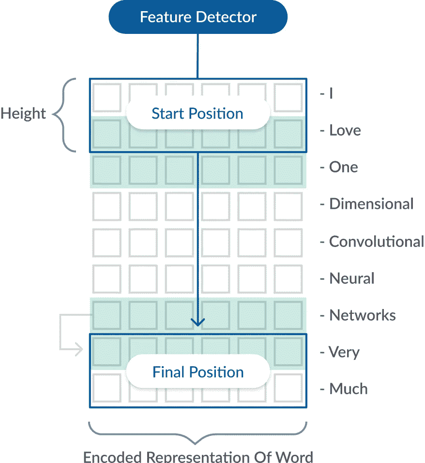

# 基于深度学习的优步和奥拉情感分析

> 原文：<https://towardsdatascience.com/sentiment-analysis-of-uber-ola-using-deep-learning-5c281d353e13?source=collection_archive---------21----------------------->

## 了解印度出租车服务客户的需求

肖院长在 [Unsplash](https://unsplash.com?utm_source=medium&utm_medium=referral) 上的照片

本文介绍了我们使用深度学习来了解优步和 Ola 在印度各地的出租车服务的研究。

# **要点**

1.  我们的工作针对不同人群的日常交通方式，以及他们对服务提供商的期望。
2.  目前在印度最受欢迎的两家出租车服务是优步和 Ola，拥有大量生活方式不同的用户。
3.  如今，Twitter 正处于数据高峰期，每天有数百万人发推文，目前优步和奥拉在 Twitter 上的粉丝分别为 315.2K 和 244.9K。
4.  用于理解人们情绪的深度学习算法是卷积神经网络。
5.  我们评估情绪类别的模型，例如积极和消极，以找出它相对于用例产生的准确性。

# 介绍

Twitter 情绪分析用于发现推文背后人们的情绪或情感。通过推文分析个人/客户的评论，这有助于公司进一步了解客户对公司提供的产品或服务的评论。自从 Twitter 情感分析开始以来，从客户的角度提取、量化和理解他们产品的价值对公司来说是非常有益的。虽然 Twitter 情绪分析可以在任何领域进行，但选择的领域是优步和奥拉出租车服务公司。选择优步和奥拉的原因是因为可以从出租车用户那里收集到大量的数据。这可以在以后用于提取推文，以了解客户对服务是否满意&他们面临什么问题。

研究人员已经对 3000 条推文进行了情感分析，在提取这些推文后，必须清除它们中的停用词、超链接和空格。我们想到使用的方法是深度学习，以更敏锐地理解它如何对优步和奥拉的 Twitter 情绪分析产生影响。对于我们的数据集，使用的算法是深度前馈神经网络(DFF)和卷积神经网络(CNN)。这两种算法都属于深度神经网络(DNN)的范畴。清理完 tweets 后，首先使用的技术是 Google Word2Vec。Google Word2Vec 是一种训练文本中词汇的高级方法。它训练词汇，使其尽可能接近单词的意思。各种参数是感知器的权重乘法、各种激活函数、用于优化输出和损失函数的优化器。精度是基于损失函数计算的。该函数用于计算训练和测试数据之间的损失，从而使我们了解深度学习算法如何影响优步和奥拉的推特情感分析。

# 资料组

使用 API 从 Twitter 获得用于情感分类的数据集。

CSV 格式的 Excel 表格

需要记住的重要一点是，可以从文本(用户的推文)中获得情感分类的相关信息。

# 情感分类涉及的步骤

获得所需用例有不同的步骤，它们是

情感分析的步骤

> 情感分析包括 7 个步骤，分别是:
> 
> 1.**文本输入**
> 
> 数据是从优步和 Ola 收集的，并牢记用例的相关参数。
> 
> 2.**标记化**
> 
> 符号化是从整体中提取有意义的数据的过程。
> 
> 3.**停止单词过滤**
> 
> 停用词是应该被过滤的常用词。
> 
> 4.**否定处理**
> 
> 否定处理决定了不同类型否定的否定范围。
> 
> 5.**词干**
> 
> 词干是一种压缩不同单词形式的方法。
> 
> 6.**分类**
> 
> 用于情感分析的分类算法，将在其中创建模型。
> 
> 7.**情感类**
> 
> 情感类别分为正面和负面，或者对于不同的用例可以有所不同。

# 词云生成

词云只不过是在特定文本中出现次数较多的词的可视化表示。单词越大，出现的次数越多，反之亦然。

词云让我们正确理解一个特定的词是如何与用例相关联的。

## 优步的文字云生成

优步的圆形文字云—作者图片

## Ola 的词云生成

Ola 的圆形单词云—作者图片

# 算法

使用深度学习来理解情感的算法有

## 非深度前馈神经网络

单层神经网络—图片由作者提供

## 深度前馈神经网络

多层神经网络—作者图片

## 卷积神经网络(CNN)

一维卷积神经网络—图片由作者提供

# 谷歌 Word2Vec

Google Word2vec 是一种更好的训练文本理解不同单词之间词汇的方法。NLP 使用不同的词汇表进行改进，因为 word2vec 是两层的，包含不同的单词和单词之间的相似性，这有助于特定文本以更好的方式理解含义。关于网格的 google word2vec 的表示如下所示。

Google Word2Vec 展示——作者图片

深度学习用于尽可能最好地理解 Word2Vec。

# 实验

> 这项研究的实验部分由通过执行迭代获得的各种测试和结果组成。情感分析涉及的步骤有:
> 使用 TwitterAPI 从 Twitter 收集数据
> CSV 文件包含两个数据集的 3000 条推文
> 获取每条推文的情感评分
> 将推文分为正面&负面
> 正面== 1 &负面== 0
> 生成单词词汇
> 将数据划分为 2400 个训练&测试

## 谷歌 Word2Vec 地图

越接近的点越相似——作者图片

特征数量与推文数据集——按作者分类的图片

## 用于优化网络的公式

> **感知器的权重乘法**感知器具有一个输入，该输入具有一些输入值，并被传递到具有一些分配的权重的节点，该权重被加上偏差并被传递到激活函数。每个感知器的公式如下所示。

带输入和偏差的广义权重乘法—作者图片

> **激活函数**权重相乘得到的值&加上偏置赋予激活函数，有不同的激活函数，本文使用的两个是 ReLu & Sigmoid 激活函数。

ReLU 激活功能—作者图片

Sigmoid 激活功能—图片由作者提供

> **优化输出的优化器**优化器用于通过各种迭代来优化值，有不同数量的优化器可供使用。用于 DNN 的优化器是 Adadelta。Adagrad optimizer 的缺乏是由于分母值的增加导致了学习率的增加，为了克服这种影响，使用了 Adadelta。

Adadelta 优化器—作者图片

> **损失函数**用于处理输出损失的损失函数是
> 二元交叉熵损失函数。使用二进制是因为输出分别为 0 & 1。

二元交叉熵损失函数—作者图片

## 为分类创建的模型

> **非深度神经网络**

单层神经网络

在不同的时间间隔上训练非深度神经网络，以了解这如何影响大多数数据集的准确性。该模型分别针对优步和奥拉的数据集进行了训练。

> **单层神经网络获得的精度和损失**

NDNN 的训练和验证准确性/损失

> 【NDNN 的 500 个数据集区间的精度

增加 500 条推文的数据集

该表具有以百分比表示的准确度，并且可以观察到，对于 500 个数据集，生成的准确度对于优步是 87.00 %，对于 Ola 是 70.00 %。Ola 从基本数据集得到的准确性相对较低，因此它为 3000 个数据集生成了最高的 81.88 %。优步数据集的平均准确率为 92.99 %，Ola 的平均准确率为 75.18 %，比优步低 17.81 %。

> **深度神经网络**

多层神经网络

深度前馈神经网络也在超参数优化的帮助下使用，以了解各个模型需要多少个隐藏层。用于深度学习模型的隐藏层的数量是 2-隐藏层，所有其他参数保持不变。与批量大小为 50 的非深度神经网络相比，该模型中使用的时期也是 20。

> **多层神经网络获得的精度以及损失**

DNN 的培训和验证准确性/损失

> **DNN 500 个数据集区间的精度**

增加 500 条推文的数据集

可以观察到，优步数据集的基本精度为 88.00 %，奥拉数据集的基本精度为 71.00 %，优步数据集的最高精度为 96.33 %，奥拉数据集的最高精度为 82.05%，与模型的 1 层相比，精度没有显著提高。与非深度学习神经网络相比，优步数据集增加了 0.16 %，Ola 数据集增加了 0.17 %。

> **卷积神经网络**

卷积神经网络

有一个维数为 300 和字数为 2200 的 1-嵌入层，它连接到 128 个内核大小为 3，4，5 的滤波器，并且使用的激活函数是 ReLu。Max Pooling 还用于从格网中获取最大值，这些值通过激活函数 Sigmoid 传递到输出层。

> **从卷积神经网络获得的精度以及损失**

CNN 的培训和验证准确性/损失

> **CNN 500 个数据集区间的精度**

增加 500 条推文的数据集

可以观察到，为优步数据集生成的最小准确度是 91.00 %，而 Ola 数据集是 65.00 %，这优于非深度神经网络和深度神经网络的准确度。优步和奥拉数据集的最大准确率分别为 96.00 %和 80.37 %，与其他两个模型的准确率接近。优步数据集的平均准确率为 93.59 %，而 Ola 数据集的平均准确率为 74.42 %。

# 结论

这些数据在深度学习算法的帮助下进行训练，以更深入的方式理解情绪。Google word2vec 用于生成词汇，并使数据集中的词与相似的词得到正确的理解。所有三个模型都计算了精确度。为优步数据集生成最佳精度的模型是具有两个隐藏层的深度神经网络。超参数优化提供了使用两个隐藏层的选择，这反过来最适合优步推文。类似地，为 Ola 数据集生成最佳准确度的模型是具有两个隐藏层的相同深度神经网络。据观察，与优步相比，Ola 推文的准确性并不是那么好，因为提取的推文有许多格式不正确的文本，尽管清理工作已经完成，但仍无法产生预期的准确性。还观察到 CNN 模型在 DNA 方面是温和的，这是有疑问的。卷积神经网络在图像处理方面更为人所知，但也用于理解它在文本分析中的表现。

# 参考

[1]去，亚历克，黄蕾，和 Richa Bhayani。“推特情绪分析。”熵 17 (2009): 252。

[2] Sharma、Anuj 和 Shubhamoy Dey。"情感分析的特征选择和机器学习技术的比较研究."2012 年 ACM 应用计算研究会议录。2012.

[3]金，尹。"用于句子分类的卷积神经网络."arXiv 预印本 arXiv:1408.5882 (2014)。

[4]塞弗林、阿利亚克塞和亚历山德罗·莫斯奇蒂。"用深度卷积神经网络进行推特情感分析."第 38 届国际 ACM SIGIR 信息检索研究与发展会议录。2015.

[5]王、博、。"基于方面的情感分析的深度学习."斯坦福大学报告(2015)。

# 在你走之前

研究论文:[https://ieeexplore.ieee.org/document/9215429](https://ieeexplore.ieee.org/document/9215429)

代号:【https://github.com/yashindulkar/Uber-Deep-Learning 

代号:【https://github.com/yashindulkar/Ola-Deep-Learning 