# 亚马逊美食评论的情感分析:从 EDA 到部署

> 原文：<https://towardsdatascience.com/sentiment-analysis-on-amazon-food-reviews-from-eda-to-deployment-f985c417b0c?source=collection_archive---------24----------------------->

在 [Unsplash](https://unsplash.com?utm_source=medium&utm_medium=referral) 上由 [Ayesha Firdaus](https://unsplash.com/@ayeshafirdaus?utm_source=medium&utm_medium=referral) 拍摄的照片

Amazon.com 公司是一家总部位于华盛顿州西雅图市的美国跨国科技公司。亚马逊专注于电子商务、云计算、数字流媒体和人工智能。由于他们在电子商务平台上实力雄厚，他们的评论系统可能会被卖家或客户滥用，他们会撰写虚假评论来换取激励。手动检查每一篇评论并标注其观点是昂贵的。因此，更好的方法是依靠机器学习/深度学习模型。在本案例研究中，我们将关注亚马逊上的 [**美食评论数据集**](https://www.kaggle.com/snap/amazon-fine-food-reviews) ，该数据集可在 Kaggle 上获得。

*注意:本文不是对我们问题的代码解释。相反，我将解释我使用的方法。你可以从* [*这里*](https://github.com/arunm8489/Amazon_Fine_Food_Reviews-sentiment_analysis) *看我的代码。*

## **关于数据集**

该数据集由亚马逊超过 10 年的美食评论组成，包括截至 2012 年 10 月的 568，454 条评论。评论包括评级、产品和用户信息以及纯文本评论。它还包括所有其他亚马逊类别的评论。

我们有以下栏目:

1.  产品 Id:产品的唯一标识符
2.  用户 Id:用户的唯一标识符
3.  配置文件名称:用户的配置文件名称
4.  有用性分子:认为评论有用的用户数量
5.  有用性分母:表示他们认为评论是否有用的用户数量
6.  分数:评分在 1 到 5 之间
7.  时间:时间戳
8.  摘要:审查摘要
9.  文本:评论

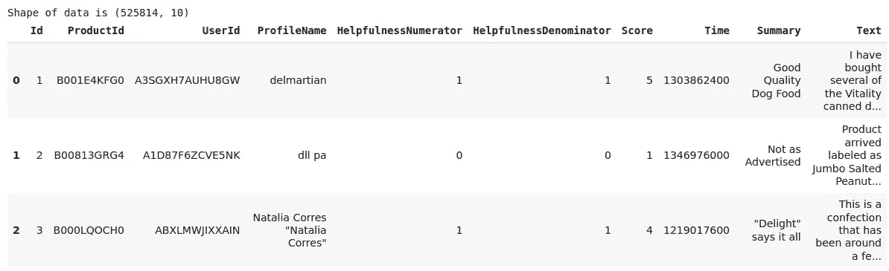

## **目标**

**给出一个评价，确定该评价是正面的(评分为 4 或 5)还是负面的(评分为 1 或 2)。**

> *如何确定一个点评是正面还是负面？*

我们可以使用分数/评级。评分为 4 或 5 可视为正面评价。评级为 1 或 2 可被视为负面评级。评级为 3 的审查被认为是中性的，此类审查在我们的分析中被忽略。这是一种确定评论极性(积极/消极)的近似和代理方式。

# 探索性数据分析

## 基本预处理

作为基本数据清理的一步，我们首先检查任何丢失的值。幸运的是，我们没有任何**缺失值**。接下来，我们将检查**重复条目**。经过分析，我们发现对于不同的产品，同一用户在同一时间给出了相同的评论。实际上这没有意义。所以我们将只保留第一个，删除其他重复的。

重复条目的示例:

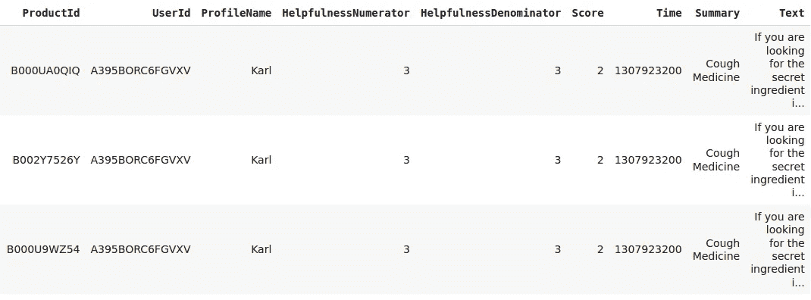

数据

现在我们的数据点减少到 69%左右。

## 分析评论趋势

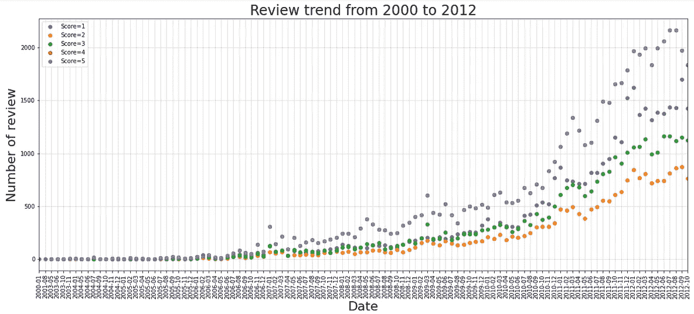

回顾趋势

*   从 2001 年到 2006 年，审查的次数是一致的。但之后，评论的数量开始增加。在这些评论中，许多评论的五星评级都很高。也许这是未经核实的帐户，以虚假评论不适当地提升卖家。另一个原因可能是由于用户帐户数量的增加。

## 分析目标变量

如前所述，我们将所有高于等级 3 的数据点指定为正类，低于等级 3 的数据点指定为负类。我们将忽略其余的要点。

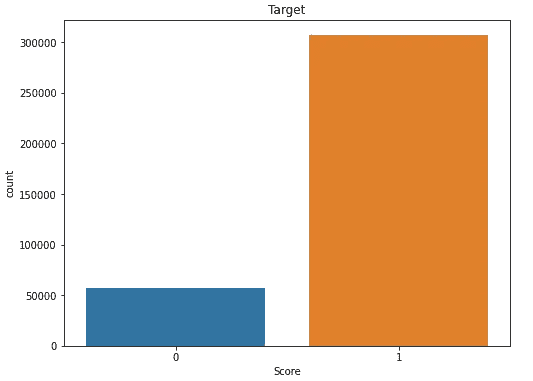

目标

**观察:**很明显，我们的分类数据集不平衡。所以我们不能选择准确性作为衡量标准。所以这里我们将使用 AUC(ROC 曲线下面积)

> *为什么不平衡数据集的准确性不行？*

考虑这样一个场景，我们有一个不平衡的数据集。例如，考虑信用卡欺诈检测的情况，其中 98%的点数为非欺诈(1)，其余 2%的点数为欺诈(1)。在这种情况下，即使我们预测所有的点都是非欺诈的，我们也将获得 98%的准确性。但事实并非如此。所以我们不能用准确性作为衡量标准。

> *什么是 AUC ROC？*

AUC 是 ROC 曲线下的面积。它告诉我们这个模型在多大程度上能够区分不同的类。AUC 越高，模型预测 0 为 0 和 1 为 1 的能力越强。用 TPR 对 FPR 绘制 ROC 曲线，其中 TPR 在 y 轴上，FPR 在 x 轴上。

## 分析用户行为

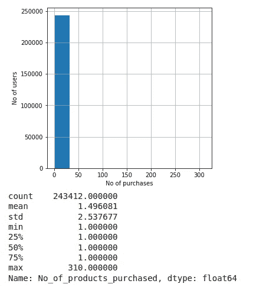

用户行为

*   在分析了用户带来的产品数量后，我们知道大多数用户都只带了一种产品。
*   另一件要注意的事情是，有用性分母应该总是大于分子，因为有用性分子是认为评论有用的用户数量，而有用性分母是表示他们认为评论是否有用的用户数量。有一些数据点违背了这一点。所以我们去掉这些点。

在我们的预处理之后，数据从 568454 减少到 364162。也就是说，大约 64%的数据仍然存在。现在让我们进入我们的重要部分。正在处理审阅数据。

## 预处理文本数据

在我们进一步分析和建立预测模型之前，文本数据需要一些预处理。因此，在预处理阶段，我们按以下顺序执行以下操作

*   从移除 Html 标签开始。
*   删除任何标点符号或有限的一组特殊字符，如、或。或者#！等等。
*   检查单词是否由英文字母组成，并且不是字母数字
*   将单词转换成小写
*   最后，删除停用词

## 列车测试分离

一旦我们完成预处理，我们将把数据分成训练和测试。我们将在根据时间对数据排序后进行拆分，因为时间的变化会影响评论。

## 向量化文本数据

之后，我应用了 bow 矢量化、tfidf 矢量化、average word2vec 和 tfidf word2vec 技术来描述我们的文本，并将它们保存为单独的矢量。由于对大量数据进行矢量化是很昂贵的，所以我计算了一次并存储起来，这样我就不想一次又一次地重新计算了。

*注意:我对单词包和 tfidf 使用了一种单字方法。在 word2vec 的情况下，我训练了模型，而不是使用预先训练好的权重。对于 bow/tfidf，您总是可以尝试使用 n-gram 方法，并且可以在 word2vec 的情况下使用预先训练的嵌入。*

> 您应该始终尝试根据训练数据来拟合您的模型，并根据测试数据来转换它。不要试图在测试数据上安装矢量器，因为这会导致数据泄漏问题。

## TSNE 可视化

代表 t 分布随机邻居嵌入的 TSNE 是最流行的降维技术之一。它主要用于较低维度的可视化。在进入机器学习模型之前，我试图在更低的维度上可视化它。

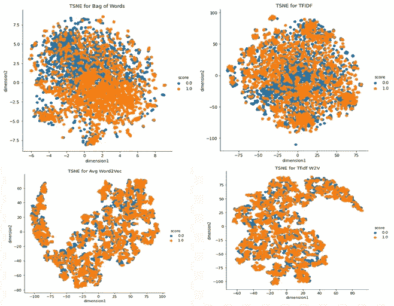

TSNE

我在 TSNE 遵循的步骤:

*   保持困惑不变，我在不同的迭代中运行 TSNE，找到了最稳定的迭代。
*   现在保持迭代不变，我在不同的困惑下运行 TSNE，以获得更好的结果。
*   一旦我得到了稳定的结果，用同样的参数再次运行 TSNE。

但是我发现 TSNE 不能很好地分离低维的点。

*注:我用随机的 20000 分(平均等级分布)试了试 TSNE。大量数据点可能会改善结果*

# 机器学习方法

## 朴素贝叶斯

如果我们有一个基线模型来评估，在机器学习中总是更好。我们将从创建一个朴素贝叶斯模型开始。对于朴素贝叶斯模型，我们将拆分数据进行训练、cv 和测试，因为我们使用的是手动交叉验证。最后，我们在 bow 特征和 tfidf 特征上尝试了多项式朴素贝叶斯。在超参数调优之后，我们以下面的结果结束。

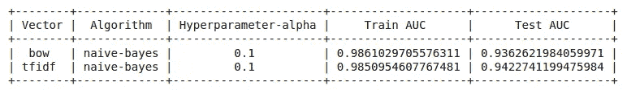

朴素贝叶斯

我们可以看到，在这两种情况下，模型都有点过度拟合。别担心，我们也会尝试其他算法。

## 逻辑回归

由于算法很快，我很容易在 12gb 内存的机器上训练。在这种情况下，我只将数据分为训练和测试，因为 grid search cv 进行内部交叉验证。最后，我对 bow 特性、tfidf 特性、平均 word2vec 特性和 tfidf word2vec 特性进行了超参数调优。

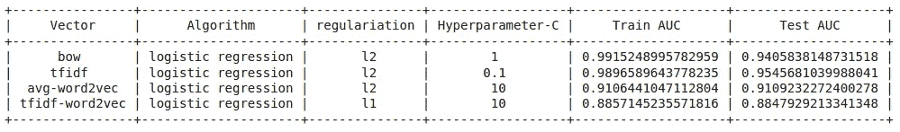

逻辑回归

尽管 bow 和 tfidf 特征在测试数据上给出了更高的 AUC，但是模型稍微有些过度拟合。平均 word2vec 特征使模型更一般化，在测试数据上 AUC 为 91.09。

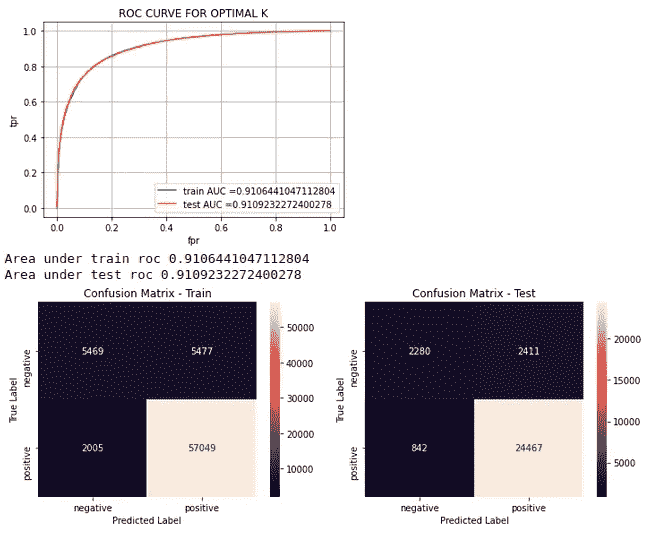

avg-word2vec 上的性能指标逻辑回归

## 支持向量机

接下来，我尝试了 SVM 算法。我尝试了线性 SVM 和 SVM 径向基函数。SVM 在处理高维数据时表现良好。具有平均 word2vec 特征的线性 SVM 产生了更一般化的模型。

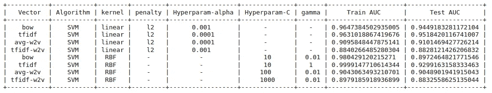

SVM

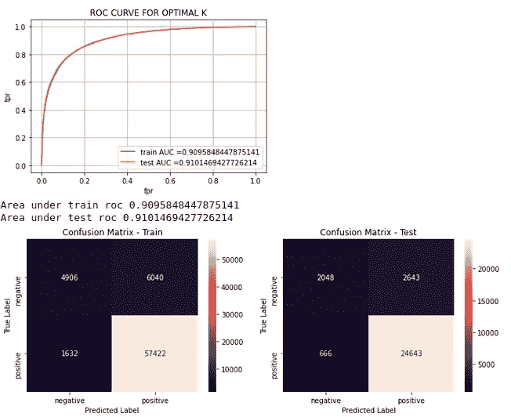

平均 word2vec 上的性能指标线性 SVM

## 决策树

尽管我们已经知道这种数据很容易在决策树上过度拟合，但我只是尝试了一下，看看它在基于树的模型上表现如何。

在超参数调优之后，我得到了下面的结果。我们可以看到，与逻辑回归、朴素贝叶斯和 SVM 相比，模型过拟合，决策树的性能较低。我们可以通过使用像成本复杂性修剪这样的后期修剪技术在一定程度上克服这个问题，或者我们可以在它上面使用一些集成模型。在这里，我决定使用像 random forest 和 XGboost 这样的集合模型，并检查性能。

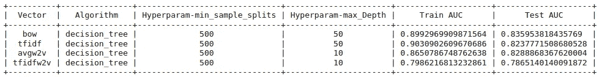

决策树

## 随机森林

对于随机森林，我们可以看到测试的 AUC 增加了。但是，大多数模型还是有点过度拟合。

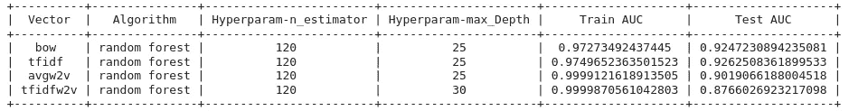

随机森林

## XG-Boost

Xg-boost 的表现也与随机森林相似。大多数模型都过拟合。

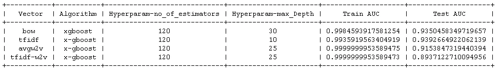

xgboost

在尝试了几种机器学习方法后，我们可以看到**逻辑回归和线性 SVM** 平均 word2vec 特征给出了一个更一般化的模型。

**不要止步于此！！！**

序列模型呢。事实证明，它们能很好地处理文本数据。接下来，我们将尝试使用深度学习方法来解决问题，看看结果是否有所改善。

# 深度学习方法

基本上，如果我们使用序列模型来解决这个问题，文本预处理会有一些不同。

*   初始预处理与我们之前所做的相同。我们将删除标点符号，特殊字符，停用词等，我们也将每个单词转换成小写。
*   接下来，我们将使用另一种方法，而不是直接对数据进行矢量化。首先，我们通过编码将文本数据转换成有序的。也就是说，对于语料库中的每个独特的单词，我们将分配一个号码，如果单词重复，号码就会重复。

例如，“*这是真正美味的食物，非常棒*”的顺序是“25，12，20，50，11，17，25，12，109”，而“这是糟糕的食物”的顺序是“25，12，78，11”

*   最后，我们将把每个序列填充到相同的长度。

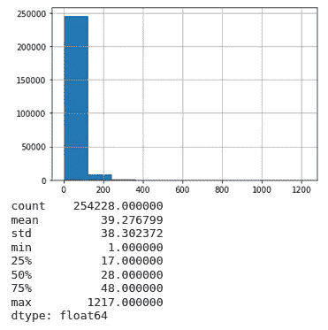

填料

标绘后，序列的长度，我发现大部分评论的序列长度≤225。所以我把序列的最大长度取为 225。如果序列长度> 225，我们将按顺序取最后 225 个数字，如果长度< 225，我们用零填充初始点。

我们的模型由一个具有预训练权重的嵌入层、一个 LSTM 层和多个密集层组成。我们尝试了 LSTM 和密集层的不同组合以及不同的漏失。我们使用**手套向量**进行预训练嵌入。我认为这在一定程度上对我们 AUC 分数的提高起到了重要作用。最后，我们用两个 LSTM 层和两个密集层得到了更好的结果，并且丢失率为 0.2。我们的架构如下所示:

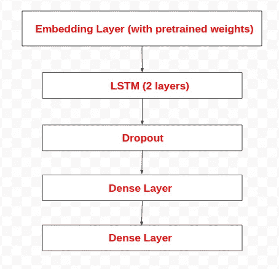

体系结构

我们的模型在第二个纪元中很容易就收敛了。我们得到了约 94.8%的验证 AUC，这是我们得到的一般化模型的最高 AUC。

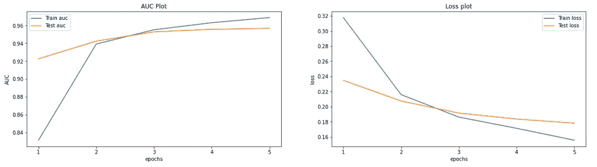

有一个 LSTM 层

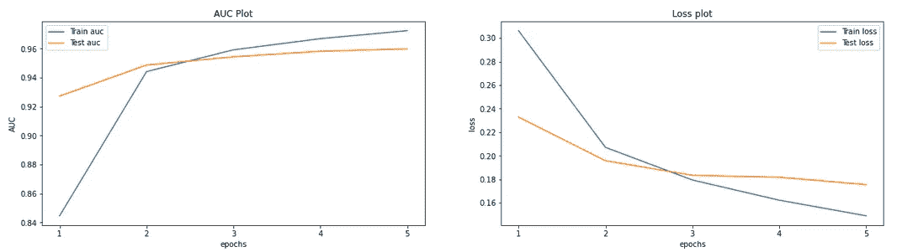

有两层 LSTM

我们的一些实验结果如下:

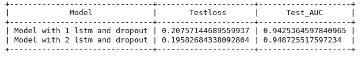

LSTM 结果

就这样，我成功地训练了一个模型。这里来了一个有趣的问题。但是怎么用呢？放心吧！我还将解释我如何使用 flask 部署模型。

# 使用 Flask 的模型部署

这是大家错过的最精彩的部分。如何部署我们刚刚创建的模型？我选择 Flask，因为它是一个基于 python 的微型 web 框架。由于我来自一个非 web 开发人员的背景，Flask 相对来说比较容易使用。

现在，我们将通过预测文本“食物有好味道”的情感来测试我们的应用程序。我们将通过创建如下请求来测试它

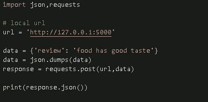

试验码

我们的应用程序将输出给定文本成为相应类的概率和类名。在这里，我们的文本被预测为概率约为 94%的正类。

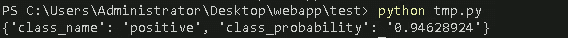

在外

你可以玩我的 [Github 项目](https://github.com/arunm8489/Amazon_Fine_Food_Reviews-sentiment_analysis)的全部代码。

**改善范围:**

*   尽管如此，我们目前的模式还有很大的改进空间。为了训练机器学习模型，我从来没有使用过完整的数据集。你可以试试。它可能有助于克服我们的 ml 模型的过度拟合问题。
*   我只对我们的深度学习模型使用了预训练单词嵌入，而没有对机器学习模型使用。所以你可以尝试使用预训练嵌入，就像手套或 word2vec 与机器学习模型一样。

**参考文献**

*   应用课程
*   [https://github . com/arunm 8489/Amazon _ Fine _ Food _ Reviews-情操 _ 分析](https://github.com/arunm8489/Amazon_Fine_Food_Reviews-sentiment_analysis)