# 亚马逊评论的情感分析

> 原文：<https://towardsdatascience.com/sentiment-analysis-on-amazon-reviews-45cd169447ac?source=collection_archive---------21----------------------->

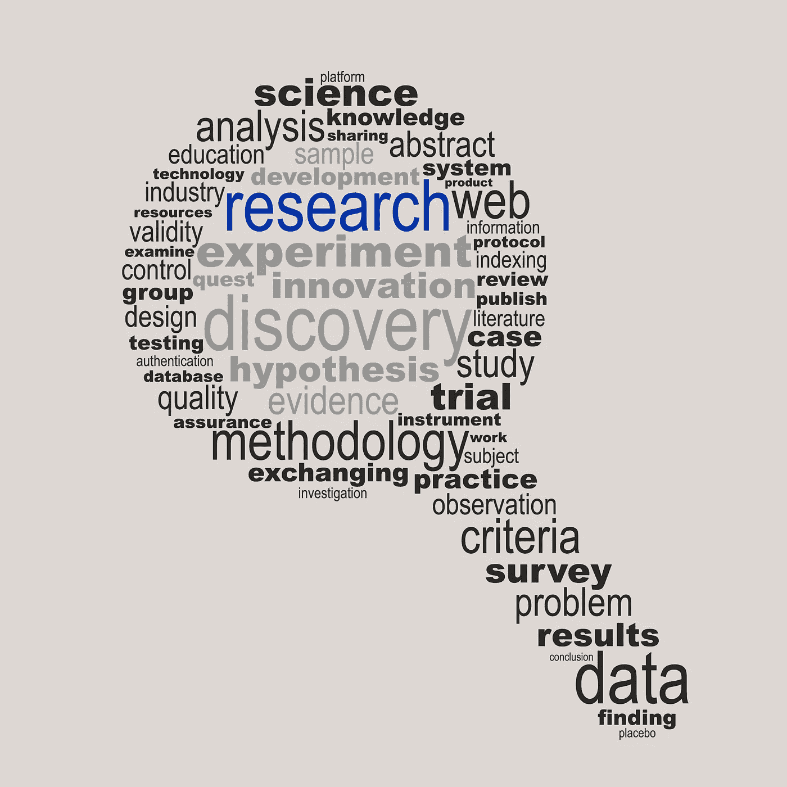

来源:[archwiz，](https://www.shutterstock.com/g/Archiwiz) via: [Shutterstock](https://www.shutterstock.com/image-vector/research-concept-made-words-drawing-magnifying-133561256)

更好地理解数据是数据分析的关键步骤之一。在这项研究中，我将分析亚马逊的评论。这些评论是非结构化的。换句话说，这篇文章没有条理。然而，情感分析通过自动标记帮助我们理解所有这些非结构化文本。情感分析帮助我们以高效且经济的方式处理大量数据。

这项研究是更大研究的一部分。为了检查特征提取和数据清洗部分(上一步)，可以检查 [***我的上一篇帖子***](http://Before making predictions based on machine learning models, we need to understand the data better. The reviews are unstructured. In other words, the text is unorganized. Sentiment analysis, however, helps us make sense of all this unstructured text by automatically tagging it. Sentiment analysis helps us to process huge amounts of data in an efficient and cost-effective way. That’s why, sentiment analysis was applied in on the text data.) 。你可以在这里 找到这项研究的所有 Python 代码 [**。在这项研究中，我将:**](https://github.com/EnesGokceDS/Amazon_Reviews_NLP_Capstone_Project)

*   简要介绍情感分析的理论背景
*   执行情感分析
*   为每个步骤提供 python 代码。

# **什么是 NLTK？**

为了执行情感分析，我们将使用 Python 的 NLTK 包。Christopher Manning 说:“NLTK 有点像 NLP 的瑞士军刀，意思是它对任何事情都不太好。但是它有很多基本的工具。”对于访问 Wordnet，这是一个简单的解决方案。

# **什么是 Wordnet？**

T21 是由普林斯顿大学开发的一个大型英语词汇数据库。名词、动词、形容词和副词被分成认知同义词组(同义词组)，每个同义词组表达一个不同的概念。同素集通过概念语义和词汇关系相互联系(Fellbaum，1998)。换句话说，Wordnet 可以被描述为在线词库。它告诉你词义和词义之间的关系。Wordnet 最初创建于 1985 年，目前仍在改进中。

Wordnet 可通过以下方式获得:

```
import nltk
nltk.download('wordnet')
```

在这项研究中，我们将使用两个主要的情感分类器:

1.极性

2.主观性

Python 的 TextBlob 包是一种执行情感分析的便捷方式。当计算单个单词的情感时，TextBlob 取整个文本的平均值。对于同音异义词，Textblob 不与不同的含义进行协商。换句话说，只考虑单词在整个文本中最常见的意思。为了制作所有这些模型，Textblob 使用 WordNet 数据库。

# **极性**

极性是浮动的，在[-1，1]的范围内，其中 1 表示肯定的陈述，而-1 表示否定的陈述。图 1 显示了评论中极性得分的分布。大多数评论都是在积极的一面(图 1)。

```
# Create quick lambda functions to find the polarity of each review# Terminal / Anaconda Navigator: conda install -c conda-forge textblobfrom textblob import TextBlobdf['Text']= df['Text'].astype(str) #Make sure about the correct data typepol = lambda x: TextBlob(x).sentiment.polarity
df['polarity'] = df['Text'].apply(pol) # depending on the size of your data, this step may take some time.import matplotlib.pyplot as plt
import seaborn as snsnum_bins = 50
plt.figure(figsize=(10,6))
n, bins, patches = plt.hist(df.polarity, num_bins, facecolor='blue', alpha=0.5)
plt.xlabel('Polarity')
plt.ylabel('Number of Reviews')
plt.title('Histogram of Polarity Score')
plt.show();
```

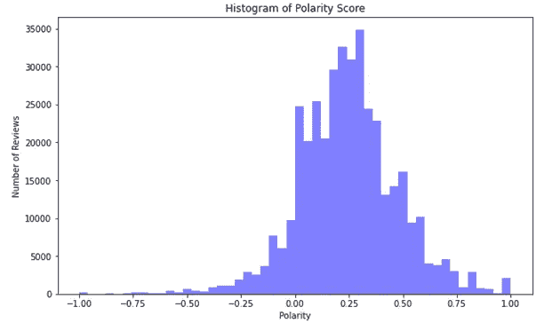

图 1:评论极性分数的分布

在图 2 中，可以观察到，与差评相比，好评(好评=1)具有更高的极性。另一方面，好的评论也有更高数量的负极性评论。这是一个不平衡的数据，好评的数量高于差评。因此，在这一类别中看到更多的极端值并不奇怪。

```
plt.figure(figsize=(10,6))
sns.boxenplot(x=’Good_reviews’, y=’polarity’, data=df)
plt.show();
```

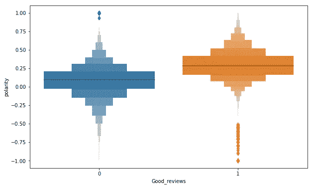

图 2:关于好或坏评论的极性分布的箱线图。

正如我们从这个方框图中看到的，

*   我们有一些极性很低(非常负面)的好评
*   一些负面评价具有很高的极性(正面陈述)

让我们来看看其中的一些:

```
df.loc[(df.polarity == 1 & (df.Good_reviews == 0))].Text.head(10).tolist()
```

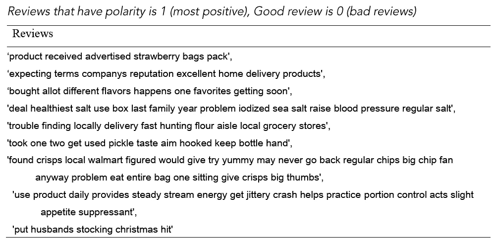

表 1: *极性为 1(最正面)的评论，好评为 0(差评)*

当检查表 1 时，可以看到一些评论实际上是正面的，但不知何故得到了不好的评论分数。请记住，这些都是极端的案例评论，看到他们的评级没有太大意义也就不足为奇了。

**标点符号 vs 极性:**从图 3 可以看出，标点符号的值低时，极性较高。对此的一个可能的解释是，更加注意标点符号的人在他们的产品评价中更倾向于平衡。尽管有异常值，平均极性得分几乎是一条线，在 0.25 左右。该信息与图 1 一致。我们还可以看到，在极性的两个方向上都存在极端情况(图 3)

```
plt.figure(figsize=(15,8))
df3= df.loc[df.upper <= 50]
sns.boxenplot(x='upper', y='polarity', data=df3)
plt.xlabel('Punctuation', fontsize=13)
plt.ylabel('Polarity Score', fontsize=13)
plt.title('Punctuation vs Polarity Plot', fontsize=15)
plt.show();
```

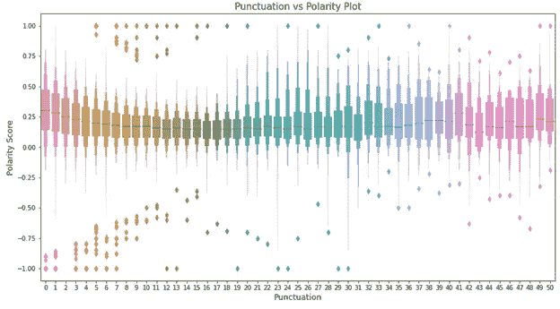

图 3:标点符号的数量和极性得分

**乐于助人与极性**:图 4 呈现了*好评*类别中*乐于助人*与*极性*之间的关系。有一些有趣的异常值。例如，一些评论的极性最低(最负面)，但评级很好(好评论为 1)，有用性超过 3。这个组合是一个有争议的案例。当我们更仔细地看这些案例时，我们可以看到这些评论没有对购买使用负面的词语(表 2)。那些否定的表达是为了和其他购买进行比较。目前，NLP 方法在处理这种单词用法方面做得不太好。

```
plt.figure(figsize=(12,6))
df_sub= df.loc[df.HelpfulnessNumerator <=30]
sns.boxenplot(x='HelpfulnessNumerator', y='polarity', hue='Good_reviews', data=df_sub)plt.xlabel('Helpfulness Numerator', fontsize=13)
plt.ylabel('Polarity Score', fontsize=13)
plt.title('Helpfulness Numerator vs Polarity', fontsize=15)
plt.show();
```

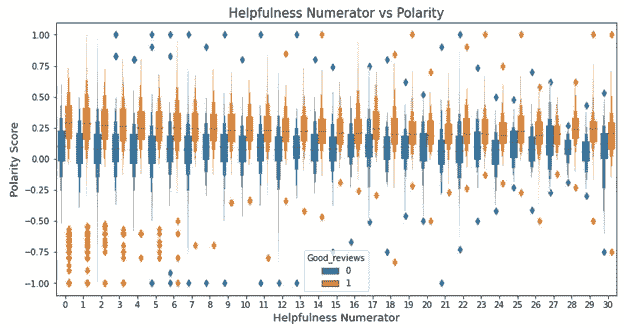

图 4:好评类别中的有用性和极性

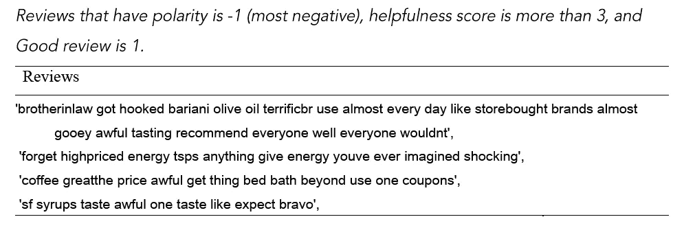

表 2

# **主观性**

主观性用于单个句子，以确定一个句子是否表达观点。就主观性而言，世界上的文本信息可以大致分为两大类:事实和观点。主观句通常指的是个人观点、情感或判断，而客观句指的是事实信息。事实是关于实体、事件和属性的客观表达。观点通常是描述人们对实体、事件及其属性的情绪、评价或感觉的主观表达(刘，2010)。

在情感分析中，*主观性*也是一个位于[0，1]范围内的浮点数。当接近 0 时，更多的是关于事实。当主观性增加时，它接近于一种意见。在数据集中，评论的主观性分数的分布类似于正态分布(图 5)。当我们检查*主观性*、*极性、*和*好评*特征之间的关系时，我们可以看到主观性和极性显示出漏斗模式(图 6)。还可以观察到，主观性评分低的评论在极性上也是中性评论。

对于创建主观性评分:

```
sub = lambda x: TextBlob(x).sentiment.subjectivity
df['subjectivity'] = df['Text'].apply(sub)
df.sample(10)
```

检查主观性分数的分布:

```
# Density Plot and Histogram of subjectivity
plt.figure(figsize=(10,5))
sns.distplot(df['subjectivity'], hist=True, kde=True,
bins=int(30), color = 'darkblue',
hist_kws={'edgecolor':'black'},
kde_kws={'linewidth': 4})plt.xlim([-0.001,1.001])
plt.xlabel('Subjectivity', fontsize=13)
plt.ylabel('Frequency', fontsize=13)plt.title('Distribution of Subjectivity Score', fontsize=15)
```

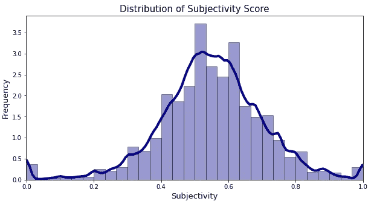

图 5:亚马逊评论中主观性分数的分布

```
plt.figure(figsize=(10,6))
sns.scatterplot(x='polarity', y='subjectivity', hue="Good_reviews", data=df)
plt.xlabel('Polarity', fontsize=13)
plt.ylabel('Subjectivity', fontsize=13)
plt.title('Polarity vs Subjectivity', fontsize=15)
plt.show();
```


图 6:主观和极性得分调整到好评类别

图 7 展示了极性和主观性如何受到评论评级的影响(好的评论特征)。在阅读这个图时，我们需要记住 y 轴在一个非常小的范围内。我们可以看到，两组之间的平均主观性得分差异可以忽略不计。(你可以在 [*我的 GitHub repo*](https://github.com/EnesGokceDS/Amazon_Reviews_NLP_Capstone_Project/blob/master/Sentiment_Analysis_Amazon_Review.ipynb) 上找到这个剧情的代码)

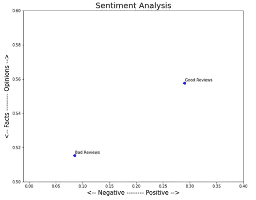

图 7:评论评级的极性和主观性得分的平均值

# **审查极端评论**

为了更好地理解我们的数据，我们需要从不同的角度来检查它。有一些评论可以被认为是一个极端的案例。例如，表 3 给出了 10 条评论，它们具有最高的极性(最积极的情绪)，但是“好评”值为 0，并且是最主观的(意见)。这些推文很难被情感分析算法评分。毫不奇怪，他们的得分最高(极性=1)。

```
df.loc[(df["Good_reviews"] == 0) & (df.polarity == 1 ) & (df.subjectivity ==1), "Text"].head(10).tolist()
```


表 3

为了理解数据是如何形成的以及情感分析是如何工作的，让我们用不同的标准来检查更多的评论(表 4 和表 5)。

```
df.loc[(df["Good_reviews"] == 1) & (df.polarity == 1 ) & (df.subjectivity ==1), "Text"].sample(5).tolist()
```

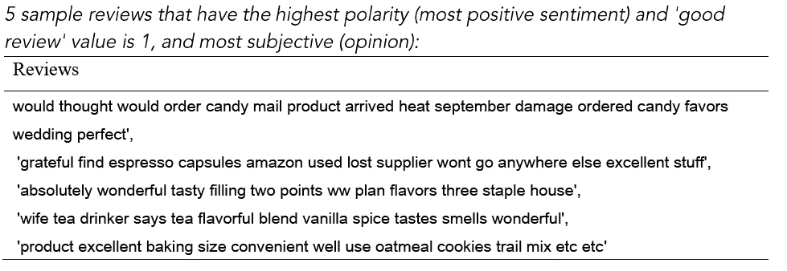

表 4

```
df.loc[(df["Good_reviews"] == 1) & (df.polarity == -1 ) & (df.subjectivity ==1), "Text"].sample(5).tolist()
```

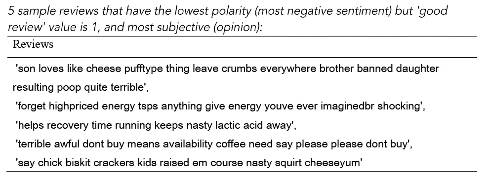

表 5

总之，通过这项研究，我试图通过将情感分析应用于亚马逊评论数据来展示它是如何工作的。在接下来的研究中，我将通过一步一步的解释来展示如何使用潜在狄利克雷分配(LDA)进行主题分析。

开心分析！

*特别感谢我的朋友 [Tabitha Stickel](https://www.linkedin.com/in/tabitha-stickel-050b21170/) 校对这篇文章。

**我的情感分析进一步内容推荐:**

*   赵雅丽:【https://youtu.be/xvqsFTUsOmc?t=4125】
*   计算极性和主观性:[https://planspace.org/20150607-textblob_sentiment/](https://planspace.org/20150607-textblob_sentiment/)

**参考文献:**

费尔鲍姆，C. (1998 年)。WordNet:一个电子词汇数据库。布拉德福图书公司。吉邦，欧克斯，m .&贝洛特，P. (2016 年 6 月)。从表情符号到情感分析。

刘，学士(2010)。情感分析和主观性。*自然语言处理手册*， *2* (2010)，627–666。

[斯坦福 CS224N:具有深度学习的 NLP](https://www.youtube.com/watch?v=8rXD5-xhemo&list=PLoROMvodv4rOhcuXMZkNm7j3fVwBBY42z&index=2&t=4244s)