# 基于 TextBlob 的远程学习微博情感分析

> 原文：<https://towardsdatascience.com/sentiment-analysis-on-the-tweets-about-distance-learning-with-textblob-cc73702b48bc?source=collection_archive---------14----------------------->

## 人们对远程学习有什么看法？

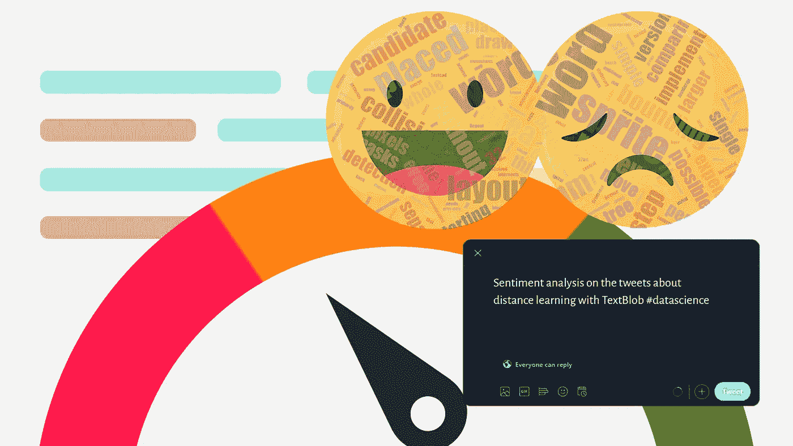

故事横幅，作者图片

大家好，

Covid19 疫情在 2020 学年引入了远程学习。虽然有些人可以很容易适应，但有些人发现这种方法效率很低。如今，正在讨论重新开放学校的问题。大部分专家建议至少一个学期再上线。作为一名通过远程学习度过上学期的学生，我可以找到很多时间花在学习自然语言处理上。最后，我决定探究一下人们对远程学习的看法。

我正在计划这个故事作为一个端到端的项目。我们将探索与远程学习相关的推文，以了解人们的意见(也称为意见挖掘)并发现事实。我将使用基于词典的方法来确定推文的极性(我稍后会解释)。TextBlob 将是我们实现这一目标的工具。我们还将建立一个机器学习模型，通过使用**伯努利** **朴素贝叶斯分类器**来预测推文的正面和负面。

我们的工作流程如下:

1.  数据收集
    - Twitter API
    -使用 ***tweepy*** 检索推文
2.  预处理和清理
    -删除重复项
    -数据类型转换
    -删除无信息列
    -去掉停用词、标签、标点和一两个字母的单词
    -对单词进行标记
    -应用词条化
    -词频-逆文档频率矢量化
3.  探索性数据分析
    -可视化数据
    -比较字数
    -调查创建次数分布
    -调查推文位置
    -查看热门推文和最常用词
    -制作词云
4.  情感分析
5.  机器学习
6.  摘要

## 要求

开始之前，请确保以下库在您的工作区中可用。

```
pandas
numpy
matplotlib
seaborn
TextBlob
wordcloud
sklearn
nltk
pickle
```

您可以使用以下命令安装非内置库。

```
pip install pycountry
pip install nltk
pip install textblob
pip install wordcloud
pip install scikit-learn
pip install pickle
```

> 你可以在这里找到完整的代码。

# 1.数据采集

首先，我们需要一个 ***Twitter 开发者账号*** 才能被允许使用 *Twitter API* 。你可以在这里得到账号[。审批可能需要几天时间。我已经完成了这些步骤。一旦我得到了这个帐户，我就创建了一个包含 API 信息的文本文件。它位于项目的向上目录中。文本文件的内容如下。如果你想使用它，你必须用你的信息替换它。](https://developer.twitter.com/)

```
CONSUMER KEY=your_consumer_key
CONSUMER KEY SECRET=your_consumer_key_secret
ACCESS TOKEN=your_access_token
ACCESS TOKEN SECRET=your_access_token_secret
```

之后我创建了一个名为*[***get _ tweets . py***](https://github.com/Bhasfe/distance_learning/blob/master/get_tweets.py)的 py 文件来收集远程学习相关的推文(只有英文)。您可以在下面看到完整的代码。*

*上面的代码搜索包含以下标签的推文*

*#远程教育，#在线学校，#在线教学，#虚拟学习，#在线教育，#远程教育，#在线课堂，#数字学习，#电子学习，#在线学习*

*和以下关键字*

*“远程学习”、“在线教学”、“在线教育”、“在线课程”、“在线学期”、“远程课程”、“远程教育”、“在线课堂”、“电子学习”、“电子学习”*

*它还过滤*转发*以避免重复。*

**get_tweets* 函数将检索到的 tweets 存储在临时 *pandas 数据帧*中，并在*输出*目录中保存为 *CSV* 文件。大约花了 40 个小时收集了 ***202.645*** 条推文。之后，它给了我以下文件*

*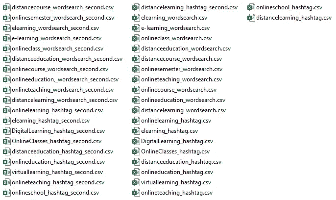*

*输出文件，按作者分类的图像*

*为了将所有 CSV 文件连接成一个文件，我创建了包含以下代码的 *concatenate.py* 文件。*

*最终，我们有了 *tweets_raw.csv* 文件*。*我们来看看它是什么样子的。*

```
*# Load the tweets
tweets_raw = pd.read_csv("tweets_raw.csv")# Display the first five rows
display(tweets_raw.head())# Print the summary statistics
print(tweets_raw.describe())# Print the info
print(tweets_raw.info())*
```

*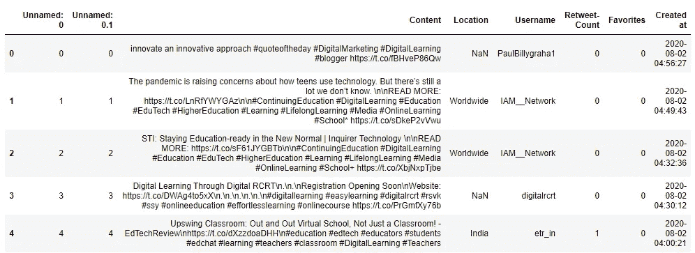**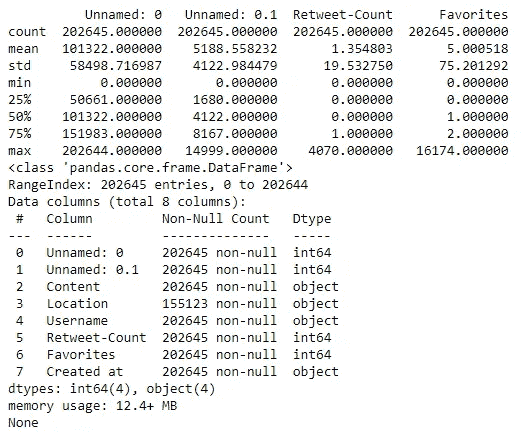*

*乍一看，我们可以看到 DataFrame 中有 202.645 条推文，包括*内容、位置、用户名、转发次数、收藏夹数、*和*创建时间*特征。*位置*栏也有一些缺失值。我们将在下一步处理它们。*

# *2.预处理和清洗*

*根据以上信息，*未命名:0* 和*未命名:0.1* 列对我们来说没有任何信息，因此我们将删除它们。在列创建的*的数据类型也应该是 datetime。同样，如果有重复的推文，我们也需要删除它们。**

```
*# We do not need first two columns. Let's drop them out.
tweets_raw.drop(columns=["Unnamed: 0", "Unnamed: 0.1"], axis=1, inplace=True)# Drop duplicated rows
tweets_raw.drop_duplicates(inplace=True)# Created at column's type should be datatime
tweets_raw["Created at"] = pd.to_datetime(tweets_raw["Created at"])# Print the info again
print(tweets_raw.info())*
```

*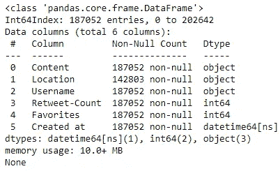*

*tweets 计数已经减少到 **187.052** (有 15.593 个重复行)。“创建于”列的数据类型也更改为**数据时间 64【ns】**。*

*现在，让我们整理一下推文的内容。我们需要去掉*停用词*、*标点符号*、*标签*、*提及*、*链接*、*一两个字母的单词*。我们还需要*对推文*进行标记。*

***标记化**就是把一个句子拆分成单词和标点符号。句子“这是一个例子。”可以像[“这个”、“是”、“一个”、“例”、“等”这样进行标记化。”]*

***停用词**是常用的词，它们对句子的意义没有贡献，如“一个”、“一个”、“这个”、“在”、“在”等等。*

***词汇化** 就是把一个单词还原成它的词根形式的过程。这个根形式叫做一个 ***引理*** 。比如单词*running**run*和*run*的引理就是 *run**

*让我们定义一个函数来完成所有这些操作。*

*函数调用后，我们的*处理后的*列将如下所示。你可以看到推文被标记化了，它们不包含停用词、标签、链接和一两个字母的单词。我们还对它们进行了引理化操作。*

*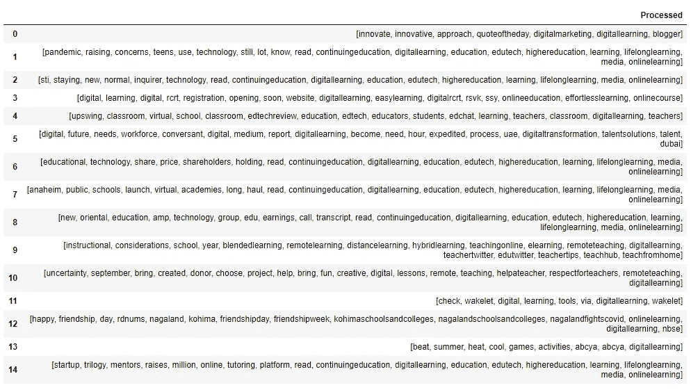*

*我们得到了我们想要的。不用担心*学习*、*在线*、*教育*等词汇。我们稍后会处理它们。*

*在探索性数据分析中，推文长度和推文中的字数也可能是有趣的。让我们抓住他们！*

```
*# Get the tweet lengths
tweets_raw["Length"] = tweets_raw["Content"].str.len()# Get the number of words in tweets
tweets_raw["Words"] = tweets_raw["Content"].str.split().str.len()# Display the new columns
display(tweets_raw[["Length", "Words"]])*
```

*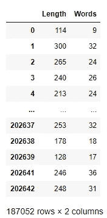*

*注意，我们没有使用经过*处理的* tweets。*

*地点呢？*

*当我们调用 tweets_raw DataFrame *、*的 *info* 函数*时，我们看到在“Location”列中有一些缺失值。缺失的值显示为 **NaN** 。我们将用*“未知”*标签来填充丢失的值。**

```
*# Fill the missing values with unknown tag
tweets_raw["Location"].fillna("unknown", inplace=True)*
```

*我们有多少独特的位置？*

```
*# Print the unique locations and number of unique locations
print("Unique Values:",tweets_raw["Location"].unique())
print("Unique Value count:",len(tweets_raw["Location"].unique()))*
```

*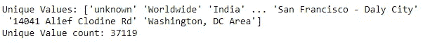*

*输出显示位置信息是混乱的。有 37.119 个唯一位置。我们需要按国家对它们进行分组。为了实现这一点，我们将使用 python 中的 ***pycountry*** 包。如果你有兴趣，你可以在这里找到进一步的信息[。](https://pypi.org/project/pycountry/)*

*让我们定义一个名为 *get_countries* 的函数，它返回给定位置的国家代码。*

*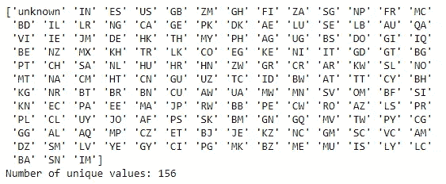*

*成功了！现在我们有 156 个独特的国家代码。我们将在探索性数据分析部分使用它们。*

*现在是时候对推文进行矢量化了。我们将使用 ***tf-idf(词频-逆文档词频)*** 矢量化。*

***Tf-idf(词频—逆词频)**是一个统计概念，用于获取语料库中的词频。我们将使用 scikit-learn 的*tfidf 矢量器*。矢量器将计算语料库中每个单词的权重，并返回一个 tf-idf 矩阵。您可以在此找到更多信息*

**

**td* =词频(j 中每个 I 出现的次数)
*df* =文档频率
*N* =文档数量
*w* = tf-idf 对每个 *i* 和 *j* (文档)的权重。*

*由于内存限制，我们将只选择前 *5000 个单词*进行 tf-idf 矢量化。您可以通过使用其他方法，如*散列*来试验更多。*

```
*# Create our contextual stop words
tfidf_stops = ["online","class","course","learning","learn",\
"teach","teaching","distance","distancelearning","education",\
"teacher","student","grade","classes","computer","onlineeducation",\ "onlinelearning", "school", "students","class","virtual","eschool",\ "virtuallearning", "educated", "educates", "teaches", "studies",\ "study", "semester", "elearning","teachers", "lecturer", "lecture",\ "amp","academic", "admission", "academician", "account", "action" \
"add", "app", "announcement", "application", "adult", "classroom", "system", "video", "essay", "homework","work","assignment","paper",\ "get", "math", "project", "science", "physics", "lesson","courses",\ "assignments", "know", "instruction","email", "discussion","home",\ "college","exam""use","fall","term","proposal","one","review",\
"proposal", "calculus", "search", "research", "algebra"]# Initialize a Tf-idf Vectorizer
vectorizer = TfidfVectorizer(max_features=5000, stop_words= tfidf_stops)# Fit and transform the vectorizer
tfidf_matrix = vectorizer.fit_transform(tweets_processed["Processed"])# Let's see what we have
display(tfidf_matrix)# Create a DataFrame for tf-idf vectors and display the first rows
tfidf_df = pd.DataFrame(tfidf_matrix.toarray(), columns= vectorizer.get_feature_names())
display(tfidf_df.head())*
```

*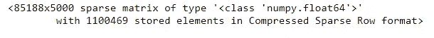*

*它返回给我们一个稀疏矩阵。你可以看看它下面的内容。*

*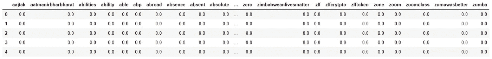*

*毕竟，我们将新的数据帧保存为 CSV 文件，以便以后使用，而无需再次执行整个操作。*

```
*# Save the processed data as a csv file
tweets_raw.to_csv("tweets_processed.csv")*
```

# *3.探索性数据分析*

*探索性数据分析是数据科学项目不可或缺的一部分。只要我们理解我们的数据告诉我们什么，我们就可以建立我们的模型。*

```
*# Load the processed DataFrame
tweets_processed = pd.read_csv("tweets_processed.csv", parse_dates=["Created at"])*
```

*首先，让我们看看数据集中最早和最新的 tweets 创建时间。*

```
*# Print the minimum datetime
print("Since:",tweets_processed["Created at"].min())# Print the maximum datetime
print("Until",tweets_processed["Created at"].max())*
```

*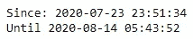*

*这些推文是在 2020 年 7 月 23 日至 8 月 14 日之间创建的。创作时间呢？*

```
*# Set the seaborn style
sns.set()# Plot the histogram of hours
sns.distplot(tweets_processed["Created at"].dt.hour, bins=24)
plt.title("Hourly Distribution of Tweets")
plt.show()*
```

*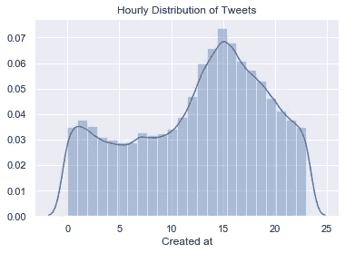*

*直方图表明，大多数推文是在一天的 12 点至 17 点之间创建的。最受欢迎的时间是下午 15 点左右。*

*让我们看看我们已经处理过的位置。*

```
*# Print the value counts of Country column
print(tweets_processed["Country"].value_counts())*
```

*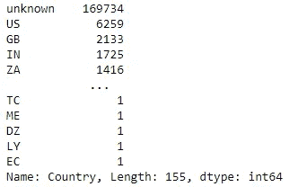*

*显然，这些位置对我们来说是无信息的，因为我们有 ***169.734 个未知的*** 位置。但我们仍然可以查看最热门的推特国家。*

*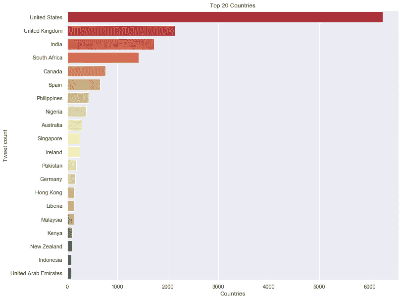*

*根据上面的柱状图， ***美国******英国******印度*** 是我们数据集中排名前 3 的国家。*

*现在，让我们来看看最受欢迎的推文(就转发和收藏而言)。*

```
*# Display the most popular tweets
display(tweets_processed.sort_values(by=["Favorites","Retweet-Count", ], axis=0, ascending=False)[["Content","Retweet-Count","Favorites"]].head(20))*
```

**

*热门推文，点击图片看更好*

*推文中的常用词也能告诉我们很多。让我们从我们的 Tf-idf 矩阵中获取它们。*

```
*# Create a new DataFrame called frequencies
frequencies = pd.DataFrame(tfidf_matrix.sum(axis=0).T,index=vectorizer.get_feature_names(),columns=['total frequency'])# Display the most 20 frequent words
display(frequencies.sort_values(by='total frequency',ascending=False).head(20))*
```

*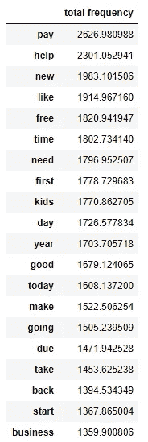*

*文字云会更好。*

**

*文字云，作者图片*

*显然，人们谈论的是**【付款】**。**“求助”是使用频率最高的词之一。我们可以说人们正在大量寻求帮助:)***

# *****4。情绪分析*****

***经过预处理和 EDA，我们终于可以专注于我们在这个项目的主要目标。我们将使用 **TextBlob** 来计算推文的情感特征，如 ***极性*** 和 ***主观性*** 。它通过使用预定义的单词分数给我们这些值。您可以查看[文档](https://textblob.readthedocs.io/en/dev/quickstart.html#sentiment-analysis)了解更多信息。***

******极性*** 是在 **-1** **到** **1** 之间变化的一个值。它向我们展示了给出的句子是*正*还是*负*。***

***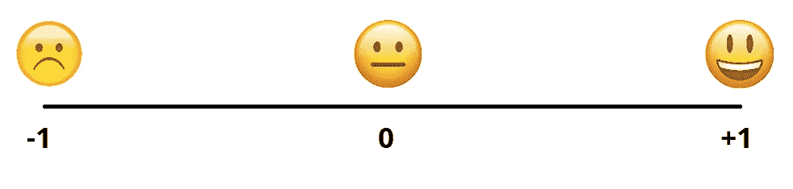***

******主观性*** 是 **0 到 1** 之间的另一个值变化，它向我们表明句子是关于一个事实还是观点(客观还是主观)。***

***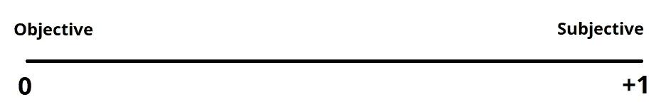***

***让我们用 TextBlob 计算极性和主观性得分***

***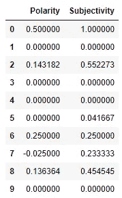***

***我们需要将极性分为积极的、中性的和消极的。***

***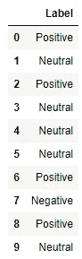***

***我们也可以像下面这样把它们数起来。***

```
***# Print the value counts of the Label column
print(tweets_processed["Label"].value_counts())***
```

***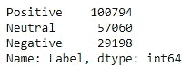***

***结果和我预料的不一样。正面推文明显比负面多。***

***到目前为止，我们将推文标记为积极、中立和消极。让我们仔细检查一下我们的发现。我将从标签数开始。***

```
***# Change the datatype as "category"
tweets_processed["Label"] = tweets_processed["Label"].astype("category")# Visualize the Label counts
sns.countplot(tweets_processed["Label"])
plt.title("Label Counts")
plt.show()# Visualize the Polarity scores
plt.figure(figsize = (10, 10)) 
sns.scatterplot(x="Polarity", y="Subjectivity", hue="Label", data=tweets_processed)
plt.title("Subjectivity vs Polarity")
plt.show()***
```

***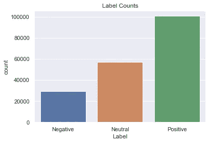*********

***由于基于词典的分析并不总是可靠的，我们必须手动检查结果。让我们来看看极性得分最高/最低的热门(根据转发和收藏)推文。***

```
***# Display the positive tweets
display(tweets_processed.sort_values(by=["Polarity", "Retweet-Count", "Favorites"], axis=0, ascending=False)[["Content","Retweet-Count","Favorites","Polarity"]].head(20))# Display the negative tweets
display(tweets_processed.sort_values(by=["Polarity", "Retweet-Count", "Favorites"], axis=0, ascending=[True, False, False])[["Content","Retweet-Count","Favorites","Polarity"]].head(20))***
```

***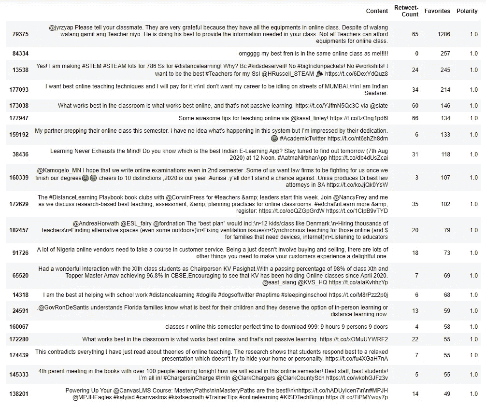***

***正面推文，点击图片看更好***

***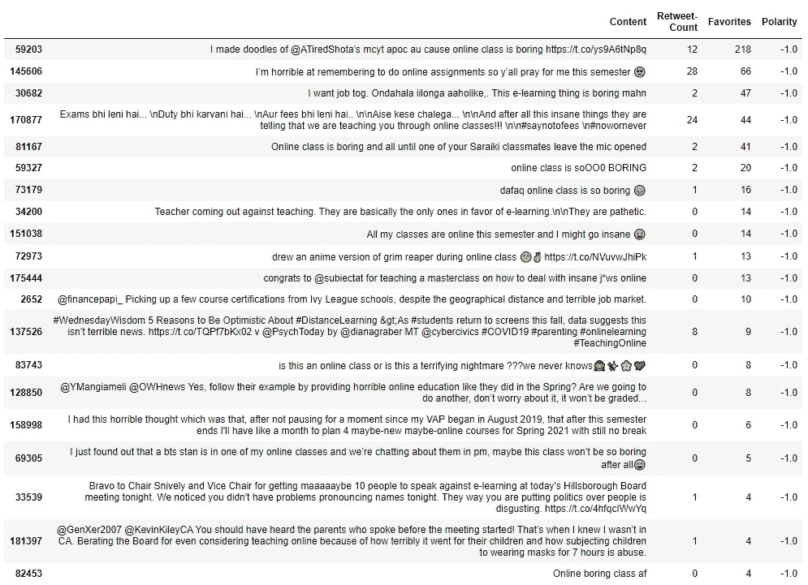***

***负面推文，，点击图片看得更清楚***

***根据上面的结果，TextBlob 已经正确地完成了它的工作！我们可以像上面那样为每个标签制作单词云。为此，我将定义一个函数。该函数将以一个数据帧和一个标签作为参数，用 tf-idf 矢量器对 ***处理过的*** tweets 进行矢量化。最后，它会为我们制作单词云。由于计算的限制，我们将只查看最受欢迎的 50 条推文。你可以用更多的数据来尝试。***

***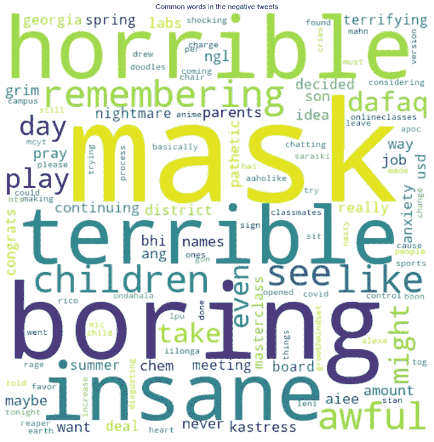*********

***很明显，推特上负面消息的人发现远程学习很无聊，很可怕，很糟糕。另一方面，有些人喜欢远程学习的选择。***

***让我们来看看各国的正面和负面推文数量。***

***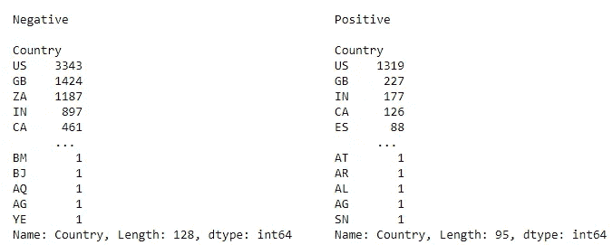******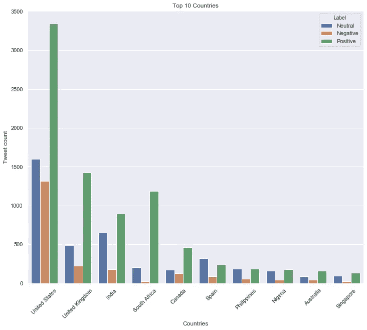***

***时间和推特的极性有什么关系吗？***

```
***positive = tweets_processed.loc[tweets_processed.Label=="Positive"]["Created at"].dt.hour
negative = tweets_processed.loc[tweets_processed.Label=="Negative"]["Created at"].dt.hourplt.hist(positive, alpha=0.5, bins=24, label="Positive", density=True)
plt.hist(negative, alpha=0.5, bins=24, label="Negative", density=True)
plt.xlabel("Hour")
plt.ylabel("PDF")
plt.title("Hourly Distribution of Tweets")
plt.legend(loc='upper right')
plt.show()***
```

***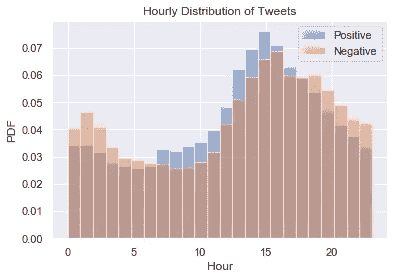***

***上面的直方图表明，时间和推文的极性之间没有关系。***

***我想在这里结束我的探索，以保持这个故事简短。***

# ***5.建立一个机器学习模型***

***我们根据极性分数给推文贴上了标签。让我们通过使用多项式朴素贝叶斯分类器来建立机器学习模型。我们将使用 tf-idf 向量作为特征，标签作为目标。***

```
***# Encode the labels
le = LabelEncoder()
tweets_processed["Label_enc"] = le.fit_transform(tweets_processed["Label"])# Display the encoded labels
display(tweets_processed[["Label_enc"]].head())***
```

***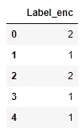***

***我们已经对标签进行了编码。***

*****“正”= 2*****

*****“空档”= 1*****

*****“负”= 0*****

```
***# Select the features and the target
X = tweets_processed['Processed']
y = tweets_processed["Label_enc"]***
```

***现在，我们需要将数据分成训练集和测试集。由于我们的数据不平衡，我们将使用 *train_test_split* 的 ***分层*** 参数。***

```
***X_train, X_test, y_train, y_test = train_test_split(X, y, test_size=0.2, random_state=34, stratify=y)***
```

***现在，我们可以创建我们的模型。由于我们早期的 tf-idf 矢量器适合整个数据集，我们必须初始化一个新的。否则，我们的模型可以通过测试集进行学习。***

```
***# Create the tf-idf vectorizer
model_vectorizer = TfidfVectorizer()# First fit the vectorizer with our training set
tfidf_train = vectorizer.fit_transform(X_train)# Now we can fit our test data with the same vectorizer
tfidf_test = vectorizer.transform(X_test)# Initialize the Bernoulli Naive Bayes classifier
nb = BernoulliNB()# Fit the model
nb.fit(tfidf_train, y_train)# Print the accuracy score
best_accuracy = cross_val_score(nb, tfidf_test, y_test, cv=10, scoring='accuracy').max()
print("Accuracy:",best_accuracy)***
```

***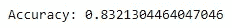***

***虽然我们没有做任何超参数调优，但是精度还不错。我们来看看混淆矩阵和分类报告。***

```
***# Predict the labels
y_pred = nb.predict(tfidf_test)# Print the Confusion Matrix
cm = confusion_matrix(y_test, y_pred)
print("Confusion Matrix\n")
print(cm)# Print the Classification Report
cr = classification_report(y_test, y_pred)
print("\n\nClassification Report\n")
print(cr)***
```

******

***还有很多工作要做，以提高模型在负面推文中的表现，但我把它留给另一个故事:)***

***最后，我们可以保存模型以备后用。***

```
***# Save the model
pickle.dump(nb, open("model.pkl", 'wb'))***
```

# ***摘要***

***综上，让我们记住我们一起做的事。首先，我们使用 Twitter API 和 *tweepy* 库收集了关于远程学习的推文。之后，我们对它们应用了常见的预处理步骤，比如标记化、词条化、删除停用词等等。我们通过使用汇总统计和可视化工具来研究数据。毕竟，我们使用 TextBlob 来获得推文的极性分数，并解释了我们的发现。因此，我们发现，在我们的数据集中，大多数推文对远程学习持积极态度。不要忘记，我们只使用了基于词典的方法，这是不太可靠的。希望这个故事对你理解推文的情感分析有所帮助。***

# *****参考*****

*****【1】***(教程)在 Python 中简化情感分析*。(未注明)。数据营社区。[https://www . data camp . com/community/tutorials/simplizing-情操-分析-python](https://www.datacamp.com/community/tutorials/simplifying-sentiment-analysis-python)***

*****【2】**李，J. (2020 年 5 月 19 日)。 *Twitter 情感分析| NLP |文本分析*。中等。[https://towards data science . com/Twitter-情操-分析-NLP-文本-分析-b7b296d71fce](/twitter-sentiment-analysis-nlp-text-analytics-b7b296d71fce)***

*****【3】**李，c .(2019 . 9 . 20)。*用于品牌改进和话题跟踪的实时推特情感分析(第 1/3 章)*。中等。[https://towards data science . com/real-time-Twitter-opinion-analysis-for-brand-improvement-and-topic-tracking-chapter-1-3-e02f 7652 D8 ff](/real-time-twitter-sentiment-analysis-for-brand-improvement-and-topic-tracking-chapter-1-3-e02f7652d8ff)***

*****【4】**randers 112358。(2020 年 7 月 18 日)。*如何用 Python 对一个 Twitter 账号做情感分析*。中等。[https://medium . com/better-programming/Twitter-情操-分析-15d8892c0082](https://medium.com/better-programming/twitter-sentiment-analysis-15d8892c0082)***

*****【5】***Python 中的词干化和词条化*。(未注明)。数据营社区。[https://www . data camp . com/community/tutorials/stemming-lemma tization-python](https://www.datacamp.com/community/tutorials/stemming-lemmatization-python)***