# 关于 2020 年美国大选的推特数据情感分析

> 原文：<https://towardsdatascience.com/sentiment-analysis-on-twitter-data-regarding-2020-us-elections-1de4bedbe866?source=collection_archive---------11----------------------->


马库斯·温克勒在 [Unsplash](https://unsplash.com?utm_source=medium&utm_medium=referral) 上的照片

据热门科技网站 GeeksforGeeks 称，情感分析是通过“计算”来确定一篇文章是正面、负面还是中性的过程。这也被称为意见挖掘，得出一个发言者的意见或态度。

情绪分析被许多数据分析公司用于各种主题。使用它的一些受欢迎的市场有:

*   业务:许多公司的营销团队使用它来制定业务战略，了解客户如何看待他们的产品，并了解客户的行为，以提高销售额。
*   政治:在政治领域，它用于跟踪候选人有利的地区，并致力于候选人不利的地区，以提高他们在选举中的机会。

美国总统选举定于 11 月 3 日举行，还剩不到一周的时间，这是了解美国不同州对候选人——共和党现任总统唐纳德·特朗普和民主党挑战者乔·拜登——的公众情绪和看法的好时机。

为了进行这项分析，我收集了过去一周使用 Twitter 的公开 API 发布的推文，并使用 VADER 情绪分析对这些推文进行了情绪分析。

# 数据争论

为了使用 Twitter api，我们需要一个 Twitter 开发人员帐户，该帐户允许我们访问访问令牌、访问令牌秘密、API 密钥和 API 秘密密钥。我在一个属性文件中记录了这些参数，这个文件放在我的一个驱动器文件夹中。我使用 python 的 configparser 来读取这些数据，以便使用 twitter API。

```
import configparser
import os
import tweepy as tw
import pandas as pdconfig = configparser.RawConfigParser()
config.read('/content/drive/My Drive/Colab Notebooks/twitter.properties')accesstoken = config.get('twitter','accesstoken')
accesstokensecret = config.get('twitter','accesstokensecret')
apikey = config.get('twitter','apikey')
apisecretkey = config.get('twitter','apisecretkey')auth = tw.OAuthHandler(apikey, apisecretkey)
auth.set_access_token(accesstoken, accesstokensecret)
api = tw.API(auth, wait_on_rate_limit=True)search_words = "Joe Biden" *# This will be changed to Donald Trump when we retrieve tweets related to him.*
date_since = "2020-10-27"
```

Twitter 在他们的 API 开发中大量使用分页。为了执行分页，Twitter 为每个请求提供了一个页面/光标参数。因此，这需要大量的 boiler plate 代码来管理分页循环。为了使分页更容易，需要的代码更少，Twitter API 或 Tweepy 使用了 Cursor 对象。

现在，由于游标是通过 callable 传递的，所以我们不能将参数直接传递给方法。相反，参数被传递到游标构造函数方法中。对于搜索 tweets 的 api，我们传递以下参数:

1.  问:这是推文中要搜索的关键词。对于我们的项目，我们传递候选人的名字(Donald Trump/Joe Biden)。
2.  lang:这是我们想要从 API 中检索的 tweets 的语言。由于美国很大程度上是一个英语国家，英语也是官方语言，我们检索用英语制作的推文。
3.  因为:这是我们想要检索推文的日期。出于我们的目的，我们对当前的政治对话感兴趣，以了解选举前的当前情绪。所以我们通过了上周二的法案，也就是选举前一周。

另一个需要记住的因素是 tweepy 搜索 api 一次最多检索 1500 条推文，然后有 15 分钟的冷却时间。

```
tweets = tw.Cursor(api.search, q=search_words, lang="en", since=date_since).items(100)
tweets
```

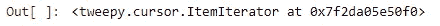

搜索 api 调用的结果是一个迭代器对象。

搜索 api 调用的结果是一个游标项迭代器对象。从这个迭代器对象中，我们迭代获取地理、文本、用户名和位置细节。一些细节如地理和位置细节取决于特定用户是否共享这些细节。如果用户不共享这些详细信息，我们将获得这些列的空白数据。

然后，我们将列表转换成熊猫数据帧。

```
tweet_details = [[tweet.geo, tweet.text, tweet.user.screen_name, tweet.user.location] for tweet in tweets]
tweet_df = pd.DataFrame(data=tweet_details, columns=["geo","text","user","location"])
tweet_df.head()
```

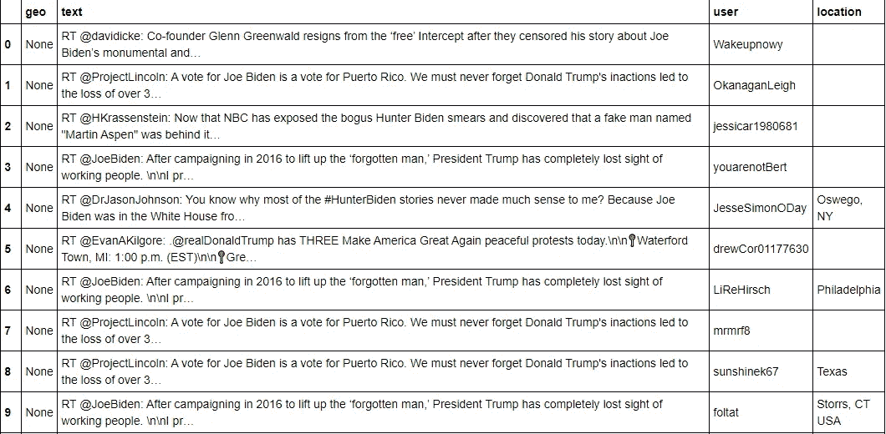

查看 tweet 文本，我们注意到有许多字符对情感分析没有任何价值。许多推文前面都有 RT，这表明推文被转发了。推文前面还有转发推文的用户的名字，这也是我们不关心的信息。我们还删除了任何可能出现在推文中的 html 网站链接。所有这些数据清理都是在 Python 的“重新”内置包的帮助下完成的。

```
import re
def clean_tweets(text):
  text = re.sub("RT @[\w]*:","",text)
  text = re.sub("@[\w]*","",text)
  text = re.sub("https?://[A-Za-z0-9./]*","",text)
  text = re.sub("\n","",text)
  return texttweet_df['text'] = tweet_df['text'].apply(lambda x: clean_tweets(x))
tweet_df['Subject'] = search_words
tweet_df.head(20)
```

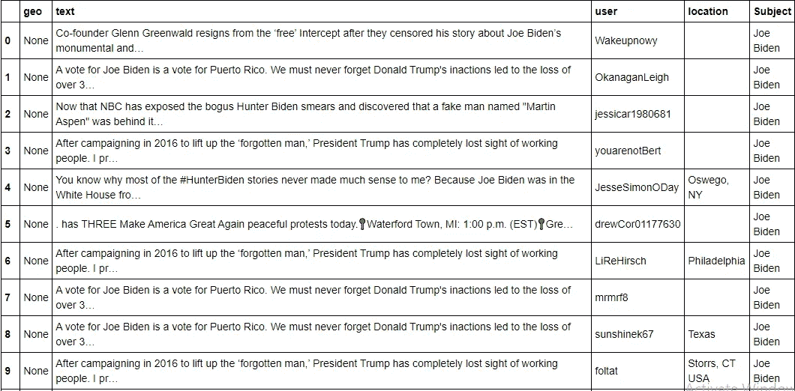

在这个分析中，我们最关心的是从 twitter 数据中找出当前美国每个州的政治情绪。为了做到这一点，我们需要对从 tweepy API 中提取的原始数据进行更多的过滤。正如我们之前所讨论的，tweepy API 为我们提供了发布推文的用户的位置，前提是他/她与我们共享这些信息。这个位置数据大部分是空白的。对于其他人，它可能只包含国家名称、城市名称或用逗号分隔的城市和州，等等。

在下一部分中，我们形成一个美国各州的列表和另一个美国各州代码的列表，以便提取位置记录中包含这些代码的 tweets。

P.S .这是一种非常幼稚的净化方式。一个更好的方法是使用 Google Maps API，从位置数据中获取州信息，前提是它在美国。然而，由于我的谷歌地图付费账户的问题，我不得不与这种幼稚的方式作斗争。

```
states = ['Alabama', 'Alaska', 'Arizona', 'Arkansas', 'California', 'Colorado', 'Connecticut', 'Delaware', 'Florida', 'Georgia', 'Hawaii', 'Idaho', 'Illinois', 'Indiana', 'Iowa', 'Kansas', 'Kentucky', 'Louisiana', 'Maine', 'Maryland', 'Massachusetts', 'Michigan', 'Minnesota', 'Mississippi', 'Missouri', 'Montana', 'Nebraska', 'Nevada', 'New Hampshire', 'New Jersey', 'New York', 'New Mexico', 'North Carolina', 'North Dakota', 'Ohio', 'Oklahoma', 'Oregon', 'Pennsylvania', 'Rhode Island', 'South Carolina', 'South Dakota', 'Tennessee', 'Texas', 'Utah', 'Vermont', 'Virginia', 'Washington', 'West Virginia', 'Wisconsin', 'Wyoming']stateCodes = ['AL', 'AK', 'AZ', 'AR', 'CA', 'CO', 'CT', 'DE', 'FL', 'GA', 'HI', 'ID', 'IL', 'IN', 'IA', 'KS', 'KY', 'LA', 'ME', 'MD', 'MA', 'MI', 'MN', 'MS', 'MO', 'MT', 'NE', 'NV', 'NH', 'NJ', 'NM', 'NY', 'NC', 'ND', 'OH', 'OK', 'OR', 'PA', 'RI', 'SC', 'SD', 'TN', 'TX', 'UT', 'VT', 'VA', 'WA', 'WV', 'WI', 'WY']stateMapping = {'AL': 'Alabama', 'AK': 'Alaska', 'AZ': 'Arizona', 'AR': 'Arkansas', 'CA': 'California', 'CO': 'Colorado', 'CT': 'Connecticut', 'DE': 'Delaware', 'FL': 'Florida', 'GA': 'Georgia', 
                  'HI': 'Hawaii', 'ID': 'Idaho', 'IL': 'Illinois', 'IN': 'Indiana', 'IA': 'Iowa', 'KS': 'Kansas', 'KY': 'Kentucky', 'LA': 'Louisiana', 'ME': 'Maine', 'MD': 'Maryland', 'MA': 'Massachusetts', 'MI': 'Michigan', 'MN': 'Minnesota', 'MS': 'Mississippi', 'MO': 'Missouri', 'MT': 'Montana', 'NE': 'Nebraska', 'NV': 'Nevada', 'NH': 'New Hampshire', 'NJ': 'New Jersey', 'NY': 'New York', 'NM': 'New Mexico', 'NC': 'North Carolina', 'ND': 'North Dakota', 'OH': 'Ohio', 'OK': 'Oklahoma', 'OR': 'Oregon', 'PA': 'Pennsylvania', 'RI': 'Rhode Island', 'SC': 'South Carolina', 'SD': 'South Dakota', 'TN': 'Tennessee', 'TX': 'Texas', 'UT':  'Utah', 'VT': 'Vermont', 'VA': 'Virginia', 'WA': 'Washington', 'WV':  'West Virginia', 'WI': 'Wisconsin', 'WY': 'Wyoming'}tweet_copied_df = tweet_df
for index, row in tweet_df.iterrows():
  flag = 0
  if row.location:
    locationSplit = row.location.split(',')
    for word in locationSplit:
      word_stripped = word.strip()
      if word_stripped in states:
        flag = 1
        row['state'] = word_stripped
      elif word_stripped in stateCodes:
        flag = 1
        row['state'] = stateMapping[word_stripped]
  if flag == 0:
    tweet_copied_df = tweet_copied_df.drop(index=index)
  else:
    tweet_copied_df.loc[index, 'state'] = row['state']
```

最后，我们将清理后的数据附加到一个现有的 csv 文件中，以创建一个 twitter 数据语料库，我们将在其上使用我们的情感分析器。出于这个项目的目的，我在一个循环中运行了上面的代码行，每次迭代之间间隔 15 分钟。

```
tweet_copied_df.to_csv('tweets_election.csv', header=**False**, mode='a')
```

# 情感分析

我们使用 VADER 情感分析器来执行情感分析。根据 GeeksforGeeks 的说法，VADER (Valence Aware 字典和情感推理器)是一个词汇和基于规则的情感分析工具，专门针对社交媒体中表达的情感。情感词典是词汇特征的列表，用更简单的术语来说，这些词通常根据它们的语义取向被标记为正面或负面。VADER 不仅将情绪分为积极或消极，还告诉我们情绪有多积极或消极。

```
import nltk
from nltk.sentiment.vader import SentimentIntensityAnalyzer
nltk.download('vader_lexicon')sid = SentimentIntensityAnalyzer()
```

接下来，我们将两位候选人的推文分离到不同的数据帧中。

```
tweets_election_df = pd.read_csv('tweets_election.csv')
tweets_trump = tweets_election_df[tweets_election_df.Subject == 'Donald Trump']
tweets_trump.drop(tweets_trump.columns[0], axis=1, inplace = **True**)
tweets_trump.head()
```

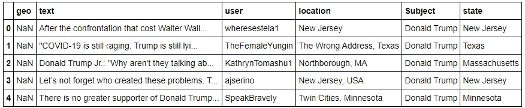

```
tweets_biden = tweets_election_df[tweets_election_df.Subject == 'Joe Biden']
tweets_biden.drop(tweets_biden.columns[0], axis=1, inplace = **True**)
tweets_biden.head()
```

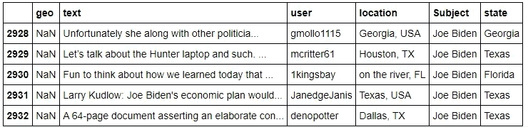

```
df = pd.merge(tweets_trump['state'].value_counts(), tweets_biden['state'].value_counts(), right_index = **True**, 
               left_index = **True**)
df = df.rename(columns = {"state_x": "Total Trump Mentions", "state_y": "Total Biden Mentions"})
ax = df.plot(kind='barh', figsize=(16, 25), zorder=2)

*# Despine*
ax.spines['right'].set_visible(**False**)
ax.spines['top'].set_visible(**False**)
ax.spines['left'].set_visible(**False**)
ax.spines['bottom'].set_visible(**False**)

*#Replacing ticks with horizontal lines*
*#ax.tick_params(axis="both", which="both", bottom="off", top="off", labelbottom="on", left="off", right="off", labelleft="on")*
vals = ax.get_xticks()
**for** tick **in** vals:
      ax.axvline(x=tick, linestyle='dashed', alpha=0.4, color='#eeeeee', zorder=1)

*# Set y-axis label*
ax.set_ylabel("States", labelpad=20, weight='bold', size=12)
ax.set_title('Comparison of Twitter mentions of both candidates in all US states as per data collected',fontweight="bold", size=15)
```

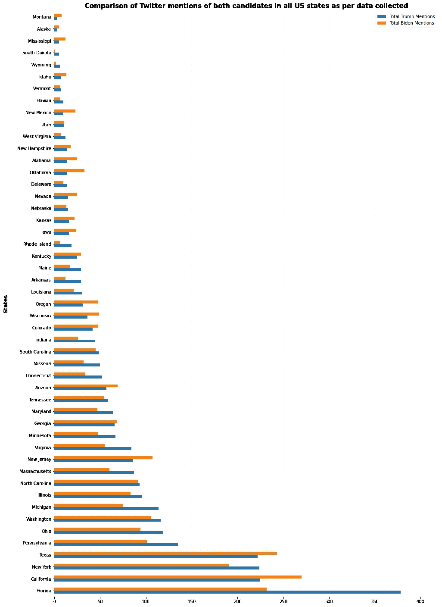

上图显示了我们分析的一个巨大缺点。像许多其他数据集一样，我们的数据集不是一个分布良好的数据集。这意味着我们有一些州，比如佛罗里达、加利福尼亚、德克萨斯，它们比其他州拥有更多的数据。还有，似乎与特朗普相关的数据量以微弱优势超过拜登的数据。

我们现在继续进行情感分析。首先，我们将 polarity_scores()方法应用于每条 tweet 文本，以便理解 tweet 的情感。这个方法调用的结果是一个字典，显示推文中负面、中性和正面情绪的强度。所有这三个值被用来创建第四个数字，这是推文的总体复合情绪。我们会用这个数字来判断一条推文的情绪是正面的、负面的还是中性的。

```
tweets_trump['sentiment'] = tweets_trump['text'].apply(lambda x: sid.polarity_scores(x))
tweets_biden['sentiment'] = tweets_biden['text'].apply(lambda x: sid.polarity_scores(x))def sentimentVerdict(sentiment):
  if sentiment['compound'] >= 0.05:
    return "Positive"
  elif sentiment['compound'] <= -0.05:
    return "Negative"
  else:
    return "Neutral"tweets_trump['sentiment_overall'] = tweets_trump['sentiment'].apply(lambda x: sentimentVerdict(x)
tweets_biden['sentiment_overall'] = tweets_biden['sentiment'].apply(lambda x: sentimentVerdict(x))tweets_trump.head()
```

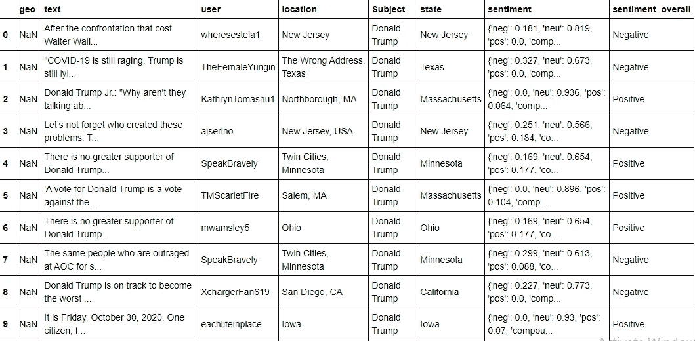

既然我们已经将每条推文数据分为正面、负面或中性，我们可以按州分组，并了解该州公众对特定候选人的总体看法。这是我们的下一步行动。

```
tweets_trump_location = tweets_trump.groupby(['state', 'sentiment_overall']).count()
tweets_trump_location = tweets_trump_location['user']
tweets_biden_location = tweets_biden.groupby(['state', 'sentiment_overall']).count()
tweets_biden_location = tweets_biden_location['user']tweets_location_df = pd.DataFrame({'State': [state for state in states],
        'Trump Positive': [0 for state in states],
        'Trump Negative': [0 for state in states],
        'Trump Neutral': [0 for state in states],
        'Trump Total': [0 for state in states],
        'Biden Positive': [0 for state in states],
        'Biden Negative': [0 for state in states],
        'Biden Neutral': [0 for state in states],
        'Biden Total': [0 for state in states]})
tweets_location_df.set_index('State', inplace = True)
for state in states:
  positiveTrump, negativeTrump, neutralTrump, positiveBiden, negativeBiden, neutralBiden = 0, 0, 0, 0, 0, 0
  try:
    positiveTrump = tweets_trump_location[state]['Positive']
  except:
    positiveTrump = 0

  try:
    negativeTrump = tweets_trump_location[state]['Negative']
  except:
    negativeTrump = 0

  try:
    neutralTrump = tweets_trump_location[state]['Neutral']
  except:
    neutralTrump = 0

  try:
    positiveBiden = tweets_biden_location[state]['Positive']
  except:
    positiveBiden = 0

  try:
    negativeBiden = tweets_biden_location[state]['Negative']
  except:
    negativeBiden = 0

  try:
    neutralBiden = tweets_biden_location[state]['Neutral']
  except:
    neutralBiden = 0

  totalTrump = positiveTrump + negativeTrump + neutralTrump
  totalBiden = positiveBiden + negativeBiden + neutralBiden

  if totalTrump == 0:
    tweets_location_df.at[state, 'Trump Positive'], tweets_location_df.at[state, 'Trump Negative'], tweets_location_df.at[state, 'Trump Neutral'] = 0,0,0
  else:
    tweets_location_df.at[state, 'Trump Positive'] = round((positiveTrump/totalTrump)*100.0)
    tweets_location_df.at[state, 'Trump Negative'] = round((negativeTrump/totalTrump)*100.0)
    tweets_location_df.at[state, 'Trump Neutral'] = round((neutralTrump/totalTrump)*100.0)
  tweets_location_df.at[state, 'Trump Total'] = totalTrump

  if totalBiden == 0:
    tweets_location_df.at[state, 'Biden Positive'], tweets_location_df.at[state, 'Biden Negative'], tweets_location_df.at[state, 'Biden Neutral'] = 0,0,0
  else:
    tweets_location_df.at[state, 'Biden Positive'] = round((positiveBiden/totalBiden)*100.0)
    tweets_location_df.at[state, 'Biden Negative'] = round((negativeBiden/totalBiden)*100.0)
    tweets_location_df.at[state, 'Biden Neutral'] = round((neutralBiden/totalBiden)*100.0)
  tweets_location_df.at[state, 'Biden Total'] = totalBiden
tweets_location_df
```

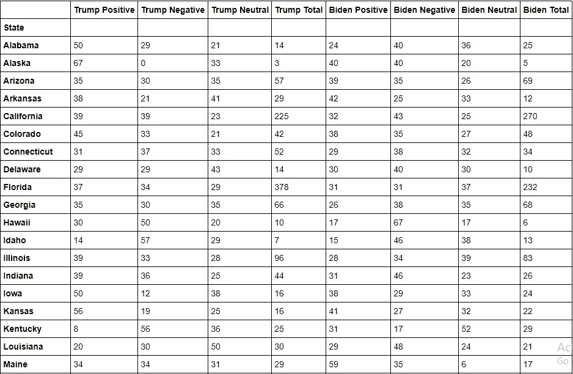

总结我们的分析，我们使用上面的分析来分类一个状态是否是下列之一:

*   **强烈共和党**:对特朗普的正面推文数量超过对拜登的正面推文数量，对特朗普的负面推文数量少于拜登，或者对特朗普持中立态度的推文数量多于拜登。
*   **强烈民主党**:拜登的正面推文数量超过特朗普，拜登的负面推文数量少于特朗普，或者对拜登持中立态度的推文数量多于特朗普。
*   **有点像共和党**:特朗普的正面推文和拜登的正面推文之间的差距大于负面推文的差距。
*   **有点民主**:正面的特朗普推文和正面的拜登推文之间的差距小于负面推文的差距。
*   **数据不足**:任何一个参赛者的推文数量少于 15 条的州。

```
tweets_location_df['Predicted Judgement'] = 'Neutral'
for index, row in tweets_location_df.iterrows():
  if row['Trump Total'] <= 15 and row['Biden Total'] <= 15:
    tweets_location_df.loc[index, 'Predicted Judgement'] = 'Insufficient Data'
  else:
    if row['Trump Positive'] > row['Biden Positive'] and (row['Trump Negative'] < row['Biden Negative'] or row['Trump Neutral'] > row['Biden Neutral']):
      tweets_location_df.loc[index, 'Predicted Judgement'] = 'Strongly Republican'
    elif row['Biden Positive'] > row['Trump Positive'] and (row['Biden Negative'] < row['Trump Negative'] or row['Biden Neutral'] > row['Trump Neutral']):
      tweets_location_df.loc[index, 'Predicted Judgement'] = 'Strongly Democratic'
    elif row['Trump Positive'] - row['Biden Positive'] > row['Biden Negative'] - row['Trump Negative']:
      tweets_location_df.loc[index, 'Predicted Judgement'] = 'Somewhat Republican'
    elif row['Biden Positive'] - row['Trump Positive'] > row['Trump Negative'] - row['Biden Negative']:
      tweets_location_df.loc[index, 'Predicted Judgement'] = 'Somewhat Democratic'
tweets_location_df = tweets_location_df.rename(columns={'Trump Positive': 'Trump Positive (in %)', 
     'Trump Negative': 'Trump Negative (in %)',
     'Trump Neutral': 'Trump Neutral (in %)',
     'Trump Total': 'Trump Total Mentions',
     'Biden Positive': 'Biden Positive (in %)',
     'Biden Negative': 'Biden Negative (in %)',
     'Biden Neutral': 'Biden Neutral (in %)',
     'Biden Total': 'Biden Total Mentions'})
tweets_location_df
```

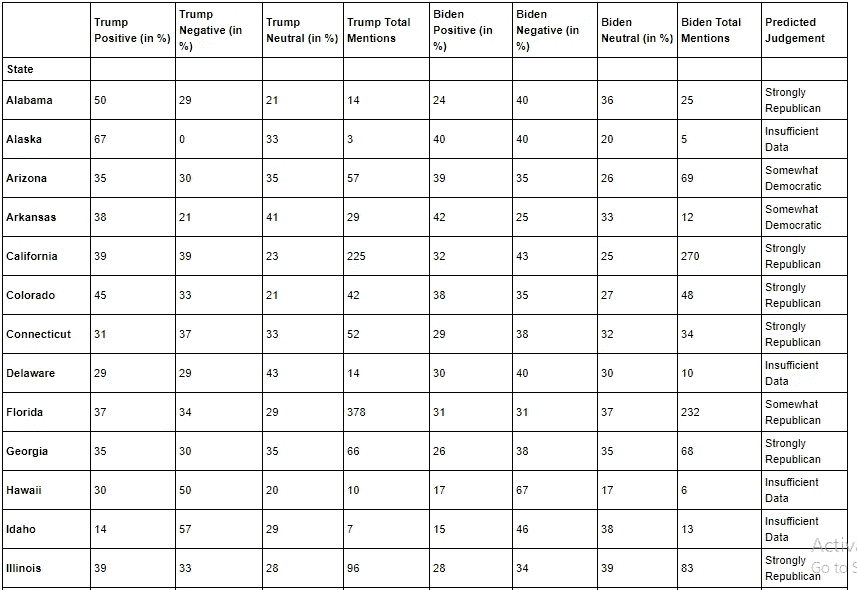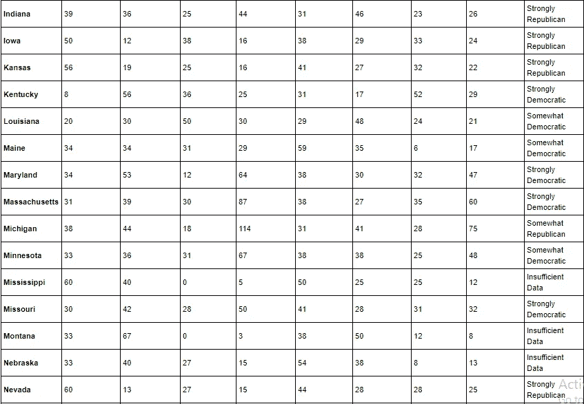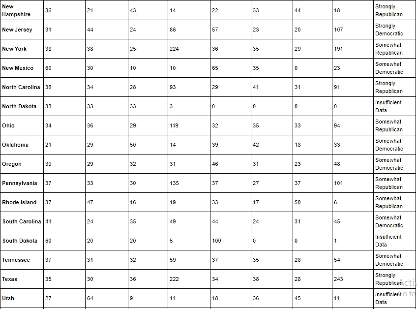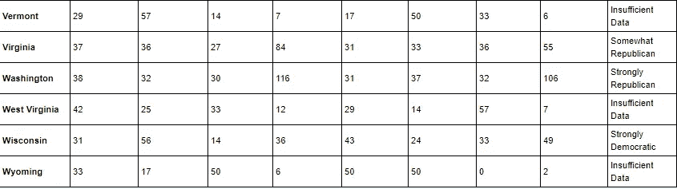

```
tweets_location_df.groupby('Predicted Judgement').size()
```

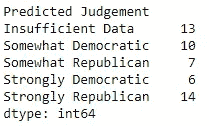

从我的分析结果来看，根据目前的情绪，共和党以 21 比 16 领先。然而，由于数据不足，我无法了解 13 个州的观点，这 13 个州的观点可能会对任何一方的命运产生重大影响。最终的选举结果将决定我的分析是否成功。在我们等待星期二的时候，我鼓励所有美国人走出家门，去投票。

# 需要改进的地方

这个分析有一些缺点，我想在这里指出来。根据我的观察，这里有一些:

1.  数据的分布很差。我在之前的分析中指出了这一点，我觉得这可能在我的分析中包含了一些偏见。理想情况下，两个候选人在所有州的推文数量应该相同。但在现实世界中，这即使不是不可能，也是很难实现的。然而，一个需要改进的地方是包括一些分布模型，以使我的数据集趋向于状态的均匀分布。
2.  **分析中的位置识别部分需要改进。**如前所述，理想情况下，如果推文来自美国，可以将推文的位置提供给 Google Maps API，以获取推文发布地所在的州。
3.  **对一个国家的预测判断是可以改进的。**我用来预测一个州是民主党还是共和党的整体判断的逻辑还可以改进。我用我在这个领域有限的技术知识和理性为这个计算做了一个逻辑，但这是开放的进一步建议和改进。

*这款笔记本就这么多了！如果你还没有弄明白，这个项目的全部是使用 Python 完成的。*

*以下是 GitHub 储存库的链接:*[*https://GitHub . com/pritamguha 31/sensation-Analysis-on-Twitter-data-ahead-of-2020-US-Elections*](https://github.com/PritamGuha31/Sentiment-Analysis-on-Twitter-data-ahead-of-2020-US-Elections)

*随时欢迎分享和反馈。*