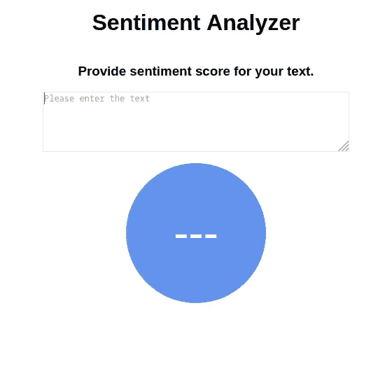
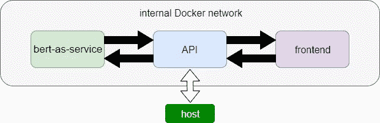
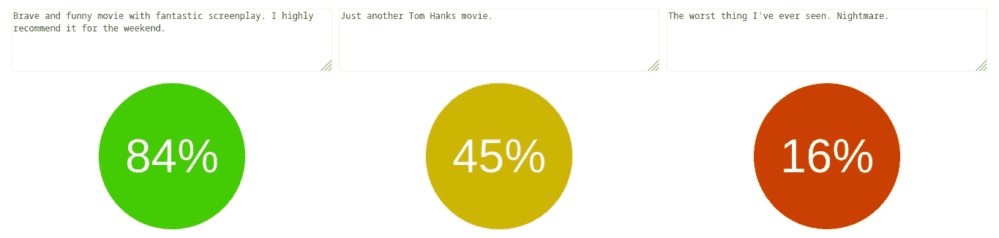

# 带有 BERT 的情感分析器(构建、调整、部署)

> 原文：<https://towardsdatascience.com/sentiment-analyzer-with-bert-build-tune-deploy-da84c0f2366d?source=collection_archive---------52----------------------->

## 简要说明我如何开发情感分析器。它涵盖了文本预处理、模型构建、调优、API、前端创建和容器化。

# 资料组

我使用了斯坦福大学 NLP 小组发布的[数据集。我合并了两个文件，即包括 239，232 个文本片段的“dictionary.txt”和包含分配给各种文本片段的情感分数的“impression _ labels . txt”。](https://nlp.stanford.edu/sentiment/)

# 用正则表达式进行文本预处理

为了清理文本，我通常使用一堆包含正则表达式的函数。在`common.py`中，您可以找到所有这些，例如下面描述的`remove_nonwords`:

类似的函数也用于空行、特殊符号、数字和 html 代码删除。

在文本清理之后，是时候创建 BERT 嵌入了。为此，我使用了 [bert-as-service](https://github.com/hanxiao/bert-as-service) 。它非常简单，只包含 3 个步骤:下载一个预先训练好的模型，启动 BERT 服务，使用客户端对指定长度的句子进行编码。

运行服务时，可以设置多个参数。例如，为了定义`max_seq_len`，我计算了 0.9 分位数的训练数据长度。

预处理数据具有包含 768 个特征的数据帧形式。完整代码请上`nlp_preprocess.py`。

# 用 Keras 建模

在这一部分，我们在不同的参数上建立和训练模型。假设我们需要如下 5 层神经网络。我们将参数化 batch_size、历元数、前 4 个密集层和 5 个下降层中的节点数。

# 用神圣的模型调谐

现在我们可以调整参数了。我们将使用`sacred`模块。这里的要点是:

**1。创建一个实验并添加观察者**

首先，我们需要创建一个记录各种信息的实验和观察器。很简单！

2.**定义主功能**

当我们运行 Python 脚本时,`@ex.automain`装饰器定义并运行实验的主函数。

**3。添加配置参数**

我们将通过配置范围来定义它们。

**4。添加指标**

在我们的例子中，我想知道 MAE 和 MSE 分别是**和**和**T21。我们可以为此使用 Metrics API。**

**5。运行实验**

前面步骤的功能存储在`model_experiment.py`脚本中。为了对一堆参数运行我们的实验，我们为所有可能的排列创建并运行`run_sacred.py.`，MAE 和 MSE 将被保存在 MongoDB 中。

我得到的最好成绩是 MAE 分数的 9%。这意味着我们的情感分析器工作得非常好。我们可以用`model_inference`功能来查看。

请注意，分数是标准化的，因此也可以获得异常值。模型保存后，我们可以构建一个 Web API！

# 用 Flask 创建 Web API

现在，我们希望创建一个 API 来运行函数中的代码，并在浏览器中显示返回的结果。

语法`@app.route('/score', methods=['PUT'])`让 Flask 知道函数`score`应该被映射到*端点/分数*。`methods`列表是一个关键字参数，它告诉我们允许哪种 HTTP 请求。我们将使用`PUT`请求来接收用户的句子。在函数`score`中，我们得到一个字典形式的分数，因为它可以很容易地转换成 JSON 字符串。完整代码在`api.py`中提供。

# 前端

对于 web 界面，创建了三个文件:

*   `index.html`提供了站点的基本结构:标题、描述、输入文本区和带分数的圆圈。
*   `style.css`用于网站样式。
*   `index.js`提供交互性。它负责读取用户输入，处理 API 请求并显示计算出的分数。这里的三个主要功能是:

对于坡度**，使用 HSV** 模型。饱和度和值是常量。色调对应于分值。在范围[0；中更改色调；120]产生从红色到黄色到绿色的平滑颜色变化。

# 码头集装箱化

Docker 的高明之处在于，一旦你将一个应用程序及其所有依赖项打包到容器中，你就能确保它能在任何环境下运行。通常建议通过对每个容器使用一个服务来分隔关注的区域。在我的小应用程序有 3 个部分应该结合起来:伯特即服务，应用程序和前端。帮助您构建 Docker 映像和运行容器的工具是 **Docker Compose** 。

将我们的代码进行文档化需要做的步骤:

*   为 bert-as-service、api 和前端创建单独的文件夹，
*   把相关文件放在那里，
*   将`requirenments.txt`和`Dockerfile`添加到每个文件夹中。第一个文件应该包含将通过第二个文件中的命令安装的所有需要的库。其格式在 docker [文档](https://docs.docker.com/engine/reference/builder/)中有描述
*   在 3 个文件夹目录中创建`docker-compose.yaml`。在这个文件中定义组成应用程序的 3 个服务，以便它们可以在一个隔离的环境中一起运行。

现在我们已经准备好构建和运行我们的应用程序了！请参见下面的输出示例。

像往常一样，请随意查看我的 GitHub 上的完整代码。

 [## GitHub-zuzadeu/带 BERT 的情感分析器

### 此时您不能执行该操作。您已使用另一个标签页或窗口登录。您已在另一个选项卡中注销，或者…

github.com](https://github.com/zuzadeu/Sentiment-Analyzer-with-BERT)