# Python 中的情感分类

> 原文：<https://towardsdatascience.com/sentiment-classification-in-python-da31833da01b?source=collection_archive---------10----------------------->

## 使用 VADER 和 TextBlob 进行情感分析，使用 scikit-learn 进行监督文本分类

这篇文章是构建情感分类器的三篇连续文章中的最后一篇。做了一些[探索性文本分析](/exploratory-text-analysis-in-python-8cf42b758d9e)和[预处理文本](/preprocessing-text-in-python-923828c4114f)之后，是时候将评论分类为情绪了。在这篇文章中，我们将首先看看两种不用建立模型就能获得情感的方法，然后建立一个定制模型。


照片由[混合](https://unsplash.com/@artbyhybrid?utm_source=medium&utm_medium=referral)在 [Unsplash](https://unsplash.com?utm_source=medium&utm_medium=referral) 上拍摄

在我们开始之前，让我们后退一步，快速地看一下更大的画面。 [CRISP-DM](https://www.datasciencecentral.com/profiles/blogs/crisp-dm-a-standard-methodology-to-ensure-a-good-outcome) 方法概述了成功的数据科学项目的流程。在本帖中，我们将做一些数据科学家在**建模**阶段会经历的任务。


CRISP-DM 工艺流程摘录

# 0.Python 设置

这篇文章假设读者(👀是的，你！)可以访问并熟悉 Python，包括安装包、定义函数和其他基本任务。如果您是 Python 的新手，[这个](https://www.python.org/about/gettingstarted/)是一个很好的入门地方。

我在 Jupyter 笔记本里测试过 Python 3.7.1 的脚本。

让我们在开始之前确保您已经安装了以下库:
◼️ **数据操作/分析:** *numpy，pandas* ◼️ **数据分区:***sk learn* ◼️**文本预处理/分析:** *nltk，textblob*
◼️ **可视化:** *matplotlib，seaborn*

一旦你安装了 *nltk* ，请确保你已经从 *nltk* 下载了*【停用词】**【wordnet】*和*【Vader _ lexicon】*，脚本如下:

```
import nltk
nltk.download('stopwords') 
nltk.download('wordnet')
nltk.download('vader_lexicon')
```

如果你已经下载了，运行这个会通知你。

现在，我们准备好导入包了:

```
# Set random seed
seed = 123# Data manipulation/analysis
import numpy as np
import pandas as pd# Text preprocessing/analysis
import re
from nltk.corpus import stopwords
from nltk.stem import WordNetLemmatizer
from nltk.tokenize import RegexpTokenizer
from nltk.sentiment.vader import SentimentIntensityAnalyzer
from textblob import TextBlob
from scipy.sparse import hstack, csr_matrix
from sklearn.feature_extraction.text import TfidfVectorizer
from sklearn.preprocessing import MinMaxScaler# Modelling
from sklearn.model_selection import train_test_split, cross_validate, GridSearchCV, RandomizedSearchCV
from sklearn.linear_model import LogisticRegression, SGDClassifier
from sklearn.naive_bayes import MultinomialNB
from sklearn.metrics import classification_report, confusion_matrix
from sklearn.pipeline import Pipeline# Visualisation
import matplotlib.pyplot as plt
import seaborn as sns
%matplotlib inline
sns.set(style="whitegrid", context='talk')
```

# 1.数据📦

我们将使用 IMDB 电影评论数据集。您可以在这里下载数据集[，并将其保存在您的工作目录中。保存后，让我们将其导入 Python:](https://www.kaggle.com/lakshmi25npathi/imdb-dataset-of-50k-movie-reviews)

```
sample = pd.read_csv('IMDB Dataset.csv')
print(f"{sample.shape[0]} rows and {sample.shape[1]} columns")
sample.head()
```


让我们来看看情绪之间的分歧:

```
sample['sentiment'].value_counts()
```


在样本数据中，情感是平均分配的。让我们将目标编码成数字值，其中正数为 1，负数为 0:

```
# Encode to numeric
sample['target'] = np.where(sample['sentiment']=='positive', 1, 0)# Check values
sample.groupby(['sentiment', 'target']).count().unstack()
```

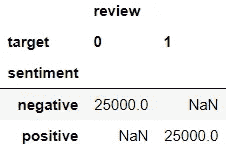

让我们留出 5000 个案例进行测试:

```
# Split data into train & test
X_train, X_test, y_train, y_test = train_test_split(sample['review'], sample['sentiment'], test_size=5000, random_state=seed, 
                                                    stratify=sample['sentiment'])# Append sentiment back using indices
train = pd.concat([X_train, y_train], axis=1)
test = pd.concat([X_test, y_test], axis=1)# Check dimensions
print(f"Train: {train.shape[0]} rows and {train.shape[1]} columns")
print(f"{train['sentiment'].value_counts()}\n")print(f"Test: {test.shape[0]} rows and {test.shape[1]} columns")
print(test['sentiment'].value_counts())
```

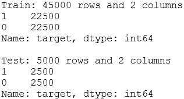

我们将快速检查训练数据集的头部:

```
train.head()
```

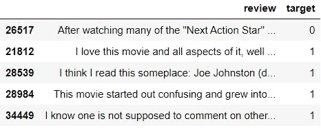

好吧，我们开始吧！🐳

# 1.情感分析💛

在这一节中，我想向您展示两种非常简单的方法来获得情感，而无需构建自定义模型。我们将用 *VADER* 和*文本块*提取极性强度分数。

## 1.1.VADER 的情感分析

> “VADER (Valence Aware 字典和情感推理器)是一个基于词典和规则的情感分析工具，专门针对社交媒体中表达的情感。”

让我们从一个简单的例子开始，看看我们如何使用 *VADER* 情感分析器提取情感强度分数:

```
example = 'The movie was awesome.'
sid = SentimentIntensityAnalyzer()
sid.polarity_scores(example)
```

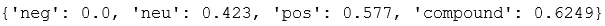

> [***neg，neu，pos:*** *这三个分数相加为 1。这些分数显示了属于该类别的文本的比例。* ***复合:*** *这个分数范围从-1(最负)到 1(最正。*](https://github.com/cjhutto/vaderSentiment)

虽然不是所有的评论都像我们手头的例子一样简单，但很高兴看到例子评论的分数看起来大多是正面的。现在，让我们将强度分数添加到训练数据中:

```
train[['neg', 'neu', 'pos', 'compound']] = train['review'].apply(sid.polarity_scores).apply(pd.Series)
train.head()
```

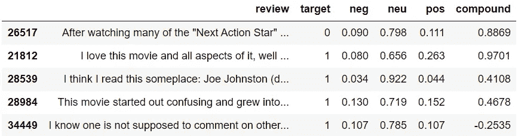

一旦我们初始化了分析器对象，获得情感分数只需要一行代码。我们要进一步检查分数吗？让我们从得分最高的 5 条记录开始:

```
train.nlargest(5, ['pos'])
```

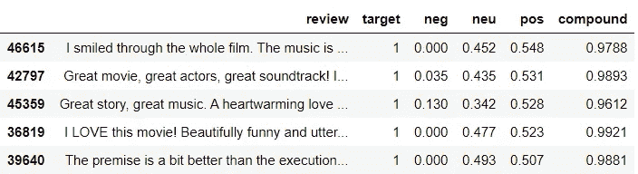

很高兴看到所有的评论都是正面的。让我们为*阴性*做同样的事情:

```
train.nlargest(5, ['neg'])
```


这个看起来也不错。但我们可能会看到数据的极端，那里的情绪更加明显。让我们用直方图直观显示分数，以便更好地理解:

```
for var in ['pos', 'neg', 'neu', 'compound']:
    plt.figure(figsize=(12,4))
    sns.distplot(train.query("target==1")[var], bins=30, kde=False, 
                 color='green', label='Positive')
    sns.distplot(train.query("target==0")[var], bins=30, kde=False, 
                 color='red', label='Negative')
    plt.legend()
    plt.title(f'Histogram of {var} by true sentiment');
```

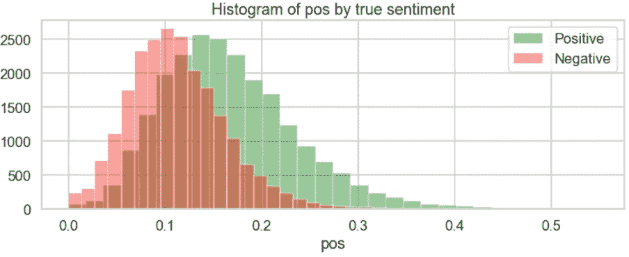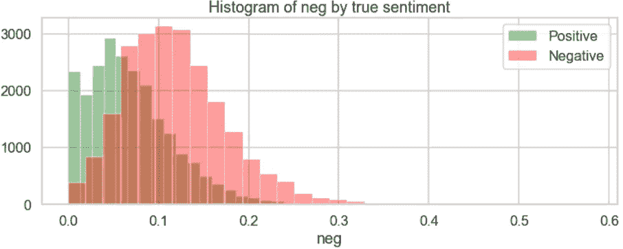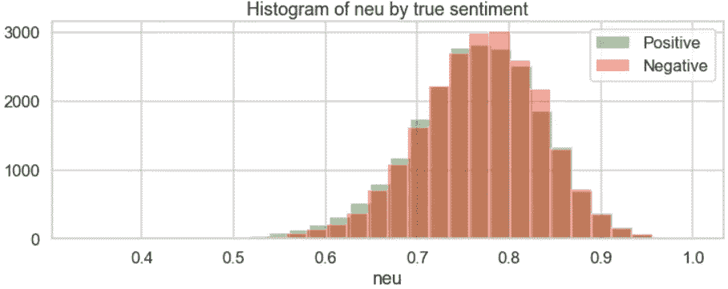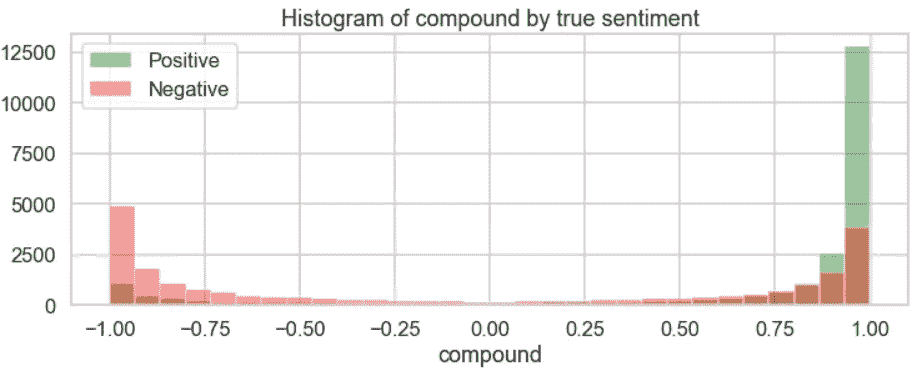

从直方图来看，似乎 *pos、neg* 和潜在的 *compound* 列在对积极和消极情绪进行分类时是有用的。我们可以使用这些分数快速地将每个评论分为正面或负面类别。让我们看看它会做得多好:

```
train['vader_polarity'] = np.where(train['pos']>train['neg'], 1, 0)
target_names=['negative', 'positive']
print(classification_report(train['target'], 
                            train['vader_polarity'], 
                            target_names=target_names))
```

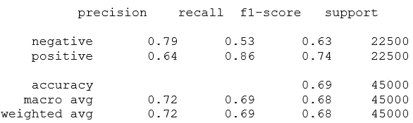

使用 *VADER* ，我们可以不费吹灰之力获得大约 69%的准确率。不过，正面和负面评论的表现看起来有所不同。我们对正面评论的召回率更高，准确率更低——这意味着我们有更多的误报(看到我在那里做了什么吗？你明白我为什么把正面评价编码为 1 了吗？🙊).让我们看看混淆矩阵:

```
# Create function so that we could reuse later
def plot_cm(y_test, y_pred, target_names=['negative', 'positive'], 
            figsize=(5,3)):
    """Create a labelled confusion matrix plot."""
    cm = confusion_matrix(y_test, y_pred)
    fig, ax = plt.subplots(figsize=figsize)
    sns.heatmap(cm, annot=True, fmt='g', cmap='BuGn', cbar=False, 
                ax=ax)
    ax.set_title('Confusion matrix')
    ax.set_xlabel('Predicted')
    ax.set_xticklabels(target_names)
    ax.set_ylabel('Actual')
    ax.set_yticklabels(target_names, 
                       fontdict={'verticalalignment': 'center'});# Plot confusion matrix
plot_cm(train['target'], train['vader_polarity'])
```

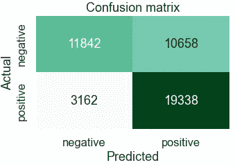

正如我们所见，我们有许多真阳性和假阳性。事实上，大约 67%的预测是积极的。让我们看看如果使用*复合*分数，性能是否会提高。

```
train['vader_compound'] = np.where(train['compound']>0, 1, 0)
print(classification_report(train['target'], 
                            train['vader_compound'], 
                            target_names=target_names))
```

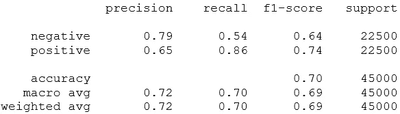

```
plot_cm(train['target'], train['vader_compound'])
```

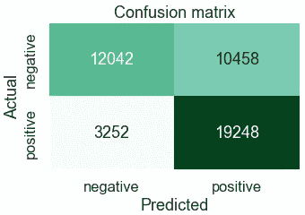

性能看起来非常相似。我使用训练数据集进行评估，因为我们在这里不是训练模型。但是，如果对测试数据进行同样的操作，结果应该非常相似。

🔗nltk 中关于[*【VADER】*](https://github.com/cjhutto/vaderSentiment)*[*VADER 的更多信息。*](https://www.nltk.org/howto/sentiment.html)*

## *1.2.使用 TextBlob 进行情感分析*

*另一种获得情感分数的方法是利用 *TextBlob* 库。使用来自 *TextBlob* 对象的情感属性，我们也可以提取相似的分数。下面是我们如何使用之前的示例进行提取:*

```
*TextBlob(example).sentiment*
```

*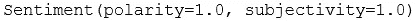*

> ****极性:*** *范围从-1(最负)到 1(最正)* ***主观性:*** *范围从 0(非常客观)到 1(非常主观)**

*我们的例子被分析为非常主观的肯定陈述。是真的，不是吗？在这两个分数中，*极性*与我们更相关。让我们将强度分数添加到训练数据中，并检查具有最高*极性*分数的 5 个记录:*

```
*train[['polarity', 'subjectivity']] = train['review'].apply(lambda x:TextBlob(x).sentiment).to_list()columns = ['review', 'target', 'polarity', 'subjectivity']
train[columns].nlargest(5, ['polarity'])*
```

*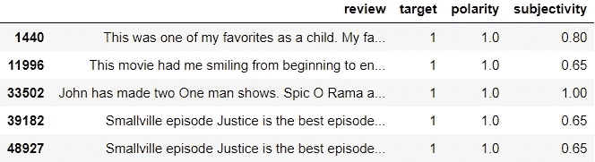*

*如你所见，用 *TextBlob* 添加情感强度分数也很简单。让我们来看看极性*分数最低的 5 条记录:**

```
*train[columns].nsmallest(5, ['polarity'])*
```

*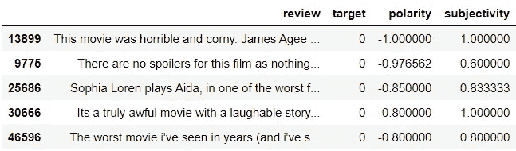*

*是时候绘制一些直方图来更好地理解分数了:*

```
*for var in ['polarity', 'subjectivity']:
    plt.figure(figsize=(12,4))
    sns.distplot(train.query("target==1")[var], bins=30, kde=False, 
                 color='green', label='Positive')
    sns.distplot(train.query("target==0")[var], bins=30, kde=False, 
                 color='red', label='Negative')
    plt.legend()
    plt.title(f'Histogram of {var} by true sentiment');*
```

*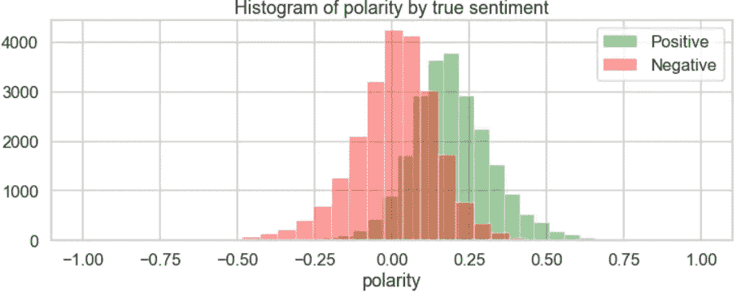**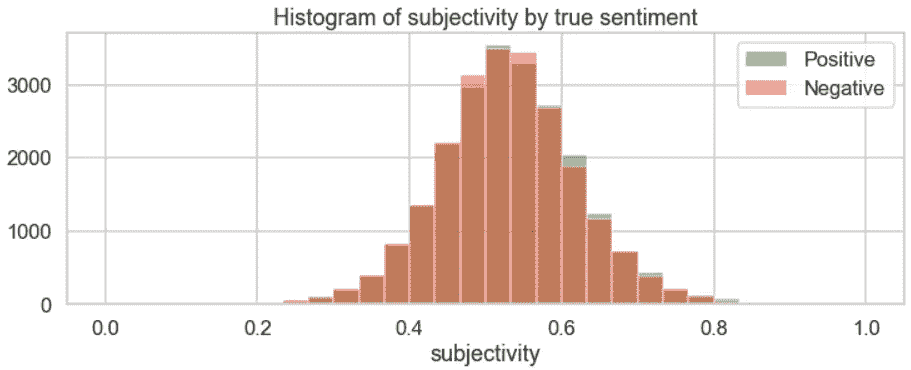*

*正如所料，*极性*分数看起来可能有助于对积极情绪和消极情绪进行分类。让我们使用*极性*分数进行分类，并查看性能:*

```
*train['blob_polarity'] = np.where(train['polarity']>0, 1, 0)
print(classification_report(train['target'], 
                            train['blob_polarity'], 
                            target_names=target_names))*
```

*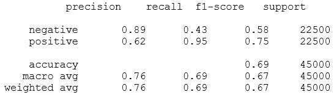*

*使用 *TextBlob* ，我们可以不费吹灰之力获得大约 69%的准确率。同样，我们有许多假阳性，事实上，甚至比以前更多。让我们看看混淆矩阵:*

```
*plot_cm(train['target'], train['blob_polarity'])*
```

*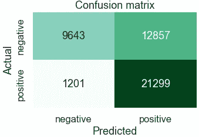*

*这一次，假阳性的数量高于真阴性的数量。预测偏向积极情绪，因为 76%的预测是积极的。*

*🔗关于 [*TextBlob* 的更多信息。](https://textblob.readthedocs.io/en/dev/)*

## *1.3.两者之间的关系*

*让我们来比较一下 *VADER* 和 *TextBlob* 的分数有多相似:*

```
*pd.crosstab(train['vader_polarity'], train['blob_polarity'])*
```

*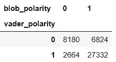*

*他们的分类中有大约 79%的重叠，大多数是正面情绪。让我们来看看极性得分:*

```
*plt.figure(figsize=(12,12))
sns.scatterplot(data=train, x='polarity', y='compound',
                hue='target', palette=['red', 'green'], 
                alpha=.3)
plt.axhline(0, linestyle='--', color='k')
plt.axvline(0, linestyle='--', color='k')
plt.title('Scatterplot between polarity intensity scores');*
```

*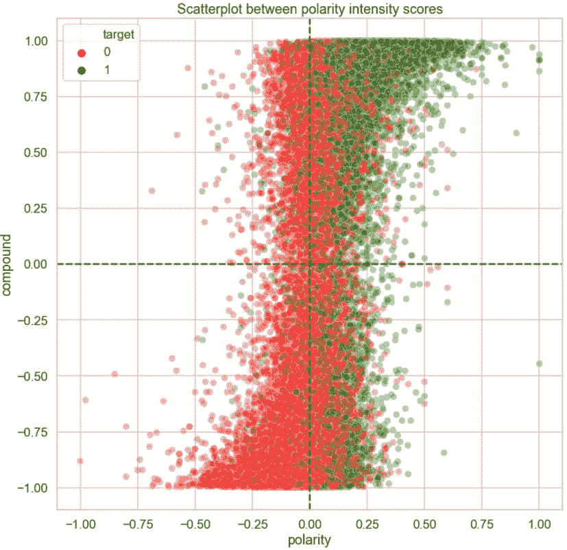*

*这张图显示的信息比前一张表多一点。在左下象限，我们主要看到红色圆圈，因为两种方法中的负面分类都更精确。在右上象限，有大量的圆圈，大部分是绿色的，但颜色混合不像以前那么纯。剩下的两个象限显示了两个分数不一致的地方。总的来说，在图的右半部分，颜色比左半部分更混合。*

*我们从两者中得到非常相似的 69%的总体准确度；然而，当我们仔细观察预测时，这两种方法之间的性能是不同的。*

*现在你知道如何用 *VADER* 或*文本块*获得情感极性分数。如果您有未标记的数据，这两个工具为自动标记您的数据提供了一个很好的起点。是时候建立模型了！✨*

# *2.模拟ⓜ️*

*在本节中，我们将:*

1.  *选择合适的预处理方法和算法*
2.  *探索添加 *VADER* 和*文本斑点*情感分数作为特征是否会提高模型的预测能力*
3.  *构建管道并调整其超参数*
4.  *在看不见的数据上测试最终管道*

*情感分类是监督分类模型的一个应用。因此，我们在这里采用的方法可以推广到任何监督分类任务。*

## *2.1.选择合适的预处理方法和算法*

*在[我之前的帖子](/preprocessing-text-in-python-923828c4114f)中，我们探索了三种不同的文本预处理方法，并列出其中两种:*简单方法*和*简单方法*。在这两个选项中，我们现在将测试这两个选项之间的模型性能是否有任何差异，并选择其中一个来使用向前移动。为了使事情变得简单，我们将创建两个函数(这些函数的想法是从[这里](https://www.kaggle.com/pouryaayria/a-complete-ml-pipeline-tutorial-acu-86/comments)得到的启发):*

```
*# Define functions
def create_baseline_models():
    """Create list of baseline models."""
    models = []
    models.append(('log', LogisticRegression(random_state=seed, 
                                             max_iter=1000)))
    models.append(('sgd', SGDClassifier(random_state=seed)))
    models.append(('mnb', MultinomialNB()))
    return modelsdef assess(X, y, models, cv=5, scoring=['roc_auc', 
                                        'accuracy', 
                                        'f1']):
    """Provide summary of cross validation results for models."""
    results = pd.DataFrame()
    for name, model in models:
        result = pd.DataFrame(cross_validate(model, X, y, cv=cv, 
                                             scoring=scoring))
        mean = result.mean().rename('{}_mean'.format)
        std = result.std().rename('{}_std'.format)
        results[name] = pd.concat([mean, std], axis=0)
    return results.sort_index()*
```

*我挑了三个算法来试: [*逻辑回归分类器*](https://scikit-learn.org/stable/modules/generated/sklearn.linear_model.LogisticRegression.html) 、 [*随机梯度下降分类器*](https://scikit-learn.org/stable/modules/generated/sklearn.linear_model.SGDClassifier.html?highlight=sgd#sklearn.linear_model.SGDClassifier) 和 [*多项朴素贝叶斯分类器*](https://scikit-learn.org/stable/modules/generated/sklearn.naive_bayes.MultinomialNB.html?highlight=multinomialnb#sklearn.naive_bayes.MultinomialNB) 。让我们启动模型:*

```
*models = create_baseline_models()
models*
```

*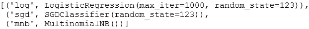*

*现在，让我们检查使用*更简单方法*时的模型性能:*

```
*# Preprocess the data
vectoriser = TfidfVectorizer(token_pattern=r'[a-z]+', 
                             stop_words='english', 
                             min_df=30, 
                             max_df=.7)
X_train_simpler = vectoriser.fit_transform(X_train)# Assess the model
assess(X_train_simpler, y_train, models)*
```

*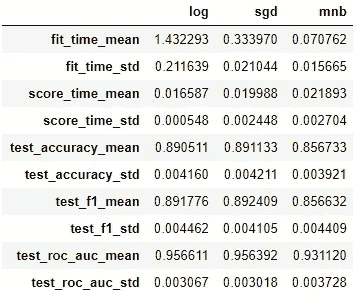*

*很高兴看到我们获得了更好的性能:与仅使用情感分数相比，基线模型的准确率为 86–89%。由于这些职业相当平衡，我们将主要关注准确性。但是，我们将确保稍后更仔细地检查预测，以评估模型。性能指标在*逻辑回归*和*随机梯度下降*之间看起来非常接近，后者在训练中更快(参见 *fit_time* )。朴素贝叶斯是三个人中训练速度最快的，但是表现比其他两个人稍差。现在让我们来评估一下*简单方法*:*

```
*# Define function
def preprocess_text(text):
    # 1\. Tokenise to alphabetic tokens
    tokeniser = RegexpTokenizer(r'[A-Za-z]+')
    tokens = tokeniser.tokenize(text)

    # 2\. Lowercase and lemmatise 
    lemmatiser = WordNetLemmatizer()
    tokens = [lemmatiser.lemmatize(t.lower(), pos='v') 
              for t in tokens]
    return tokens# Preprocess the data
vectoriser = TfidfVectorizer(analyzer=preprocess_text, 
                             min_df=30, 
                             max_df=.7)
X_train_simple = vectoriser.fit_transform(X_train)# Assess models
assess(X_train_simple, y_train, models)*
```

*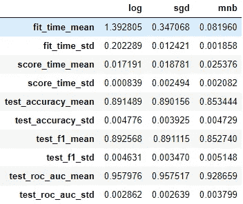*

*性能看起来和以前差不多。因此，我们将倾向于使用*更简单的方法*,并继续使用它。在这三种算法中，我们将选择*随机梯度下降*，因为它最能平衡速度和预测能力。*

## *2.2.评估附加功能*

*在本节中，我们将探讨添加 *VADER* 和*文本斑点*情感分数作为特征是否会提高模型的预测能力。让我们快速检查一下是否有任何高度相关的特性:*

```
*plt.figure(figsize = (14,5))
columns = ['target', 'neg', 'neu', 'pos', 'compound', 'polarity', 
           'subjectivity']
sns.heatmap(train[columns].corr(), annot=True, cmap='seismic_r');*
```

*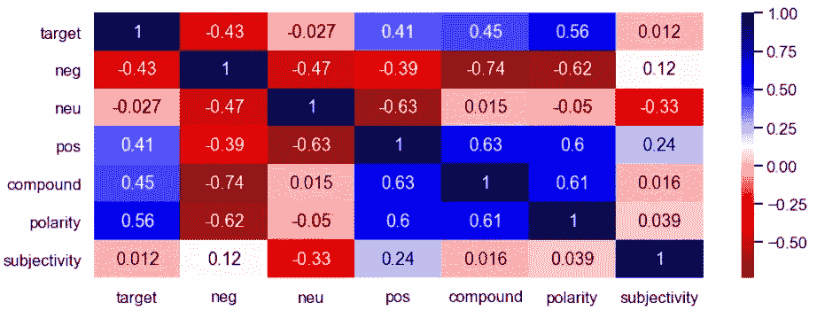*

*最相关的特征是*复合*和*负*。让我们运行一个快速模型，看看哪些分数更有用:*

```
*# Initialise a model
sgd = SGDClassifier(random_state=seed)# Initialise a scaler
scaler = MinMaxScaler()# Assess the model using scores
scores = train[['neg', 'neu', 'pos', 'compound', 'polarity', 
                'subjectivity']]
assess(scaler.fit_transform(scores), y_train, [('sgd', sgd)])*
```

*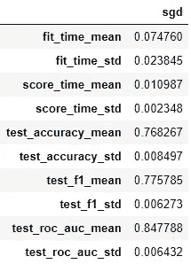*

*我们使用分数得到大约 77%的准确率。现在让我们检查系数:*

```
*# Fit to training data
sgd.fit(scores, y_train)# Get coefficients
coefs = pd.DataFrame(data=sgd.coef_, columns=scores.columns).T
coefs.rename(columns={0: 'coef'}, inplace=True)# Plot
plt.figure(figsize=(10,5))
sns.barplot(x=coefs.index, y='coef', data=coefs)
plt.title('Coefficients');*
```

*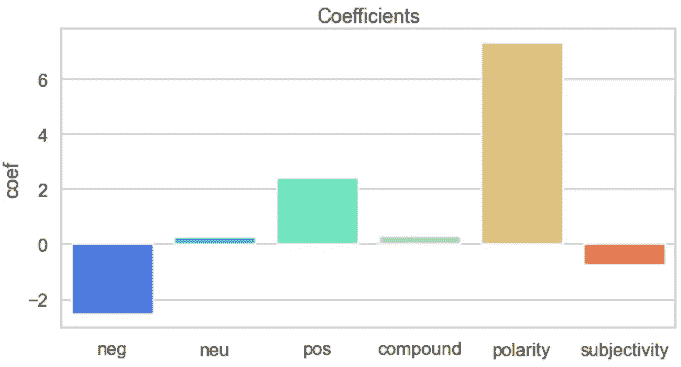*

*似乎我们只能使用*阴性、阳性*和*极性*，因为它们是得分*中最主要的特征。*让我们看看是否可以通过将这些选择的分数添加到先前预处理的数据来改进模型结果。*

```
*# Add features to sparse matrix
selected_scores = train[['neg', 'pos', 'polarity']]
X_train_extended = hstack([X_train_simpler, csr_matrix(scaler.fit_transform(selected_scores))])# Assess
assess(X_train_extended, y_train, [('sgd', sgd)])*
```

*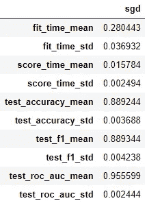*

*由于添加这些分数并没有改进模型，因此没有必要将它们作为特征添加。这也将使我们的渠道保持简单！*

## *2.3.构建管道并调整其超参数*

*是时候构建一个小管道，将预处理器和模型放在一起了。我们将微调它的超参数，看看我们是否能改进这个模型。首先，让我们尝试理解三个超参数的影响:对于向量机的`min_df`、`max_df`和对于随机搜索模型的`loss`:*

```
*# Create a pipeline
pipe = Pipeline([('vectoriser', TfidfVectorizer(token_pattern=r'[a-z]+')),
                 ('model', SGDClassifier(random_state=seed))])# Prepare a random search
param_distributions = {'vectoriser__min_df': np.arange(10, 1000, 10),
                       'vectoriser__max_df': np.linspace(.2, 1, 40),
                       'model__loss': ['log', 'hinge']}
r_search = RandomizedSearchCV(estimator=pipe, param_distributions=param_distributions, 
                              n_iter=30, cv=5, n_jobs=-1, random_state=seed)
r_search.fit(X_train, y_train)# Save results to a dataframe
r_search_results = pd.DataFrame(r_search.cv_results_).sort_values(by='rank_test_score')*
```

*这里，我们正在尝试 30 种不同的超参数空间指定的随机组合。这需要一段时间来运行。随机搜索的输出将保存在名为`r_search_results`的数据帧中。让我们创建另一个数据框架，其中包含一些我们更感兴趣的列:*

```
*columns = [col for col in r_search_results.columns 
           if re.search(r"split|param_", col)]
r_summary = r_search_results[columns].copy()
r_summary.columns = [re.sub(r'_test_score|param_', '', col) 
                     for col in r_summary.columns]
columns = [col.split('__')[1] if '__' in col else col 
           for col in r_summary.columns ]
r_summary.columns = columns
r_summary.head()*
```

*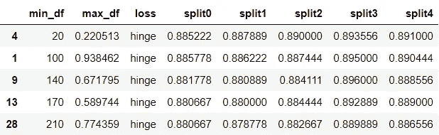*

*让我们将输出可视化，以便更好地理解超参数的影响:*

```
*# Create a long dataframe
r_summary_long = pd.melt(r_summary, 
                         id_vars=['min_df', 
                                  'max_df', 
                                  'loss'], 
                         value_vars=['split0', 
                                     'split1', 
                                     'split2', 
                                     'split3', 
                                     'split4'])# Plot hyperparameter 'loss'
plt.figure(figsize=(8,4))
plt.title('Performance by loss')
sns.boxplot(x='value', y='loss', data=r_summary_long, 
            orient='h')
plt.xlim(.8, .9);*
```

*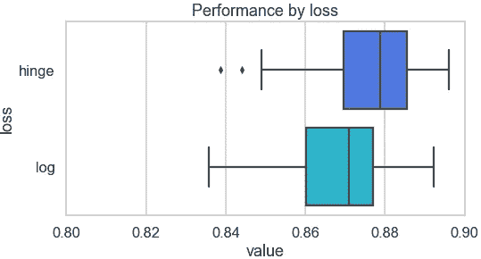*

*看起来`loss='hinge'`会带来稍微好一点的性能。让我们看看数字超参数:*

```
*for param in ['min_df', 'max_df']:
    plt.figure(figsize=(8,4))
    sns.scatterplot(x=param, y="value", data=r_summary_long, 
                    x_jitter=True, alpha=0.5)
    plt.ylim(.8, .9);*
```

*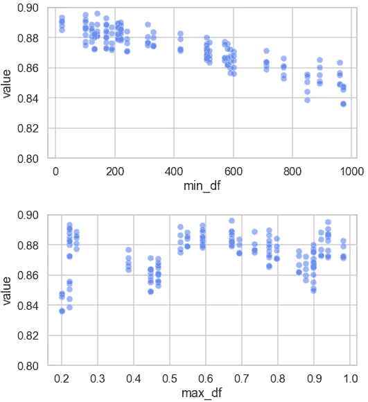*

*由于`min_df`和准确度之间似乎存在负相关关系，我们将把`min_df`保持在 200 以下。`max_df`没有明显的趋势，可能是因为业绩受`min_df`和`loss`的影响更大。虽然他们三个都是这样，但是对于`max_df`来说更明显。现在，我们对这些超参数如何影响模型有了一些了解，让我们更精确地定义管道(`max_df=.6`和`loss=’hinge'`)并尝试使用网格搜索进一步调整它:*

```
*# Create a pipeline
pipe = Pipeline([('vectoriser', TfidfVectorizer(token_pattern=r'[a-z]+', max_df=.6)),
                 ('model', SGDClassifier(random_state=seed, loss='hinge'))])# Prepare a grid search
param_grid = {'vectoriser__min_df': [30, 90, 150],
              'vectoriser__ngram_range': [(1,1), (1,2)],
              'vectoriser__stop_words': [None, 'english'],
              'model__fit_intercept': [True, False]}
g_search = GridSearchCV(estimator=pipe, param_grid=param_grid, cv=5, n_jobs=-1)
g_search.fit(X_train, y_train)# Save results to a dataframe
g_search_results = pd.DataFrame(g_search.cv_results_).sort_values(by='rank_test_score')*
```

*网格搜索也需要一些时间，因为我们有 24 种不同的超参数组合要尝试。像以前一样，输出将保存到名为`g_search_results`的数据帧中。让我们将更多相关列提取到另一个数据框架中:*

```
*columns = [col for col in g_search_results.columns 
           if re.search(r"split|param_", col)]
g_summary = g_search_results[columns+['mean_test_score']].copy()
g_summary.columns = [re.sub(r'_test_score|param_', '', col) 
                     for col in g_summary.columns]
columns = [col.split('__')[1] if '__' in col else col 
           for col in g_summary.columns ]
g_summary.columns = columns
g_summary.head()*
```

*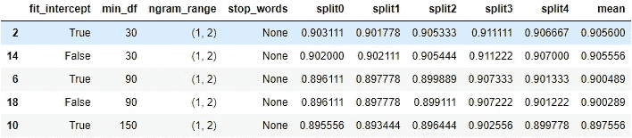*

*使用这些组合中的任何一种，我们都可以达到约 0.9 的交叉验证精度。很高兴看到边际增长。*

```
*# Create a long dataframe
g_summary_long = pd.melt(g_summary, 
                         id_vars=['min_df', 
                                  'ngram_range', 
                                  'stop_words', 
                                  'fit_intercept'], 
                         value_vars=['split0', 
                                     'split1', 
                                     'split2', 
                                     'split3', 
                                     'split4'])
g_summary_long.replace({None: 'None'}, inplace=True)# Plot performance
for param in ['ngram_range', 'stop_words', 'fit_intercept']:
    plt.figure(figsize=(8,4))
    plt.title(f'Performance by {param}')
    sns.boxplot(x='value', y=param, data=g_summary_long, orient='h')
    plt.xlim(.85, .95);*
```

*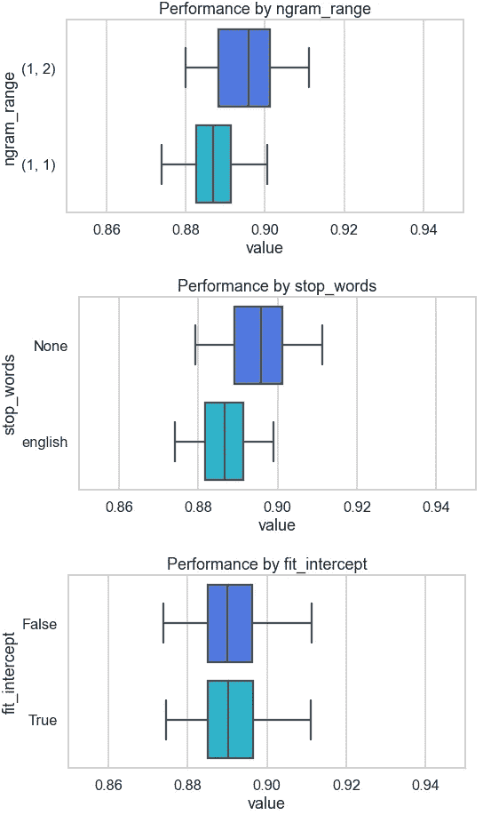*

*我们可以看到，换成`ngram_range=(1,2)`，model 表现更好。`stop_words=None`也是如此。另一方面，我们是否拟合截距并没有太大的影响，这意味着我们可以将这个超参数保留为默认值。我认为这已经足够好了，我们现在可以定义最终的管道了。*

## *2.4.在看不见的数据上测试最终管道*

*使用网格搜索中的顶部组合，这是我们最终管道的样子:*

```
*pipe = Pipeline([('vectoriser', TfidfVectorizer(token_pattern=r'[a-z]+', min_df=30, max_df=.6, ngram_range=(1,2))),
                 ('model', SGDClassifier(random_state=seed, loss='hinge'))])pipe.fit(X_train, y_train)*
```

*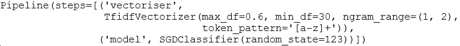*

*我们的管道很小很简单。让我们看看它的系数:*

```
*coefs = pd.DataFrame(pipe['model'].coef_, 
                     columns=pipe['vectoriser'].get_feature_names())
coefs = coefs.T.rename(columns={0:'coef'}).sort_values('coef')
coefs*
```

*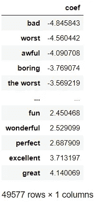*

*具有最高或最低系数的特征看起来很直观。但是看看我们拥有的特性数量:49，577！这主要是因为放松了`min_df`，增加了二元模型，没有删除停用词。如果我们热衷于减少特征的数量，我们可以改变管道中的这些超参数。如果我们开始减少特征，我们会注意到特征数量和模型精度之间的权衡。最佳平衡是什么样的取决于具体情况。让我们来评估管道:*

```
*train_pred = pipe.predict(X_train)
print(classification_report(train_pred, 
                            y_train, 
                            target_names=target_names))*
```

*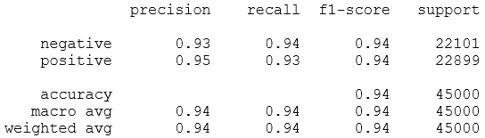*

```
*test_pred = pipe.predict(X_test)
print(classification_report(test_pred, 
                            y_test, 
                            target_names=target_names))*
```

*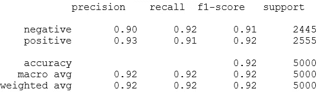*

*在训练集和测试集上的准确率分别约为 0.94 和 0.92。这两种观点的精确度和召回率看起来非常相似。我们有稍微多一点的假阴性。让我们绘制混淆矩阵:*

```
*plot_cm(test_pred, y_test, target_names=target_names)*
```

*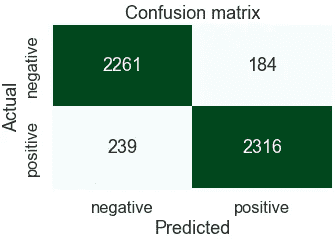*

*看起来不错。这么🎊现在，我们有了一个将大约 90%的评论归类为正确观点的管道。让我们看看做一次预测需要多长时间。我们将使用 Jupyter 笔记本的魔法命令`%timeit`:*

```
*for i in range(10):
    lead = X_test.sample(1)
    %timeit pipe.predict(lead)*
```

*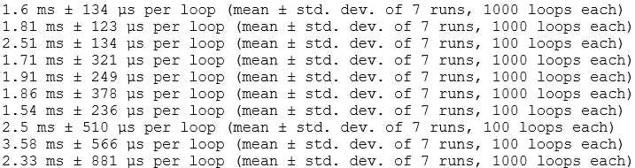*

*尽管`%timeit`运行了多个循环，并给出了运行时间的均值和标准差，但我注意到我每次得到的输出都略有不同。因此，我们正在查看`%timeit`的 10 个循环以观察范围。*

*单次预测大约需要 1.5 到 4 毫秒。这需要在用例的生产环境的上下文中进行评估。*

*好了，这就是这篇文章的内容。💫*

**

*照片由[伯爵克里斯](https://unsplash.com/@countchris?utm_source=medium&utm_medium=referral)在 [Unsplash](https://unsplash.com?utm_source=medium&utm_medium=referral) 上拍摄*

**您想访问更多这样的内容吗？媒体会员可以无限制地访问媒体上的任何文章。如果您使用* [*我的推荐链接*](https://zluvsand.medium.com/membership) ，*成为会员，您的一部分会费将直接用于支持我。**

*谢谢你看我的帖子。希望您已经学会了一些不同的实用方法，可以在构建或不构建定制模型的情况下将文本分类为情感。以下是本系列其他两篇文章的链接:◼️[python 中的探索性文本分析](/exploratory-text-analysis-in-python-8cf42b758d9e)
◼️[python 中的文本预处理](/preprocessing-text-in-python-923828c4114f)*

*以下是我的其他 NLP 相关帖子的链接:
◼️[Python 中的简单 word cloud](/simple-wordcloud-in-python-2ae54a9f58e5)
*(下面列出了一系列关于 NLP 介绍的帖子)*
◼️ [第一部分:Python 中的预处理文本](/introduction-to-nlp-part-1-preprocessing-text-in-python-8f007d44ca96)
◼️ [第二部分:词条满足和词干的区别](https://medium.com/@zluvsand/introduction-to-nlp-part-2-difference-between-lemmatisation-and-stemming-3789be1c55bc)
◼️ [第三部分:TF-IDF 解释](https://medium.com/@zluvsand/introduction-to-nlp-part-3-tf-idf-explained-cedb1fc1f7dc)
◼️ [第四部分:python 中的监督文本分类模型](https://medium.com/@zluvsand/introduction-to-nlp-part-4-supervised-text-classification-model-in-python-96e9709b4267)*

*再见🏃💨*