# PyTorch 中基于 CNN 的餐馆评论情感分类

> 原文：<https://towardsdatascience.com/sentiment-classification-using-cnn-in-pytorch-fba3c6840430?source=collection_archive---------10----------------------->

## 使用 Word2Vec 嵌入作为输入实现卷积神经网络(CNN)以分类 PyTorch 中的 Yelp 餐馆评论

在 PyTorch 中使用 CNN 进行情感分类

在本文中，我将解释 CNN 如何用于文本分类问题，以及如何设计网络以接受 word2vec 预训练的嵌入作为网络的输入。您将了解如何在 PyTorch 中为情感分类问题构建自定义 CNN。

在[我之前的帖子](https://medium.com/@dipikabaad/sentiment-classification-using-logistic-regression-in-pytorch-e0c43de9eb66)中，我介绍了 PyTorch 的基础知识以及如何实现用于情感分类的逻辑回归。如果你是 PyTorch 新手，可以参考一下。如果你想习惯用 PyTorch 定义网络，请参考[的前馈神经网络文章](https://medium.com/swlh/sentiment-classification-using-feed-forward-neural-network-in-pytorch-655811a0913f)。我在以前的帖子中解释了使用决策树分类器使用 [BOW](https://medium.com/swlh/sentiment-classification-with-bow-202c53dac154) 、 [TF-IDF](https://medium.com/swlh/sentiment-classification-for-restaurant-reviews-using-tf-idf-42f707bfe44d) 、 [Word2Vec](https://medium.com/swlh/sentiment-classification-using-word-embeddings-word2vec-aedf28fbb8ca) 和 [Doc2Vec](https://medium.com/swlh/sentiment-classification-for-reviews-using-doc2vec-660ba594c336) 向量进行情感分类的其他方法，最后也会进行比较。现在让我们开始加载数据吧！

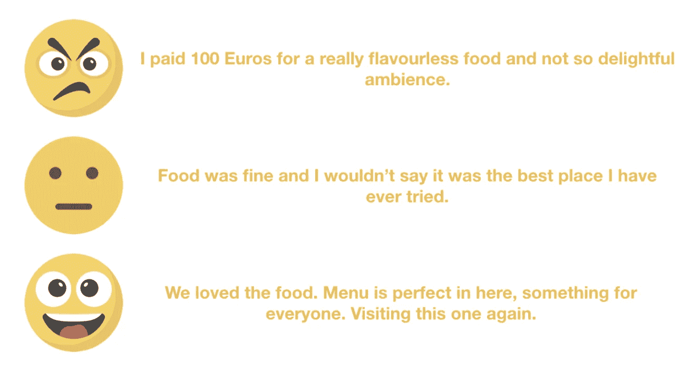

由[迪皮卡·巴德](https://medium.com/u/cb4f6856d71b?source=post_page-----fba3c6840430--------------------------------)提供的按情感分类的餐馆评论示例

# 加载数据

Yelp 餐馆评论[数据集](https://www.yelp.com/dataset)可以从他们的网站下载，那里的数据格式是 JSON。提供的数据实际上不是 python 可读的正确 json 格式。每一行都是 dictionary，但是为了使它成为有效的 json 格式，应该在文件的开头和结尾加上方括号，并在每一行的末尾添加`,`。将`INPUT_FOLDER`定义为 yelp review.json 文件所在的本地目录中的文件夹路径。将`OUTPUT_FOLDER`声明为一个路径，您希望在该路径中写入以下函数的输出。json 数据的加载和前 100，000 行的写入在下面的函数中完成:

一旦运行了上面的函数，您就可以为接下来的步骤将它加载到 pandas dataframe 中了。对于这个实验，只取了少量的数据，这样就可以更快地运行以查看结果。

# 探索数据

在加载数据之后，创建用于情感指示的新列。原始数据集中并不总是存在带有您想要的预测标签的某个列。在大多数情况下，这可以是一个派生列。对于这种情况，数据中的`stars`列用于导出情绪。

**输出:**

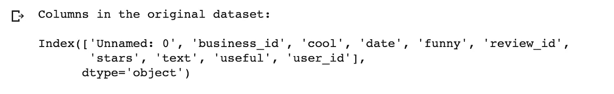

在数据可用之后，完成从星星到情绪的映射，并绘制每个情绪的分布。

**输出:**

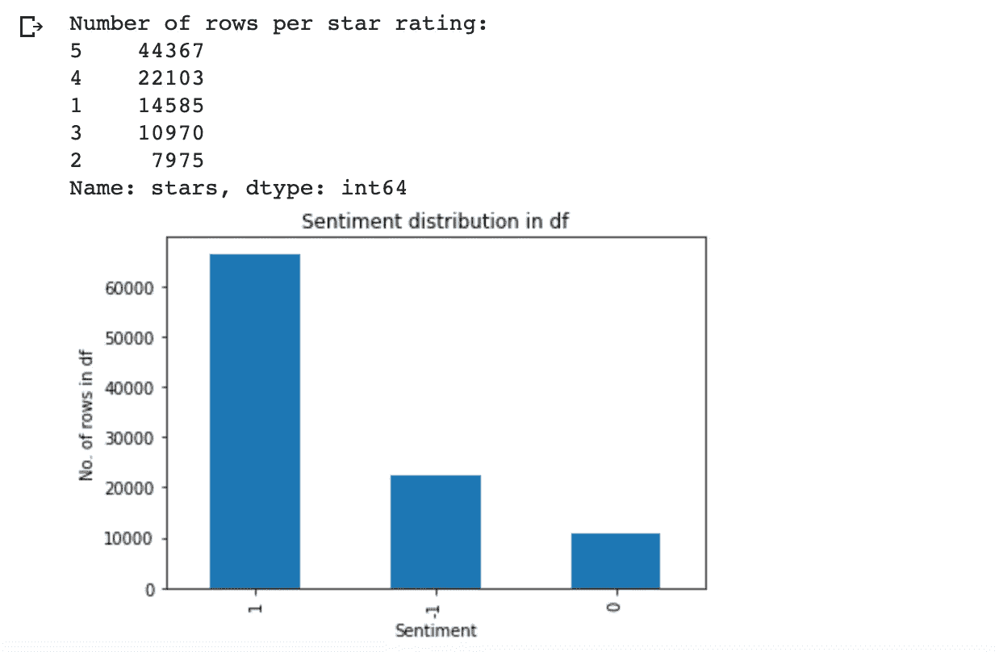

完成后，检查每个情感的行数。情感类别如下:

1.  阳性:1
2.  负数:-1
3.  中性:0

这三种情绪的行数分布不均匀。在这篇文章中，不平衡类的问题将不会被处理，这就是为什么，简单的函数检索每个情绪的前几个记录被写。在本例中，`top_n`是 10000，这意味着将获取总共 30，000 条记录。

**输出:**

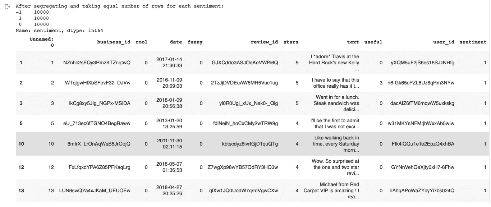

# 如何对文本数据进行预处理？

预处理包括许多步骤，如标记化、去除停用词、词干化/词条化等。这些常用的技巧在我之前的弓的[帖子里有详细解释。这里，下一阶段只解释必要的步骤。](https://medium.com/swlh/sentiment-classification-with-bow-202c53dac154)

为什么需要对这段文字进行预处理？—并非所有信息都对预测或分类有用。减少字数将减少模型的输入维度。这种语言的书写方式，包含了大量语法特有的信息。因此，当转换成数字格式，像大写，标点符号，后缀/前缀等字的具体特征。都是多余的。以相似单词映射到单个单词的方式清理数据，并从文本中删除语法相关信息，可以极大地减少词汇量。应用哪种方法和跳过哪种方法取决于手头的问题。

# 1.停用词的删除

停用词是在不同的自然语言处理(NLP)任务中作为前置步骤经常使用并从句子中移除的词。停用词的例子有:a、an、the、this、not 等。每个工具都使用一组稍微不同的停用词列表，但是在短语结构很重要的情况下，比如在情感分析的情况下，就避免使用这种技术。

移除停用字词的示例:

**输出:**

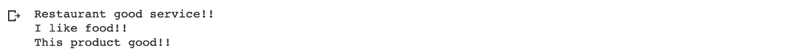

从输出中可以看出，删除停用词就删除了获取情感所需的必要词，有时它可以完全改变句子的意思。在上面这段代码打印的例子中，很明显，它可以将否定句转换成肯定句。因此，对于情感分类来说，这个步骤被跳过。

# 2.标记化

标记化是将句子/文本分割成称为标记的单词阵列的过程。这有助于分别对每个单词进行转换，也是将单词转换为数字所必需的。执行标记化有不同的方式。我已经在我的[上一篇文章](https://medium.com/@dipikabaad/sentiment-classification-with-bow-202c53dac154)的标记化部分解释了这些方法，所以如果你感兴趣的话，你可以去看看。

Gensim 的`[simple_preprocess](https://radimrehurek.com/gensim/utils.html)`允许你将文本转换成小写，并删除标点符号。它还有`min`和`max`长度参数，这有助于过滤掉那些长度范围内的罕见单词和最常见的单词。

这里，`simple_preprocess`用于获取数据帧的标记，因为它已经为我们做了大部分预处理。让我们应用此方法来获取数据帧的令牌:

**输出:**

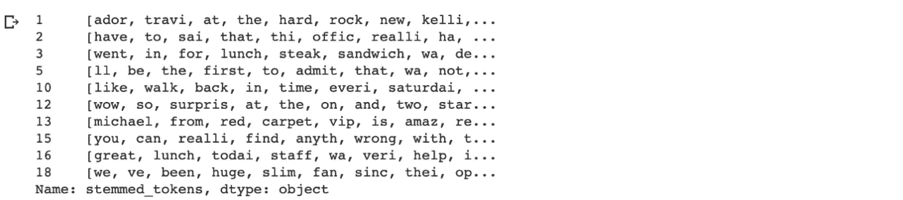

# 3.堵塞物

词干处理将单词还原为其“词根”。不同于使用语法规则和字典将单词映射到词根形式的词干化，词干化只是删除后缀/前缀。词干分析广泛用于 SEOs、Web 搜索结果和信息检索的应用中，因为只要词根在文本的某个地方匹配，它就有助于检索搜索中的所有相关文档。

有不同的算法用来做词干分析。PorterStammer(1979)、LancasterStammer (1990)和 SnowballStemmer(可以添加自定义规则)。NLTK 或 Gensim 包可用于实现这些词干提取算法。兰开斯特比波特慢一点，所以我们可以根据大小和所需的响应时间来使用它。Snowball stemmer 是 Porter stemmer 的略微改进版本，通常比后者更受欢迎。不太清楚哪种方法会产生准确的结果，因此必须试验不同的方法，并选择给出更好结果的方法。在这个例子中，波特斯特梅尔被使用，这是简单和快速的。以下代码显示了如何在数据帧上实现词干，并创建新列`stemmed_tokens`:

**输出:**

# 分成训练集和测试集:

训练数据将用于训练模型，测试数据是模型预测分类的数据，它将与原始标签进行比较，以检查准确性或其他模型测试指标。

*   训练数据(用于训练 ML 模型的数据子集)~70%
*   测试数据(用于测试从训练数据训练的 ML 模型的数据子集)~30%

尽量平衡两个集合中的类数，使结果不偏不倚或者成为模型训练不足的原因之一。这是机器学习模型的关键部分。在现实世界的问题中，存在不平衡类的情况，需要使用过采样少数类、欠采样多数类([scikit-learn 包](https://scikit-learn.org/stable/modules/generated/sklearn.utils.resample.html)中的重采样函数)或使用 Imblearn 包中的 [SMOTE 功能生成合成样本等技术。](https://imbalanced-learn.readthedocs.io/en/stable/over_sampling.html#smote-variants)

在这种情况下，数据分为两部分，训练和测试，70%在训练中，30%在测试中。在进行拆分时，最好在训练和测试数据中平均分布类别。这里使用了 scikit-learn 包中的函数 [train_test_split](https://scikit-learn.org/stable/modules/generated/sklearn.model_selection.train_test_split.html) 。

**输出:**

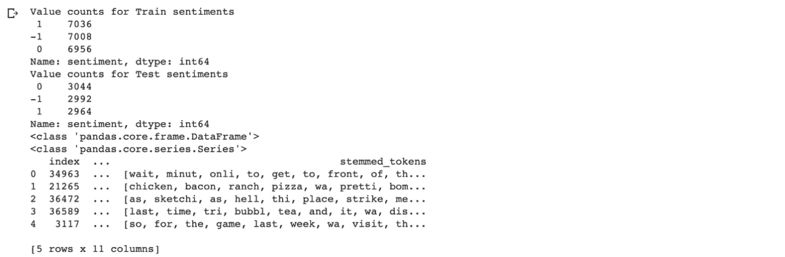

从上面的输出可以看出，数据是按比例分配给每个类的。打印训练和测试中每个情感的行数。

# 用于文本分类的卷积神经网络

现在，我们准备深入研究如何使用 CNN 进行文本分类，以及如何构建输入。CNN 涉及两种操作，可以认为是特征提取器:卷积和池化。这些操作的输出最终连接到多层感知器以获得最终输出。

神经网络只对数字数据起作用，因此首要任务是找到从文字到数字格式的合适转换。这里我们将使用大小为 500 的 Word2Vec 向量作为输入，这在我之前的文章中已经解释过了。

*   卷积层——这些层用于通过在输入上滑动小内核窗口来发现模式。它不是在图像的小区域上增加过滤器，而是通过嵌入窗口大小提到的几个词的向量来滑动。为了查看单词嵌入序列，窗口必须查看一个序列中的多个单词嵌入。它们将是尺寸为`window_size * embedding_size`的矩形。例如，在我们的例子中，如果窗口大小是 3，那么内核将是 3*500。这实质上代表了模型中的 n 元语法。内核权重(过滤器)被成对地乘以单词嵌入，并被求和以获得输出值。随着网络被学习，这些内核权重也被学习。以下显示了如何在卷积层中进行计算的示例(使用了填充，这将在后面解释)。

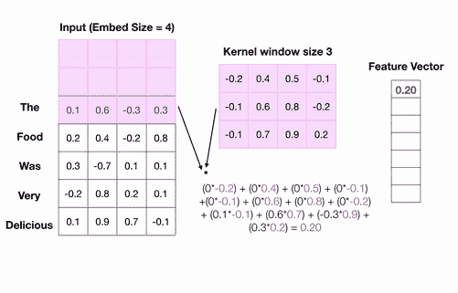

通过 [Dipika Baad](https://medium.com/u/cb4f6856d71b?source=post_page-----fba3c6840430--------------------------------) 进行文本分类的 CNN 计算

*   卷积的输入和输出通道—这里，`nn.Conv2d`用于创建卷积层。在图像的情况下，不同颜料的输入被分别给出，在这种情况下，如果是 RGB，则输入通道的数量是 3，如果是灰度，则输入通道的数量是 1。在这种情况下，我们只输入一个特征，即单词嵌入，因此`conv2d`的第一个参数是`1`，输出通道是特征总数，将是`NUM_FILTERS`。我们可以为每个窗口大小设置多个滤波器，因此总输出会有这么多。
*   填充——有时滑动时，内核大小不会完全覆盖。因此，为了使高度相同的大小，填充使用。这里我们用了`window_size-1`。下面的动画展示了它如何使用 window_size-1 填充。

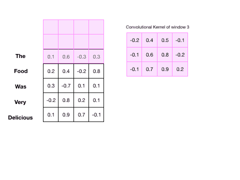

带填充的滑动窗口，用于 CNN 分类，文本由[迪皮卡·巴德](https://medium.com/u/cb4f6856d71b?source=post_page-----fba3c6840430--------------------------------)提供

*   Maxpooling —一旦我们有了特征向量，并且它已经提取了重要的特征，就足以知道它存在于句子中，就像一些积极的短语“棒极了的食物”,并且它出现在句子中的什么地方并不重要。Maxpooling 用于获取这些信息，并丢弃其余的信息。例如，在上面的动画中，我们有特征向量，在应用最大池后，将选择最大值。在上面的例子中，当`very`和`delicious`在短语中时，它显示 max，这是有意义的。

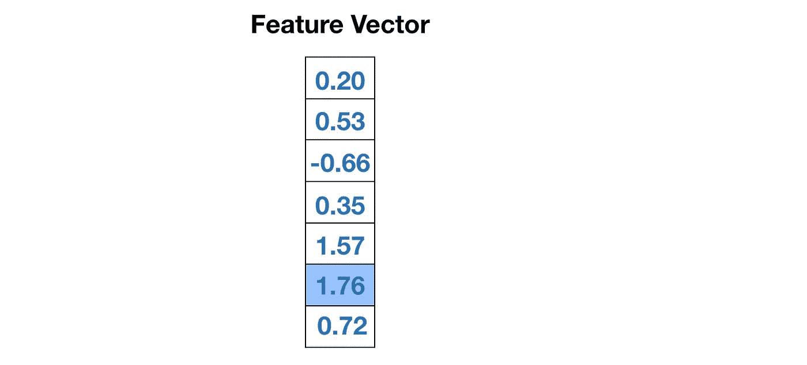

[迪皮卡巴德](https://medium.com/u/cb4f6856d71b?source=post_page-----fba3c6840430--------------------------------)对特征向量的最大池化结果

一旦对所有特征向量应用了最大池，就可以像前馈神经网络一样添加更多层。让我们开始实施吧！下面的代码显示了在构建网络之前需要包含的基本库。我在 Google colab 上用的是 GPU，所以设备指示的是 cuda。

**输出:**

# 生成输入和输出张量

输入将是用嵌入大小 500 训练的 Word2Vec 向量。由于我们希望保持句子的长度不变，当句子的长度小于语料库中最长的句子时，将使用填充标记来填充多余的剩余单词。让我们使用下面的函数来训练 Word2Vec 模型。如果你有兴趣了解更多关于 Word2Vec 的知识，那么可以参考[我之前的文章](https://medium.com/swlh/sentiment-classification-using-word-embeddings-word2vec-aedf28fbb8ca)。模型是在整个语料库上训练的。

一旦模型准备好了，我们就可以创建一个函数来生成输入张量。

找到的句子的最大长度为 927。所以每个输入张量都是这个大小。为了创建输出张量，必须完成从标签到正值的映射。目前我们用-1 表示阴性，这在神经网络中是不可能的。输出层中的三个神经元将给出每个标签的概率，因此我们只需要映射到正数。功能如下:

# 定义 CNN

下面的代码显示了如何定义 CNN。一些参数，如窗口大小，过滤器的数量可以调整，以获得不同的结果。在这里，我已经加载了上面生成的模型，这是为了当你在不同时间训练 word2vec 和在不同时间运行 CNN 时，最好使用保存文件中的模型。

# 训练 CNN 模型

一旦定义了网络，我们就可以开始初始化用于训练的必要对象，如模型对象、损耗和优化对象。下面的代码显示了如何训练 CNN 模型。我已经运行了 30 个时代。在训练数据的每一步都记录损失。

# 测试模型

测试模型代码如下所示。损失图也绘制和代码保存图。当您正在进行多个实验，并且想要比较不同超参数的所有组合后的结果时，这非常有用。

**输出:**

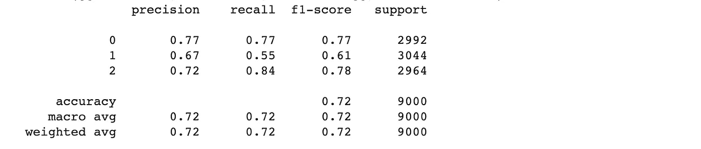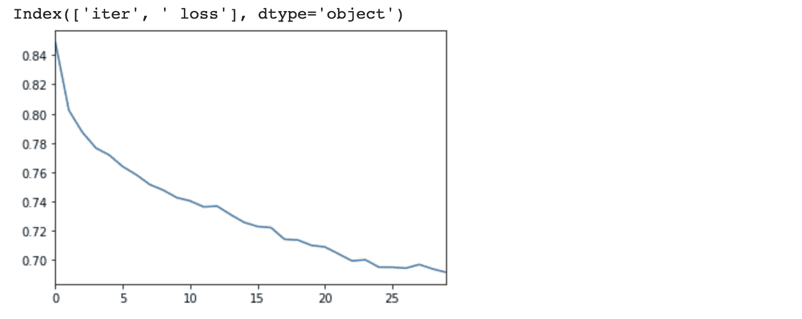

从损失图中可以清楚地看出，损失在稳步减少，并且损失波动不大，这表明学习率不是太高。与以前的方法相比，`0.72`的准确性非常好，在以前的方法中，决策分类器与 [BOW](https://medium.com/swlh/sentiment-classification-with-bow-202c53dac154) 、 [TF-IDF](https://medium.com/swlh/sentiment-classification-for-restaurant-reviews-using-tf-idf-42f707bfe44d) 、 [Word2Vec](https://medium.com/swlh/sentiment-classification-using-word-embeddings-word2vec-aedf28fbb8ca) 和 [Doc2Vec](https://medium.com/swlh/sentiment-classification-for-reviews-using-doc2vec-660ba594c336) 以及使用 PyTorch 的[逻辑回归](https://medium.com/@dipikabaad/sentiment-classification-using-logistic-regression-in-pytorch-e0c43de9eb66)一起使用。这个精度接近我们使用简单的[前馈神经网络](https://medium.com/swlh/sentiment-classification-using-feed-forward-neural-network-in-pytorch-655811a0913f)的精度。因此，使用 CNN 总是没有必要的。根据问题的复杂性和可用于计算的资源，应该使用适当的方法。

所以现在你可以很容易地用这种方法对你自己的数据集进行实验！我希望这有助于您理解如何使用 PyTorch 构建 CNN 模型来对餐馆评论数据进行情感分析。请随意扩展这段代码！这适用于存在多个类别的任何其他文本分类问题。如果我可以考虑改进这个模型，我会使用不同的学习速率、时期、不同的窗口大小、嵌入大小、滤波器数量和其他优化算法，如`SGD`、`RMSProp`等。预处理可以改为使用词汇化或其他词干算法来查看结果如何变化。你的项目有很大的试验空间。

一如既往—愉快的实验和学习:)