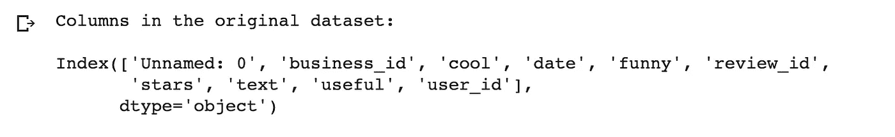
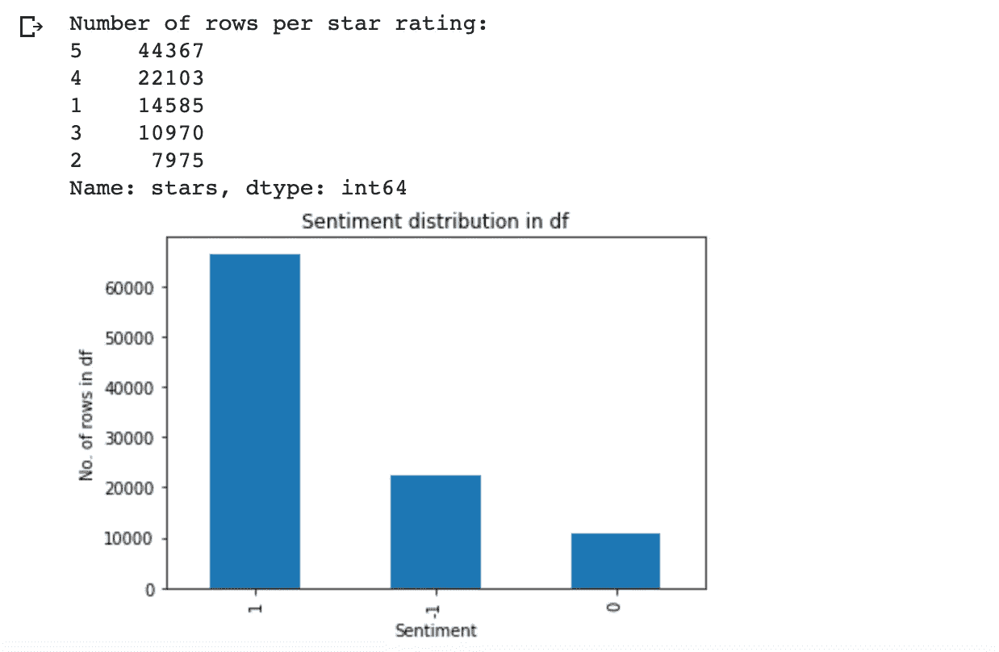
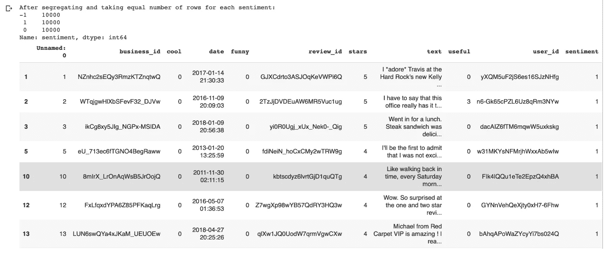
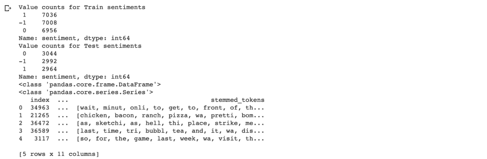
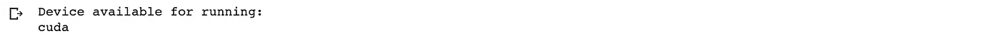
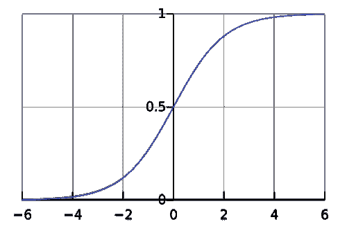
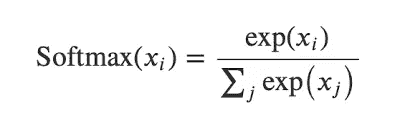
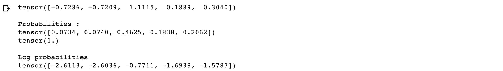

# PyTorch 中基于逻辑回归的情感分类

> 原文：<https://towardsdatascience.com/sentiment-classification-using-logistic-regression-in-pytorch-e0c43de9eb66?source=collection_archive---------25----------------------->

在 PyTorch 中实现逻辑回归，用于 Yelp 餐馆评论数据上的情感分类，其中输入特征是单词包(BOW)

由[迪皮卡·巴德](https://medium.com/u/cb4f6856d71b?source=post_page-----e0c43de9eb66--------------------------------)在 PyTorch 中使用逻辑回归进行情感分类

将评论数据分类为不同情感的逻辑回归将在深度学习框架 PyTorch 中实现。这是为了熟悉 PyTorch 框架的基本功能，比如如何定义神经网络？以及如何在 PyTorch 中调优模型的超参数？将在这篇文章中讨论。在我之前的帖子中，决策树分类器与不同输入特征(如 [BOW](https://medium.com/swlh/sentiment-classification-with-bow-202c53dac154) 、 [TF-IDF](https://medium.com/@dipikabaad/sentiment-classification-for-restaurant-reviews-using-tf-idf-42f707bfe44d) 、 [Word2Vec](https://medium.com/swlh/sentiment-classification-using-word-embeddings-word2vec-aedf28fbb8ca) 和 [Doc2Vec](https://medium.com/swlh/sentiment-classification-for-reviews-using-doc2vec-660ba594c336) )的比较将在最后进行。

在那些帖子中，我已经讨论了预处理文本和加载数据的主题。这将类似于那些职位。让我们从加载数据开始。

由[迪皮卡·巴德](https://medium.com/u/cb4f6856d71b?source=post_page-----e0c43de9eb66--------------------------------)提供的按情感分类的餐馆评论示例

# 加载数据

Yelp 餐馆评论[数据集](https://www.yelp.com/dataset)可以从他们的网站下载，那里的数据格式是 JSON。提供的数据实际上不是 python 可读的正确 json 格式。每一行都是 dictionary，但是为了使它成为有效的 json 格式，应该在文件的开头和结尾加上方括号，并在每一行的末尾添加`,`。将`INPUT_FOLDER`定义为 yelp review.json 文件所在的本地目录中的文件夹路径。将`OUTPUT_FOLDER`声明为一个路径，您希望在该路径中写入以下函数的输出。json 数据的加载和前 100，000 行的写入在下面的函数中完成:

一旦运行了上面的函数，您就可以为接下来的步骤将它加载到 pandas dataframe 中了。对于这个实验，只取了少量的数据，这样就可以更快地运行以查看结果。

# 探索数据

在加载数据之后，创建用于情感指示的新列。原始数据集中并不总是存在带有您想要的预测标签的某个列。在大多数情况下，这可以是一个派生列。对于这种情况，数据中的`stars`列用于导出情绪。

**输出:**

在数据可用之后，完成从星星到情绪的映射，并绘制每个情绪的分布。

**输出:**

完成后，检查每个情感的行数。情感类别如下:

1.  阳性:1
2.  负数:-1
3.  中性:0

这三种情绪的行数分布不均匀。在这篇文章中，不平衡类的问题将不会被处理，这就是为什么，简单的函数检索每个情绪的前几个记录被写。在本例中，`top_n`是 10000，这意味着将获取总共 30，000 条记录。

**输出:**

# 如何对文本数据进行预处理？

预处理包括许多步骤，如标记化、去除停用词、词干化/词条化等。这些常用的技巧在我之前的弓的[帖子里有详细的讲解。这里，下一阶段只解释必要的步骤。](https://medium.com/swlh/sentiment-classification-with-bow-202c53dac154)

为什么需要对这段文字进行预处理？—并非所有信息都对预测或分类有用。减少字数将减少模型的输入维度。这种语言的书写方式，包含了大量语法特有的信息。因此，当转换成数字格式，像大写，标点符号，后缀/前缀等字的具体特征。都是多余的。以相似单词映射到单个单词的方式清理数据，并从文本中删除语法相关信息，可以极大地减少词汇量。应用哪种方法和跳过哪种方法取决于手头的问题。

# 1.停用词的删除

停用词是在不同的自然语言处理(NLP)任务中作为前置步骤经常使用并从句子中移除的词。停用词的例子有:a、an、the、this、not 等。每个工具都使用一组稍微不同的停用词列表，但是在短语结构很重要的情况下，比如在情感分析的情况下，就避免使用这种技术。

移除停用字词的示例:

**输出:**

从输出中可以看出，删除停用词就删除了获取情感所需的必要词，有时它可以完全改变句子的意思。在上面这段代码打印的例子中，很明显，它可以将否定句转换成肯定句。因此，对于情感分类来说，这个步骤被跳过。

# 2.标记化

标记化是将句子/文本分割成称为标记的单词阵列的过程。这有助于分别对每个单词进行转换，也是将单词转换为数字所必需的。执行标记化有不同的方式。我已经在我的[上一篇文章](https://medium.com/@dipikabaad/sentiment-classification-with-bow-202c53dac154)的标记化部分解释了这些方法，所以如果你感兴趣的话可以去看看。

Gensim 的`[simple_preprocess](https://radimrehurek.com/gensim/utils.html)`允许你将文本转换成小写，并删除标点符号。它还有`min`和`max`长度参数，这有助于过滤掉那些长度范围内的罕见单词和最常见的单词。

这里，`simple_preprocess`用于获取数据帧的标记，因为它已经为我们做了大部分预处理。让我们应用此方法来获取数据帧的令牌:

**输出:**

# **3。词干**

词干处理将单词还原为其“词根”。不同于使用语法规则和字典将单词映射到词根形式的词干化，词干化只是删除后缀/前缀。词干分析广泛用于 SEOs、Web 搜索结果和信息检索的应用中，因为只要词根在文本的某个地方匹配，它就有助于检索搜索中的所有相关文档。

有不同的算法用来做词干分析。PorterStammer(1979)、LancasterStammer (1990)和 SnowballStemmer(可以添加自定义规则)。NLTK 或 Gensim 包可用于实现这些词干提取算法。兰开斯特比波特慢一点，所以我们可以根据大小和所需的响应时间来使用它。Snowball stemmer 是 Porter stemmer 的略微改进版本，通常比后者更受欢迎。不太清楚哪种方法会产生准确的结果，因此必须试验不同的方法，并选择给出更好结果的方法。在这个例子中，波特斯特梅尔被用来简单和快速。以下代码显示了如何在数据帧上实现词干，并创建新列`stemmed_tokens`:

**输出:**

# 分成训练集和测试集:

训练数据将用于训练模型，测试数据是模型预测分类的数据，它将与原始标签进行比较，以检查准确性或其他模型测试指标。

*   训练数据(用于训练 ML 模型的数据子集)~70%
*   测试数据(用于测试从训练数据训练的 ML 模型的数据子集)~30%

尽量平衡两个集合中的类数，使结果不偏不倚或者成为模型训练不足的原因之一。这是机器学习模型的关键部分。在现实世界的问题中，存在不平衡类的情况，需要使用像过采样少数类、欠采样多数类([scikit-learn 包](https://scikit-learn.org/stable/modules/generated/sklearn.utils.resample.html)中的重采样函数)或使用 Imblearn 包中的 [SMOTE 功能生成合成样本等技术。](https://imbalanced-learn.readthedocs.io/en/stable/over_sampling.html#smote-variants)

在这种情况下，数据分为两部分，训练和测试，70%在训练中，30%在测试中。在进行拆分时，最好在训练和测试数据中平均分布类别。这里使用了 scikit-learn 包中的函数 [train_test_split](https://scikit-learn.org/stable/modules/generated/sklearn.model_selection.train_test_split.html) 。

**输出:**

从上面的输出可以看出，数据是按比例分配给每个类的。打印训练和测试中每个情感的行数。

# PyTorch 入门

[PyTorch](https://pytorch.org/get-started/locally/) 是一个开源的机器学习库，用于计算机视觉和自然语言处理，基于 Torch 库。PyTorch 的主要特点是使用 GPU 和深度神经网络进行张量计算。张量被定义为`torch.tensor`它们是像 Numpy 数组一样的多维数字数组，但是能够在 GPU 上运行。你可以从[这里](https://pytorch.org/tutorials/beginner/former_torchies/tensor_tutorial.html)通过简单的教程，熟悉不同[类型的张量](https://pytorch.org/docs/stable/tensors.html)。

## PyTorch 中深度学习的构建模块

1.  **亲笔签名** PyTorch 使用了一种叫做自动微分的方法。在神经网络中，您需要计算梯度，这样可以节省操作次数，因为它会记录完成的操作，并重放这些操作来计算梯度。
2.  **Optim** 要使用`torch.optim`，我们必须使用构造优化器对象。这通常需要包含需要优化的模型参数和优化相关参数(如学习速率、权重衰减等)的 iterable。
3.  **nn** 神经网络可以使用`torch.nn`构建。一个`nn.Module`包含层和一个返回输出的方法 forward(input)。

下面的代码显示了需要包含的主库以及如何识别当前设备。加载张量和进行计算的位置由神经网络层中使用的不同函数中的`device`参数决定。我已经使用 google colab 进行了实验，并在硬件加速器中设置了运行时 GPU，这就是为什么我可以看到`torch.cuda.is_available`在我的情况下是正确的。

**输出:**

我不会详细讨论神经网络是如何工作的，因为这不是这篇文章的主题。为了获得了解培训过程所需的基本信息，您可以在这里阅读[。](https://pytorch.org/tutorials/beginner/blitz/neural_networks_tutorial.html)

## 神经网络中使用的不同函数

通常在获得标注预测的输出图层上，softmax 函数与`F.softmax`一起使用。其他功能通过`torch.nn.functional`可用。目标函数是您的网络被训练以最小化的函数，在这种情况下称为损失函数或成本函数。在神经网络通过训练实例的每次迭代结束时计算损失。它们通过`nn`用于例如`nn.NLLLoss()`。为了优化网络，不同的算法，如 SGD，Adam 和 RMSProp 等。被使用。例如，要使用 SGD，您需要初始化`optim.SGD`。然后在初始化对象上的`step()`函数是在网络上完成优化的地方。

下面我们来深入探讨一下如何构建神经网络！我们将通过建立一个进行逻辑回归的基本网络来了解这一点。

# 生成输入和标签张量

第一步是要有函数，可以创建输入张量和相应标签，即输出张量，输入到网络进行训练。对于逻辑回归，我们将使用 BOW 向量作为输入，它只不过是语料库中词汇大小的数组，值是语料库中单词的频率，索引是单词的唯一 id。我们将从使用 Gensim 包的`corpora.Dictionary`构建的字典中获得唯一的 id。这类似于我在 BOW post 中所做的，但我添加了另一个名为 padding 的参数，它将用于其他任务，如 CNN，其中您希望对文档中的每个单词使用单词嵌入。对于此示例，填充被关闭。

之后，你就可以创建弓矢量函数了，如下所示。Vocab 大小为`30056`。您可以看到我在创建张量时是如何分配设备的:

为了创建输出张量，必须完成标签到正值的映射。目前我们用-1 表示阴性，这在神经网络中是不可能的。输出层中的三个神经元将给出每个标签的概率，因此我们只需要映射到正数。功能如下:

# 使用 BOW 的逻辑回归

使用 Softmax (s [rc](https://www.quora.com/How-does-softmax-function-work-in-AI-field) 的逻辑回归函数示例

逻辑回归是一种回归模型，但当对每一类的预测概率使用阈值时，可用于分类问题。它使用 Sigmoid 函数或 Softmax 函数来获得类的概率。Softmax 函数通常用于多类分类的情况。标签节点的最高概率将被选为该输入的预测类标签。Softmax 取输入向量 i = 1，2，..，K，并输出由与输入数的指数成比例的 *K* 个概率组成的概率分布。输出大小相同，值在范围(0，1)内，它们的总和都是 1。每个元素 *Xi* 被应用到 softmax，j 从 1 到 k。它如何工作的例子如下所示。

Softmax 公式(s [rc](https://mc.ai/softmax-function-beyond-the-basics/)

**输出:**

## 逻辑回归的架构:

*   输入将与字典中的词汇大小相同
*   输出大小将与标签数量相同
*   正向函数将首先运行线性图层，然后计算值的 Log softmax。
*   SGD 优化器通常用于逻辑回归，因此在这里也以适当的学习速率使用。

首先让我们通过创建一个继承`nn.Module`的类来定义神经网络。`forward`功能被覆盖，以告诉网络如何向前传球。

让我们初始化模型对象，使用负对数似然损失函数和 SGD 进行优化的损失函数。对于损失，通常使用交叉熵损失函数，在这种情况下，您不需要单独计算 Log Softmax。这里我们分开使用它，这样你可以了解每个步骤的组成部分，以及如何在其他情况下实现或改变它们，如二进制分类。

终于我们准备好训练模型了！:)

# 训练逻辑回归模型

下面的代码将在 epochs 设置为 100 的训练数据上训练模型。

**输出:**

# 测试模型

一旦模型准备好了，我们现在就可以测试它。为了比较这些数字，我把张量带回了 cpu。我们将使用用于获取测试数据集上的输入张量的相同函数。

**输出:**

分类报告显示平均准确度为`0.70`。与用于训练的数据量相比，这是一个相当好的结果。可以对预测的概率值使用`torch.argmax`函数来获得标签。正面和负面情绪的准确性优于中性，这是有意义的，因为与正面和负面情绪中的常用词相比，很难区分中性评论。在上面的结果中，`0`和`1`分别代表负和正。

这种准确性优于我在以前的帖子中实现的方法，其中使用决策树分类器基于 BOW、TF-IDF、Word2Vec 和 Doc2Vec 向量作为输入进行分类。这表明，实现简单逻辑回归的神经网络可以更好地执行针对多个时期训练的简单 BOW 向量。它可以更好地提取词语和情感之间的关系并进行分类。本教程介绍 PyTorch 以及如何用它构建简单的分类器。

所以现在你可以很容易地用这种方法对你自己的数据集进行实验！我希望这有助于您理解如何使用 PyTorch 构建神经网络模型来对餐馆评论数据进行情感分析。请随意扩展这段代码！这适用于存在多个类别的任何其他文本分类问题。如果我可以考虑改进这个模型，我会使用不同的学习速率、时期，并尝试使用不同的输入类型，而不仅仅是弓。可以试试 TFIDF，Word2Vec，Doc2Vec 等。看看你会得到什么结果。预处理可以改为使用词汇化或其他词干算法来查看结果如何变化。

一如既往—愉快的实验和学习:)