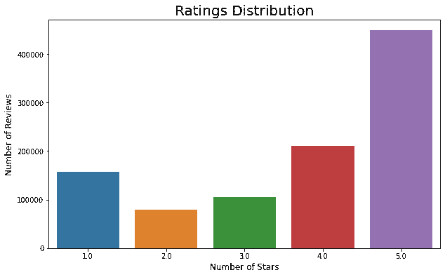
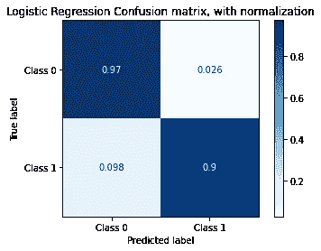
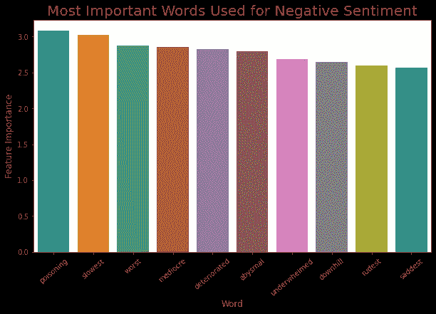
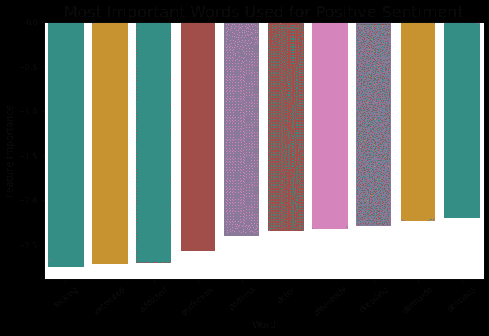
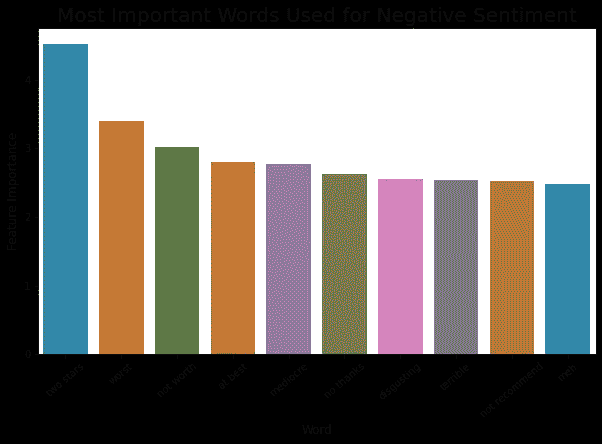
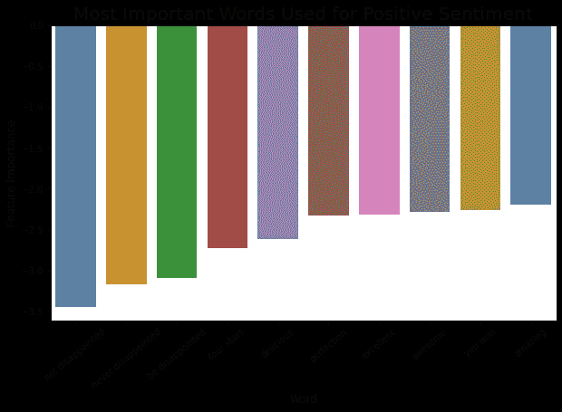

# 基于逻辑回归的情感分类 Yelp 评论分析

> 原文：<https://towardsdatascience.com/sentiment-classification-with-logistic-regression-analyzing-yelp-reviews-3981678c3b44?source=collection_archive---------14----------------------->


柴坦尼亚·皮拉拉在 [Unsplash](https://unsplash.com?utm_source=medium&utm_medium=referral) 上的照片

几周前你刚开了自己的公司。

你想了解顾客对你的产品和服务的感受，所以你去了社交媒体平台(推特、脸书等)。)来看看人家都说了些什么。

哇哦。好像已经有几千条关于你的生意的帖子了。你很兴奋，但是你很快意识到自己一个人读完所有的书是不可行的。

你开始怀疑:有没有办法从文本信息中提取客户的情绪？

# 古玩目录

1.  [为什么情感分析很重要？](#d046)
2.  [什么是逻辑回归？](#c3b8)
3.  [我们应该使用哪些指标来评估模型？](#e4b4)
4.  [模型如何理解文本输入？](#0c67)
5.  [我们如何知道哪些文本特征是重要的？](#1575)
6.  我们能进一步改进我们的模型吗？
7.  [接下来我们能做什么？](#7cf1)

# **动机**

情感分析是一种非常有效的工具，不仅可以让企业了解整体品牌认知，还可以评估客户对特定产品线或服务的态度和情感[1]。

这种数据驱动的方法可以帮助企业更好地了解客户，发现他们观点的微妙变化，以满足不断变化的需求。

# 概观

这篇文章是我探索 Yelp 数据集的第二部分。有关数据集的更多信息，以及对其**业务**数据和**提示**数据的一些探索性数据分析，请参见我下面的帖子:

[](/discover-your-next-favorite-restaurant-exploration-and-visualization-on-yelps-dataset-157d9799123c) [## 发现你下一个最喜欢的餐馆 Yelp 数据集上的探索和可视化

### 你用 Yelp 找好餐馆吗？这篇文章揭示了流行的 Yelp 数据集中的见解和模式。

towardsdatascience.com](/discover-your-next-favorite-restaurant-exploration-and-visualization-on-yelps-dataset-157d9799123c) 

这篇文章主要关注 Yelp 数据集中的 **review.json** 文件，它包含了 Yelp 用户写的评论。此外，每个评论都包括一个相应的“星级”，或用户对企业的评级，可以作为情绪的代理。目标是建立一个模型，在给定文本数据的情况下，可以对评论的情绪进行分类(正面或负面)。此外，我们感兴趣的是哪些文本特征是对该分类任务最有帮助的预测器。

**逻辑回归**

一般来说，有两种不同类型的分类模型:**生成式**模型(朴素贝叶斯、隐马尔可夫模型等。)和**判别型**模型(Logistic 回归、SVM 等)。).最终，两个模型都试图计算 p(类|要素)或 p(y|x)。关键区别在于，生成模型试图首先对联合概率分布 p(x，y)建模，然后使用 **Baye 定理**计算条件概率 p(y|x)，而判别模型直接对 p(y|x)建模。关于这两种模型之间的比较的详细讨论，参见吴恩达的论文[这里](http://ai.stanford.edu/~ang/papers/nips01-discriminativegenerative.pdf)。

在这篇文章中，我将检验一个流行的判别模型——逻辑回归。关于它的数学基础(sigmoid 函数、成本函数、决策边界等)的更多细节，见[这篇文章](/logistic-regression-detailed-overview-46c4da4303bc)。).

要查看我的完整 Python 代码，请查看我的 [Kaggle 内核](https://www.kaggle.com/dehaozhang/sentiment-analysis-with-lr)或我的 [Github 页面](https://github.com/terryz1/Yelp_Sentiment_Analysis)。现在让我们开始吧！

**偷看评论**

让我们从评论数据集中取出**1**26】百万条记录来进行分析。“文本”列将是我们的模型输入。让我们来看看一个有积极情绪的随机评论(评分为 5.0):

```
"I love Deagan's. I do. I really do. The atmosphere is cozy and festive. The shrimp tacos and house fries are my standbys. The fries are sometimes good and sometimes great, and the spicy dipping sauce they come with is to die for. The beer list is amazing and the cocktails are great. The prices are mid-level, so it's not a cheap dive you can go to every week, but rather a treat when you do. Try it out. You won't be disappointed!"
```

当我们考虑特征提取时，这里的几个线索可以帮助我们推断这是积极的情绪，如“爱”、“舒适”、“为...而死”、“令人惊叹”和“不会失望”。

让我们看一个负面评价(评分 1.0):

```
"If I could give less than one star, that would have been my choice.  I rent a home and Per my lease agreement it is MY responsibility to pay their Pool Service company.  Within the last year they changed to PoolServ.  I have had  major issues with new techs every week, never checking PH balances, cleaning the filter, and not showing up at all 2 weeks in the past 2 months. I have had 4 different techs in the past 4 weeks.   I have emailed and called them and they never respond back nor even acknowledged my concerns or requests.  I cannot change companies but I'm required to still pay for lousy or no service.  Attached are a couple pictures of my pool recently due to one tech just didn't put any chlorine in it at all according to the tech who came the following week to attempt to clean it up.  Please think twice before working with these people.  No one wants to work with a business that doesn't return phone calls or emails."
```

尽管它很长，但我们仍然可以看到诸如“不到一星”、“糟糕”、“从不回复”、“没有服务”等线索是有用的预测因素。

让我们快速确认数据中没有缺失值:

```
text     0.0
stars    0.0
dtype: float64
```

**将评分转化为积极和消极情绪**

让我们绘制收视率分布图:



我们可以看到，在 100 万条评论中，几乎有一半包含 5.0 的评级。

在这个任务中，我们希望将所有的评论文本分为两类:积极情绪和消极情绪。因此，我们首先需要将“星星”值转换成两个类别。在这里，我们可以将‘4.0’和‘5.0’视为正面情绪，将‘1.0’和‘2.0’视为负面情绪。我们可以将“3.0”视为中性，甚至将每个明星视为其自己的情感类别，这将使其成为一个多类分类问题。但是，为了简单的二进制分类，我们可以将带有“3.0”的排除在外。

然后，我们将积极情绪编码为 0 类，消极情绪编码为 1 类。因为我们知道类 0 中的样本比类 1 中的样本多，所以我们的基线模型可以是简单地将每个评论标记为类 0 的模型。让我们检查一下基线精度:

```
0.74
```

在我们继续之前，让我们花点时间了解一下评估指标。

**评估指标**

Jason Brownlee 在他的一篇文章中说，“分类器的好坏取决于用来评估它的度量标准”[2]。

在每个分类问题中，准确性可能不是合适的评估标准，特别是当类别分布不平衡时，以及当假阳性和假阴性的业务影响不相等时。例如，在信用卡欺诈检测问题中，预测每个交易是非欺诈的基线模型将具有超过 99.99%的准确度，但这并不意味着它是合适的模型，因为假阴性的百分比将是 100%，并且与假阳性相比，每个假阴性(未检测到欺诈交易)对企业和客户来说可能具有高得多的成本。

在此任务中，以下是一些合适的评估指标:

1.  **精度** — TP/(TP+FP)，意思是模型归类为阳性的点实际上是阳性的比例。
2.  **回忆** — TP/(TP+FN)，意思是被模型正确分类的实际阳性的比例。
3.  **F1 得分**—精确度和召回率的调和平均值。

查看[这篇文章](/beyond-accuracy-precision-and-recall-3da06bea9f6c)，了解关于这些指标的更多详细讨论。

在此任务中，我们将使用测试集上的 **F1 分数作为关键评估指标。**

**列车测试分割**

让我们留出 30%的数据作为测试集，按类标签分层。

```
train, test = train_test_split(df_reviews, test_size = 0.3, stratify = df_reviews['labels'], random_state = 42)
```

**文本预处理**

在大多数文本挖掘或 NLP 相关的任务中，清理文本是至关重要的一步。让我们首先删除所有非字母字符，标点符号，并确保所有字母都是小写字母。稍后我们还将评估移除停用词和词干化/词条化的效果。

**矢量化**

为了让模型能够处理文本输入，我们需要将它们转换成向量。有几种不同的方法来表示这些文本特征，下面是最常见的几种:二进制，例如，单词“good”是否存在。2.计数，例如“好”这个词在这篇综述中出现了多少次，类似于朴素贝叶斯中的单词袋模型。3.TF-IDF，这是与文档相关的每个文本特征的加权重要性(在此阅读更多)。

让我们首先尝试使用所有单字的二进制表示。

```
cv= CountVectorizer(binary=True, analyzer = text_prep, min_df = 10, max_df = 0.95)
cv.fit_transform(train['text'].values)
train_feature_set=cv.transform(train['text'].values)
test_feature_set=cv.transform(test['text'].values)
```

我使用了 sklearn 的 CountVectorizer 对象来提取所有的单词特征，如果这个单词出现在少于 10 条评论或超过 95%的评论中，就会被排除。

让我们检查一下我们的字典里有多少独特的单词:

```
train_feature_set.shape[1]
--------------------------------------------------------------------
40245
```

大约有 40K 个独特的单词。例如，让我们检查单词“tasty”的索引:

```
cv.vocabulary_['tasty']
--------------------------------------------------------------------
35283
```

**适合 LR 车型**

现在，我们准备使用 sklearn 拟合我们的第一个逻辑回归模型:

```
lr = LogisticRegression(solver = 'liblinear', random_state = 42, max_iter=1000)
lr.fit(train_feature_set,y_train)
y_pred = lr.predict(test_feature_set)
print("Accuracy: ",round(metrics.accuracy_score(y_test,y_pred),3))
print("F1: ",round(metrics.f1_score(y_test, y_pred),3))
--------------------------------------------------------------------
Accuracy:  0.955
F1:  0.914
```

让我们绘制一个混淆矩阵来可视化预测结果:



**可视化特征重要性**

逻辑回归的一个好处是，我们可以很容易地找到每个特征的重要性。让我们想象一下与消极情绪最相关的前 10 个词:



这些话在我们的预料之中。让我们检查所有包含“中毒”一词的评论，看看有多少属于负面情绪类别:

```
0.904
```

同样，让我们来看看积极情绪的前 10 个相关词:



注意，高肯定特征重要性与类 1 的高可能性相关，低否定(高绝对值)特征重要性与类 0 的高可能性相关。

在检查了积极的评论后，我意识到“对接”这个词在顶部，因为大多数给“4.0”星的评论都提到“我对接一颗星是因为……”。

**改进策略**

在我们建立了第一个模型之后，让我们检查几个想法，看看我们的模型是否可以进一步改进。

> 想法 1:降低概率截止阈值

为了减少假阴性，一种直觉是降低截止阈值(默认为 0.5)。这将提高召回率，但也会降低准确率。因此，我们需要检查这是否会提高 F1 的整体得分:

```
******** For i = 0.3 ******
F1: 0.91

******** For i = 0.4 ******
F1: 0.915

******** For i = 0.45 ******
F1: 0.915

******** For i = 0.5 ******
F1: 0.914
```

我们可以看到，F1 分数对该阈值的变化相对稳健。

> 想法 2:过采样类别 1 或欠采样类别 0

过采样少数类和欠采样多数类是处理不平衡分类的常用方法(此处[阅读更多](https://machinelearningmastery.com/random-oversampling-and-undersampling-for-imbalanced-classification/))。然而，在这种情况下，F1 分数并没有提高。

过采样等级 1 的性能:

```
Accuracy:  0.95
F1:  0.908
```

欠采样等级 0 的性能:

```
Accuracy:  0.947
F1:  0.904
```

> 想法 3:去掉停用词和词干

去除停用词和词干可以去除噪音，从而减少词汇量。然而，准确度和 F1 分数**都略微降低**。

```
Accuracy:  0.949
F1:  0.902
```

> 想法 4:用 TF-IDF 代替二进制表示

这一次，F1 分数略有增加，但增幅不大。

```
Accuracy:  0.958
F1:  0.919
```

> 想法 5:将单词和双词作为特征包含进来

动机可以用这个例子来说明:

以我们最初开发的 LR 模型为例，然后在这篇评论中预测——“我不喜欢食物或服务”:

```
test_review = cv.transform(["I did not enjoy the food or the service"])
lr.predict_proba(test_review)
--------------------------------------------------------------------
array([[0.50069323, 0.49930677]])
```

该模型认为这一评论是积极的，因为该模型只接受与积极情绪相关联的单词，如“enjoy”，而不考虑否定“enjoy”含义的“did not”。

在我们把单词和双词(两个单词的序列)都考虑进去之后，我们首先看到词汇量的增加:

```
488683
```

拟合该模型后，我们看到两个指标都有所改善，尤其是 F1 得分。

```
Accuracy:  0.969
F1:  0.942
```

让我们再次检查它对同一个句子的预测:

```
test_review = cv.transform(["I did not enjoy the food or the service"])
lr.predict_proba(test_review)
--------------------------------------------------------------------
array([[0.2678198, 0.7321802]])
```

现在，它以相对较高的可信度做出正确的预测。

我们可以再次看到正面和负面情绪的 10 大新特征:



我们开始看到诸如“两颗星”、“不值得”、“不谢谢”、“不推荐”之类的二元词出现在热门功能中。



请注意,“失望”可能看起来是一种消极的情绪，但这可能是因为它是“不要失望”短语的一部分。

我们应该包括三元模型(三个单词的序列)或者更高阶的 N 元模型吗？请注意，随着我们包含越来越高阶的 N 元文法，我们的特征大小变得越来越大，这消耗了更多的内存空间，并且还存在极度稀疏的问题(在此阅读更多)。

# 后续步骤

以下是对后续步骤的一些想法:

1.  LR 模型中有几个超参数我们可以调整，调整它们可以得到更优化的模型。此外，为了避免过度拟合，尝试交叉验证以获得每个模型更准确的指标(点击这里查看 grid search)。
2.  将“3.0”视为中性，或将每个类别视为其自己的类别，并重新制定这些模型。
3.  建立一个交互式情感分析器，允许用户输入评论，并给出对其情感的预测。具有增量学习的内置功能，用户可以帮助模型在做出错误预测时进行学习。

# 摘要

让我们回顾一下。

我们使用逻辑回归建立了一个情感分类模型，并尝试了不同的策略来改进这个简单的模型。在这些想法中，包含二元模型作为特征对 F1 分数的提高最大。对于简单模型和改进模型，我们还分析了其最重要的文本特征。

我希望你喜欢这篇文章，并请分享你的想法:)

DS/ML 初学者？查看我的另一篇关于如何使用经典 Iris 数据集构建第一个 Python 分类器的帖子:

[](/exploring-classifiers-with-python-scikit-learn-iris-dataset-2bcb490d2e1b) [## 使用 Python Scikit-learn-Iris 数据集探索分类器

### 如何用 Python 构建第一个分类器的分步指南。

towardsdatascience.com](/exploring-classifiers-with-python-scikit-learn-iris-dataset-2bcb490d2e1b) 

# 参考

[1][http://copper Taurus . com/insights/opinion-analysis-Product-management/#:~:text = Product % 20 reviews % 20 provide % 20 opinion % 20 analysis，successive % 20 refinement % 20 of % 20 their % 20 offering。](http://coppertaurus.com/insights/sentiment-analysis-product-management/#:~:text=Product%20reviews%20provide%20sentiment%20analysis,subsequent%20refinement%20of%20their%20offering.)【2】[https://machine learning mastery . com/tour-of-evaluation-metrics-for-unbalanced-class ification/](https://machinelearningmastery.com/tour-of-evaluation-metrics-for-imbalanced-classification/)