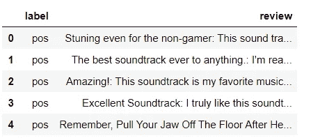
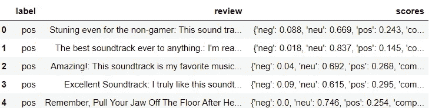
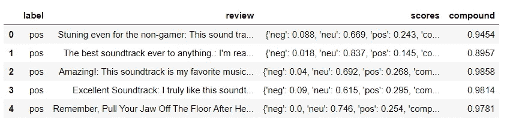
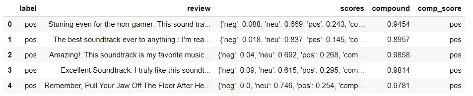

# 使用 VADER 的情感分析

> 原文：<https://towardsdatascience.com/sentimental-analysis-using-vader-a3415fef7664?source=collection_archive---------1----------------------->

## 情绪的解释和分类

情感分析是一种文本分析方法，它检测文本中的极性(例如，正面*意见*或负面*意见*，无论是整个文档、段落、句子还是子句。

情感分析旨在基于文本中主观性的计算处理来测量说话者/作者的态度、情感、评价、态度和情绪。


来源:MonkeyLearn，图片链接:【https://bit.ly/2X806dW 

# 为什么情感分析很难执行？

尽管理论上看起来很容易，但情绪分析是一个棘手的问题。一个文本可以同时包含多种情感。举个例子，

*“演技不错，但电影本来可以更好”*

上面这句话包含了两个极性！！！

# **VADER**

VADER(用于情感推理的效价感知词典)是用于文本情感分析的模型，其对情感的极性(积极/消极)和强度(强度)都敏感。它在 NLTK 包中提供，可以直接应用于未标记的文本数据。

VADER 情感分析依赖于一个字典，该字典将词汇特征映射到情感强度，即情感得分。文本的情感得分可以通过对文本中每个词的强度求和得到。

例如，像*、【爱】、【享受】、【快乐】、【喜欢】这些词都传达了一种积极的情绪。VADER 也足够聪明，能够理解这些词的基本语境，比如*“不爱”*作为否定陈述。也理解大写和标点符号的侧重点，比如*“享受”**

# 极性分类

我们不会试图确定一个句子是客观的还是主观的，是事实还是观点。相反，我们只关心文本是否表达了积极的、消极的或中立的 T21 观点。

# 文档级范围

我们还会尝试将一个文档或段落中的所有句子聚合在一起，得出一个整体观点。

# 粗略分析

我们不会尝试进行精细的分析来确定积极/消极的程度。也就是说，我们并不试图猜测一个评论者给了多少颗星，只是想知道这个评论是正面的还是负面的。

# 主要步骤:

*   首先，考虑被分析的文本。一个基于整段评论的模型可能是无效的。确保为手头的任务使用合适的模型。
*   接下来，决定要执行的分析类型。一些基本的情感分析模型更进一步，考虑两个词的组合，或*二元模型*。我们将学习完整的句子，为此我们将导入一个名为 *VADER* 的经过训练的 NLTK 词典。

# 要使用的数据集

对于这个模型，您可以使用各种数据集，如亚马逊评论、电影评论或任何产品的任何其他评论。

```
**import** **nltk**
nltk.download('vader_lexicon')**from** **nltk.sentiment.vader** **import** SentimentIntensityAnalyzer

sid = SentimentIntensityAnalyzer()
```

VADER 的`SentimentIntensityAnalyzer()`接受一个字符串，并返回四个类别的得分字典:

*   否定的；消极的；负面的；负的
*   中立的
*   积极的
*   复合值*(通过对上述*的分数进行归一化计算)

让我们通过情感分析仪来分析一些随机陈述

```
a = 'This was a good movie.'
sid.polarity_scores(a)OUTPUT-{'neg': 0.0, 'neu': 0.508, 'pos': 0.492, 'compound': 0.4404}a = 'This was the best, most awesome movie EVER MADE!!!'
sid.polarity_scores(a)OUTPUT-{'neg': 0.0, 'neu': 0.425, 'pos': 0.575, 'compound': 0.8877}
```

# 使用 VADER 分析评论

```
**import** **numpy** **as** **np**
**import** **pandas** **as** **pd**

df = pd.read_csv('../TextFiles/reviews.tsv', sep='**\t**')
df.head()
```



```
df['label'].value_counts() OUTPUT-neg    5097
pos    4903
Name: label, dtype: int64
```

# 清理数据(可选)

这一步是为了清除评论中的任何空白。

```
*# REMOVE NaN VALUES AND EMPTY STRINGS:*
df.dropna(inplace=**True**)

blanks = []  *# start with an empty list*

**for** i,lb,rv **in** df.itertuples():  
    **if** type(rv)==str:            
        **if** rv.isspace():        
            blanks.append(i)     

df.drop(blanks, inplace=**True**)
```

# 向数据帧添加分数和标签

现在，我们将向原始数据帧添加列，以存储 polarity_score 字典、提取的复合得分以及从复合得分派生的新“正/负”标签。我们将使用这最后一列来执行准确性测试。这种方法中的评论将被分为负面、正面和中性比率。

```
df['sc ores'] = df['review'].apply(**lambda** review: sid.polarity_scores(review))

df.head()
```



现在会将化合物作为单独的列，所有大于零的值都将被视为正面评价，所有小于零的值都将被视为负面评价。

```
df['compound']  = df['scores'].apply(**lambda** score_dict: score_dict['compound'])

df.head()
```



```
df['comp_score'] = df['compound'].apply(**lambda** c: 'pos' **if** c >=0 **else** 'neg')

df.head()
```



所以现在我们有了一个完整的分析，无论是正面的还是负面的。

现在让我们通过一些新的评论来测试我们的模型表现如何！

```
*# Write a review as one continuous string (multiple sentences are ok)*
review = 'The shoes I brought were amazing.' # Obtain the sid scores for your review
sid.polarity_scores(review)OUTPUT-
{'neg': 0.0, 'neu': 0.513, 'pos': 0.487, 'compound': 0.5859}review='The mobile phone I bought was the WORST and very BAD'# Obtain the sid scores for your review
sid.polarity_scores(review) OUTPUT-{'neg': 0.539, 'neu': 0.461, 'pos': 0.0, 'compound': -0.8849}
```

# 结论

VADER 分析的结果似乎不仅显著，而且非常令人鼓舞。结果显示了在网站中文本数据可能是一系列文本的复杂混合的情况下，通过利用 VADER 将获得的优势。

## 额外资源

我在《走向数据科学》杂志上发表了两篇关于这个博客相关主题的文章。为了更好地理解自然语言处理，请阅读这些文章

[词干 vs 词汇化——https://link.medium.com/JWpURpQjt6](https://link.medium.com/JWpURpQjt6)

词语向量和语义—[https://link.medium.com/tuVCswhYu6](https://link.medium.com/tuVCswhYu6)

# 这只是对什么是情绪分析以及 VADER 如何工作的一个小小的窥探。如有任何疑问和澄清，请随时回复本博客。