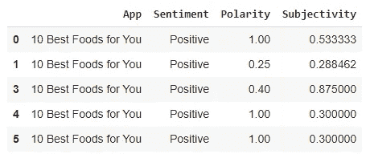
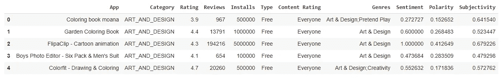
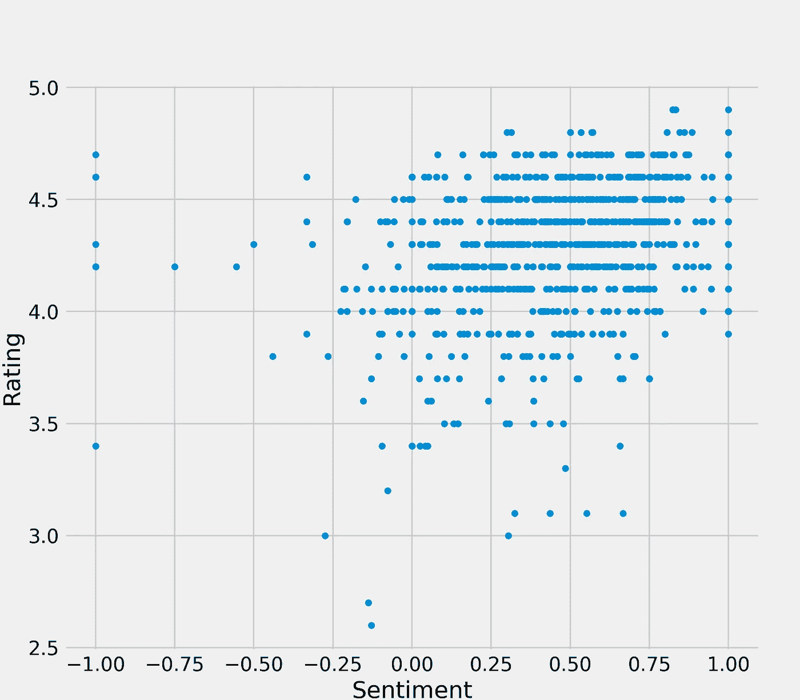
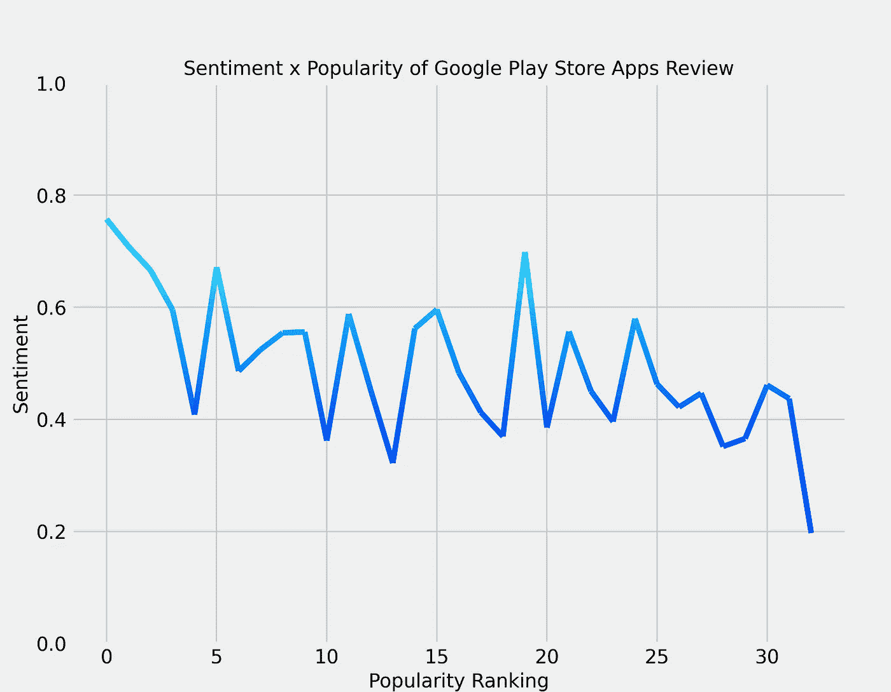

# 谷歌 Play 商店应用点评

> 原文：<https://towardsdatascience.com/sentiments-of-google-play-store-apps-reviews-13f9ee7246c6?source=collection_archive---------36----------------------->

## 基于评论者报告的情绪分析谷歌 Play 商店应用程序评论

## 关于这篇文章

他的文章在谷歌 Play 商店应用评估的背景下讨论了一个数据可视化项目的结果。T2 谷歌 Play 商店 T3 是世界上使用最多的数字分发服务之一，拥有大量的应用程序和用户。因此，有很多关于应用程序及其用户评价的数据可用。
该项目是作为巴西纳塔尔北里奥格朗德联邦大学 Metrópole Digital 学院的数据科学 I 课程的一部分征集的，用于练习课堂上所学的科目。

## 方法

在这个项目中，我们将在 [Kaggle](https://www.kaggle.com/) 中可用的[谷歌 Play 商店应用](https://www.kaggle.com/lava18/google-play-store-apps)数据集中搜索趋势。为此，我们将确定一些初始假设，并试图找到有助于巩固这些假设的信息。我们将使用 [Google Colab](https://colab.research.google.com/) 和 [Python](https://www.python.org/) 来完成这个项目。
这个项目使用的代码可以在[这个 GitHub 库](https://github.com/EmanuelArnaud/DataScience/tree/main/1FP%20%2302)中找到。

## 设置和下载数据

该项目中使用的软件包有:

*   **Google . Colab**:Google Colab 中的文件操作；
*   **Kaggle** :从 Kaggle 网站导入数据集；
*   熊猫:数据集操作；
*   **NumPy** :处理数学运算；
*   **Pyplot** :创建图形和表格。

代码 01:设置环境和下载数据。作者代码。

通过 Kaggle API，我们可以下载数据集。我们的主数据集包含谷歌 Play 商店可用应用程序的信息，还有一个包含应用程序评论信息的辅助数据集。

## 过滤评论

代码 02:过滤评论。作者代码。

表 01:过滤的评论数据集。图片作者。

reviews 数据集包含大量无效观察值。由于我们将使用数字数据，并且无法识别缺失数据的值，因此最好完全删除这些观察值。这个项目中不会用到“翻译评论”这一栏，所以我们也可以删除它。此外，可以优化列的名称。
每个应用程序都有多个评论，所以我们需要与它合作。

## 转换

正如我们在 unique 方法中看到的，情绪列假设了三个值:负面的、中性的和正面的。知道了这一点，我们可以应用李克特量表来评估这些信息的数值。
李克特量表是问卷中最常见的心理测量量表。它包括要求回答者在从负面到正面的范围内评价某事。
对于本项目，李克特量表为-1 表示负面，0 表示中性，1 表示正面。这样，当计算平均值时，我们得到一个介于-1 和 1 之间的数字，其中较高的值意味着更多的正面评价，较低的值意味着更多的负面评价，以及更接近零的中性。

代码 03:转换数据。作者代码。

## 组合和重新过滤

函数 merge 将完成几乎所有需要的工作。常见的一栏是 app 名称，是 reviews_mean 的索引。因为索引保留了“App”这个名称，所以该函数仍然可以访问它。默认的“内部”方法将只保留两个数据集中有值的观测值。
得到的数据集有 1229 个观测值，而 reviews_mean 有 865 个观测值。这意味着出于某种原因，我们的数据集中有多个外观的应用程序。删除重复将确保每个应用程序只有一个观察。

现在，我们将只选择所需的列，并将 Installs 列的值更改为 numeric。

代码 04:合并和重新过滤数据。作者代码。

表 02:过滤后的数据集。图片作者。

## 分析

首先，我们先建立一些初始假设。这些可能是在调查数据或初步猜测之前看起来合乎逻辑的事情。

1.  情绪影响 app 的最终评分；
2.  付费内容会有更好的评分；
3.  热门类别有更积极的情绪。

**人气和评分**

代码 05:创建直方图。作者代码。

让我们检查一下我们现在的数据。为此，我们希望看到情绪和评级的直方图。如果我们的假设是真的，如果情绪有很多高值，那么评级也会有很多高值，这意味着在我们的数据集中这两个变量之间有很高的相关性。

图 01:情绪和评级直方图。图片作者。

查看直方图，我们可以看到两列都有积极的趋势。在情绪方面，大多数值都高于中性值(0)，在-1 到 1 的范围内约为 0.5。但是对于评级栏来说，这种趋势看起来更加明显，在 0 到 5 的范围内，许多值都在 4 到 5 左右。

代码 06:计算中位数并绘制散点图。作者代码。

中间值有助于形象化。作为第二个资源，我们可以通过评级绘制一个情绪线图，并查看线条的行为。如果情绪影响了评级，我们可以预期接近直线上升。

图 02:情绪 x 评级散点图。图片作者。

**付费内容和评级**

首先，我们需要分离内容类型(免费和付费)。然后，我们可以得到每个类别的平均值。

代码 07:计算免费和付费内容的平均值。作者代码。

正如我们所见，付费内容的平均值略高于免费内容的平均值。但是这种差异似乎不足以支持我们的假设。此外，只有 9 个付费应用程序，这可能会误导由于低数量的观察信息。

**热门类别和人气**

代码 08:绘制渐变线。作者代码。

在我们的数据集中，我们有 Installs 列，包含应用程序被安装的次数，通过分组和排序，我们获得了类别的流行度排名。

让我们来看看人气排名中的情绪反应。我们将使用渐变线来帮助我们看到图形中的变化。

图 03:人气排名 x 人气的渐变线。图片作者。

**结果**

我们所有的三个假设都在分析部分被观察到了。由于我们只是试图看到数据的宏观状态来猜测关于它的事情，而没有使用任何真实的信息测试或推断，我们无法做出任何假设。尽管如此，这个项目的工作可以帮助创造一个更好的假设。

*   **假设 1** :直方图指出了情绪和评级之间的某种联系，但这可能是由于相似的因果关系，而不是由于这两个变量之间的相关性。之后创建的散点图没有添加任何新的信息，保持我们从直方图的猜测。
*   **假设 2** :由于付费类别的观察数量较少，该数据集不适合回答我们的假设。分析手段，两者并无显著差异。
*   **假设 3** :观察创建的图形，没有明确的信息可以获得。随着受欢迎程度等级降低，更高情感值的出现更少，这可能有助于我们最初的假设。

**下一个**

在未来的工作中，有许多可行的方法来继续这个项目。首先，有可能假设其他假设，并尝试像我们所做的那样将其可视化。
另一种可能是通过统计检验和方法来验证这里提出的假设。

最后，人们可以用推理的方法接近数据集，试图找到关于它的新信息。例如，卡方检验可以应用于这里使用的李克特量表。

**参考文献**

*   谷歌 Play 商店应用。
    [https://www.kaggle.com/lava18/google-play-store-apps](https://www.kaggle.com/lava18/google-play-store-apps)
    访问时间:2020 年 17 月 10 日。
*   Matplotlib。
    [https://matplotlib.org/contents](https://matplotlib.org/contents)
    访问时间:2020 年 10 月 20 日。
*   熊猫。
    [https://pandas.pydata.org/docs/](https://pandas.pydata.org/docs/)
    存取时间:2020 年 10 月 20 日。
*   NumPy。
    [https://numpy.org/doc/stable/](https://numpy.org/doc/stable/)
    访问时间:2020 年 10 月 20 日。
*   源代码:
    [https://github . com/Emanuel arnaud/data science/tree/main/1FP % 20% 2302](https://github.com/EmanuelArnaud/DataScience/tree/main/1FP%20%2302)
    访问时间:2020 年 10 月 20 日。